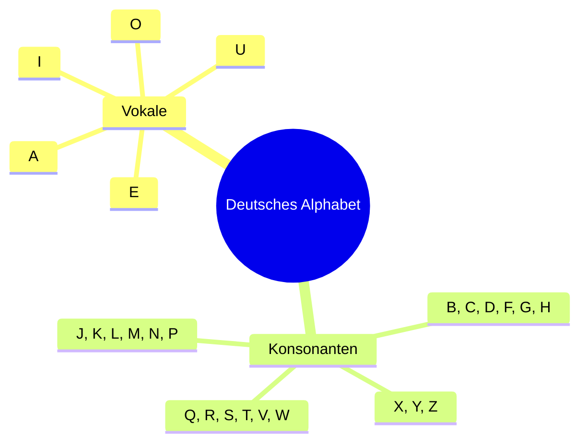
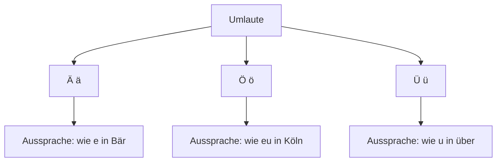
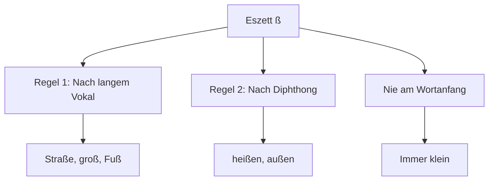
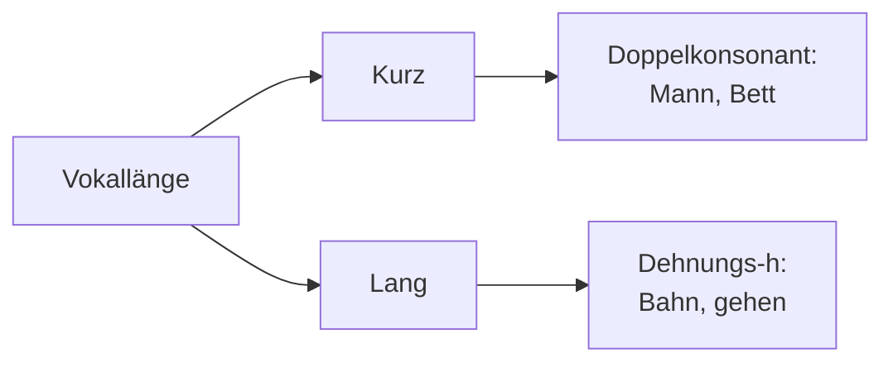

# 🇩🇪 Das deutsche Alphabet

## Einführung

Das deutsche Alphabet besteht aus den gleichen 26 Buchstaben wie das englische Alphabet, jedoch mit einigen wichtigen Besonderheiten. Zusätzlich gibt es die Umlaute (Ä, Ö, Ü) und das Eszett (ß).

## Das Basis-Alphabet (26 Buchstaben)



## Buchstaben mit Aussprache

### Vokale

| Buchstabe | Aussprache (IPA) | Beispiel | Übersetzung |
|-----------|------------------|-----------|-------------|
| A a | [aː] | **A**pfel | Apfel |
| E e | [eː] | **E**ltern | Eltern |
| I i | [iː] | **I**gel | Igel |
| O o | [oː] | **O**fen | Ofen |
| U u | [uː] | **U**hr | Uhr |

### Wichtige Konsonanten

| Buchstabe | Aussprache (IPA) | Beispiel | Übersetzung |
|-----------|------------------|-----------|-------------|
| B b | [beː] | **B**uch | Buch |
| C c | [tseː] | **C**ity | Stadt |
| D d | [deː] | **D**orf | Dorf |
| F f | [ɛf] | **F**enster | Fenster |
| G g | [geː] | **G**arten | Garten |
| H h | [haː] | **H**aus | Haus |
| J j | [jɔt] | **J**ahr | Jahr |
| S s | [ɛs] | **S**onne | Sonne |
| V v | [faʊ] | **V**ater | Vater |
| W w | [veː] | **W**asser | Wasser |
| Z z | [tsɛt] | **Z**eit | Zeit |

## Besondere deutsche Buchstaben

### Umlaute



#### Ä ä
- **Aussprache**: [ɛː] wie in "B**ä**r"
- **Beispiele**: 
  - M**ä**dchen (Mädchen)
  - sp**ä**t (spät)
  - **Ä**pfel (Äpfel)

#### Ö ö
- **Aussprache**: [øː] wie in "K**ö**ln"
- **Beispiele**:
  - **Ö**l (Öl)
  - sch**ö**n (schön)
  - L**ö**we (Löwe)

#### Ü ü
- **Aussprache**: [yː] wie in "**Ü**ber"
- **Beispiele**:
  - **Ü**bung (Übung)
  - fr**ü**h (früh)
  - M**ü**cke (Mücke)

### Das Eszett (ß)



- **Aussprache**: [ɛsˈtsɛt] - wie scharfes "s"
- **Regeln**:
  - Steht nach langem Vokal oder Diphthong
  - Wird nie am Wortanfang verwendet
  - Wird immer klein geschrieben

**Beispiele**:
- Stra**ß**e (Straße)
- hei**ß**en (heißen)
- Fu**ß** (Fuß)
- gru**ß** (Gruß)

## Aussprache-Besonderheiten

### Vokal-Länge



#### Lange Vokale
- Werden oft durch "h" gedehnt: B**a**h**n**, g**e**h**e**n
- Oder durch Verdopplung: M**ee**r, S**aa**l

#### Kurze Vokale
- Stehen vor Doppelkonsonanten: M**a**nn, B**e**tt
- Oder vor Konsonantengruppen: H**a**nd, W**i**nter

### Konsonanten-Kombinationen

| Kombination | Aussprache | Beispiel | Übersetzung |
|-------------|------------|-----------|-------------|
| ch | [ç] oder [x] | i**ch**, Ba**ch** | ich, Bach |
| sch | [ʃ] | **sch**ön | schön |
| sp | [ʃp] | **Sp**rache | Sprache |
| st | [ʃt] | **St**adt | Stadt |
| pf | [pf] | **Pf**erd | Pferd |
| qu | [kv] | **Qu**elle | Quelle |

## Das Alphabet singen lernen

**Deutsches Alphabet-Lied** (Melodie wie das englische):

```
A B C D E F G
H I J K L M N O P
Q R S T U V W
X Y Z Ä Ö Ü ß
```

## Übungen

### Übung 1: Buchstaben erkennen
Welche Buchstaben sind das?
1. **ß** - ...
2. **Ü** - ...
3. **Ö** - ...
4. **Ä** - ...

### Übung 2: Wörter buchstabieren
Buchstabiere diese Wörter:
- **Haus** - H-A-U-S
- **Schule** - ...
- **Mädchen** - ...
- **Straße** - ...

### Übung 3: Aussprache üben
Sprich diese Wörter laut aus:
1. **ich** (nicht "itsch"!)
2. **Vater** (F wie in "Father")
3. **Wasser** (V wie in "Water")
4. **Zimmer** (ts wie in "Cats")

## Wichtige Tipps

✅ **Hören und Nachsprechen**: Höre deutschen Muttersprachlern zu und spreche nach

✅ **Laut üben**: Sprich die Buchstaben und Wörter laut aus

✅ **Regelmäßig wiederholen**: Übe täglich 10 Minuten

✅ **Fehler machen ist okay**: Jeder macht anfangs Aussprachefehler

## Nächste Schritte

- [Aussprache vertiefen](aussprache.md)
- [Phonetik lernen](phonetik.md) 
- [Erste Begrüßungen üben](begruessungen.md)
- [Zum A1-Kurs](../niveau/a1/ueberblick.md)

---

<div align="center">

*Übung macht den Meister! Viel Erfolg beim Deutschlernen!* 🇩🇪✨

[▶️ Zur Aussprache](aussprache.md){ .md-button .md-button--primary }

</div>