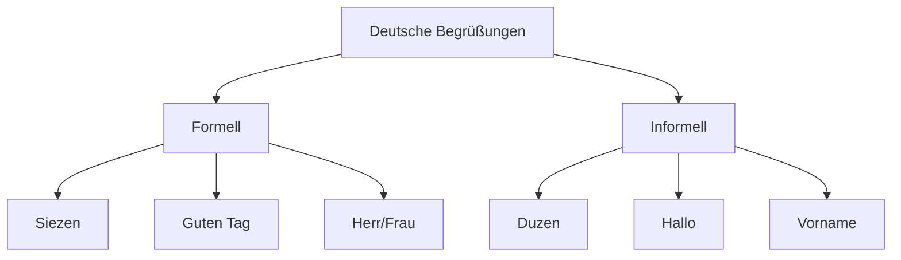
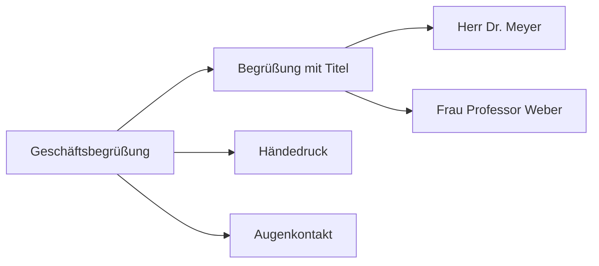
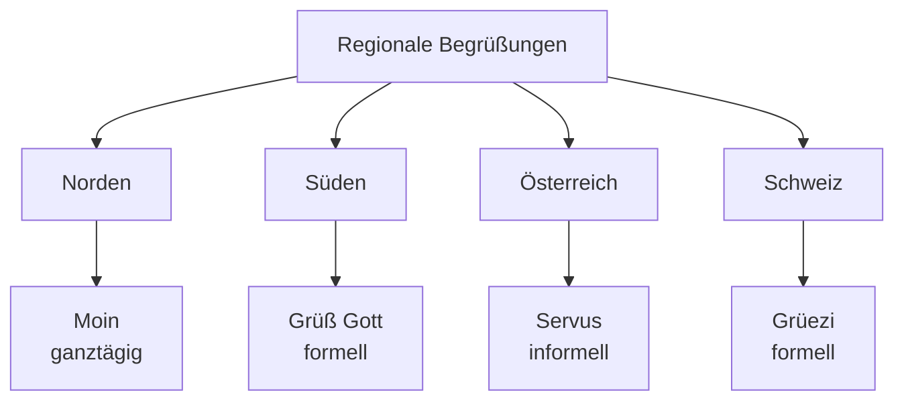
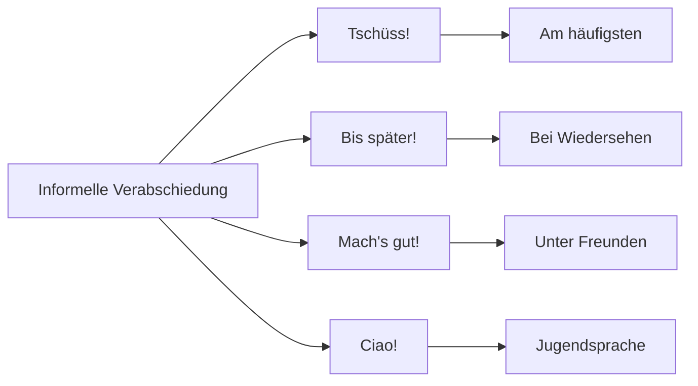
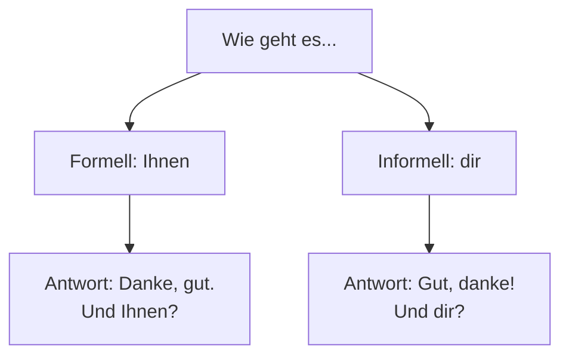
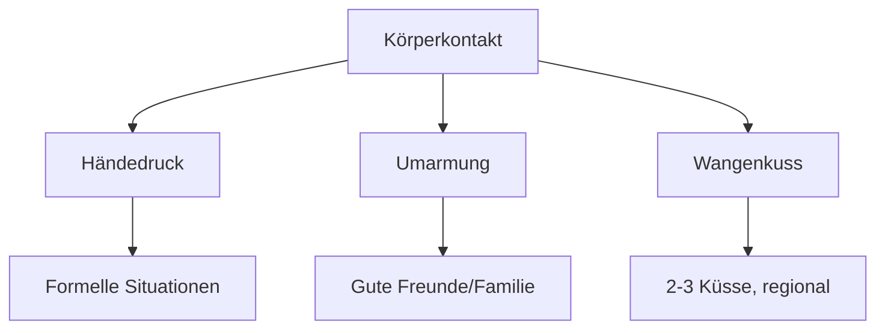

# 👋 Deutsche Begrüßungen und Verabschiedungen

## Einführung

Begrüßungen sind der erste Schritt in jeder Kommunikation. Im Deutschen gibt es formelle und informelle Begrüßungen, die je nach Situation verwendet werden.

## Überblick: Formell vs. Informal



## Formelle Begrüßungen

### Tageszeiten-basierte Begrüßungen

| Tageszeit | Begrüßung | Antwort | Verwendung |
|-----------|-----------|---------|------------|
| **Morgen** (bis 10 Uhr) | Guten Morgen! | Guten Morgen! | Formell/Informell |
| **Vormittag/Mittag** (10-17 Uhr) | Guten Tag! | Guten Tag! | Hauptsächlich formell |
| **Abend** (ab 17 Uhr) | Guten Abend! | Guten Abend! | Formell/Informell |

**Beispiel-Dialog**:
```
Person A: Guten Tag, Herr Müller!
Person B: Guten Tag, Frau Schmidt!
```

### Geschäftliche Begrüßungen



**Wichtige Phrasen**:
- "Guten Tag, mein Name ist [Name]"
- "Schön, Sie kennenzulernen"
- "Wie geht es Ihnen?"
- "Danke, gut. Und Ihnen?"

## Informelle Begrüßungen

### Unter Freunden und Familie

| Begrüßung | Antwort | Verwendung |
|-----------|---------|------------|
| **Hallo!** | Hallo! | Sehr häufig |
| **Hi!** | Hi! | Jugendsprache |
| **Na?** | Na? | Sehr informell |

**Beispiel-Dialog unter Freunden**:
```
Lisa: Hallo Tom!
Tom: Hi Lisa! Wie geht's?
Lisa: Gut, danke! Und dir?
Tom: Auch gut!
```

### Regionale Besonderheiten



**Regionale Varianten**:
- **Norddeutschland**: "Moin!" (ganztägig)
- **Bayern/Österreich**: "Servus!" (informell)
- **Süddeutschland**: "Grüß Gott!" (formell)
- **Schweiz**: "Grüezi!" (formell)

## Verabschiedungen

### Formelle Verabschiedungen

| Situation | Verabschiedung | Antwort |
|-----------|----------------|---------|
| **Allgemein** | Auf Wiedersehen! | Auf Wiedersehen! |
| **Geschäftlich** | Schönen Tag noch! | Gleichfalls! |
| **Abends** | Gute Nacht! | Gute Nacht! |

### Informelle Verabschiedungen



**Häufige Verabschiedungen**:
- **Tschüss!** - Am gebräuchlichsten
- **Bis bald!** - Wenn man sich bald wieder sieht
- **Bis später!** - Wenn man sich später am Tag trifft
- **Mach's gut!** - Unter guten Freunden
- **Ciao!** - Aus dem Italienischen, sehr informell

## Besondere Situationen

### Telefon-Begrüßungen

**Formell**:
- "Schmidt, guten Tag!"
- "[Firmenname], guten Tag!"

**Informell**:
- "Hallo, [Name] hier!"
- "[Name], hallo!"

### E-Mail Begrüßungen

**Formell**:
```
Sehr geehrte Frau Müller,
Sehr geehrter Herr Schmidt,
```

**Informell**:
```
Hallo Lisa,
Lieber Tom,
```

## Die wichtigsten Fragen nach der Begrüßung

### "Wie geht es dir/Ihnen?"



**Antwort-Möglichkeiten**:
- **Sehr gut** - Very good
- **Gut** - Good
- **Es geht** - Okay/So-so
- **Nicht so gut** - Not so good
- **Schlecht** - Bad

### Weitere höfliche Fragen
- "Wie war Ihr Wochenende?"
- "Alles in Ordnung?"
- "Was macht die Arbeit/Familie?"

## Kulturelle Besonderheiten

### Körperkontakt



**Regeln**:
- **Händedruck**: Fest, aber nicht zu stark
- **Augenkontakt**: Wichtig bei der Begrüßung
- **Umarmungen**: Nur unter guten Freunden
- **Wangenküsse**: 2-3 Küsse, regional unterschiedlich

## Übungen

### Übung 1: Situationen zuordnen
Welche Begrüßung passt zu welcher Situation?
1. **Beim Vorstellungsgespräch** - ...
2. **Mit deinem besten Freund** - ...
3. **Am Telefon mit einem Kunden** - ...
4. **In einer Bayern-Bar** - ...

### Übung 2: Dialoge vervollständigen
**Dialog 1 (formell)**:
```
Herr Weber: Guten Tag, Frau Schneider!
Frau Schneider: ______, ______!
Herr Weber: Wie ______ ______ ______?
Frau Schneider: ______, ______. ______ ______?
```

**Dialog 2 (informell)**:
```
Anna: ______, Max!
Max: ______ Anna! ______?
Anna: ______! ______?
Max: ______!
```

### Übung 3: Übersetzen
Übersetze diese Begrüßungen ins Deutsche:
1. "Good morning, how are you?" (formell) - ...
2. "Hi, see you later!" - ...
3. "Goodbye, have a nice day!" - ...
4. "Hello, my name is..." - ...

## Wichtige Vokabeln

| Deutsch | Englisch | Verwendung |
|---------|----------|------------|
| der Herr | Mr. | Formelle Anrede |
| die Frau | Mrs./Ms. | Formelle Anrede |
| kennenzulernen | to meet | Bei Vorstellungen |
| sich vorstellen | to introduce oneself | |
| der Händedruck | handshake | |
| die Umarmung | hug | |

## Häufige Fehler vermeiden

❌ **"Guten Tag" zu informell verwenden** → Bei Freunden "Hallo" benutzen

❌ **"Du" statt "Sie"** → Immer zuerst "Sie" verwenden, bis zum "Du" eingeladen

❌ **Kein Augenkontakt** → Immer Blickkontakt beim Händedruck halten

❌ **Zu schwacher Händedruck** → Fest, aber nicht schmerzhaft

## Nächste Schritte

- [Aussprache üben](aussprache.md)
- [Das Alphabet lernen](alphabet.md)
- [Erste Gespräche führen](../kommunikation/alltagsgespraeche.md)
- [Zum A1-Kurs](../niveau/a1/ueberblick.md)

---

<div align="center">

*Viel Erfolg beim Üben! Denke daran: Übung macht den Meister!* 🇩🇪✨

[▶️ Zu den Alltagsgesprächen](../kommunikation/alltagsgespraeche.md){ .md-button .md-button--primary }

</div>