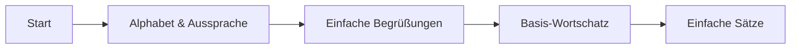

# 🇩🇪 Willkommen beim Deutsch Lernen Guide!

**Ihr umfassender Wegweiser für den erfolgreichen Deutschlernprozess**  
*Von absoluten Anfängern bis zur Sprachmeisterung*

[Starte mit A1](grundlagen/einfuehrung.md){ .md-button .md-button--primary }
[Grammatik lernen](grammatik/index.md){ .md-button }
[Übungen machen](uebungen/index.md){ .md-button }

## 🎯 Warum Deutsch lernen?

Deutsch zu sprechen öffnet Türen in einem der wirtschaftsstärksten Länder Europas. Egal ob für:

- **🎓 Studium** an deutschen Universitäten
- **💼 Beruf** in internationalen Unternehmen  
- **🏡 Leben** in Deutschland, Österreich oder der Schweiz
- **🌍 Reisen** im deutschsprachigen Raum
- **🧩 Persönliche Entwicklung** und kognitive Herausforderung

## 🗺️ Dein Lernpfad

### 🔰 Absolute Anfänger (A1)

**Empfohlener Start:**
- [Alphabet und Aussprache](grundlagen/alphabet.md)
- [Erste Begrüßungen](grundlagen/begruessungen.md)  
- [A1 Komplettkurs](niveau/a1/ueberblick.md)

### 📈 Fortgeschrittene Anfänger (A2)
- Erweiterter Wortschatz
- Grundlegende Grammatik
- Einfache Gespräche führen

### 🚀 Selbstständige Anwender (B1)
- Fließende Alltagsgespräche
- Komplexere Satzstrukturen
- Berufliche Kommunikation

### 🏆 Kompetente Sprecher (B2-C2)
- Fachsprache und Nuancen
- Akademisches und berufliches Deutsch
- Muttersprachliche Kompetenz

## 📚 Lernbereiche im Überblick

- __🏛️ Grammatik__

- Artikel & Fälle
- Verben & Zeitformen  
- Satzbau & Struktur
- [Zur Grammatik →](grammatik/index.md)

- __💬 Wortschatz__

- 18 Themenbereiche
- Von Basis bis Fachwortschatz
- Mit praktischen Beispielen
- [Zum Wortschatz →](wortschatz/index.md)

- __🗣️ Kommunikation__

- Alltagsgespräche
- Formelle Kommunikation
- Präsentationen & Briefe
- [Zur Kommunikation →](kommunikation/index.md)

- __🌍 Kultur__

- Deutsche Traditionen
- Leben in Deutschland
- Etikette & Bräuche
- [Zur Kultur →](kultur/index.md)

- __🏆 Übungen__

- Grammatik & Wortschatz
- Hör- & Leseverstehen
- Schreib- & Sprechübungen
- [Zu den Übungen →](uebungen/index.md)

- __🎯 Prüfungen__

- Goethe-Zertifikat
- TestDaF & telc
- DSH & Tipps
- [Zu den Prüfungen →](pruefungen/index.md)

## 🎓 Zertifizierungen und Niveaus

| Niveau | Bezeichnung | Prüfungen | Verwendungszweck |
|--------|-------------|-----------|------------------|
| **A1** | Anfänger | Start Deutsch 1 | Einfache Alltagssituationen |
| **A2** | Grundlagen | Start Deutsch 2 | Grundlegende Kommunikation |
| **B1** | Mittelstufe | Goethe B1, telc B1 | Selbstständige Sprachverwendung |
| **B2** | Oberstufe | Goethe B2, TestDaF | Beruf und Studium |
| **C1** | Fortgeschritten | Goethe C1, TestDaF | Akademische und berufliche Expertise |
| **C2** | Kompetenz | Goethe C2 | Nahezu muttersprachliches Niveau |

## 💡 Tipps für erfolgreiches Lernen

!!! success "Bewährte Strategien"
    **Konsistenz beats Intensität** - Lieber täglich 20 Minuten als einmal pro Woche 3 Stunden!

### 🎯 Effektive Lernmethoden
- **📅 Tägliche Routine**: Integriere Deutsch in deinen Alltag
- **🎧 Immersion**: Höre deutsche Podcasts, Musik, Filme
- **💬 Sprechen üben**: Nutze Sprach-Apps oder Tandem-Partner
- **📝 Schreibtraining**: Führe ein deutschsprachiges Tagebuch

### 🔧 Nützliche Tools
- [Lern-Apps](ressourcen/apps.md) für unterwegs
- [Online-Kurse](ressourcen/online-kurse.md) für strukturiertes Lernen
- [Podcasts](ressourcen/podcasts.md) für Hörverstehen
- [Bücher & Materialien](ressourcen/buecher.md) für vertieftes Lernen

## 🚀 Schnellstart Guide

### Erste Woche - Die Basis
1. **Tag 1-2**: [Alphabet und Aussprache](grundlagen/alphabet.md) meistern
2. **Tag 3-4**: [Einfache Begrüßungen](grundlagen/begruessungen.md) lernen
3. **Tag 5-7**: [Basis-Wortschatz](wortschatz/zahlen.md) aufbauen

### Zweite Woche - Erste Sätze  
1. **Einfache Grammatik**: [Artikel und Substantive](grammatik/artikel.md)
2. **Praktische Anwendung**: [Alltagsgespräche](kommunikation/alltagsgespraeche.md)
3. **Erste Übungen**: [A1 Grammatikübungen](uebungen/grammatik/a1.md)

<!-- ## 🌟 Erfolgsgeschichten

> "Dank dieses strukturierten Guides habe ich innerhalb von 6 Monaten das B1-Niveau erreicht und konnte problemlos in Deutschland studieren!" - *Maria, 24*

> "Die kulturellen Tipps waren genauso wertvoll wie die Sprachlektionen. Ich fühle mich jetzt sicher in deutschen Business-Meetings." - *Thomas, 32* -->

## 📞 Hilfe & Community

- **❔ Fragen?** Durchstöbere unsere detaillierten Guides
- **🔗 Fehler gefunden?** [Beitrag auf GitHub](https://github.com/wulfnb/german)
- **💡 Verbesserungsvorschläge?** Wir freuen uns über Feedback!

---

### Beginne jetzt deine Deutsch-Lernreise!

[✨ Jetzt mit A1 starten](./docs/grundlagen/einfuehrung.md)  
[📚 Alle Ressourcen ansehen](./docs/ressourcen/index.md)

*Letztes Update: {{ git.page.revision_date }}*

