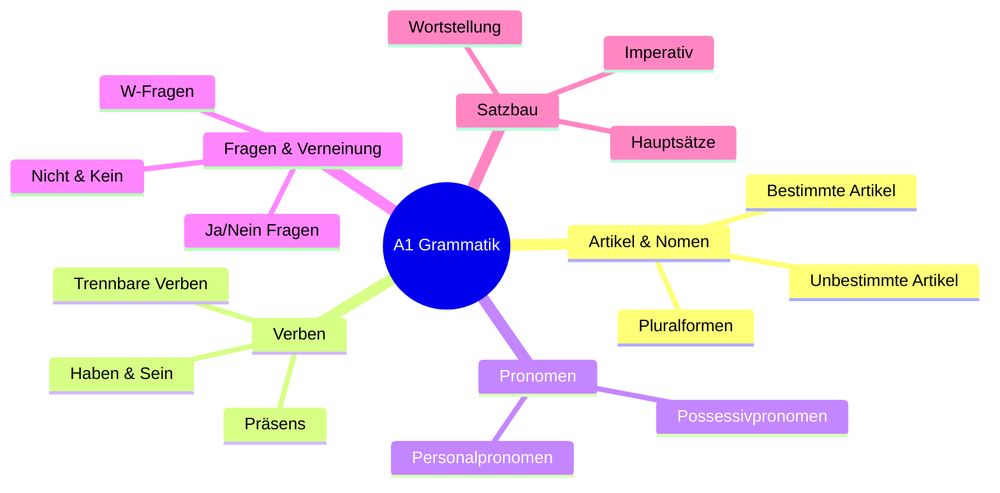
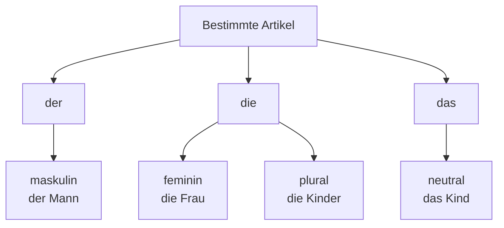
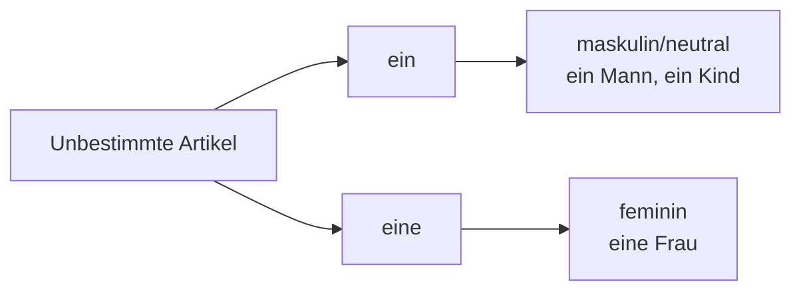
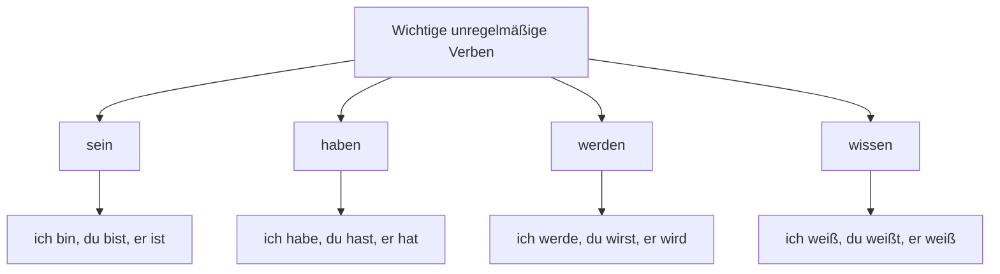
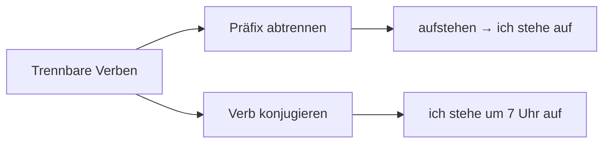
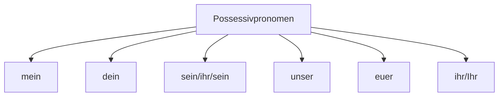
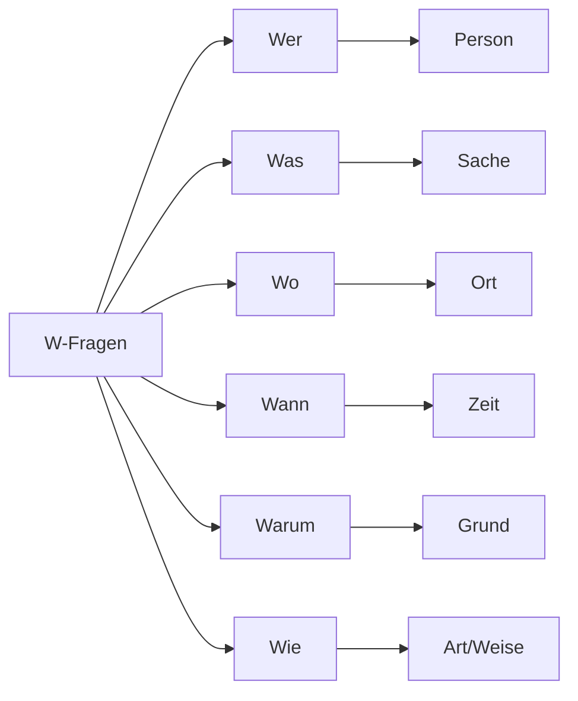
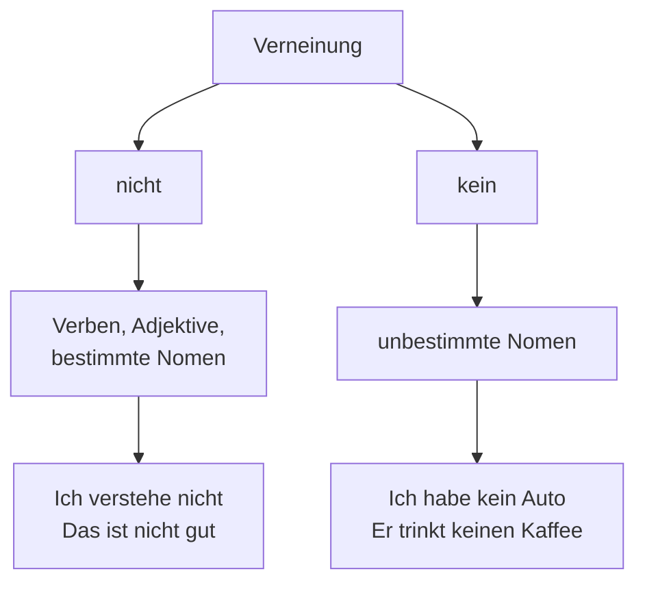
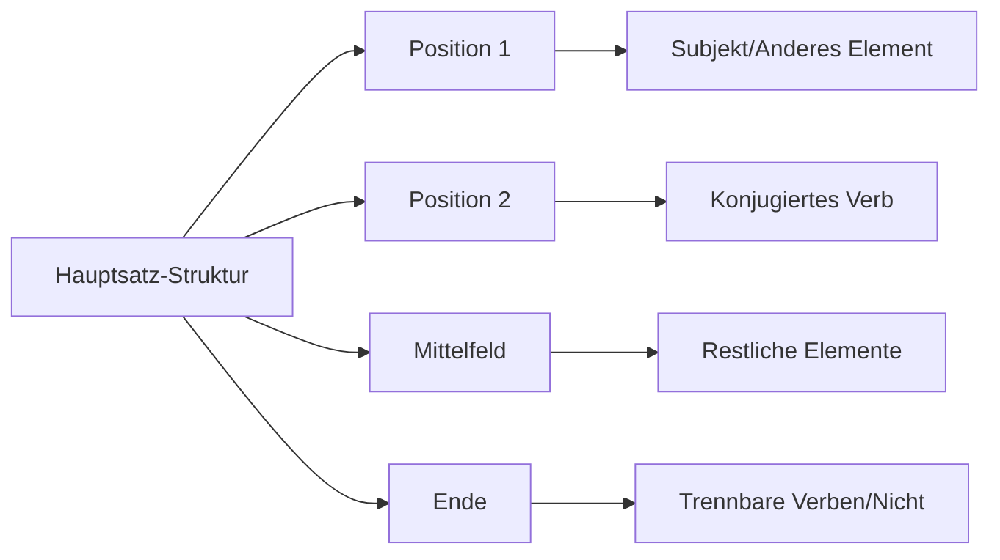

# 📚 A1 Grammatik - Komplettübersicht

## Einführung in die deutsche Grammatik

Willkommen zur A1-Grammatik! Hier lernst du die grundlegenden Bausteine der deutschen Sprache, die du für einfache Gespräche und Texte benötigst.

## A1 Grammatik im Überblick

## 1. Artikel (Geschlechterwörter)

### Bestimmte Artikel (der, die, das)

**Regeln und Beispiele:**

| Artikel | Geschlecht | Beispiel | Übersetzung |
|---------|------------|----------|-------------|
| **der** | maskulin | **der** Mann | der Mann |
| **die** | feminin | **die** Frau | die Frau |
| **die** | Plural | **die** Kinder | die Kinder |
| **das** | neutral | **das** Kind | das Kind |

### Unbestimmte Artikel (ein, eine)

**Verwendung:**
- **ein** für maskulin/neutral: **ein** Mann, **ein** Kind
- **eine** für feminin: **eine** Frau, **eine** Tasche
- **kein** für Verneinung: **kein** Auto, **keine** Zeit

## 2. Verben im Präsens (Gegenwart)

### Regelmäßige Verben

| Pronomen | Endung | Beispiel: lernen | Beispiel: machen |
|----------|--------|------------------|------------------|
| ich | -e | ich lern**e** | ich mach**e** |
| du | -st | du lern**st** | du mach**st** |
| er/sie/es | -t | er lern**t** | er mach**t** |
| wir | -en | wir lern**en** | wir mach**en** |
| ihr | -t | ihr lern**t** | ihr mach**t** |
| sie/Sie | -en | sie lern**en** | sie mach**en** |

### Unregelmäßige Verben

**Konjugation von sein und haben:**

| Pronomen | sein | haben |
|----------|------|-------|
| ich | **bin** | **habe** |
| du | **bist** | **hast** |
| er/sie/es | **ist** | **hat** |
| wir | **sind** | **haben** |
| ihr | **seid** | **habt** |
| sie/Sie | **sind** | **haben** |

### Trennbare Verben

**Beispiele:**
- aufstehen: Ich **stehe** um 7 Uhr **auf**
- einkaufen: Sie **kauft** Lebensmittel **ein**
- mitkommen: **Kommst** du **mit**?
- anrufen: Ich **rufe** dich **an**

## 3. Pronomen (Fürwörter)

### Personalpronomen

| Fall | Deutsch | Englisch |
|------|---------|----------|
| 1. Person Singular | **ich** | I |
| 2. Person Singular | **du** | you (informal) |
| 3. Person Singular | **er/sie/es** | he/she/it |
| 1. Person Plural | **wir** | we |
| 2. Person Plural | **ihr** | you (plural informal) |
| 3. Person Plural | **sie** | they |
| Höflichkeitsform | **Sie** | you (formal) |

### Possessivpronomen (Besitzwörter)

**Beispiele:**
- **mein** Haus, **meine** Familie
- **dein** Buch, **deine** Tasche
- **sein** Auto (er), **ihr** Hund (sie), **sein** Spielzeug (es)

## 4. Fragen stellen

### W-Fragen

**Wichtige W-Fragen:**
- **Wer**? - Who? → **Wer** ist das?
- **Was**? - What? → **Was** machst du?
- **Wo**? - Where? → **Wo** wohnst du?
- **Wann**? - When? → **Wann** kommst du?
- **Warum**? - Why? → **Warum** lernst du Deutsch?
- **Wie**? - How? → **Wie** geht es dir?

### Ja/Nein Fragen

**Bildung:** Verb + Subjekt + ...?
- Sprichst du Deutsch? → Ja/Nein
- Hast du Hunger? → Ja/Nein
- Kommst du aus Berlin? → Ja/Nein

## 5. Verneinung

### "nicht" vs. "kein"

**Regeln:**
- **nicht** für Verben, Adjektive, bestimmte Nomen
- **kein** für unbestimmte Nomen (ersetzt ein/eine)

**Beispiele:**
- Ich verstehe **nicht**. (Verb)
- Das ist **nicht** teuer. (Adjektiv)
- Ich habe **kein** Auto. (unbestimmter Artikel)
- Er trinkt **keinen** Kaffee. (Akkusativ)

## 6. Satzbau (Wortstellung)

### Hauptsätze

**Grundregel:** Verb an zweiter Position!

**Beispiele:**
- Ich **lerne** heute Deutsch. (Subjekt + Verb)
- Heute **lerne** ich Deutsch. (Anderes Element + Verb)
- Deutsch **lerne** ich heute. (Anderes Element + Verb)

### Imperativ (Befehlsform)

| Person | Bildung | Beispiel |
|--------|---------|----------|
| du | Verb-Stamm + ∅ | **Lern** Deutsch! |
| ihr | Verb-Stamm + -t | **Lern**t Deutsch! |
| Sie | Verb-Stamm + -en + Sie | **Lernen** Sie Deutsch! |

## 7. Präpositionen mit Dativ

### Wichtige Präpositionen

| Präposition | Beispiel | Übersetzung |
|-------------|----------|-------------|
| **aus** | Ich komme **aus** Deutschland. | from |
| **von** | Das ist **von** meinem Freund. | from |
| **zu** | Ich gehe **zu** meiner Freundin. | to |
| **in** | Ich bin **in** der Schule. | in |
| **an** | Das Bild hängt **an** der Wand. | on |
| **auf** | Das Buch liegt **auf** dem Tisch. | on |

## Grammatik-Übungen

### Übung 1: Artikel einsetzen
Setze den richtigen Artikel ein:
1. ___ Haus (das)
2. ___ Frau (die)
3. ___ Mann (der)
4. ___ Kinder (die)
5. ___ Buch (das)

### Übung 2: Verben konjugieren
Konjugiere die Verben:
1. ich (wohnen) → ich **wohne**
2. du (sprechen) → du ___
3. er (arbeiten) → er ___
4. wir (lernen) → wir ___
5. ihr (machen) → ihr ___

### Übung 3: Fragen bilden
Bilde Fragen zu diesen Antworten:
1. "Ich heiße Maria." → **Wie heißt du?**
2. "Ich komme aus Spanien." → ___
3. "Ich bin 25 Jahre alt." → ___
4. "Ich wohne in Berlin." → ___

### Übung 4: Verneinung
Verneine die Sätze:
1. Ich habe ein Auto. → Ich habe **kein** Auto.
2. Er trinkt Kaffee. → ___
3. Sie versteht Deutsch. → ___
4. Das ist teuer. → ___

## Häufige A1-Fehler

### ❌ Typische Grammatikfehler
- "Ich bin 25 Jahre" → **Ich bin 25 Jahre alt.**
- "Ich habe Auto" → **Ich habe ein Auto.**
- "Du sprichst Deutsch?" → **Sprichst du Deutsch?**
- "Ich nicht verstehe" → **Ich verstehe nicht.**

### ✅ Korrekte Verwendung merken
- Immer Artikel mitlernen
- Verb immer an 2. Position
- "nicht" ans Satzende
- Großschreibung bei Nomen

## Lernstrategien für Grammatik

### Tägliche Übung
- 📝 **5 Minuten**: Artikel üben
- 🎯 **10 Minuten**: Verben konjugieren
- 💬 **5 Minuten**: Sätze bilden
- 📚 **Wiederholung**: Gelerntes festigen

### Praktische Anwendung
- Schreibe täglich 3 Sätze mit neuer Grammatik
- Sprich mit Sprach-Apps
- Höre deutsche Sätze und analysiere die Struktur

## Nächste Schritte

- [A1 Wortschatz lernen](wortschatz.md)
- [A1 Übungen machen](../../uebungen/grammatik/a1.md)
- [Kommunikation üben](../../kommunikation/alltagsgespraeche.md)
- [Zu A2 Grammatik](../../a2/grammatik.md)

---

*Grammatik ist wie ein Werkzeugkasten - je mehr Werkzeuge du hast, desto besser kannst du bauen!* 🛠️

[💪 Jetzt A1 Übungen machen](../../uebungen/grammatik/a1.md){ .md-button .md-button--primary }
[📚 Zum A1 Wortschatz](wortschatz.md){ .md-button }

