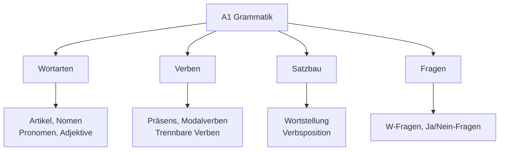
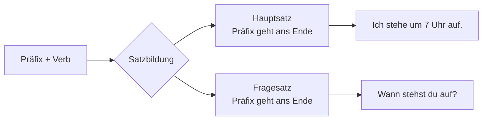
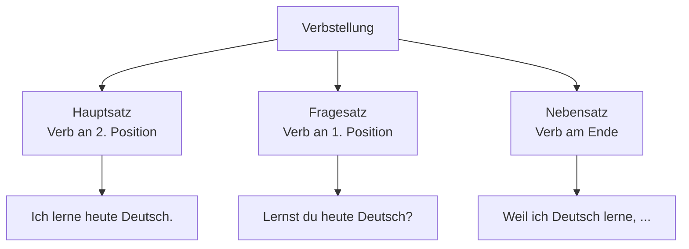

# A1 Grammatik - Grundlagen

## Einführung
Auf A1-Niveau lernen Sie die fundamentalen Grammatikstrukturen des Deutschen. Diese Grundlagen sind essenziell für den weiteren Spracherwerb.

## Grammatik-Übersicht A1

## Artikel und Nomen

### Bestimmte Artikel

| Fall | Maskulin | Feminin | Neutral | Plural |
|------|----------|---------|---------|--------|
| Nominativ | der | die | das | die |
| Akkusativ | den | die | das | die |

### Unbestimmte Artikel

| Fall | Maskulin | Feminin | Neutral |
|------|----------|---------|---------|
| Nominativ | ein | eine | ein |
| Akkusativ | einen | eine | ein |

### Nomen-Regeln

| Regel | Beispiel | Besonderheit |
|-------|----------|--------------|
| Großschreibung | der Tisch, die Frau | Alle Nomen werden großgeschrieben |
| Pluralbildung | der Tisch → die Tische | Verschiedene Pluralendungen |
| Zusammensetzung | die Küche + der Tisch = der Küchentisch | Deutsche Nomen können kombiniert werden |

## Verben im Präsens

### Regelmäßige Verben

| Person | Endung | Beispiel: lernen |
|--------|--------|------------------|
| ich | -e | ich lerne |
| du | -st | du lernst |
| er/sie/es | -t | er/sie/es lernt |
| wir | -en | wir lernen |
| ihr | -t | ihr lernt |
| sie/Sie | -en | sie/Sie lernen |

### Unregelmäßige Verben

| Verb | ich | du | er/sie/es |
|------|-----|----|-----------|
| sein | bin | bist | ist |
| haben | habe | hast | hat |
| werden | werde | wirst | wird |
| essen | esse | isst | isst |

### Trennbare Verben

**Beispiele:**
- aufstehen: Ich stehe um 7 Uhr auf.
- einkaufen: Sie kauft im Supermarkt ein.
- anrufen: Er ruft seine Mutter an.

## Pronomen

### Personalpronomen

| Person | Nominativ | Akkusativ |
|--------|-----------|-----------|
| ich | ich | mich |
| du | du | dich |
| er/sie/es | er/sie/es | ihn/sie/es |
| wir | wir | uns |
| ihr | ihr | euch |
| sie/Sie | sie/Sie | sie/Sie |

### Possessivpronomen

| Person | Maskulin | Feminin | Neutral | Plural |
|--------|----------|---------|---------|--------|
| ich | mein | meine | mein | meine |
| du | dein | deine | dein | deine |
| er/sie/es | sein/ihr/sein | seine/ihre/sein | sein/ihr/sein | seine/ihre/sein |

## Satzbau

### Grundregeln

| Satztyp | Struktur | Beispiel |
|---------|----------|----------|
| Aussagesatz | Subjekt - Verb - Objekt | Ich lerne Deutsch. |
| W-Frage | Fragewort - Verb - Subjekt | Wo wohnst du? |
| Ja/Nein-Frage | Verb - Subjekt - Objekt | Sprichst du Deutsch? |
| Imperativ | Verb - (Subjekt) - Objekt | Sprich langsam! |

### Verbposition

## Modalverben

### Die wichtigsten Modalverben

| Verb | Bedeutung | Konjugation (ich/du/er) |
|------|-----------|--------------------------|
| können | can, to be able to | ich kann, du kannst, er kann |
| müssen | must, to have to | ich muss, du musst, er muss |
| wollen | to want to | ich will, du willst, er will |
| mögen | to like | ich mag, du magst, er mag |
| sollen | should, to be supposed to | ich soll, du sollst, er soll |

### Verwendung

| Situation | Beispiel |
|-----------|----------|
| Fähigkeit | Ich kann Deutsch sprechen. |
| Pflicht | Ich muss heute lernen. |
| Wunsch | Ich will nach Deutschland reisen. |
| Vorliebe | Ich mag deutsche Musik. |
| Rat | Du sollst mehr üben. |

## Präpositionen

### Wechselpräpositionen

| Präposition | Bedeutung | Beispiel |
|-------------|-----------|----------|
| in | in, into | in der Schule (Dativ) / in die Schule (Akkusativ) |
| an | at, on, to | an der Tafel (Dativ) / an die Tafel (Akkusativ) |
| auf | on, onto | auf dem Tisch (Dativ) / auf den Tisch (Akkusativ) |

### Dativ-Präpositionen

| Präposition | Bedeutung | Beispiel |
|-------------|-----------|----------|
| mit | with | mit dem Bus |
| nach | after, to | nach der Schule |
| von | from, of | von meinem Freund |
| zu | to | zu meiner Familie |

## Negation

### "nicht" vs "kein"

| Negation | Verwendung | Beispiel |
|----------|------------|----------|
| nicht | Verneint Verben, Adjektive, Ortsangaben | Ich verstehe nicht. |
| kein | Verneint Nomen ohne Artikel | Ich habe keine Zeit. |

## Übungsbeispiele

### Übung 1: Artikel einsetzen
Setzen Sie den richtigen Artikel ein:
1. ___ Buch ist interessant. (das)
2. Ich sehe ___ Mann. (den)
3. ___ Frau spricht Deutsch. (die)

### Übung 2: Verben konjugieren
Konjugieren Sie die Verben:
1. Ich (wohnen) ___ in Berlin.
2. Du (sprechen) ___ gut Deutsch.
3. Wir (lernen) ___ jeden Tag.

### Übung 3: Sätze bilden
Bilden Sie Sätze mit diesen Elementen:
1. ich / heute / Deutsch / lernen
2. du / wo / wohnen / ?
3. wir / Kaffee / trinken / wollen

---

## Zusammenfassung

Die A1-Grammatik bildet das Fundament für Ihren weiteren Deutschlernprozess. Konzentrieren Sie sich auf:
- Richtige Artikelverwendung
- Verbkonjugation im Präsens
- Grundlegende Satzstrukturen
- Einfache Fragen bilden

Mit diesen Grundlagen sind Sie bestens vorbereitet für [A2](../a2/grammatik.md)!