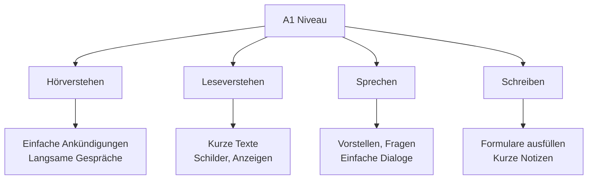
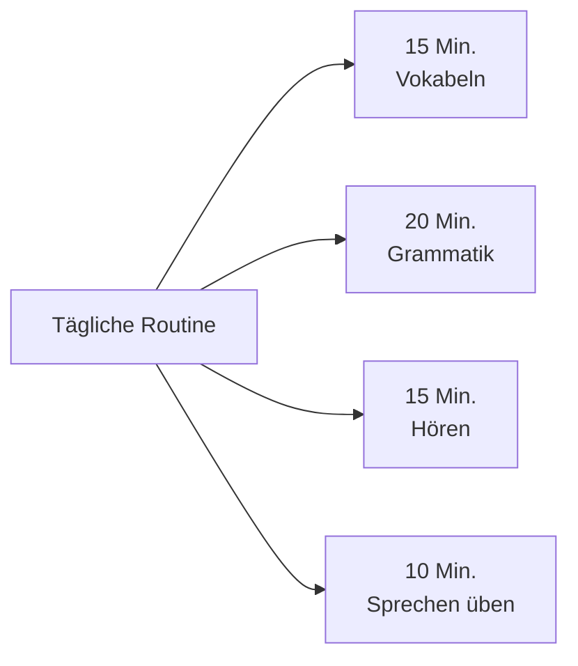

# A1 Level - Überblick (Overview)

## Einführung
A1 ist die erste Stufe des Gemeinsamen Europäischen Referenzrahmens für Sprachen (GER). Auf diesem Niveau können Sie einfache, alltägliche Ausdrücke und Sätze verstehen und verwenden.

## Was Sie auf A1 lernen

## Lernziele A1

### Kommunikative Kompetenzen

| Bereich | Was Sie können | Beispiele |
|---------|----------------|-----------|
| 🗣️ **Sprechen** | Einfache Fragen stellen und beantworten | "Wie heißt du?", "Woher kommst du?" |
| 👂 **Hören** | Langsame, klare Sprache verstehen | Zahlen, Preise, einfache Anweisungen |
| 📖 **Lesen** | Kurze, einfache Texte verstehen | Schilder, Formulare, kurze Notizen |
| ✍️ **Schreiben** | Einfache Formulare ausfüllen | Namen, Adressen, Nationalität |

### Themenbereiche

| Thema | Inhalt |
|-------|--------|
| 👤 **Persönliche Informationen** | Name, Alter, Herkunft, Beruf |
| 🏠 **Alltag** | Familie, Wohnen, tägliche Routine |
| 🍽️ **Essen & Trinken** | Lebensmittel, im Restaurant bestellen |
| 🛒 **Einkaufen** | Preise, Mengen, einfache Einkäufe |
| 🗓️ **Zeit & Datum** | Tage, Monate, Uhrzeit, Termine |

## A1 Prüfungsformen

### Typische Prüfungsteile

| Prüfungsteil | Dauer | Inhalt |
|--------------|-------|--------|
| Hörverstehen | 20-25 Min. | Kurze Dialoge, Ansagen |
| Leseverstehen | 25-30 Min. | Schilder, Formulare, kurze Texte |
| Schreiben | 20-25 Min. | Formular ausfüllen, kurzer Text |
| Sprechen | 15-20 Min. | Vorstellen, Fragen beantworten |

## Lernempfehlungen für A1

### Tägliches Lernen

### Nützliche Ressourcen

- [Apps](../ressourcen/apps.md) für unterwegs lernen
- [Übungen](../uebungen/grammatik/a1.md) zur Grammatik
- [Podcasts](../ressourcen/podcasts.md) für Hörverstehen

## Zeitaufwand für A1

| Lernform | Empfohlene Zeit |
|----------|-----------------|
| Selbststudium | 80-100 Stunden |
| Kurs (Gruppe) | 60-80 Unterrichtsstunden |
| Intensivkurs | 4-6 Wochen |

## Häufige Herausforderungen

### Typische Schwierigkeiten

| Bereich | Herausforderung | Lösung |
|---------|-----------------|--------|
| 🎵 **Aussprache** | Umlaute (ä, ö, ü) | Mundstellung üben, nachsprechen |
| 📝 **Artikel** | der, die, das | Mit Nomen lernen, Farben verwenden |
| 🔄 **Wortstellung** | Verb an 2. Position | Satzbaupläne üben |

## Vorbereitung auf A2

### Was kommt als nächstes?
Nach A1 können Sie sich auf [A2](../a2/ueberblick.md) vorbereiten, wo Sie lernen:
- Über Vergangenes sprechen
- Komplexere Sätze bilden
- Erweiterte Alltagssituationen meistern

## Übungsbeispiele

### Selbsttest: Bin ich bereit für A1?
Beantworten Sie diese Fragen auf Deutsch:

1. ❓ Können Sie sich vorstellen? (Name, Herkunft, Alter)
2. ❓ Können Sie einfache Fragen zu Alltagsthemen stellen?
3. ❓ Verstehen Sie langsame, klare Ansagen?
4. ❓ Können Sie ein einfaches Formular ausfüllen?

Wenn Sie mindestens 3 Fragen mit "Ja" beantworten, sind Sie bereit für A1!

---

## Zusammenfassung

A1 ist der Einstieg ins Deutsche, wo Sie grundlegende Kommunikationsfähigkeiten erlernen. Mit regelmäßigem Üben und den richtigen [Lernstrategien](../../lernstrategien/index.md) meistern Sie dieses Niveau erfolgreich!