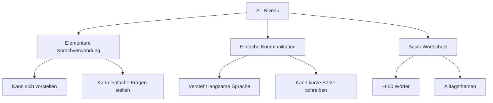
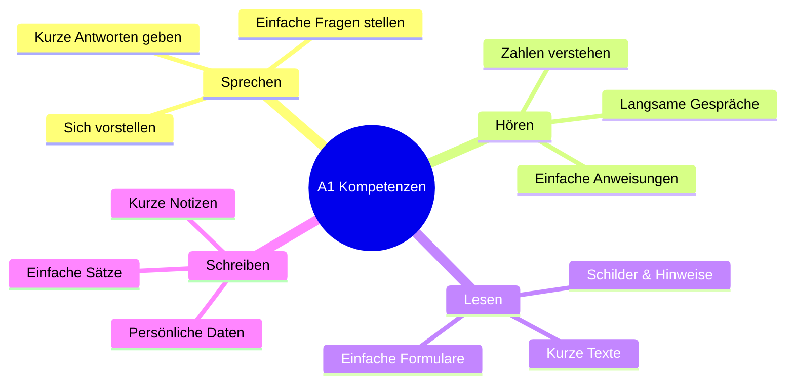
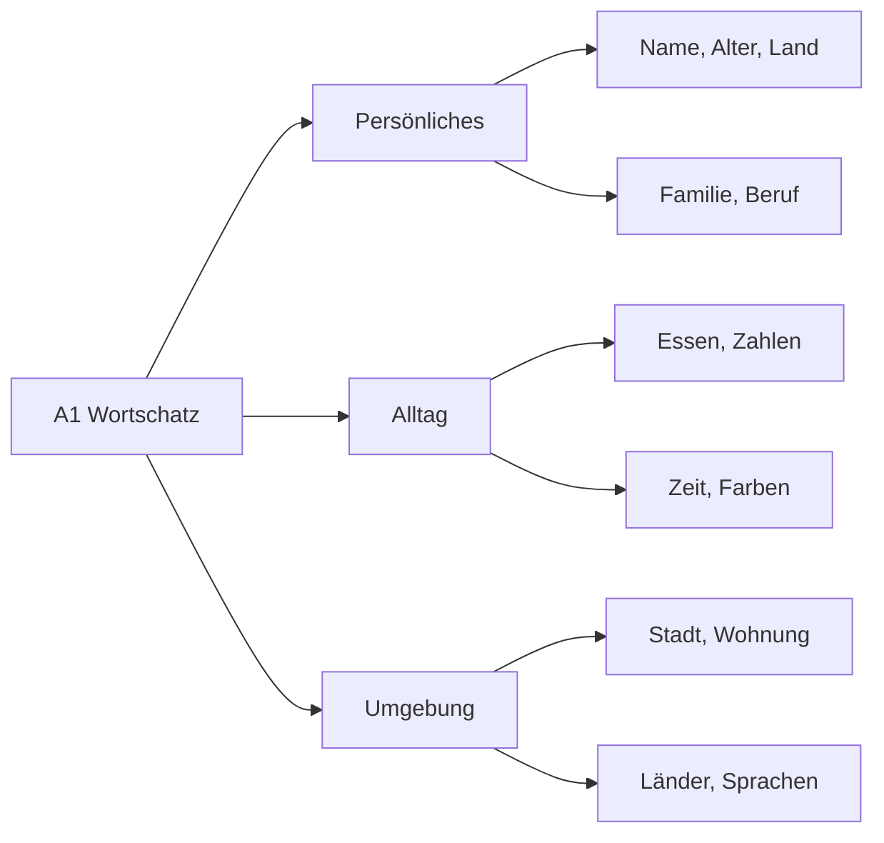
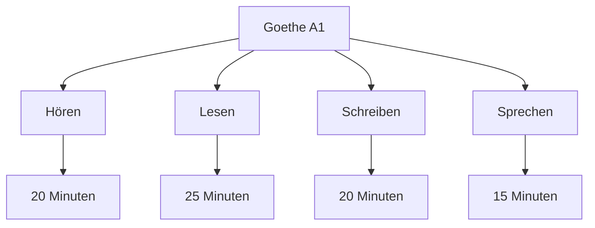
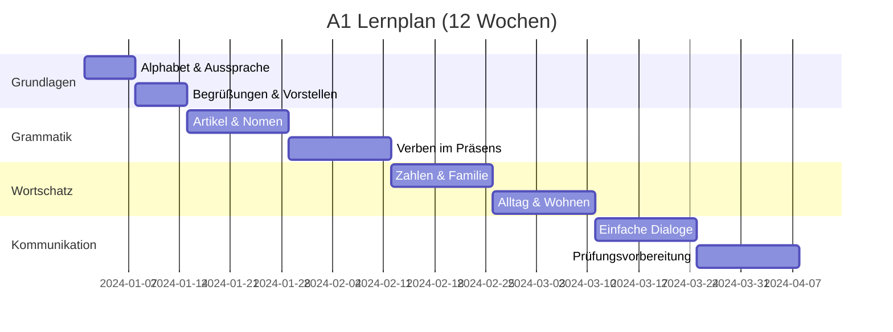
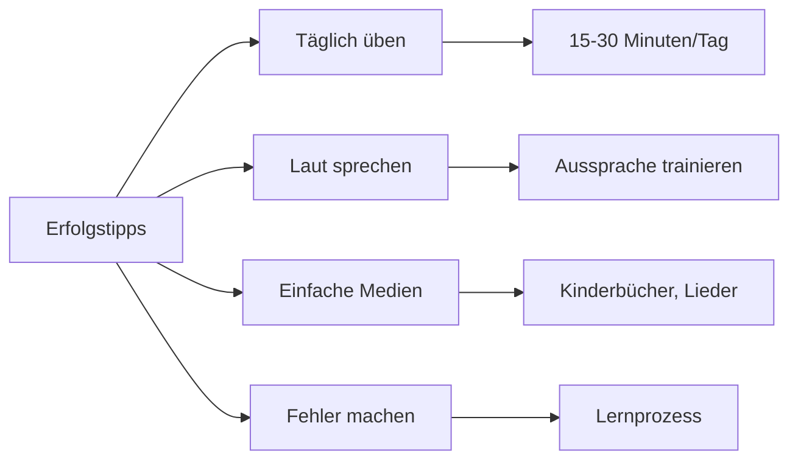

# 🟢 A1 Deutsch - Anfänger Überblick

## Willkommen im A1-Level!

Herzlich willkommen beim Einstieg in die deutsche Sprache! A1 ist die erste Stufe des Gemeinsamen Europäischen Referenzrahmens (GER) und perfekt für absolute Anfänger.

## Was ist A1?



**A1 bedeutet, dass du:**
- Dich und andere vorstellen kannst
- Einfache Alltagsfragen stellen und beantworten kannst
- Langsam und deutlich gesprochene Sprache verstehst
- Kurze, einfache Texte lesen und schreiben kannst

## A1 Lernziele

### Kommunikative Kompetenzen



### Grammatik-Schwerpunkte

| Thema | Was du lernst | Beispiel |
|-------|---------------|----------|
| **Artikel** | der, die, das | **der** Mann, **die** Frau, **das** Kind |
| **Plural** | Einfache Pluralformen | der Tisch → die Tisch**e** |
| **Verben** | Präsens, haben/sein | ich lern**e**, du bist |
| **Pronomen** | ich, du, er, sie, es | **Ich** bin Maria |
| **Fragen** | W-Fragen | **Wo** wohnst du? |
| **Negation** | nicht, kein | Ich habe **kein** Auto |

## A1 Themenbereiche

### Wortschatz-Themen



**Wichtige Themen:**
- 📝 **Persönliche Daten**: Name, Alter, Nationalität, Adresse
- 👨‍👩‍👧‍👦 **Familie**: Familienmitglieder, Beziehungen
- 🏠 **Wohnen**: Zimmer, Möbel, Adresse
- 🍎 **Essen & Trinken**: Lebensmittel, Getränke, Mahlzeiten
- 🔢 **Zahlen**: 1-100, Preise, Telefonnummern
- 🕐 **Zeit**: Tage, Monate, Uhrzeit, Datum
- 🌍 **Länder & Sprachen**: Herkunft, Nationalitäten

## Typische A1-Situationen

### Situation 1: Sich vorstellen
```
Hallo! Ich heiße Maria.
Ich komme aus Spanien.
Ich wohne in Berlin.
Ich bin Studentin.
Ich lerne Deutsch.
```

### Situation 2: Im Café
```
"Guten Tag!"
"Ich möchte einen Kaffee, bitte."
"Wie viel kostet das?"
"Danke! Auf Wiedersehen!"
```

### Situation 3: Persönliche Informationen
```
Wie heißen Sie?
Woher kommen Sie?
Wie alt sind Sie?
Was sind Sie von Beruf?
Sprechen Sie Deutsch?
```

## A1 Prüfungen

### Goethe-Zertifikat A1



**Prüfungsteile:**
- **Hören** (20 Min.): Kurze Alltagsgespräche verstehen
- **Lesen** (25 Min.): Schilder, Notizen, kurze Texte
- **Schreiben** (20 Min.): Formulare ausfüllen, kurze Notizen
- **Sprechen** (15 Min.): Sich vorstellen, Fragen beantworten

### Weitere A1 Prüfungen
- **telc Deutsch A1**
- **ÖSD Zertifikat A1**
- **Start Deutsch 1**

## Lernplan für A1

### 12-Wochen-Plan



**Wöchentlicher Zeitaufwand:**
- **Minimum**: 3-4 Stunden pro Woche
- **Empfohlen**: 5-7 Stunden pro Woche
- **Intensiv**: 10+ Stunden pro Woche

## Erfolgstipps für A1

### ✅ Was funktioniert gut


**Praktische Tipps:**
- 🎧 **Hören**: Deutsche Kinderlieder, langsame Podcasts
- 📖 **Lesen**: Kinderbücher, einfache Nachrichten
- 💬 **Sprechen**: Mit sich selbst sprechen, Sprachapps nutzen
- 📝 **Schreiben**: Tagebuch auf Deutsch führen
- 🎯 **Wiederholen**: Täglich Vokabeln wiederholen

## Häufige A1-Fehler

### Typische Anfängerfehler
- ❌ **Artikel vergessen**: "Ich habe Auto" → "Ich habe **ein** Auto"
- ❌ **Wortstellung**: "Ich bin gut" → "Mir geht es gut"
- ❌ **Großschreibung**: "ich heiße" → "**I**ch heiße"
- ❌ **Aussprache**: "ich" wie "itsch" → richtige Aussprache üben

### Korrektur-Strategien
- 📚 Immer Artikel mitlernen
- 🎧 Auf Muttersprachler hören
- ✍️ Viel schreiben und korrigieren lassen
- 🗣️ Laut und deutlich sprechen

## A1 Lernressourcen

### Kostenlose Materialien
- [Goethe Institut A1](https://www.goethe.de/) - Übungen und Tests
- [Deutsche Welle](https://www.dw.com/) - Nicos Weg A1 Kurs
- [YouTube](https://youtube.com) - Deutsch lernen Kanäle
- [Apps](../ressourcen/apps.md) - Duolingo, Memrise

### Empfohlene Bücher
- "Menschen A1" (Hueber Verlag)
- "Schritte Plus A1" (Hueber Verlag)
- "Begegnungen A1" (Schubert Verlag)

## Vorbereitung auf A2

### Was kommt nach A1?
- Erweiterter Wortschatz (~1300 Wörter)
- Einfache Vergangenheitsformen (Perfekt)
- Dativ und Akkusativ
- Längere Gespräche führen
- Einfache Briefe und E-Mails schreiben

## Übungen für A1

### Selbsttest: Bin ich bereit für A1?
- [ ] Ich kann mich auf Deutsch vorstellen
- [ ] Ich verstehe einfache Fragen zu meiner Person
- [ ] Ich kann Zahlen von 1-100 sagen und verstehen
- [ ] Ich kenne die deutschen Artikel (der, die, das)
- [ ] Ich kann einfache Sätze im Präsens bilden

### Praxis-Übung
**Stelle dich schriftlich vor:**
```
Name: ______
Alter: ______
Land: ______
Stadt: ______
Beruf: ______
Hobbys: ______
```

## Nächste Schritte

- [A1 Grammatik lernen](grammatik.md)
- [A1 Wortschatz aufbauen](wortschatz.md)
- [A1 Übungen machen](../uebungen/grammatik/a1.md)
- [Zu A2 weitergehen](../a2/ueberblick.md)

---

<div align="center">

*Du schaffst das! Jede große Reise beginnt mit dem ersten Schritt.* 🚀

[🎯 Jetzt A1 Grammatik lernen](grammatik.md){ .md-button .md-button--primary }
[📚 Alle A1 Themen anzeigen](../uebungen/grammatik/a1.md){ .md-button }

</div>