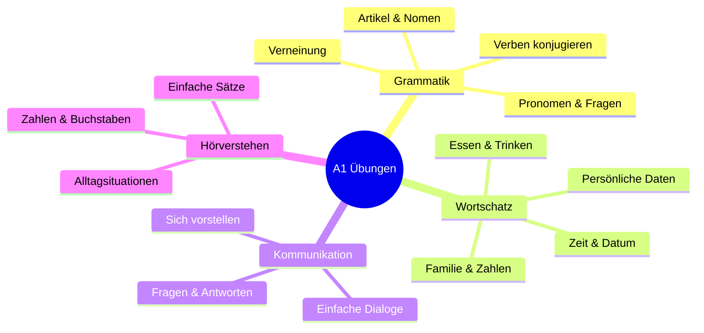
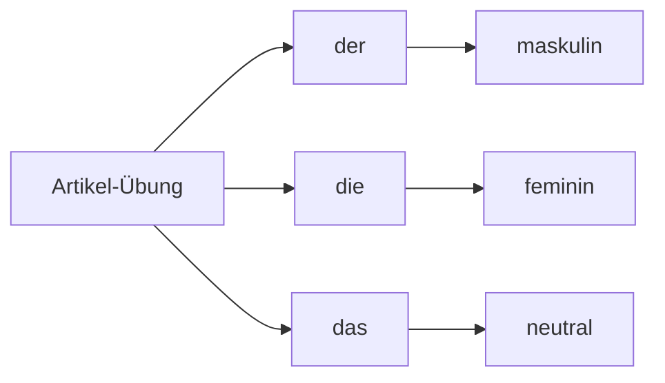
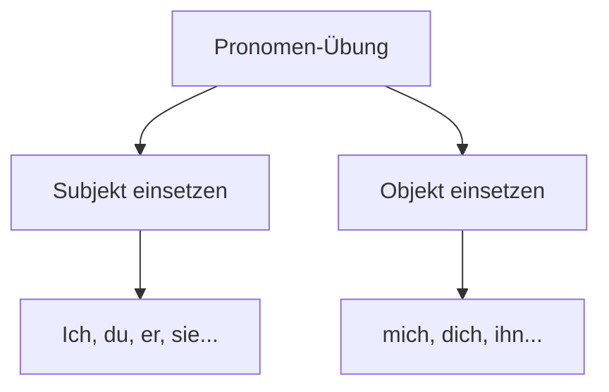
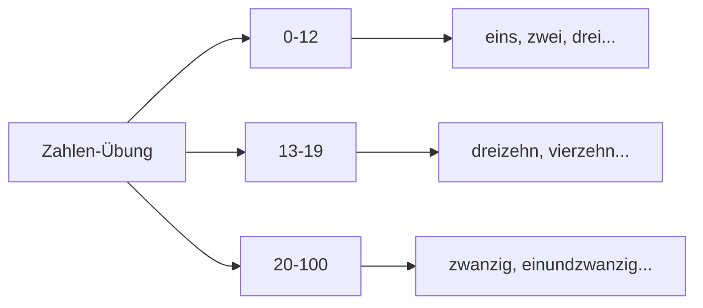
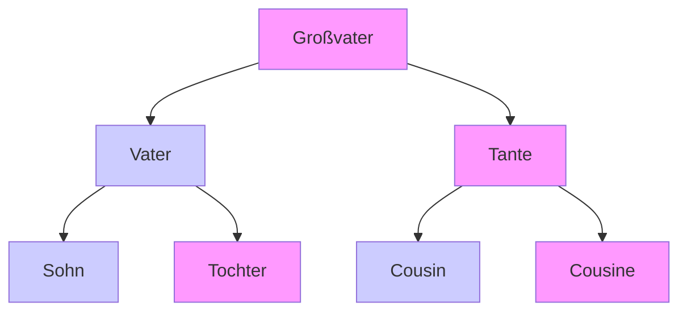
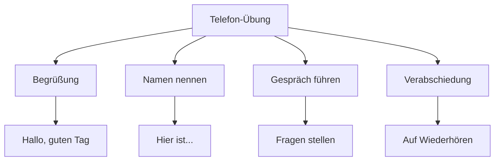
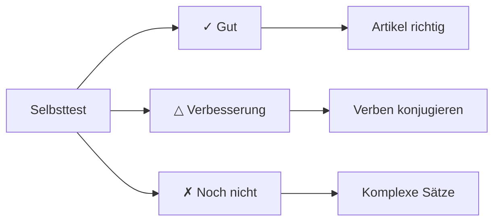

# 💪 A1 Übungen - Praktische Anwendung

## Willkommen zu den A1-Übungen!

Hier kannst du das Gelernte aus der A1-Grammatik und dem A1-Wortschatz praktisch anwenden. Übung macht den Meister!

## Übungsbereiche im Überblick



## 1. Grammatik-Übungen

### Übung 1: Artikel zuordnen

**Setze den richtigen Artikel (der, die, das) ein:**



1. ___ Tisch → **der** Tisch
2. ___ Lampe → ___
3. ___ Buch → ___
4. ___ Frau → ___
5. ___ Kind → ___
6. ___ Haus → ___
7. ___ Mann → ___
8. ___ Tür → ___

**Lösung:** 2. die, 3. das, 4. die, 5. das, 6. das, 7. der, 8. die

### Übung 2: Verben konjugieren

**Konjugiere die Verben im Präsens:**

| Pronomen | wohnen | lernen | sprechen | sein | haben |
|----------|--------|--------|----------|------|-------|
| ich | **wohne** | **lerne** | **spreche** | **bin** | **habe** |
| du | ___ | ___ | ___ | ___ | ___ |
| er/sie/es | ___ | ___ | ___ | ___ | ___ |
| wir | ___ | ___ | ___ | ___ | ___ |
| ihr | ___ | ___ | ___ | ___ | ___ |
| sie/Sie | ___ | ___ | ___ | ___ | ___ |

**Lösung:** 
du: wohnst, lernst, sprichst, bist, hast  
er/sie/es: wohnt, lernt, spricht, ist, hat  
wir: wohnen, lernen, sprechen, sind, haben  
ihr: wohnt, lernt, sprecht, seid, habt  
sie/Sie: wohnen, lernen, sprechen, sind, haben

### Übung 3: Personalpronomen



**Ersetze die unterstrichenen Wörter mit Pronomen:**

1. **Maria** ist 25 Jahre alt. → **Sie** ist 25 Jahre alt.
2. **Der Mann** kommt aus Berlin. → ___
3. **Das Buch** ist interessant. → ___
4. **Mein Bruder und ich** lernen Deutsch. → ___
5. **Die Kinder** spielen im Garten. → ___

**Lösung:** 2. Er, 3. Es, 4. Wir, 5. Sie

### Übung 4: Fragen bilden

**Bilde Fragen zu diesen Antworten:**

1. "Ich heiße Thomas." → **Wie heißt du?**
2. "Ich komme aus Österreich." → ___
3. "Ich bin 30 Jahre alt." → ___
4. "Ich wohne in München." → ___
5. "Ich bin Lehrer." → ___
6. "Ja, ich spreche Deutsch." → ___

**Lösung:** 
2. Woher kommst du?  
3. Wie alt bist du?  
4. Wo wohnst du?  
5. Was bist du von Beruf?  
6. Sprichst du Deutsch?

## 2. Wortschatz-Übungen

### Übung 5: Zahlen schreiben

**Schreibe die Zahlen aus:**



1. 7 → **sieben**
2. 12 → ___
3. 15 → ___
4. 20 → ___
5. 25 → ___
6. 33 → ___
7. 50 → ___
8. 100 → ___

**Lösung:** 2. zwölf, 3. fünfzehn, 4. zwanzig, 5. fünfundzwanzig, 6. dreiunddreißig, 7. fünfzig, 8. hundert

### Übung 6: Familienmitglieder

**Vervollständige den Familienstammbaum:**



**Beziehungen benennen:**
1. Der Bruder meines Vaters ist mein ___ → **Onkel**
2. Die Schwester meiner Mutter ist meine ___ → ___
3. Der Sohn meiner Tante ist mein ___ → ___
4. Die Tochter meines Onkels ist meine ___ → ___
5. Die Mutter meines Vaters ist meine ___ → ___

**Lösung:** 2. Tante, 3. Cousin, 4. Cousine, 5. Großmutter

### Übung 7: Essen und Trinken

**Welche Wörter passen zusammen?**

| Getränke | Lebensmittel | Geschirr |
|----------|--------------|----------|
| **Kaffee** | Brot | Tasse |
| ___ | Käse | ___ |
| ___ | Wurst | ___ |
| ___ | Apfel | ___ |

**Lösungsvorschläge:** 
Getränke: Wasser, Tee, Milch, Saft  
Lebensmittel: Butter, Ei, Fisch, Gemüse  
Geschirr: Glas, Teller, Messer, Gabel

## 3. Kommunikations-Übungen

### Übung 8: Sich vorstellen

**Vervollständige den Dialog:**

```
Person A: Guten Tag! Wie heißen Sie?
Person B: Guten Tag! Ich heiße Anna Müller. ______?
Person A: Ich heiße Thomas Schmidt. ______?
Person B: Ich komme aus Österreich. ______?
Person A: Aus Deutschland. Ich wohne in Berlin. ______?
Person B: Ich bin 28 Jahre alt. Und Sie?
Person A: Ich bin 32. ______?
Person B: Ich bin Lehrerin. Und Sie?
Person A: Ich bin Ingenieur. ______?
Person B: Ja, ein bisschen. Der Kurs ist gut!
```

**Lösung:** 
Und Sie?  
Woher kommen Sie?  
Und Sie?  
Wie alt sind Sie?  
Was sind Sie von Beruf?  
Sprechen Sie Deutsch?

### Übung 9: Im Restaurant

**Ordne den Dialog richtig:**

- "Nein, danke. Das war alles."
- "Guten Tag! Was möchten Sie?"
- "Zahlen, bitte."
- "Ich möchte ein Stück Kuchen und einen Kaffee, bitte."
- "Das macht 8,50 Euro."
- "Danke! Auf Wiedersehen!"

**Richtige Reihenfolge:** 2, 4, 1, 3, 5, 6

### Übung 10: Telefongespräch



**Ergänze das Telefongespräch:**
```
A: Hallo, hier ist Maria.
B: Hallo Maria! ______ Tim.
A: Hi Tim! ______?
B: Gut, danke! ______?
A: Auch gut! ______ heute Abend?
B: Ja, gerne! ______?
A: Um 19 Uhr?
B: Perfekt! ______!
A: Bis später! ______!
```

**Lösung:** 
Hier ist  
Wie geht's?  
Und dir?  
Hast du Zeit  
Wann  
Tschüss  
Auf Wiederhören

## 4. Hörverstehen-Übungen

### Übung 11: Zahlen verstehen

**Höre zu und schreibe die Zahlen:**
(Angenommen du hörst diese Zahlen)
1. **dreiundzwanzig** → 23
2. siebzehn → ___
3. neunundvierzig → ___
4. einundachtzig → ___
5. hundert → ___

**Lösung:** 2. 17, 3. 49, 4. 81, 5. 100

### Übung 12: Einfache Sätze verstehen

**Welcher Satz passt zur Situation?**

Situation: Im Café
- [ ] "Ich habe Hunger."
- [ ] "Ich möchte einen Kaffee."
- [ ] "Das Wetter ist schön."
- [ ] "Wo ist die Toilette?"

**Lösung:** "Ich möchte einen Kaffee."

## 5. Gemischte Übungen

### Übung 13: Fehler korrigieren

**Korrigiere die Fehler in diesen Sätzen:**

1. Ich habe auto. → **Ich habe ein Auto.**
2. Du sprechen Deutsch? → ___
3. Ich bin 25 jahre. → ___
4. Er kommen aus Berlin. → ___
5. Wir haben kein zeit. → ___

**Lösung:** 
2. Sprichst du Deutsch?  
3. Ich bin 25 Jahre alt.  
4. Er kommt aus Berlin.  
5. Wir haben keine Zeit.

### Übung 14: Lückentext

**Setze die fehlenden Wörter ein:**
(heiße, komme, wohne, bin, lerne, spreche)

Hallo! Ich ___ Maria. Ich ___ aus Spanien. Ich ___ in Madrid. Ich ___ Studentin. Ich ___ Deutsch. Ich ___ ein bisschen Englisch.

**Lösung:** heiße, komme, wohne, bin, lerne, spreche

## Erfolgskontrolle

### Selbsttest: Was kannst du jetzt?



**Bewerte dich selbst:**
- [ ] Ich kann mich vorstellen
- [ ] Ich kenne die deutschen Artikel
- [ ] Ich kann Verben im Präsens konjugieren
- [ ] Ich verstehe einfache Fragen
- [ ] Ich kann Zahlen bis 100
- [ ] Ich kenne die Familienmitglieder
- [ ] Ich kann einfache Dialoge führen

## Tipps für erfolgreiches Üben

### 🎯 Effektive Übungsstrategien
- **Täglich 15-20 Minuten** üben
- **Laut sprechen** für bessere Aussprache
- **Fehler machen erlaubt** - daraus lernen
- **Wiederholen** bis es sitzt
- **Praktisch anwenden** im Alltag

### 📚 Weiterführende Übungen
- [Online-Übungen vom Goethe-Institut](https://www.goethe.de/)
- [Deutsche Welle - Nicos Weg](https://www.dw.com/)
- [Übungs-Apps](../ressourcen/apps.md)

## Nächste Schritte

- [A1 Grammatik vertiefen](grammatik.md)
- [A1 Wortschatz erweitern](wortschatz.md)
- [Mehr Übungen](../../uebungen/grammatik/a1.md)
- [Zu A2 übergehen](../../a2/ueberblick.md)

---

<div align="center">

*Jede Übung bringt dich einen Schritt weiter! Du schaffst das!* 🌟

[📚 Zur A1 Grammatik](grammatik.md){ .md-button .md-button--primary }
[💪 Weitere Übungen](../../uebungen/grammatik/a1.md){ .md-button }

**Viel Erfolg beim Weiterlernen!** 🚀

</div>