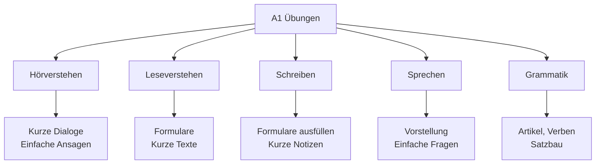
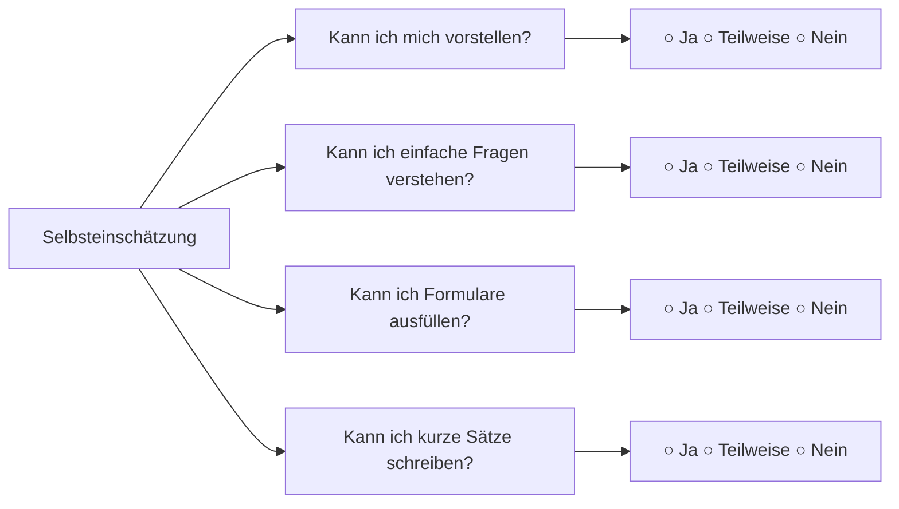

# A1 Übungen - Praxisaufgaben

## Einführung
Diese Übungen helfen Ihnen, das A1-Niveau zu festigen und anzuwenden. Regelmäßiges Üben ist der Schlüssel zum Erfolg beim Deutschlernen.

## Übungsbereiche A1



## Hörverstehen Übungen

### Übung 1: Zahlen verstehen
**Hören Sie und schreiben Sie die Zahlen:**
1. Telefonnummer: ___ ___ ___ - ___ ___ ___ ___ ___
2. Alter: ___ Jahre
3. Preis: ___ Euro ___ Cent

**Lösungshinweise:**
- Achten Sie auf die Aussprache von 13/30, 14/40, etc.
- "zwo" wird manchmal statt "zwei" verwendet

### Übung 2: Einfache Dialoge
**Hören Sie den Dialog und beantworten Sie die Fragen:**

Dialog:
- Person A: "Guten Tag! Wie heißen Sie?"
- Person B: "Guten Tag! Ich heiße Maria Schmidt."
- Person A: "Woher kommen Sie, Frau Schmidt?"
- Person B: "Ich komme aus Österreich."

**Fragen:**
1. Wie heißt die Frau? _______
2. Woher kommt sie? _______

## Leseverstehen Übungen

### Übung 1: Formular verstehen

**Lesen Sie das Formular:**

```
PERSÖNLICHE DATEN
Name: Müller
Vorname: Thomas
Geburtsdatum: 15.03.1985
Nationalität: deutsch
Beruf: Lehrer
```

**Beantworten Sie die Fragen:**
1. Wie ist der Familienname? _______
2. Wann hat Thomas Geburtstag? _______
3. Was ist sein Beruf? _______

### Übung 2: Kurze Anzeige

**Lesen Sie die Anzeige:**

"Zimmer zu vermieten
In der Innenstadt
Preis: 400 € warm
Tel: 030 1234567"

**Fragen:**
1. Was wird angeboten? _______
2. Wo ist das Zimmer? _______
3. Wie viel kostet es? _______

## Schreibübungen

### Übung 1: Formular ausfüllen

**Füllen Sie dieses Formular mit Ihren Daten aus:**

```
ANMELDEFORMULAR SPRACHKURS

Persönliche Daten:
Name: _______________
Vorname: _______________
Geburtsdatum: _______________
Nationalität: _______________
Adresse: _______________
Telefon: _______________
Email: _______________

Sprachkenntnisse:
Deutsch: ○ Anfänger ○ Fortgeschritten
```

### Übung 2: Kurze Notiz schreiben

**Schreiben Sie eine kurze Notiz an einen Freund:**

- Sie können heute nicht zum Deutschkurs kommen
- Sie sind krank
- Sie kommen nächste Woche wieder

```
Lieber/Liebe _______________,

ich kann heute nicht zum Kurs kommen, 
weil ich krank bin.

Bis nächste Woche!

Viele Grüße
_______________
```

## Sprechübungen

### Übung 1: Sich vorstellen

**Üben Sie diese Vorstellung:**

"Guten Tag! Ich heiße [Ihr Name]. Ich komme aus [Ihr Land]. Ich wohne in [Ihre Stadt]. Ich bin [Ihr Beruf]. Ich lerne Deutsch."

**Variationen:**
- Sprechen Sie langsam und deutlich
- Üben Sie mit verschiedenen persönlichen Informationen

### Übung 2: Einfache Fragen stellen

**Üben Sie diese Fragen:**
1. "Wie heißen Sie?"
2. "Woher kommen Sie?"
3. "Wo wohnen Sie?"
4. "Was machen Sie beruflich?"
5. "Sprechen Sie Deutsch?"

## Grammatikübungen

### Übung 1: Artikel einsetzen

**Setzen Sie den richtigen Artikel ein:**
1. ___ Buch ist neu. (das)
2. Ich sehe ___ Mann. (den)
3. ___ Frau spricht Englisch. (die)
4. Hast du ___ Zeit? (die)
5. Das ist ___ Auto. (ein)

### Übung 2: Verben konjugieren

**Konjugieren Sie die Verben:**
1. Ich (heißen) _______ Müller.
2. Du (kommen) _______ aus Berlin.
3. Er (wohnen) _______ in München.
4. Wir (lernen) _______ Deutsch.
5. Ihr (sprechen) _______ gut Englisch.

### Übung 3: Personalpronomen

**Ersetzen Sie die Nomen durch Pronomen:**
1. Der Mann → _______
2. Die Frau → _______
3. Das Kind → _______
4. Die Bücher → _______

## Wortschatzübungen

### Übung 1: Wortfelder

**Ordnen Sie die Wörter den Kategorien zu:**

Wörter: Apfel, Auto, Bruder, Buch, Deutsch, Hund, Kaffee, Lehrer, Milch, Mutter, Schule, Tee, Vater, Wasser

| Familie | Getränke | Berufe | Lebensmittel | Anderes |
|---------|----------|--------|--------------|---------|
| | | | | |

### Übung 2: Gegenteile finden

**Finden Sie die Gegenteile:**
1. groß - _______
2. jung - _______
3. gut - _______
4. teuer - _______
5. langsam - _______

## Interaktive Übungen

### Rollenspiel 1: Im Café

**Spielen Sie diesen Dialog:**
- Kunde: "Guten Tag!"
- Kellner: "Guten Tag! Was möchten Sie?"
- Kunde: "Ich möchte einen Kaffee, bitte."
- Kellner: "Sonst noch etwas?"
- Kunde: "Nein, danke. Das ist alles."
- Kellner: "Das macht 3,50 Euro."
- Kunde: "Bitte schön."
- Kellner: "Danke! Einen schönen Tag noch!"

### Rollenspiel 2: Nach dem Weg fragen

**Spielen Sie diesen Dialog:**
- Person A: "Entschuldigung! Wo ist der Bahnhof?"
- Person B: "Geradeaus, dann links."
- Person A: "Danke schön!"
- Person B: "Bitte schön!"

## Lernfortschritt tracken

### Selbstbewertung



### Übungsplan für eine Woche

| Tag | Übung | Dauer |
|-----|-------|-------|
| Montag | Hörverstehen + Wortschatz | 30 Min. |
| Dienstag | Grammatik + Lesen | 30 Min. |
| Mittwoch | Sprechen + Schreiben | 30 Min. |
| Donnerstag | Wiederholung + Vokabeln | 30 Min. |
| Freitag | Gemischte Übungen | 30 Min. |
| Wochenende | Pause oder freiwillige Übungen | - |

## Zusätzliche Ressourcen

### Online-Übungen
- [Apps](../../ressourcen/apps.md) für interaktives Lernen
- [Grammatik-Übungen](../../uebungen/grammatik/a1.md) speziell für A1
- [Podcasts](../../ressourcen/podcasts.md) für Hörverstehen

### Tipps für erfolgreiches Üben
1. **Regelmäßigkeit**: Täglich 20-30 Minuten üben
2. **Abwechslung**: Verschiedene Übungstypen kombinieren
3. **Realistische Ziele**: Kleine, erreichbare Ziele setzen
4. **Fehler machen**: Aus Fehlern lernen
5. **Spaß haben**: Übungen finden, die Ihnen Freude bereiten

---

## Zusammenfassung

Diese A1-Übungen decken alle wichtigen Kompetenzbereiche ab. Regelmäßiges Üben mit diesen Aufgaben bereitet Sie optimal auf [A2](../a2/uebungen.md) vor und festigt Ihr Grundwissen in Deutsch.

**Viel Erfolg beim Üben!** 🎯