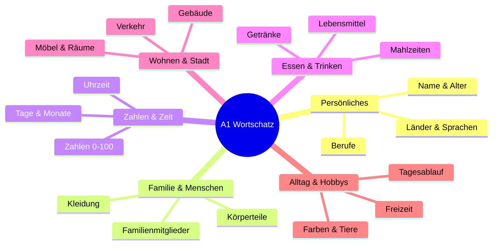
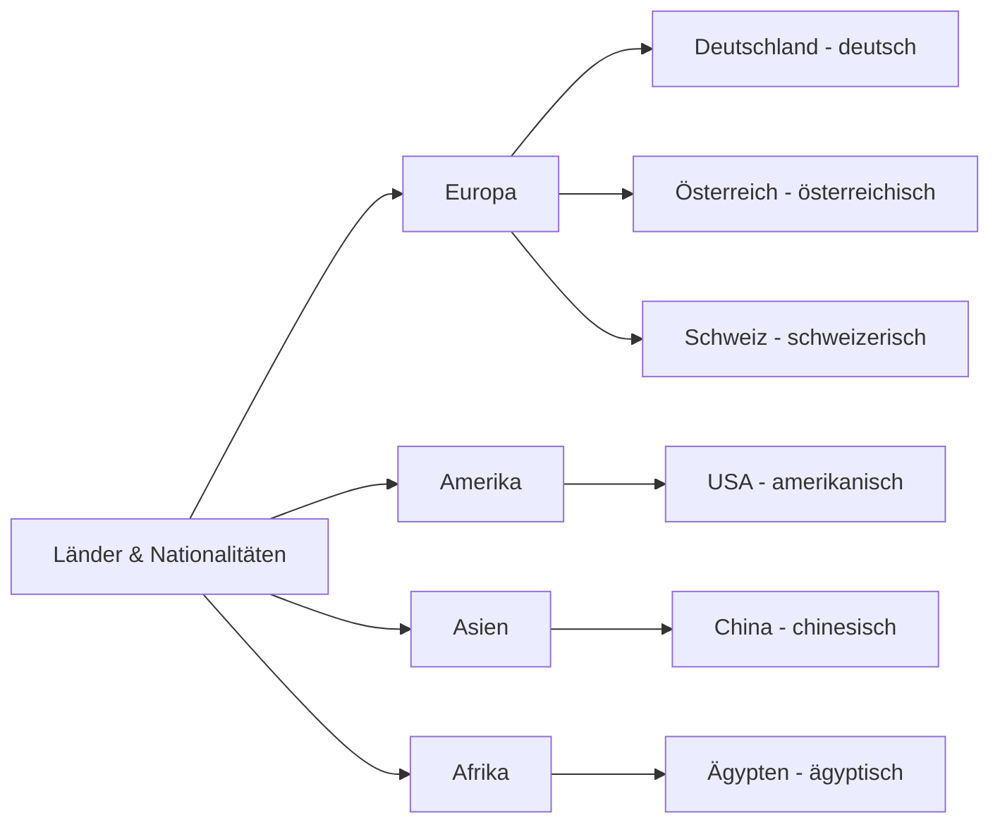
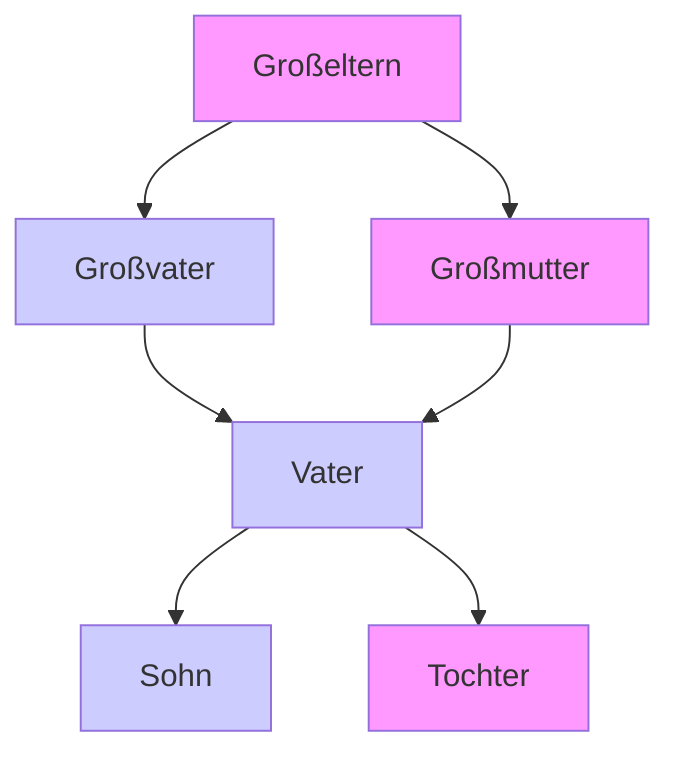
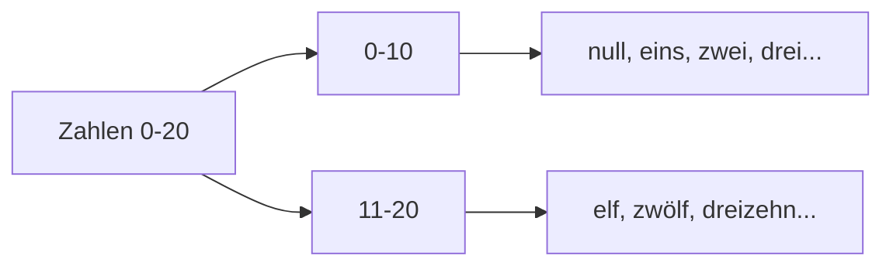
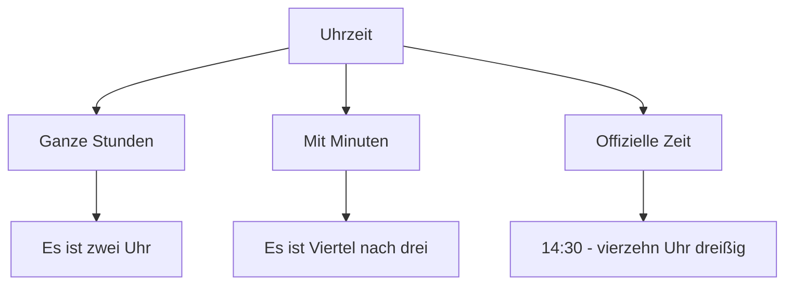
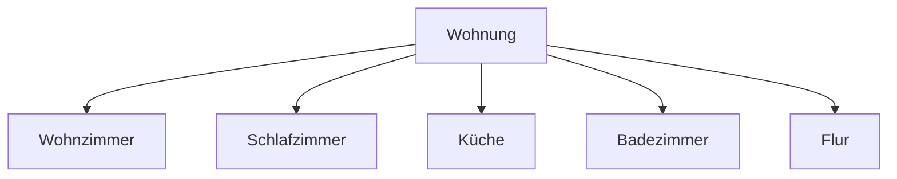
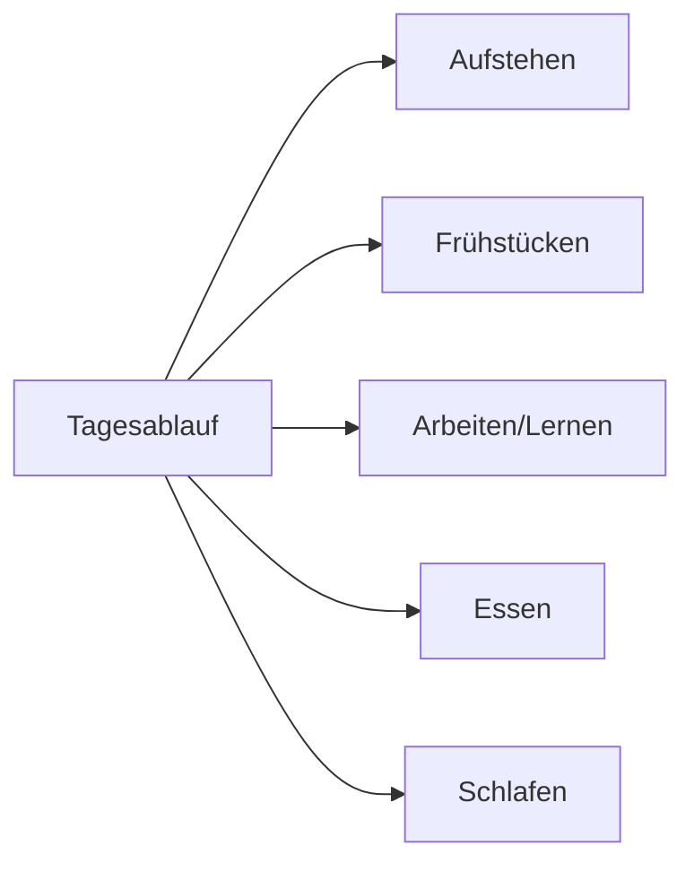
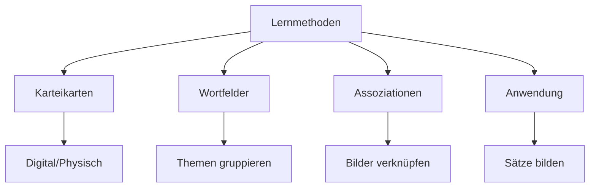

# 📚 A1 Wortschatz - Grundwortschatz Deutsch

## Einführung in den A1-Wortschatz

Hier lernst du die wichtigsten deutschen Wörter für den Alltag. Mit etwa 650-700 Wörtern kannst du dich in einfachen Situationen verständigen.

## A1 Wortschatz im Überblick

## 1. Persönliche Daten

### Länder und Nationalitäten

**Wichtige Länder:**
- **Deutschland** → deutsch
- **Österreich** → österreichisch  
- **Schweiz** → schweizerisch
- **Spanien** → spanisch
- **Italien** → italienisch
- **Frankreich** → französisch
- **Türkei** → türkisch

**Beispiele:**
- Ich komme aus **Deutschland**. Ich bin **Deutsch**.
- Sie kommt aus **Spanien**. Sie ist **Spanierin**.

### Berufe

| Beruf | Artikel | Beispiel |
|-------|---------|----------|
| **der Lehrer** | maskulin | Mein Vater ist Lehrer. |
| **die Lehrerin** | feminin | Meine Mutter ist Lehrerin. |
| **der Arzt** | maskulin | Der Arzt hilft Menschen. |
| **die Ärztin** | feminin | Die Ärztin ist jung. |
| **der Student** | maskulin | Ich bin Student. |
| **die Studentin** | feminin | Maria ist Studentin. |

**Weitere Berufe:**
- der Ingenieur / die Ingenieurin
- der Kellner / die Kellnerin
- der Verkäufer / die Verkäuferin
- der Fahrer / die Fahrerin

## 2. Familie und Menschen

### Familienmitglieder

**Familienwortschatz:**
- **der Vater** - father
- **die Mutter** - mother
- **der Bruder** - brother
- **die Schwester** - sister
- **der Sohn** - son
- **die Tochter** - daughter
- **der Opa/Großvater** - grandfather
- **die Oma/Großmutter** - grandmother

### Körperteile

| Körperteil | Artikel | Beispiel |
|------------|---------|----------|
| **der Kopf** | maskulin | Mein Kopf tut weh. |
| **das Auge** | neutral | Ich habe blaue Augen. |
| **die Nase** | feminin | Deine Nase ist klein. |
| **der Mund** | maskulin | Der Mund ist zum Sprechen. |
| **die Hand** | feminin | Ich wasche meine Hände. |
| **der Fuß** | maskulin | Mein rechter Fuß. |

## 3. Zahlen und Zeit

### Zahlen 0-20

**0-10:** null, eins, zwei, drei, vier, fünf, sechs, sieben, acht, neun, zehn  
**11-20:** elf, zwölf, dreizehn, vierzehn, fünfzehn, sechzehn, siebzehn, achtzehn, neunzehn, zwanzig

### Tage und Monate

**Wochentage:**
- Montag, Dienstag, Mittwoch
- Donnerstag, Freitag
- Samstag/Sonnabend, Sonntag

**Monate:**
- Januar, Februar, März, April
- Mai, Juni, Juli, August
- September, Oktober, November, Dezember

**Jahreszeiten:**
- der Frühling, der Sommer, der Herbst, der Winter

### Uhrzeit

**Beispiele:**
- 08:00 → **acht Uhr**
- 14:30 → **halb drei** oder **vierzehn Uhr dreißig**
- 17:15 → **Viertel nach fünf**
- 20:45 → **Viertel vor neun**

## 4. Essen und Trinken

### Lebensmittel

| Kategorie | Beispiele |
|-----------|-----------|
| **Obst** | der Apfel, die Banane, die Orange, die Erdbeere |
| **Gemüse** | die Tomate, die Kartoffel, die Karotte, der Salat |
| **Milchprodukte** | die Milch, der Käse, die Butter, der Joghurt |
| **Brot & Getreide** | das Brot, der Reis, die Nudeln, das Müsli |

### Getränke

- **das Wasser** - water
- **der Kaffee** - coffee
- **der Tee** - tea
- **die Milch** - milk
- **der Saft** - juice
- **das Bier** - beer (in Deutschland ab 16 Jahren)

### Mahlzeiten

- **das Frühstück** - breakfast
- **das Mittagessen** - lunch
- **das Abendessen** - dinner
- **der Snack** - snack

## 5. Wohnen und Stadt

### Räume in der Wohnung

**Wichtige Räume:**
- **das Wohnzimmer** - living room
- **das Schlafzimmer** - bedroom
- **die Küche** - kitchen
- **das Badezimmer** - bathroom
- **der Flur** - hallway

### Möbel

| Möbel | Artikel | Beispiel |
|-------|---------|----------|
| **der Tisch** | maskulin | Der Tisch ist groß. |
| **der Stuhl** | maskulin | Ich sitze auf dem Stuhl. |
| **das Bett** | neutral | Mein Bett ist bequem. |
| **der Schrank** | maskulin | Die Kleider sind im Schrank. |
| **das Sofa** | neutral | Das Sofa ist neu. |

### Gebäude in der Stadt

- **das Haus** - house
- **die Wohnung** - apartment
- **das Geschäft** - shop
- **die Bank** - bank
- **die Post** - post office
- **die Apotheke** - pharmacy
- **das Restaurant** - restaurant
- **das Café** - café

## 6. Alltag und Hobbys

### Tagesablauf

**Verben für den Tagesablauf:**
- **aufstehen** - to get up
- **frühstücken** - to have breakfast
- **arbeiten** - to work
- **lernen** - to study/learn
- **essen** - to eat
- **schlafen** - to sleep

### Hobbys und Freizeit

- **lesen** - to read
- **fernsehen** - to watch TV
- **Musik hören** - to listen to music
- **Sport machen** - to do sports
- **spazieren gehen** - to go for a walk
- **Freunde treffen** - to meet friends

### Farben

- **weiß** - white
- **schwarz** - black
- **rot** - red
- **blau** - blue
- **grün** - green
- **gelb** - yellow
- **braun** - brown
- **orange** - orange
- **lila** - purple

## Wortschatz-Übungen

### Übung 1: Länder und Nationalitäten

**Verbinde die Länder mit den Nationalitäten:**
1. Deutschland → **deutsch**
2. Frankreich → ___
3. Italien → ___
4. Spanien → ___
5. Türkei → ___

**Lösung:** 2. französisch, 3. italienisch, 4. spanisch, 5. türkisch

### Übung 2: Familienmitglieder

**Wer ist wer?**
1. Der Bruder meines Vaters ist mein ___ → **Onkel**
2. Die Schwester meiner Mutter ist meine ___ → ___
3. Der Sohn meines Bruders ist mein ___ → ___
4. Die Mutter meines Vaters ist meine ___ → ___

**Lösung:** 2. Tante, 3. Neffe, 4. Großmutter

### Übung 3: Zahlen schreiben

**Schreibe die Zahlen aus:**
1. 17 → **siebzehn**
2. 23 → ___
3. 48 → ___
4. 55 → ___
5. 99 → ___

**Lösung:** 2. dreiundzwanzig, 3. achtundvierzig, 4. fünfundfünfzig, 5. neunundneunzig

### Übung 4: Essen und Trinken

**Welche Wörter gehören zusammen?**
- **Obst:** Apfel, Banane, ___
- **Gemüse:** Tomate, Kartoffel, ___
- **Getränke:** Wasser, Kaffee, ___
- **Möbel:** Tisch, Stuhl, ___

**Lösungsvorschläge:** 
Obst: Orange, Erdbeere, Birne  
Gemüse: Karotte, Zwiebel, Gurke  
Getränke: Tee, Saft, Milch  
Möbel: Bett, Schrank, Sofa

### Übung 5: Tagesablauf

**Ordne die Tätigkeiten:**
- aufstehen
- frühstücken
- zur Arbeit gehen
- Mittag essen
- nach Hause kommen
- Abend essen
- fernsehen
- schlafen

### Übung 6: Wortfelder

**Finde 5 Wörter zu diesen Themen:**
**Stadt:** Haus, Geschäft, ___, ___, ___  
**Familie:** Vater, Mutter, ___, ___, ___  
**Essen:** Brot, Käse, ___, ___, ___

## Lernstrategien für Wortschatz

### 🎯 Effektive Lernmethoden

**Bewährte Strategien:**
- **📝 Karteikarten** mit Bildern erstellen
- **🎯 Wortfelder lernen** (alle Familienmitglieder zusammen)
- **🗣️ Laut aussprechen** für Aussprache
- **✍️ Sätze bilden** mit neuen Wörtern
- **🔄 Regelmäßig wiederholen** (täglich 10-15 Minuten)

### 📚 Tägliche Übungsroutine
- **Morgens:** 5 Minuten Wiederholung
- **Mittags:** 5 Minuten neue Wörter
- **Abends:** 5 Minuten Anwendung in Sätzen

## Häufige Fehler vermeiden

### ❌ Typische Wortschatz-Fehler
- **Artikel vergessen**: "Ich habe Auto" → "Ich habe **ein** Auto"
- **Falsche Pluralbildung**: "zwei Kind" → "zwei **Kinder**"
- **Wortstellung**: "Ich gehe nach Hause jetzt" → "Ich gehe **jetzt** nach Hause"

### ✅ Korrekte Anwendung
- Immer **Artikel mitlernen**
- **Pluralformen** mitlernen
- **Verben** mit Beispielsätzen lernen
- **Aussprache** üben

## Wortschatz-Erweiterung

### Nützliche Redemittel
- **Ich verstehe nicht** - I don't understand
- **Wie sagt man...?** - How do you say...?
- **Können Sie das wiederholen?** - Can you repeat that?
- **Was bedeutet...?** - What does... mean?

### Wichtige Fragewörter
- **Wer?** - Who?
- **Was?** - What?
- **Wo?** - Where?
- **Wann?** - When?
- **Warum?** - Why?
- **Wie?** - How?

## Nächste Schritte

- [A1 Grammatik lernen](grammatik.md)
- [A1 Übungen machen](uebungen.md)
- [Kommunikation üben](../../kommunikation/alltagsgespraeche.md)
- [Zu A2 Wortschatz](../../a2/wortschatz.md)

---

*Wortschatz ist wie ein Werkzeugkasten - je mehr Werkzeuge du hast, desto besser kannst du dich ausdrücken!* 🛠️

[💪 Jetzt A1 Übungen machen](uebungen.md){ .md-button .md-button--primary }
[📚 Zur A1 Grammatik](grammatik.md){ .md-button }

**Viel Erfolg beim Vokabellernen!** 🌟

