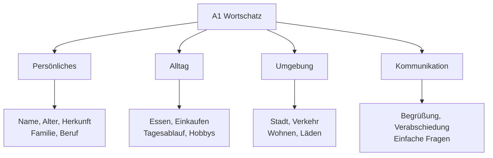
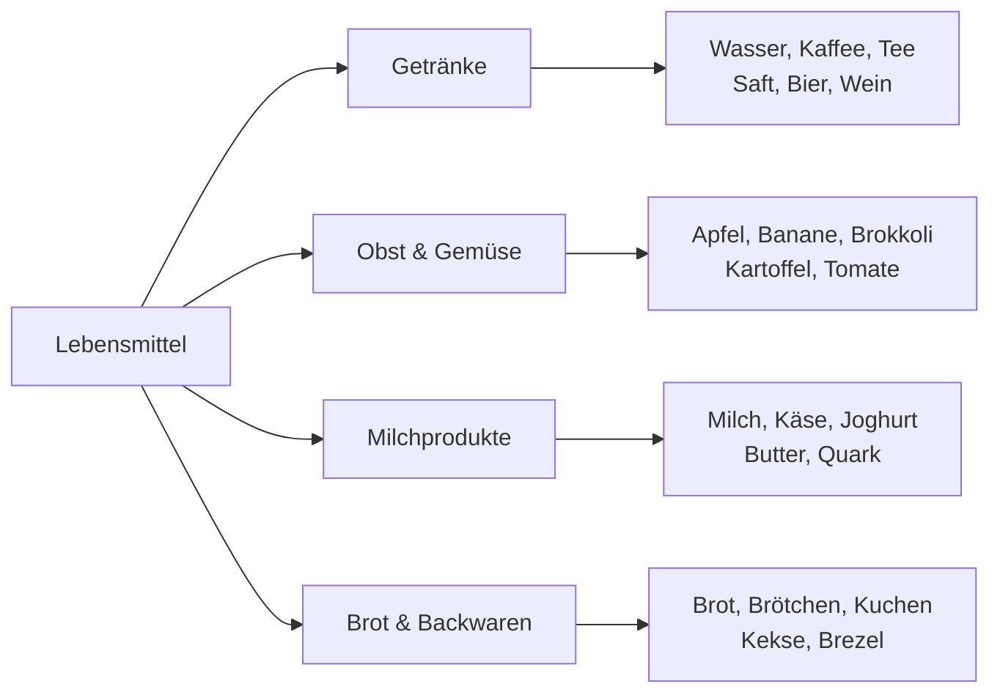
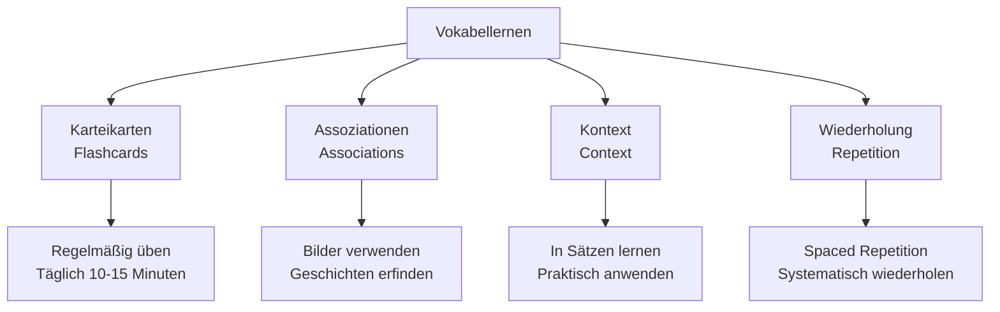

# A1 Wortschatz - Grundwortschatz

## Einführung
Der A1-Wortschatz umfasst etwa 600-800 Wörter, die für grundlegende Alltagskommunikation notwendig sind. Dieser Wortschatz ermöglicht einfache Gespräche über vertraute Themen.

## Themenbereiche A1

## Persönliche Informationen

### Vorstellung

| Deutsch | Englisch | Beispielsatz |
|---------|----------|--------------|
| der Name | name | Wie ist Ihr Name? |
| das Alter | age | Wie alt sind Sie? |
| die Herkunft | origin | Woher kommen Sie? |
| die Nationalität | nationality | Was ist Ihre Nationalität? |
| die Adresse | address | Wie ist Ihre Adresse? |
| die Telefonnummer | phone number | Wie ist Ihre Telefonnummer? |

### Familie

| Deutsch | Englisch | Plural |
|---------|----------|--------|
| die Familie | family | - |
| die Mutter | mother | die Mütter |
| der Vater | father | die Väter |
| der Bruder | brother | die Brüder |
| die Schwester | sister | die Schwestern |
| das Kind | child | die Kinder |

## Zahlen und Zeit

### Zahlen 1-100

| Zahlen | Deutsch | Aussprache |
|--------|---------|------------|
| 1-10 | eins, zwei, drei, vier, fünf, sechs, sieben, acht, neun, zehn | [aɪns, t͡svaɪ, draɪ, fiːɐ, fʏnf, zɛks, ˈziːbən, axt, nɔɪn, t͡seːn] |
| 11-20 | elf, zwölf, dreizehn, vierzehn, fünfzehn... | [ɛlf, t͡svœlf, ˈdraɪt͡seːn, ˈfɪʁt͡seːn, ˈfʏnft͡seːn] |
| 30, 40, 50... | dreißig, vierzig, fünfzig... | [ˈdraɪsɪç, ˈfɪʁt͡sɪç, ˈfʏnft͡sɪç] |

### Tage und Monate

| Wochentage | Monate |
|------------|--------|
| Montag, Dienstag, Mittwoch | Januar, Februar, März |
| Donnerstag, Freitag | April, Mai, Juni |
| Samstag, Sonntag | Juli, August, September |
| | Oktober, November, Dezember |

## Essen und Trinken

### Grundnahrungsmittel

### Im Restaurant

| Deutsch | Englisch | Beispiel |
|---------|----------|----------|
| die Speisekarte | menu | Die Speisekarte, bitte. |
| bestellen | to order | Ich möchte bestellen. |
| das Essen | food, meal | Das Essen ist gut. |
| die Rechnung | bill | Die Rechnung, bitte. |
| trinken | to drink | Was trinkst du? |
| essen | to eat | Ich esse gern Pizza. |

## Stadt und Verkehr

### Gebäude und Orte

| Deutsch | Englisch | Beispiel |
|---------|----------|----------|
| die Stadt | city | Ich wohne in der Stadt. |
| der Bahnhof | train station | Wo ist der Bahnhof? |
| die Haltestelle | bus stop | An der nächsten Haltestelle. |
| der Supermarkt | supermarket | Ich gehe zum Supermarkt. |
| die Apotheke | pharmacy | Die Apotheke ist dort. |
| die Bank | bank | Ich bin bei der Bank. |

### Verkehrsmittel

| Deutsch | Englisch | Präposition |
|---------|----------|-------------|
| das Auto | car | mit dem Auto |
| der Bus | bus | mit dem Bus |
| die Bahn | train | mit der Bahn |
| das Fahrrad | bicycle | mit dem Fahrrad |
| zu Fuß | on foot | zu Fuß gehen |

## Farben und Beschreibungen

### Grundfarben

| Farbe | Deutsch | Beispiel |
|-------|---------|----------|
| 🔴 Rot | rot | der rote Apfel |
| 🔵 Blau | blau | der blaue Himmel |
| 🟡 Gelb | gelb | die gelbe Sonne |
| 🟢 Grün | grün | das grüne Gras |
| ⚫ Schwarz | schwarz | die schwarze Tasche |
| ⚪ Weiß | weiß | das weiße Papier |

### Adjektive für Personen

| Deutsch | Englisch | Gegenteil |
|---------|----------|-----------|
| groß | tall | klein (short) |
| klein | short | groß (tall) |
| jung | young | alt (old) |
| alt | old | jung (young) |
| schön | beautiful | hässlich (ugly) |
| nett | nice | unfreundlich (unfriendly) |

## Häufige Verben

### Alltagsverben

| Verb | Englisch | Beispiel |
|------|----------|----------|
| sein | to be | Ich bin Student. |
| haben | to have | Ich habe Hunger. |
| gehen | to go | Ich gehe nach Hause. |
| kommen | to come | Kommst du mit? |
| machen | to do, make | Was machst du? |
| sagen | to say | Was sagst du? |

### Bewegungsverben

| Verb | Englisch | Präposition |
|------|----------|-------------|
| fahren | to drive, ride | nach Berlin fahren |
| fliegen | to fly | nach Deutschland fliegen |
| laufen | to walk, run | im Park laufen |
| schwimmen | to swim | im See schwimmen |
| reisen | to travel | nach Österreich reisen |

## Nützliche Ausdrücke

### Begrüßung und Verabschiedung

| Situation | Deutsch | Englisch |
|-----------|---------|----------|
| Begrüßung | Guten Tag! | Good day! |
| | Hallo! | Hello! |
| | Guten Morgen! | Good morning! |
| Verabschiedung | Auf Wiedersehen! | Goodbye! |
| | Tschüss! | Bye! |
| | Bis später! | See you later! |

### Höflichkeitsformeln

| Deutsch | Englisch | Antwort |
|---------|----------|---------|
| Danke! | Thank you! | Bitte! (You're welcome) |
| Entschuldigung! | Excuse me/Sorry! | Kein Problem! |
| Bitte! | Please/You're welcome | Danke! |
| Gern geschehen! | You're welcome | - |

## Lernstrategien für A1-Wortschatz

### Effektives Vokabellernen

### Tägliche Übungen

| Übung | Zeit | Methode |
|-------|------|---------|
| Vokabelkarten | 10 Min. | 10 neue Wörter lernen |
| Wiederholung | 5 Min. | Gelernte Wörter wiederholen |
| Anwendung | 10 Min. | Sätze mit neuen Wörtern bilden |

## Übungsbeispiele

### Übung 1: Wortschatz zuordnen
Ordnen Sie zu:
1. der Bruder - (a) sister
2. die Schwester - (b) brother
3. das Kind - (c) child
4. die Familie - (d) family

### Übung 2: Sätze vervollständigen
Vervollständigen Sie die Sätze:
1. Ich ___ aus Deutschland. (komme)
2. ___ alt bist du? (Wie)
3. Das ___ schmeckt gut. (Essen)

### Übung 3: Dialog üben
Erstellen Sie einen kurzen Dialog:
- Begrüßung
- Nach Name und Herkunft fragen
- Verabschiedung

---

## Zusammenfassung

Der A1-Wortschatz konzentriert sich auf essentielle Alltagsthemen. Wichtige Bereiche sind:
- Persönliche Vorstellung
- Zahlen, Farben, Familie
- Essen, Stadt, Verkehr
- Grundlegende Verben und Adjektive

Mit diesem Wortschatz sind Sie bereit für die erweiterten Themen in [A2](../a2/wortschatz.md)!