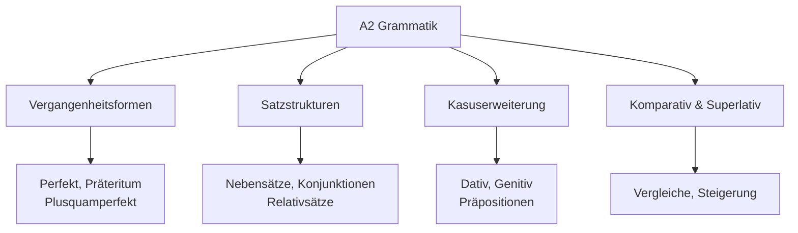
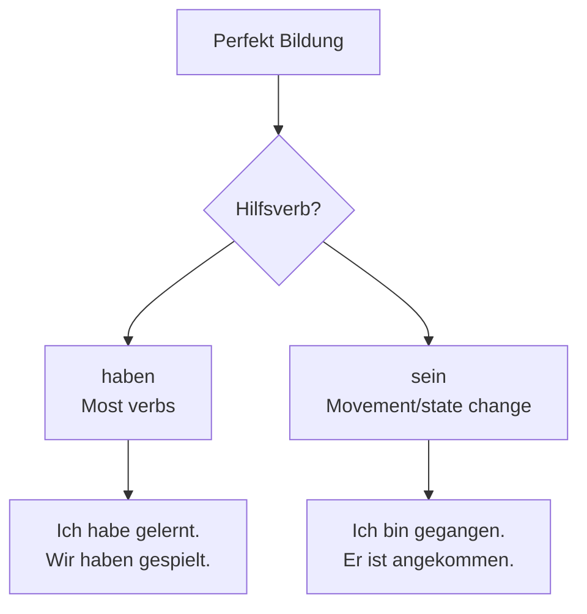

# A2 Grammatik - Erweiterte Grundlagen

## Einführung
Auf A2-Niveau erweitern Sie Ihre Grammatikkenntnisse um wichtige Zeitformen, Satzstrukturen und komplexere Sprachmuster. Diese Kenntnisse ermöglichen Ihnen, über Vergangenes zu sprechen und differenziertere Aussagen zu treffen.

## Grammatik-Übersicht A2

## Vergangenheitsformen

### Perfekt - Vollendete Gegenwart

#### Bildung des Perfekts

#### Verben mit "sein"

| Verb | Perfekt | Bedeutung |
|------|---------|-----------|
| gehen | ist gegangen | went |
| kommen | ist gekommen | came |
| fahren | ist gefahren | drove/went |
| fliegen | ist geflogen | flew |
| bleiben | ist geblieben | stayed |

#### Partizip II Bildung

| Verbtyp | Regel | Beispiel |
|---------|-------|----------|
| Regelmäßig | ge + Stamm + t | lernen → gelernt |
| Unregelmäßig | ge + Stamm + en | gehen → gegangen |
| Verben auf -ieren | Stamm + t | studieren → studiert |
| Trennbare Verben | Präfix + ge + Stamm + t | aufstehen → aufgestanden |

### Präteritum - Einfache Vergangenheit

#### Verwendung

| Situation | Zeitform | Beispiel |
|-----------|----------|----------|
| Geschriebenes | Präteritum | "Er ging gestern zur Arbeit." |
| Gesprochenes | Perfekt | "Er ist gestern zur Arbeit gegangen." |
| Modalverben | Präteritum | "Ich konnte nicht kommen." |

#### Wichtige Präteritumformen

| Infinitiv | Präteritum | Bedeutung |
|-----------|------------|-----------|
| sein | war | was |
| haben | hatte | had |
| werden | wurde | became |
| können | konnte | could |
| müssen | musste | had to |

## Satzstrukturen

### Nebensätze

#### Konjunktionen

| Konjunktion | Satztyp | Verbposition | Beispiel |
|-------------|---------|--------------|----------|
| weil | Kausalsatz | Ende | Ich lerne, weil ich nach Deutschland will. |
| dass | dass-Satz | Ende | Ich weiß, dass du Recht hast. |
| wenn | Konditionalsatz | Ende | Wenn es regnet, bleibe ich zu Hause. |
| obwohl | Konzessivsatz | Ende | Ich gehe, obwohl ich müde bin. |

### Relativsätze

#### Relativpronomen

| Genus/Numerus | Nominativ | Akkusativ | Dativ |
|---------------|-----------|-----------|-------|
| Maskulin | der | den | dem |
| Feminin | die | die | der |
| Neutral | das | das | dem |
| Plural | die | die | denen |

**Beispiele:**
- "Der Mann, der dort steht, ist mein Vater."
- "Das Buch, das ich lese, ist interessant."
- "Die Frau, der ich geholfen habe, war dankbar."

## Kasus und Präpositionen

### Dativ

#### Dativ-Verben

| Verb | Beispiel |
|------|----------|
| helfen | Ich helfe dem Kind. |
| gefallen | Das Buch gefällt mir. |
| gehören | Das Auto gehört meinem Bruder. |
| danken | Ich danke dir für die Hilfe. |

#### Dativ-Präpositionen

| Präposition | Bedeutung | Beispiel |
|-------------|-----------|----------|
| aus | from, out of | aus Deutschland |
| außer | except for | außer mir |
| bei | at, with | bei meiner Freundin |
| mit | with | mit dem Auto |
| nach | after, to | nach der Arbeit |
| seit | since | seit einem Jahr |
| von | from, of | von meinem Vater |
| zu | to | zu meiner Familie |

### Genitiv (Einführung)

#### Genitiv-Präpositionen

| Präposition | Bedeutung | Beispiel |
|-------------|-----------|----------|
| während | during | während des Kurses |
| wegen | because of | wegen des Wetters |
| trotz | despite | trotz der Probleme |

## Komparativ und Superlativ

### Steigerung der Adjektive

#### Regelmäßige Steigerung

| Positiv | Komparativ | Superlativ | Bedeutung |
|---------|------------|------------|-----------|
| schnell | schneller | am schnellsten | fast, faster, fastest |
| alt | älter | am ältesten | old, older, oldest |
| groß | größer | am größten | big, bigger, biggest |

#### Unregelmäßige Steigerung

| Positiv | Komparativ | Superlativ | Bedeutung |
|---------|------------|------------|-----------|
| gut | besser | am besten | good, better, best |
| viel | mehr | am meisten | much, more, most |
| gern | lieber | am liebsten | like, prefer, most like |

### Vergleichssätze

| Struktur | Beispiel |
|----------|----------|
| so...wie | Ich bin so groß wie du. |
| ...als | Berlin ist größer als München. |
| immer + Komparativ | Das Wetter wird immer besser. |

## Modalverben im Präteritum

### Konjugation

| Modalverb | ich | du | er/sie/es | wir | ihr | sie/Sie |
|-----------|-----|----|-----------|-----|-----|---------|
| können | konnte | konntest | konnte | konnten | konntet | konnten |
| müssen | musste | musstest | musste | mussten | musstet | mussten |
| wollen | wollte | wolltest | wollte | wollten | wolltet | wollten |
| sollen | sollte | solltest | sollte | sollten | solltet | sollten |
| dürfen | durfte | durftest | durfte | durften | durftet | durften |

## Reflexivverben

### Wichtige Reflexivverben

| Verb | Bedeutung | Beispiel |
|------|-----------|----------|
| sich freuen | to be happy | Ich freue mich auf das Wochenende. |
| sich interessieren | to be interested | Er interessiert sich für Musik. |
| sich entscheiden | to decide | Wir entscheiden uns für Option A. |
| sich erinnern | to remember | Kannst du dich erinnern? |
| sich treffen | to meet | Wir treffen uns morgen. |

### Reflexivpronomen

| Person | Akkusativ | Dativ |
|--------|-----------|-------|
| ich | mich | mir |
| du | dich | dir |
| er/sie/es | sich | sich |
| wir | uns | uns |
| ihr | euch | euch |
| sie/Sie | sich | sich |

## Übungsbeispiele

### Übung 1: Perfekt bilden
Bilden Sie Sätze im Perfekt:
1. Ich (gehen) ___ gestern ins Kino.
2. Sie (lesen) ___ das Buch.
3. Wir (essen) ___ zu Mittag.

### Übung 2: Nebensätze bilden
Verbinden Sie die Sätze:
1. Ich bleibe zu Hause. Es regnet. (weil)
2. Ich weiß. Du hast Recht. (dass)
3. Ich komme. Ich habe Zeit. (wenn)

### Übung 3: Relativsätze bilden
Ergänzen Sie Relativsätze:
1. Der Mann, ___ dort steht, ist mein Lehrer.
2. Das Buch, ___ ich lese, ist spannend.
3. Die Stadt, in ___ ich wohne, ist schön.

### Übung 4: Steigerungsformen
Bilden Sie die Steigerung:
1. gut → ___ → ___
2. interessant → ___ → ___
3. viel → ___ → ___

---

## Zusammenfassung

Die A2-Grammatik erweitert Ihre Ausdrucksmöglichkeiten erheblich. Wichtige Schwerpunkte sind:
- Perfekt für vergangene Ereignisse
- Nebensätze für komplexere Aussagen
- Dativ und erste Genitiv-Strukturen
- Komparativ und Superlativ für Vergleiche
- Reflexivverben für persönliche Aussagen

Mit diesen Grammatikkenntnissen sind Sie optimal vorbereitet für die erweiterten Strukturen in [B1](../b1/grammatik.md)!