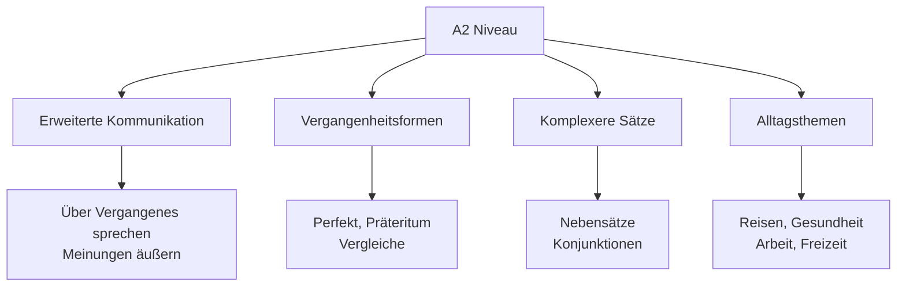
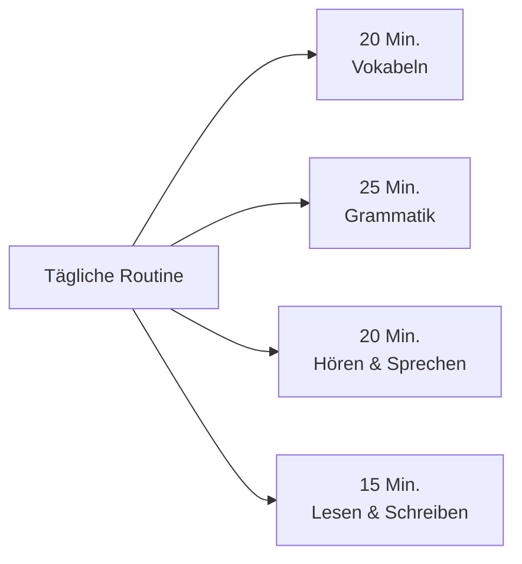

# A2 Level - Überblick (Overview)

## Einführung
A2 ist die zweite Stufe des Gemeinsamen Europäischen Referenzrahmens für Sprachen (GER). Auf diesem Niveau können Sie sich in einfachen, routinemäßigen Situationen verständigen und über vertraute Themen kommunizieren.

## Was Sie auf A2 lernen

## Lernziele A2

### Kommunikative Kompetenzen

| Bereich | Was Sie können | Beispiele |
|---------|----------------|-----------|
| 🗣️ **Sprechen** | Einfache Gespräche über vertraute Themen | Über Hobbys, Arbeit, Reisen sprechen |
| 👂 **Hören** | Hauptpunkte in klarer Standardsprache | Radionachrichten, einfache Anweisungen |
| 📖 **Lesen** | Kurze, einfache Texte verstehen | Persönliche Briefe, Werbetexte |
| ✍️ **Schreiben** | Kurze, einfache Notizen und Briefe | E-Mails, persönliche Nachrichten |

### Themenbereiche A2

| Thema | Inhalt |
|-------|--------|
| 🏥 **Gesundheit** | Arztbesuch, Symptome beschreiben |
| 🚗 **Verkehr & Reisen** | Fahrkarten kaufen, Wegbeschreibungen |
| 💼 **Arbeit & Beruf** | Berufe beschreiben, Arbeitsalltag |
| 🎭 **Freizeit & Hobbys** | Interessen beschreiben, Pläne machen |
| 🏠 **Wohnen & Umgebung** | Wohnung beschreiben, Nachbarschaft |

## A2 Prüfungsformen

### Typische Prüfungsteile

| Prüfungsteil | Dauer | Inhalt |
|--------------|-------|--------|
| Hörverstehen | 25-30 Min. | Alltagsgespräche, Radionachrichten |
| Leseverstehen | 30-35 Min. | Anzeigen, Briefe, kurze Artikel |
| Schreiben | 30-35 Min. | Persönlicher Brief, E-Mail |
| Sprechen | 15-20 Min. | Gespräch über vertraute Themen |

## Lernempfehlungen für A2

### Tägliches Lernen

### Nützliche Ressourcen

- [Apps](../../ressourcen/apps.md) für erweitertes Vokabular
- [Übungen](../../uebungen/grammatik/a2.md) zur A2-Grammatik
- [Podcasts](../../ressourcen/podcasts.md) für Alltagsdeutsch

## Zeitaufwand für A2

| Lernform | Empfohlene Zeit |
|----------|-----------------|
| Selbststudium | 100-120 Stunden |
| Kurs (Gruppe) | 80-100 Unterrichtsstunden |
| Intensivkurs | 6-8 Wochen |

## Fortschritt von A1 zu A2

### Neue Fähigkeiten

| Bereich | A1 | A2 |
|---------|----|----|
| **Grammatik** | Präsens, einfache Sätze | Perfekt, Nebensätze |
| **Wortschatz** | 600-800 Wörter | 1200-1500 Wörter |
| **Kommunikation** | Einfache Fragen | Gespräche über Alltagsthemen |
| **Schreiben** | Formulare | Persönliche Briefe |

## Häufige Herausforderungen A2

### Typische Schwierigkeiten

| Bereich | Herausforderung | Lösung |
|---------|-----------------|--------|
| 🕰️ **Perfekt** | haben vs. sein | Verblisten lernen, üben |
| 🔗 **Nebensätze** | Verbposition | Satzbaupläne visualisieren |
| 🎯 **Präpositionen** | Wechselpräpositionen | Mit Visualisierungen lernen |
| 🗣️ **Aussprache** | Satzmelodie | Nachsprechen, Aufnahmen hören |

## Vorbereitung auf B1

### Was kommt als nächstes?
Nach A2 können Sie sich auf [B1](../b1/ueberblick.md) vorbereiten, wo Sie lernen:
- Über Erfahrungen und Ereignisse berichten
- Hoffnungen und Ziele beschreiben
- Die Hauptpunkte komplexerer Texte verstehen

## Selbsttest: A2-Kenntnisse

### Können Sie das?

1. ❓ Können Sie über vergangene Ereignisse berichten?
2. ❓ Können Sie einfache Wegbeschreibungen geben?
3. ❓ Verstehen Sie die Hauptpunkte von Radionachrichten?
4. ❓ Können Sie eine persönliche E-Mail schreiben?
5. ❓ Können Sie über Ihre Hobbys und Interessen sprechen?

Wenn Sie 4-5 Fragen mit "Ja" beantworten, sind Sie bereit für A2!

## Lernstrategien für A2

### Effektive Methoden

| Strategie | Beschreibung | Beispiel |
|-----------|-------------|----------|
| **Kontextlernen** | Wörter in Sätzen lernen | Nicht "essen" allein, sondern "Ich esse gerne Pizza." |
| **Regelmäßige Wiederholung** | Gelerntes systematisch wiederholen | Karteikarten mit Spaced Repetition |
| **Aktive Anwendung** | Sprache im Alltag verwenden | Tagebuch auf Deutsch schreiben |

## Übungsbeispiele A2

### Hörverstehen
Hören Sie eine kurze Radionachricht und beantworten Sie:
- Worum geht es in der Nachricht?
- Wann findet das Ereignis statt?
- Wo findet es statt?

### Leseverstehen
Lesen Sie einen persönlichen Brief und beantworten Sie:
- Wer schreibt an wen?
- Was ist der Hauptgrund für den Brief?
- Welche Informationen werden mitgeteilt?

---

## Zusammenfassung

A2 baut auf den A1-Grundlagen auf und erweitert Ihre Kommunikationsfähigkeiten erheblich. Sie lernen:
- Über Vergangenes sprechen
- Komplexere Satzstrukturen
- Erweiterte Alltagsthemen
- Persönliche Briefe und E-Mails schreiben

Mit regelmäßigem Üben und den richtigen [Lernstrategien](../../lernstrategien/index.md) meistern Sie dieses Niveau erfolgreich und bereiten sich optimal auf B1 vor!