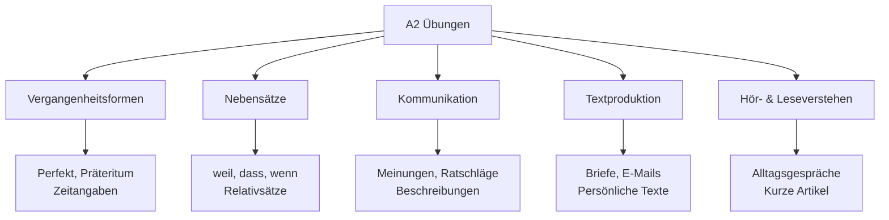
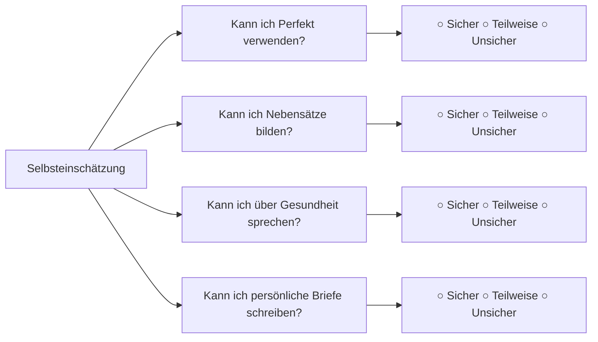

# A2 Übungen - Erweiterte Praxisaufgaben

## Einführung
Diese A2-Übungen helfen Ihnen, die erweiterten Grammatikstrukturen und den erweiterten Wortschatz zu festigen. Die Übungen decken alle Kompetenzbereiche ab und bereiten Sie optimal auf die A2-Prüfungen vor.

## Übungsbereiche A2



## Grammatikübungen

### Übung 1: Perfekt bilden
**Bilden Sie Sätze im Perfekt:**

1. Gestern (ich / ins Kino / gehen) _______
2. Letzte Woche (sie / ein Buch / kaufen) _______
3. Vor einem Jahr (wir / nach Berlin / fahren) _______
4. (Du / schon / die Hausaufgaben / machen) _______?

**Lösungshinweise:**
- Achten Sie auf das Hilfsverb (haben/sein)
- Denken Sie an die Partizip-II-Form
- Position des Verbs im Satz

### Übung 2: Nebensätze bilden
**Verbinden Sie die Sätze mit den angegebenen Konjunktionen:**

1. Ich bleibe zu Hause. Es regnet. (weil)
   _______
2. Ich weiß. Du hast Recht. (dass)
   _______
3. Ich komme. Ich habe Zeit. (wenn)
   _______

### Übung 3: Relativsätze
**Ergänzen Sie die Relativsätze:**

1. Der Mann, _______ dort steht, ist mein Lehrer.
2. Das Buch, _______ ich lese, ist sehr interessant.
3. Die Stadt, in _______ ich wohne, hat viele Parks.
4. Die Frau, _______ ich geholfen habe, war sehr dankbar.

## Hörverstehen Übungen

### Übung 1: Radionachricht
**Hören Sie eine kurze Radionachricht und beantworten Sie die Fragen:**

Nachricht:
"Guten Morgen! Hier sind die Nachrichten. Heute findet in der Innenstadt ein großer Markt statt. Der Markt ist von 8 bis 18 Uhr geöffnet. Es gibt frisches Obst, Gemüse und Blumen. Wegen des Marktes sind einige Straßen gesperrt. Bitte nutzen Sie öffentliche Verkehrsmittel."

**Fragen:**
1. Was findet in der Innenstadt statt? _______
2. Wie lange ist der Markt geöffnet? _______
3. Warum sollten Sie öffentliche Verkehrsmittel nutzen? _______

### Übung 2: Telefongespräch
**Hören Sie ein Telefongespräch und ergänzen Sie die Informationen:**

Gespräch:
- A: "Hallo, Praxis Dr. Schmidt. Guten Tag!"
- B: "Guten Tag! Ich möchte einen Termin vereinbaren."
- A: "Haben Sie Schmerzen?"
- B: "Ja, ich habe starke Kopfschmerzen."
- A: "Kommen Sie heute Nachmittag um 15 Uhr?"
- B: "Ja, das passt. Vielen Dank!"

**Informationen:**
- Grund des Anrufs: _______
- Symptome: _______
- Termin: _______

## Leseverstehen Übungen

### Übung 1: Persönlicher Brief
**Lesen Sie den Brief und beantworten Sie die Fragen:**

"Liebe Anna,

vielen Dank für deinen Brief! Es hat mich sehr gefreut, von dir zu hören.

Letztes Wochenende war ich mit meiner Familie im Zoo. Das Wetter war super - sonnig und warm. Wir haben viele Tiere gesehen: Löwen, Elefanten und sogar Pandabären. Meine Tochter war besonders begeistert von den Affen.

Nächsten Monat fahre ich nach Hamburg. Ich besuche eine Freundin, die dort studiert. Vielleicht können wir uns treffen, wenn du Zeit hast?

Schreib mir bald wieder!

Liebe Grüße,
Sarah"

**Fragen:**
1. Wo war Sarah letztes Wochenende? _______
2. Welche Tiere haben sie gesehen? _______
3. Wohin fährt sie nächsten Monat? _______
4. Warum fährt sie dorthin? _______

### Übung 2: Anzeige verstehen
**Lesen Sie die Anzeige und beantworten Sie die Fragen:**

"Zimmer in WG gesucht
Für Student/in ab September
In München-Neuhausen
Preis: max. 400 € warm
Ruhige Person, nichtrauchend
Tel: 089 7654321"

**Fragen:**
1. Was wird gesucht? _______
2. Ab wann wird das Zimmer gebraucht? _______
3. Wie viel darf das Zimmer kosten? _______
4. Welche Eigenschaften sind wichtig? _______

## Schreibübungen

### Übung 1: Persönliche E-Mail
**Schreiben Sie eine E-Mail an einen Freund:**

- Erzählen Sie von Ihrem letzten Wochenende
- Beschreiben Sie, was Sie gemacht haben
- Fragen Sie nach den Plänen Ihres Freundes
- Machen Sie einen Vorschlag für ein Treffen

```
Betreff: Mein Wochenende

Liebe/r [Name],

[Ihr Text hier...]

Viele Grüße
[Ihr Name]
```

### Übung 2: Formeller Brief
**Schreiben Sie einen Brief an ein Hotel:**

- Fragen Sie nach einem Zimmer für bestimmte Daten
- Fragen Sie nach dem Preis
- Fragen Sie nach den Annehmlichkeiten
- Geben Sie Ihre Kontaktdaten an

```
Sehr geehrte Damen und Herren,

[Ihr Text hier...]

Mit freundlichen Grüßen
[Ihr Name]
```

## Sprechübungen

### Übung 1: Vergangenes beschreiben
**Erzählen Sie über Ihr letztes Wochenende:**

Verwenden Sie:
- Perfekt für die Hauptaktivitäten
- Zeitangaben (am Samstag, um 10 Uhr, etc.)
- Gefühle und Meinungen

**Beispielstruktur:**
"Am Wochenende war ich... Zuerst habe ich... Dann bin ich... Es war..."

### Übung 2: Meinungen äußern
**Diskutieren Sie diese Themen:**

1. "Fernsehen vs. Internet - was ist besser?"
2. "Stadtleben vs. Landleben"
3. "Traumurlaub - wo und warum?"

Verwenden Sie Ausdrücke wie:
- "Ich finde, dass..."
- "Meiner Meinung nach..."
- "Ein Vorteil/Nachteil ist..."

## Wortschatzübungen

### Übung 1: Wortfamilien
**Finden Sie verwandte Wörter:**

1. arbeiten → _______, _______, _______
2. lernen → _______, _______, _______
3. reisen → _______, _______, _______

### Übung 2: Synonyme finden
**Finden Sie Synonyme:**

1. glücklich → _______
2. interessant → _______
3. schnell → _______
4. einfach → _______

### Übung 3: Wortfeld "Gesundheit"
**Ergänzen Sie das Wortfeld:**

Arzt, _______, _______, _______, _______, _______

## Interaktive Übungen

### Rollenspiel 1: Beim Arzt
**Spielen Sie diesen Dialog:**

- Patient: Beschreibt Symptome (Kopfschmerzen, Fieber)
- Arzt: Stellt Fragen, gibt Ratschläge
- Patient: Bedankt sich, vereinbart Folgetermin

### Rollenspiel 2: Im Reisebüro
**Spielen Sie diesen Dialog:**

- Kunde: Möchte eine Reise buchen
- Reisebüromitarbeiter: Bietet Optionen an, erklärt Preise
- Kunde: Entscheidet sich, stellt Fragen

## Lernfortschritt tracken

### Selbstbewertung A2



### Übungsplan für zwei Wochen

| Woche | Montag | Dienstag | Mittwoch | Donnerstag | Freitag |
|-------|--------|----------|----------|------------|---------|
| **1** | Grammatik | Hörverstehen | Wortschatz | Schreiben | Sprechen |
| **2** | Wiederholung | Leseverstehen | Kommunikation | Gemischt | Test |

## Prüfungsvorbereitung

### Typische A2-Prüfungsaufgaben

| Prüfungsteil | Übungstyp | Tipps |
|--------------|-----------|-------|
| Hörverstehen | Multiple Choice | Schlüsselwörter markieren |
| Leseverstehen | Lückentext | Kontext verstehen |
| Schreiben | Brief/E-Mail | Struktur einhalten |
| Sprechen | Dialog | Klar und langsam sprechen |

### Probeprüfung Zeitplan

| Teil | Zeit | Punkte |
|------|------|--------|
| Hörverstehen | 25 Min. | 25 |
| Leseverstehen | 30 Min. | 25 |
| Schreiben | 30 Min. | 25 |
| Sprechen | 15 Min. | 25 |

## Zusätzliche Ressourcen

### Online-Übungen
- [Apps](../../ressourcen/apps.md) für A2-Niveau
- [Grammatik-Übungen](../../uebungen/grammatik/a2.md) speziell für A2
- [Podcasts](../../ressourcen/podcasts.md) für Alltagsdeutsch

### Lerntipps für A2
1. **Regelmäßigkeit**: Täglich 30-45 Minuten üben
2. **Abwechslung**: Alle Kompetenzbereiche trainieren
3. **Realistische Ziele**: Wöchentliche Lernziele setzen
4. **Fehleranalyse**: Aus Fehlern lernen
5. **Spaß am Lernen**: Interessante Themen wählen

---

## Zusammenfassung

Diese A2-Übungen decken alle wichtigen Kompetenzbereiche ab und bereiten Sie optimal auf die A2-Prüfungen vor. Regelmäßiges Üben mit diesen Aufgaben festigt Ihr Wissen und bereitet Sie auf [B1](../b1/uebungen.md) vor.

**Viel Erfolg beim Üben!** 🎯