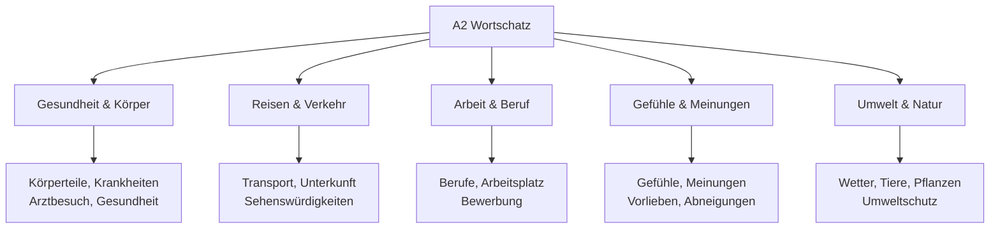
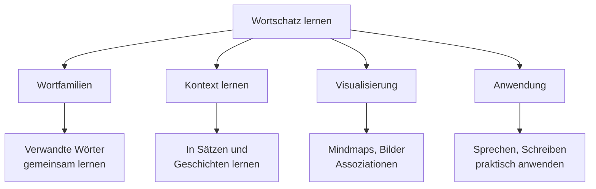

# A2 Wortschatz - Erweiterter Grundwortschatz

## Einführung
Der A2-Wortschatz umfasst etwa 1200-1500 Wörter und ermöglicht Ihnen, über ein breiteres Spektrum an Alltagsthemen zu kommunizieren. Sie lernen, Gefühle auszudrücken, Meinungen zu äußern und komplexere Situationen zu beschreiben.

## Themenbereiche A2

## Gesundheit und Körper

### Körperteile

| Deutsch | Englisch | Beispiel |
|---------|----------|----------|
| der Kopf | head | Mein Kopf tut weh. |
| der Rücken | back | Ich habe Rückenschmerzen. |
| der Magen | stomach | Mein Magen schmerzt. |
| das Herz | heart | Das Herz schlägt schnell. |
| die Lunge | lung | Die Lunge atmet. |

### Krankheiten und Symptome

| Deutsch | Englisch | Beispiel |
|---------|----------|----------|
| die Erkältung | cold | Ich habe eine Erkältung. |
| das Fieber | fever | Er hat hohes Fieber. |
| der Schmerz | pain | Ich habe Schmerzen. |
| husten | to cough | Ich huste viel. |
| niesen | to sneeze | Er muss niesen. |

### Beim Arzt

| Deutsch | Englisch | Beispiel |
|---------|----------|----------|
| der Arzt/die Ärztin | doctor | Ich gehe zum Arzt. |
| das Rezept | prescription | Der Arzt schreibt ein Rezept. |
| die Apotheke | pharmacy | Ich hole Medikamente in der Apotheke. |
| untersuchen | to examine | Der Arzt untersucht den Patienten. |
| verschreiben | to prescribe | Der Arzt verschreibt Medikamente. |

## Reisen und Verkehr

### Transportmittel

| Deutsch | Englisch | Präposition |
|---------|----------|-------------|
| der Zug | train | mit dem Zug |
| der Bus | bus | mit dem Bus |
| das Flugzeug | airplane | mit dem Flugzeug |
| das Schiff | ship | mit dem Schiff |
| das Taxi | taxi | mit dem Taxi |

### Im Hotel

| Deutsch | Englisch | Beispiel |
|---------|----------|----------|
| das Hotel | hotel | Wir übernachten im Hotel. |
| das Zimmer | room | Unser Zimmer ist im dritten Stock. |
| die Rezeption | reception | An der Rezeption fragen. |
| der Schlüssel | key | Der Zimmerschlüssel bitte. |
| die Buchung | booking | Ich habe eine Buchung. |

### Sehenswürdigkeiten

| Deutsch | Englisch | Beispiel |
|---------|----------|----------|
| das Museum | museum | Wir besuchen das Museum. |
| die Kirche | church | Die Kirche ist sehr alt. |
| das Schloss | castle | Das Schloss ist sehenswert. |
| der Park | park | Im Park spazieren gehen. |
| das Denkmal | monument | Das Denkmal steht im Zentrum. |

## Arbeit und Beruf

### Berufe

| Deutsch | Englisch | Arbeitsort |
|---------|----------|------------|
| der Lehrer/die Lehrerin | teacher | in der Schule |
| der Arzt/die Ärztin | doctor | im Krankenhaus |
| der Ingenieur/die Ingenieurin | engineer | im Büro |
| der Verkäufer/die Verkäuferin | salesperson | im Geschäft |
| der Koch/die Köchin | cook | im Restaurant |

### Arbeitsplatz

| Deutsch | Englisch | Beispiel |
|---------|----------|----------|
| der Beruf | profession | Was ist Ihr Beruf? |
| die Arbeit | work | Meine Arbeit ist interessant. |
| das Büro | office | Ich arbeite im Büro. |
| der Kollege/die Kollegin | colleague | Meine Kollegen sind nett. |
| der Chef/die Chefin | boss | Der Chef ist zufrieden. |

## Gefühle und Meinungen

### Gefühle ausdrücken

| Deutsch | Englisch | Gegenteil |
|---------|----------|-----------|
| glücklich | happy | traurig (sad) |
| zufrieden | satisfied | unzufrieden (dissatisfied) |
| aufgeregt | excited | gelangweilt (bored) |
| müde | tired | ausgeruht (rested) |
| nervös | nervous | ruhig (calm) |

### Meinungen äußern

| Deutsch | Englisch | Beispiel |
|---------|----------|----------|
| ich finde | I think | Ich finde das gut. |
| meiner Meinung nach | in my opinion | Meiner Meinung nach ist das richtig. |
| ich glaube | I believe | Ich glaube, das stimmt. |
| vielleicht | maybe | Vielleicht hast du Recht. |
| eigentlich | actually | Eigentlich mag ich das nicht. |

## Umwelt und Natur

### Wetterphänomene

| Deutsch | Englisch | Beispiel |
|---------|----------|----------|
| der Regen | rain | Es regnet stark. |
| der Schnee | snow | Im Winter schneit es. |
| der Wind | wind | Der Wind weht stark. |
| der Sturm | storm | Ein Sturm kommt auf. |
| die Sonne | sun | Die Sonne scheint. |

### Tiere und Pflanzen

| Deutsch | Englisch | Lebensraum |
|---------|----------|------------|
| der Vogel | bird | im Himmel |
| der Fisch | fish | im Wasser |
| der Baum | tree | im Wald |
| die Blume | flower | im Garten |
| das Gras | grass | auf der Wiese |

## Nützliche Ausdrücke und Redewendungen

### Zustimmung und Ablehnung

| Deutsch | Englisch | Verwendung |
|---------|----------|------------|
| Das stimmt. | That's right. | Zustimmung |
| Genau! | Exactly! | Starke Zustimmung |
| Ich bin nicht sicher. | I'm not sure. | Unsicherheit |
| Das glaube ich nicht. | I don't believe that. | Zweifel |
| Vielleicht. | Maybe. | Vorsichtige Zustimmung |

### Ratschläge geben

| Deutsch | Englisch | Beispiel |
|---------|----------|----------|
| Ich empfehle... | I recommend... | Ich empfehle dieses Restaurant. |
| Du solltest... | You should... | Du solltest mehr üben. |
| Es wäre besser... | It would be better... | Es wäre besser, früher zu kommen. |
| Versuch es mal mit... | Try... | Versuch es mal mit dieser Methode. |

## Wortfamilien und Wortbildung

### Präfixe und ihre Bedeutung

| Präfix | Bedeutung | Beispiel |
|--------|-----------|----------|
| ver- | completion, change | verstehen (understand) |
| be- | affect, provide | besuchen (visit) |
| ent- | removal, beginning | entfernen (remove) |
| er- | achievement | erreichen (achieve) |
| zer- | destruction | zerbrechen (break) |

### Suffixe für Nomen

| Suffix | Bedeutung | Beispiel |
|--------|-----------|----------|
| -ung | action/result | die Übung (exercise) |
| -heit/-keit | state/quality | die Freiheit (freedom) |
| -schaft | collective | die Freundschaft (friendship) |
| -nis | result/state | das Erlebnis (experience) |

## Lernstrategien für A2-Wortschatz

### Erweiterte Lernmethoden

### Themenbezogenes Lernen

| Thema | Vokabeln | Übungen |
|-------|----------|---------|
| Gesundheit | Körperteile, Symptome | Arztbesuch beschreiben |
| Reisen | Transport, Unterkunft | Reise planen |
| Arbeit | Berufe, Arbeitsplatz | Beruf beschreiben |

## Übungsbeispiele

### Übung 1: Wortfelder erweitern
Ergänzen Sie die Wortfelder:

**Gesundheit:**
Kopf, ___, ___, ___, ___

**Reisen:**
Zug, ___, ___, ___, ___

### Übung 2: Gegenteige finden
Finden Sie die Gegenteile:
1. gesund - _______
2. glücklich - _______
3. teuer - _______
4. schnell - _______
5. einfach - _______

### Übung 3: Sätze bilden
Bilden Sie Sätze mit diesen Wörtern:
1. Arzt / gehen / weil / krank
2. Hotel / buchen / für / Urlaub
3. Meinung / nach / interessant / Film

### Übung 4: Dialog üben
Erstellen Sie einen Dialog:
- Beim Arzt: Symptome beschreiben
- Im Reisebüro: Reise planen
- Mit Kollegen: Über Arbeit sprechen

---

## Zusammenfassung

Der A2-Wortschatz erweitert Ihre kommunikativen Möglichkeiten erheblich. Wichtige Bereiche sind:
- Gesundheit und Körper
- Reisen und Verkehr
- Arbeit und Beruf
- Gefühle und Meinungen
- Umwelt und Natur

Mit diesem erweiterten Wortschatz sind Sie optimal vorbereitet für die komplexeren Themen in [B1](../b1/wortschatz.md)!