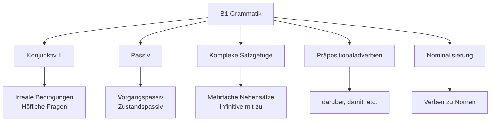
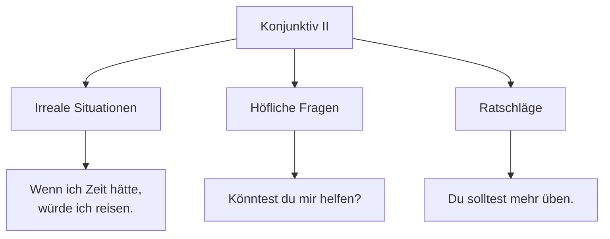
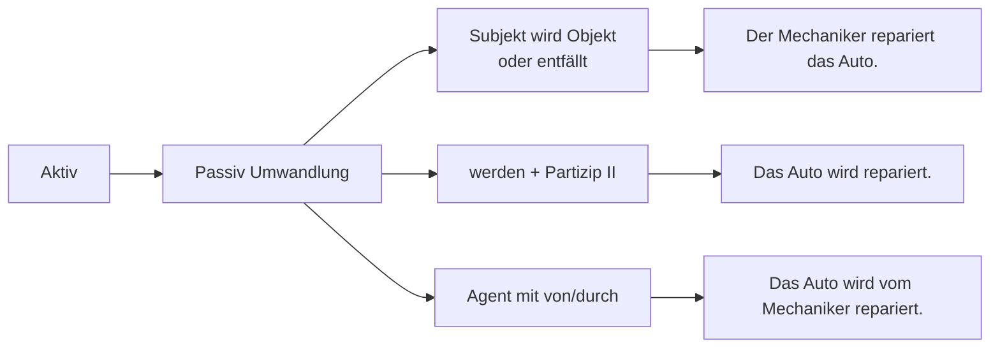

# B1 Grammatik - Fortgeschrittene Strukturen

## Einführung
Auf B1-Niveau erlernen Sie komplexere Grammatikstrukturen, die es Ihnen ermöglichen, differenziertere Aussagen zu treffen, über hypothetische Situationen zu sprechen und verschiedene Sprachregister zu verwenden.

## Grammatik-Übersicht B1

## Konjunktiv II

### Bildung und Verwendung

### Formen des Konjunktiv II

#### Mit Würde-Form
- ich würde lernen
- du würdest lernen
- er/sie/es würde lernen
- wir würden lernen
- ihr würdet lernen
- sie/Sie würden lernen

#### Unregelmäßige Formen

| Infinitiv | Konjunktiv II | Bedeutung |
|-----------|---------------|-----------|
| sein | wäre | would be |
| haben | hätte | would have |
| werden | würde | would become |
| können | könnte | could |
| müssen | müsste | would have to |
| sollen | sollte | should |
| wollen | wollte | would want to |

### Verwendungssituationen

| Situation | Beispiel |
|-----------|----------|
| Irreale Bedingung | Wenn ich reich wäre, würde ich um die Welt reisen. |
| Höfliche Bitte | Könnten Sie mir bitte helfen? |
| Vorsichtiger Vorschlag | Wir könnten morgen ins Kino gehen. |
| Unerfüllbarer Wunsch | Ich wünschte, ich hätte mehr Zeit. |

## Passiv

### Vorgangspassiv

#### Bildung

#### Zeitformen im Passiv

| Zeit | Aktiv | Passiv |
|------|-------|--------|
| Präsens | repariert | wird repariert |
| Präteritum | reparierte | wurde repariert |
| Perfekt | hat repariert | ist repariert worden |
| Plusquamperfekt | hatte repariert | war repariert worden |
| Futur I | wird reparieren | wird repariert werden |

### Zustandspassiv

#### Bildung und Verwendung

| Situation | Beispiel |
|-----------|----------|
| Zustand beschreiben | Das Auto ist repariert. |
| Ergebnis einer Handlung | Die Tür ist geschlossen. |
| Fertigstellung | Der Brief ist geschrieben. |

**Bildung:** sein + Partizip II

### Passiv mit Modalverben

| Modalverb | Aktiv | Passiv |
|-----------|-------|--------|
| können | kann reparieren | kann repariert werden |
| müssen | muss reparieren | muss repariert werden |
| sollen | soll reparieren | soll repariert werden |

## Komplexe Satzgefüge

### Mehrfache Nebensätze

#### Verschachtelung von Nebensätzen

| Struktur | Beispiel |
|----------|----------|
| Hauptsatz + 2 Nebensätze | Ich glaube, dass er kommt, weil er es versprochen hat. |
| Nebensatz im Nebensatz | Er sagt, dass er nicht kommen kann, obwohl er Zeit hat. |

### Infinitive mit "zu"

#### Verwendung

| Situation | Beispiel |
|-----------|----------|
| Nach bestimmten Verben | Ich versuche, Deutsch zu lernen. |
| Nach Adjektiven | Es ist wichtig, pünktlich zu sein. |
| Nach Nomen | Ich habe die Absicht, zu reisen. |

#### Verben mit Infinitiv + zu

| Verb | Beispiel |
|------|----------|
| versuchen | Ich versuche, besser zu werden. |
| planen | Wir planen, nach Berlin zu fahren. |
| hoffen | Sie hofft, die Prüfung zu bestehen. |
| vergessen | Er hat vergessen, anzurufen. |

## Präpositionaladverbien

### Bildung und Verwendung

| Präposition | Adverb | Beispiel |
|-------------|--------|----------|
| für | dafür | Ich bin dafür. |
| gegen | dagegen | Ich bin dagegen. |
| über | darüber | Wir sprechen darüber. |
| um | darum | Es geht darum. |
| von | davon | Ich träume davon. |
| zu | dazu | Ich rate dir dazu. |

### Verwendung in Nebensatzen

| Struktur | Beispiel |
|----------|----------|
| damit | Ich lerne, damit ich die Prüfung bestehe. |
| dadurch, dass | Ich verbessere mein Deutsch, dadurch dass ich viel lese. |
| dafür, dass | Ich danke dir dafür, dass du mir geholfen hast. |

## Nominalisierung

### Verben zu Nomen

| Verb | Nomen | Beispiel |
|------|-------|----------|
| lernen | das Lernen | Das Lernen macht Spaß. |
| arbeiten | die Arbeit | Die Arbeit ist anstrengend. |
| leben | das Leben | Das Leben ist schön. |
| fahren | die Fahrt | Die Fahrt war lang. |

### Adjektive zu Nomen

| Adjektiv | Nomen | Beispiel |
|----------|-------|----------|
| alt | der/die Alte | Die Alten brauchen Hilfe. |
| jung | der/die Junge | Die Jungen lernen schnell. |
| krank | der/die Kranke | Der Kranke muss im Bett bleiben. |

## Relativsätze mit Präpositionen

### Struktur und Verwendung

| Präposition | Beispiel |
|-------------|----------|
| mit | Der Mann, mit dem ich spreche, ist mein Chef. |
| für | Das Buch, für das ich mich interessiere, ist teuer. |
| über | Das Thema, über das wir diskutieren, ist wichtig. |
| an | Der Ort, an dem ich wohne, ist ruhig. |

## Indirekte Rede

### Konjunktiv I für indirekte Rede

#### Bildung

| Person | Indikativ | Konjunktiv I |
|--------|-----------|--------------|
| ich | lerne | lerne |
| du | lernst | lernest |
| er/sie/es | lernt | lerne |
| wir | lernen | lernen |
| ihr | lernt | lernet |
| sie/Sie | lernen | lernen |

#### Verwendung

| Direkte Rede | Indirekte Rede |
|--------------|---------------|
| "Ich komme morgen." | Er sagte, er komme morgen. |
| "Wir haben keine Zeit." | Sie meinten, sie hätten keine Zeit. |

## Adjektivdeklination nach unbestimmten Artikeln

### Tabelle

| Fall | Maskulin | Feminin | Neutral | Plural |
|------|----------|---------|---------|--------|
| Nominativ | ein großer | eine große | ein großes | meine großen |
| Akkusativ | einen großen | eine große | ein großes | meine großen |
| Dativ | einem großen | einer großen | einem großen | meinen großen |
| Genitiv | eines großen | einer großen | eines großen | meiner großen |

## Übungsbeispiele

### Übung 1: Konjunktiv II bilden
Bilden Sie Sätze im Konjunktiv II:
1. Wenn ich Zeit (haben) _______, (reisen) _______ ich um die Welt.
2. Du (können) _______ mir helfen.
3. Wir (sollen) _______ mehr üben.

### Übung 2: Passiv bilden
Wandeln Sie in Passiv um:
1. Der Mechaniker repariert das Auto. → _______
2. Sie hat den Brief geschrieben. → _______
3. Man öffnet das Geschäft um 8 Uhr. → _______

### Übung 3: Komplexe Sätze bilden
Verbinden Sie die Sätze:
1. Ich glaube. Er kommt. Er hat es versprochen. (dass, weil)
2. Sie sagt. Sie kann nicht kommen. Sie hat Zeit. (dass, obwohl)

### Übung 4: Präpositionaladverbien
Ergänzen Sie die Adverbien:
1. Ich interessiere mich _______ (für).
2. Wir sprechen _______ (über).
3. Ich bin _______ (gegen).

---

## Zusammenfassung

Die B1-Grammatik eröffnet Ihnen neue Ausdrucksmöglichkeiten für komplexere Kommunikationssituationen. Wichtige Schwerpunkte sind:
- Konjunktiv II für irreale Situationen und Höflichkeit
- Passiv für unpersönliche Aussagen
- Komplexe Satzgefüge für differenzierte Aussagen
- Präpositionaladverbien für elegante Formulierungen
- Nominalisierung für formellere Sprache

Mit diesen Grammatikkenntnissen sind Sie optimal vorbereitet für die anspruchsvollen Strukturen in [B2](../b2/grammatik.md)!