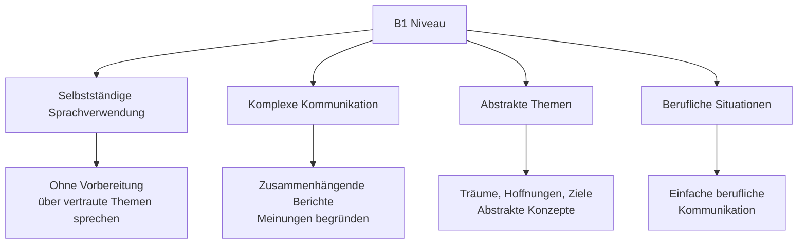
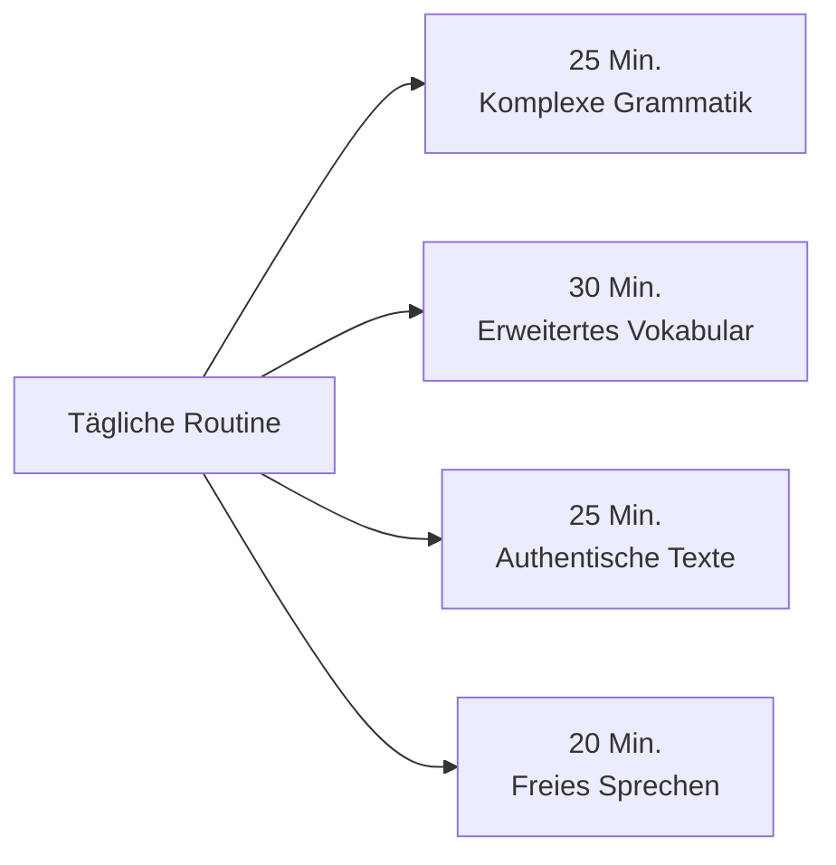

# B1 Level - Überblick (Overview)

## Einführung
B1 ist die dritte Stufe des Gemeinsamen Europäischen Referenzrahmens für Sprachen (GER). Auf diesem Niveau können Sie die Hauptpunkte verstehen, wenn klare Standardsprache verwendet wird und wenn es um vertraute Dinge aus Arbeit, Schule, Freizeit etc. geht.

## Was Sie auf B1 lernen

## Lernziele B1

### Kommunikative Kompetenzen

| Bereich | Was Sie können | Beispiele |
|---------|----------------|-----------|
| 🗣️ **Sprechen** | Zusammenhängend über vertraute Themen sprechen | Reiseerlebnisse, Beruf, Pläne |
| 👂 **Hören** | Hauptpunkte in Alltagsgesprächen verstehen | Radiosendungen, Diskussionen |
| 📖 **Lesen** | Texte mit Alltags- oder Berufssprache verstehen | Zeitungsartikel, Anleitungen |
| ✍️ **Schreiben** | Einfache zusammenhängende Texte verfassen | Briefe, Berichte, Zusammenfassungen |

### Themenbereiche B1

| Thema | Inhalt |
|-------|--------|
| 🌍 **Reisen & Kultur** | Reiseerlebnisse, kulturelle Unterschiede |
| 💼 **Beruf & Karriere** | Bewerbungen, Arbeitsalltag, Karriereziele |
| 📰 **Medien & Nachrichten** | Zeitungsartikel, aktuelle Ereignisse |
| 🎯 **Ziele & Pläne** | Zukunftspläne, Karriere, persönliche Entwicklung |
| 🏛️ **Gesellschaft & Politik** | Einfache politische Themen, gesellschaftliche Fragen |

## B1 Prüfungsformen

### Typische Prüfungsteile

| Prüfungsteil | Dauer | Inhalt |
|--------------|-------|--------|
| Hörverstehen | 30-40 Min. | Gespräche, Radiosendungen, Interviews |
| Leseverstehen | 45-60 Min. | Zeitungstexte, Anzeigen, Berichte |
| Schreiben | 60 Min. | Formeller Brief, Bericht, Stellungnahme |
| Sprechen | 15-20 Min. | Präsentation, Diskussion, Dialog |

## Lernempfehlungen für B1

### Tägliches Lernen

### Nützliche Ressourcen

- [Apps](../../ressourcen/apps.md) für fortgeschrittenes Lernen
- [Übungen](../../uebungen/grammatik/b1.md) zur B1-Grammatik
- [Medien](../../ressourcen/medien/index.md) für authentisches Deutsch

## Zeitaufwand für B1

| Lernform | Empfohlene Zeit |
|----------|-----------------|
| Selbststudium | 150-200 Stunden |
| Kurs (Gruppe) | 120-150 Unterrichtsstunden |
| Intensivkurs | 8-12 Wochen |

## Fortschritt von A2 zu B1

### Neue Fähigkeiten

| Bereich | A2 | B1 |
|---------|----|----|
| **Grammatik** | Einfache Nebensätze | Komplexe Satzgefüge |
| **Wortschatz** | 1200-1500 Wörter | 2000-2500 Wörter |
| **Kommunikation** | Alltagsgespräche | Diskussionen, Argumentation |
| **Textproduktion** | Persönliche Briefe | Berichte, Stellungnahmen |

## Häufige Herausforderungen B1

### Typische Schwierigkeiten

| Bereich | Herausforderung | Lösung |
|---------|-----------------|--------|
| 🏗️ **Satzgefüge** | Mehrere Nebensätze | Satzbaupläne üben |
| 🎭 **Konjunktiv II** | Irreale Bedingungen | Regelmäßig anwenden |
| 📚 **Passiv** | Aktiv-Passiv-Umwandlung | Verschiedene Kontexte üben |
| 💬 **Diskussionen** | Argumentation aufbauen | Redemittel lernen |

## Vorbereitung auf B2

### Was kommt als nächstes?
Nach B1 können Sie sich auf [B2](../b2/ueberblick.md) vorbereiten, wo Sie lernen:
- Komplexe Texte verstehen
- Sich spontan und fließend verständigen
- Sich zu einem breiten Themenspektrum äußern
- Standpunkte darlegen und verteidigen

## Selbsttest: B1-Kenntnisse

### Können Sie das?

1. ❓ Können Sie über Ihre Träume und Hoffnungen sprechen?
2. ❓ Können Sie die Handlung eines Buches oder Films wiedergeben?
3. ❓ Verstehen Sie die Hauptpunkte von Nachrichtensendungen?
4. ❓ Können Sie einen persönlichen Brief über Erfahrungen schreiben?
5. ❓ Können Sie Ihre Meinung begründen und diskutieren?

Wenn Sie 4-5 Fragen mit "Ja" beantworten, sind Sie bereit für B1!

## Lernstrategien für B1

### Effektive Methoden

| Strategie | Beschreibung | Beispiel |
|-----------|-------------|----------|
| **Authentische Materialien** | Mit echten deutschen Medien lernen | Deutsche Zeitungen, Podcasts, Filme |
| **Diskussionsgruppen** | Regelmäßig auf Deutsch diskutieren | Themen aus Nachrichten, Büchern, Filmen |
| **Tagebuch führen** | Tägliche Erlebnisse auf Deutsch schreiben | Reflexion über Erlebnisse, Gefühle, Gedanken |

## Berufliche Anwendungen B1

### Im Berufsleben

| Situation | Sprachhandlungen |
|-----------|------------------|
| Bewerbungsgespräch | Über Qualifikationen sprechen, Fragen beantworten |
| Team-Meeting | Beiträge leisten, Meinungen äußern |
| Kundenkontakt | Informationen geben, Probleme erklären |
| Präsentation | Einfache berufliche Themen präsentieren |

## Übungsbeispiele B1

### Hörverstehen
Hören Sie eine Radiodiskussion und beantworten Sie:
- Welche verschiedenen Standpunkte werden vertreten?
- Welche Argumente werden genannt?
- Was ist Ihre eigene Meinung zum Thema?

### Leseverstehen
Lesen Sie einen Zeitungsartikel und beantworten Sie:
- Was ist die Hauptaussage des Artikels?
- Welche Fakten werden präsentiert?
- Wie ist die Position des Autors?

### Schreiben
Schreiben Sie einen Leserbrief zu einem Zeitungsartikel:
- Fassen Sie den Artikel zusammen
- Geben Sie Ihre Meinung dazu
- Begründen Sie Ihre Position

---

## Zusammenfassung

B1 markiert den Übergang zur selbstständigen Sprachverwendung. Sie lernen:
- Komplexere Satzstrukturen und Grammatik
- Erweitertes Vokabular für abstrakte Themen
- Zusammenhängend über verschiedene Themen sprechen
- Einfache berufliche Kommunikation
- Meinungen begründen und diskutieren

Mit regelmäßigem Üben und den richtigen [Lernstrategien](../../lernstrategien/index.md) erreichen Sie dieses wichtige Sprachniveau und bereiten sich optimal auf B2 vor!