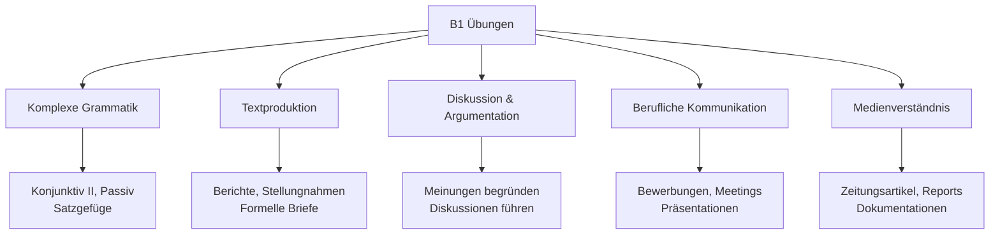
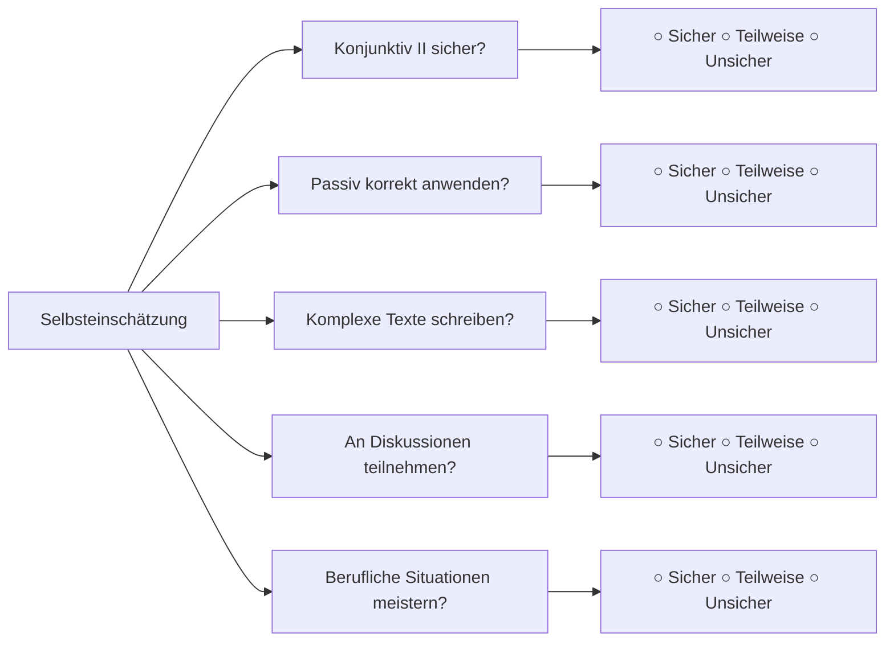

# B1 Übungen - Anspruchsvolle Praxisaufgaben

## Einführung
Diese B1-Übungen helfen Ihnen, die fortgeschrittenen Sprachstrukturen zu festigen und in anspruchsvollen Kommunikationssituationen sicher anzuwenden. Die Übungen bereiten Sie optimal auf B1-Prüfungen und den Gebrauch der Sprache in beruflichen und akademischen Kontexten vor.

## Übungsbereiche B1



## Grammatikübungen

### Übung 1: Konjunktiv II anwenden
**Bilden Sie Sätze im Konjunktiv II:**

1. Wenn ich mehr Zeit (haben) _______, (reisen) _______ ich mehr.
2. Du (können) _______ mir helfen, wenn du wolltest.
3. Wir (sollen) _______ früher anfangen.
4. Er sagte, er (kommen) _______ gerne mit.

**Erweiterte Aufgabe:**
Schreiben Sie einen kurzen Text über Ihre "ideale Welt" mit mindestens 3 Konjunktiv-II-Formen.

### Übung 2: Passiv transformation
**Wandeln Sie diese Sätze ins Passiv um:**

1. Die Firma entwickelt neue Software.
   → _______
2. Man hat das Problem gelöst.
   → _______
3. Sie werden den Bericht morgen präsentieren.
   → _______
4. Der Chef muss die Entscheidung treffen.
   → _______

### Übung 3: Komplexe Satzgefüge
**Verbinden Sie die Sätze zu einem komplexen Satzgefüge:**

1. Ich glaube. Der Klimawandel ist ein ernstes Problem. Wir müssen handeln.
   (dass, weil)
   _______
2. Sie sagt. Sie kann nicht kommen. Sie hat eine wichtige Besprechung.
   (dass, weil)
   _______
3. Es ist wichtig. Wir reduzieren unseren Energieverbrauch. Wir schützen die Umwelt.
   (dass, um...zu)
   _______

## Hörverstehen Übungen

### Übung 1: Radiodiskussion
**Hören Sie eine Radiodiskussion zum Thema "Homeoffice" und beantworten Sie:**

Diskussionsthema: "Vor- und Nachteile von Homeoffice in der modernen Arbeitswelt"

**Aufgaben:**
1. Notieren Sie mindestens 3 Argumente für Homeoffice:
   - _______
   - _______
   - _______

2. Notieren Sie mindestens 3 Argumente gegen Homeoffice:
   - _______
   - _______
   - _______

3. Welche Position vertritt der Moderator? Begründen Sie Ihre Antwort.
   _______

### Übung 2: Dokumentation verstehen
**Hören Sie einen Ausschnitt aus einer Dokumentation über erneuerbare Energien:**

**Fragen:**
1. Welche erneuerbaren Energiequellen werden genannt?
   _______
2. Welche Vorteile werden für Solarenergie genannt?
   _______
3. Welche Herausforderungen bei der Umsetzung werden diskutiert?
   _______

## Leseverstehen Übungen

### Übung 1: Zeitungsartikel analysieren
**Lesen Sie diesen Zeitungsartikel-Ausschnitt:**

"Die Digitalisierung der Arbeitswelt schreitet unaufhaltsam voran. Immer mehr Unternehmen setzen auf künstliche Intelligenz und Automatisierung. Während dies Effizienzsteigerungen verspricht, warnen Experten vor den sozialen Folgen. Arbeitsplätze in routineorientierten Bereichen könnten wegfallen, während gleichzeitig neue Berufsfelder entstehen."

**Aufgaben:**
1. Was ist die Hauptthese des Artikels?
   _______
2. Welche positiven Aspekte werden genannt?
   _______
3. Welche negativen Konsequenzen werden befürchtet?
   _______
4. Was ist Ihre eigene Meinung zu diesem Thema?
   _______

### Übung 2: Geschäftsbericht verstehen
**Lesen Sie diesen Ausschnitt aus einem Geschäftsbericht:**

"Im Geschäftsjahr 2023 verzeichnete unser Unternehmen ein Umsatzwachstum von 8%. Dieser Erfolg ist vor allem auf die erfolgreiche Einführung neuer Produkte und die Expansion in internationale Märkte zurückzuführen. Für das kommende Jahr planen wir weitere Investitionen in Forschung und Entwicklung."

**Fragen:**
1. Wie entwickelte sich der Umsatz?
   _______
2. Welche Gründe werden für den Erfolg genannt?
   _______
3. Was sind die Pläne für die Zukunft?
   _______

## Schreibübungen

### Übung 1: Formeller Brief
**Schreiben Sie einen formellen Brief an eine Firma:**

Situation: Sie möchten sich über Praktikumsmöglichkeiten informieren.

Struktur:
- Angemessene Anrede
- Vorstellung und Hintergrund
- Grund für Ihr Interesse
- Spezifische Fragen
- Höfliche Schlussformel

```
[Ihr Brief hier...]
```

### Übung 2: Stellungnahme verfassen
**Schreiben Sie eine Stellungnahme zu diesem Thema:**

"Thema: Sollten alle Schüler verpflichtet werden, eine zweite Fremdsprache zu lernen?"

Ihre Stellungnahme sollte enthalten:
- Einleitung mit Themavorstellung
- Argumente für die These
- Argumente gegen die These
- Eigene Meinung mit Begründung
- Schlussfolgerung

### Übung 3: Bericht schreiben
**Verfassen Sie einen Bericht über ein fiktives Ereignis:**

Wählen Sie eines dieser Themen:
- Ein Projekttag an Ihrer Schule/Universität
- Eine Firmenveranstaltung
- Ein kulturelles Event in Ihrer Stadt

Struktur:
- Überschrift
- Einleitung (Wer? Was? Wann? Wo?)
- Hauptteil (Ablauf, Highlights)
- Schluss (Fazit, Ausblick)

## Sprechübungen

### Übung 1: Präsentation vorbereiten
**Bereiten Sie eine 3-minütige Präsentation vor:**

Thema wählen:
- "Die Bedeutung von Umweltschutz im Alltag"
- "Meine beruflichen Ziele für die nächsten 5 Jahre"
- "Warum künstliche Intelligenz unsere Zukunft verändern wird"

Struktur:
- Einleitung (Thema vorstellen)
- Hauptteil (2-3 Hauptpunkte)
- Schluss (Zusammenfassung, Ausblick)

### Übung 2: Diskussion führen
**Führen Sie eine Diskussion zu diesen Themen:**

1. "Sollte es ein bedingungsloses Grundeinkommen geben?"
2. "Welche Rolle sollten soziale Medien in unserem Leben spielen?"
3. "Sind Elektroautos die Lösung für unsere Verkehrsprobleme?"

Verwenden Sie Diskussionsredemittel:
- "Ich stimme zu, aber..."
- "Das sehe ich anders, weil..."
- "Ein weiterer Aspekt ist..."

## Berufliche Kommunikation

### Übung 1: Bewerbungsgespräch simulieren
**Rollen Sie ein Bewerbungsgespräch:**

Rollen:
- Bewerber/in (Sie)
- Personaler/in (Partner)

Fragen des Personalers:
1. "Erzählen Sie mir etwas über sich."
2. "Warum möchten Sie in unserem Unternehmen arbeiten?"
3. "Was sind Ihre Stärken und Schwächen?"
4. "Wo sehen Sie sich in 5 Jahren?"

### Übung 2: Meeting-Beitrag
**Simulieren Sie einen Meeting-Beitrag:**

Situation: Teamsitzung zur Verbesserung der Teamarbeit

Ihr Beitrag sollte enthalten:
- Aktuelle Situation beschreiben
- Probleme benennen
- Lösungsvorschläge machen
- Auf Feedback reagieren

## Wortschatzübungen

### Übung 1: Fachwortschatz anwenden
**Bilden Sie Sätze mit diesen Fachwörtern:**

1. Nachhaltigkeit - _______
2. Digitalisierung - _______
3. Innovation - _______
4. Work-Life-Balance - _______

### Übung 2: Stilistische Anpassung
**Wandeln Sie diese Sätze in formelle Sprache um:**

1. "Ich will da nicht mitmachen." → _______
2. "Das check ich nicht." → _______
3. "Kannste mir mal helfen?" → _______

### Übung 3: Synonyme finden
**Finden Sie formellere Synonyme:**

1. gut - _______
2. wichtig - _______
3. machen - _______
4. sagen - _______

## Prüfungsvorbereitung

### Übung 1: Modellprüfung Schreiben
**Prüfungsaufgabe:**
"Schreiben Sie einen Forumsbeitrag (circa 200 Wörter) zum Thema: 'Sollten Städte autofrei werden?'"

Bewertungskriterien:
- Inhaltliche Vollständigkeit
- Sprachliche Korrektheit
- Textaufbau und Struktur
- Wortschatz und Ausdruck

### Übung 2: Mündliche Prüfung simulieren
**Prüfungsteile:**
1. Selbstvorstellung (2 Minuten)
2. Themenpräsentation (3 Minuten)
3. Diskussion mit Prüfer (5 Minuten)

Themenvorschläge:
- "Die Zukunft der Mobilität"
- "Chancen und Risiken der Globalisierung"
- "Bildung im digitalen Zeitalter"

## Lernfortschritt tracken

### Selbstbewertung B1



### 4-Wochen-Lernplan

| Woche | Schwerpunkt | Aktivitäten |
|-------|-------------|-------------|
| **1** | Grammatik vertiefen | Konjunktiv II, Passiv, Satzgefüge |
| **2** | Schriftlicher Ausdruck | Berichte, Briefe, Stellungnahmen |
| **3** | Mündliche Kommunikation | Präsentationen, Diskussionen |
| **4** | Prüfungsvorbereitung | Modelltests, Zeitmanagement |

## Zusätzliche Ressourcen

### Authentische Materialien
- [Deutsche Zeitungen](../../ressourcen/medien/nachrichten.md)
- [Fachzeitschriften](../../ressourcen/buecher-materialien/lektueren.md)
- [Dokumentationen](../../ressourcen/medien/filme-serien.md)

### Lernstrategien
- [Lerntechniken](../../lernstrategien/lerntechniken/index.md)
- [Prüfungsvorbereitung](../../pruefungen/vorbereitung/tipps-strategien.md)
- [Sprachpraxis](../../lernstrategien/immersion/sprachaustausch.md)

### Tipps für B1-Erfolg
1. **Regelmäßigkeit**: Täglich 45-60 Minuten lernen
2. **Vielfalt**: Alle Kompetenzbereiche abdecken
3. **Authentizität**: Mit echten deutschen Materialien arbeiten
4. **Reflexion**: Lernfortschritt regelmäßig überprüfen
5. **Anwendung**: Sprache aktiv im Alltag nutzen

---

## Zusammenfassung

Diese B1-Übungen bereiten Sie optimal auf anspruchsvolle Kommunikationssituationen vor und festigen Ihre fortgeschrittenen Deutschkenntnisse. Regelmäßiges Üben mit diesen Aufgaben ermöglicht Ihnen den souveränen Übergang zu [B2](../b2/uebungen.md).

**Viel Erfolg beim Üben!** 🎯