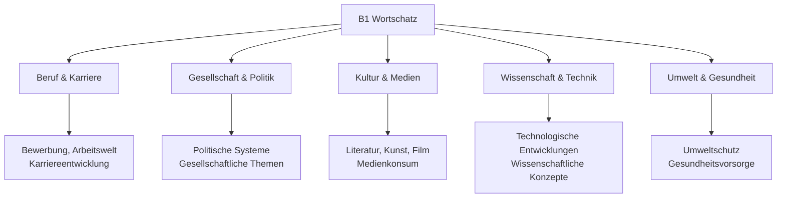
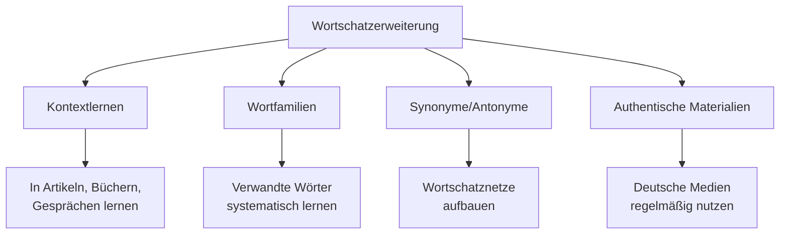

# B1 Wortschatz - Erweiterter Wortschatz für Fortgeschrittene

## Einführung
Der B1-Wortschatz umfasst etwa 2000-2500 Wörter und ermöglicht Ihnen, über ein breites Spektrum an Themen zu kommunizieren, einschließlich abstrakter Konzepte, beruflicher Situationen und gesellschaftlicher Fragen.

## Themenbereiche B1

## Beruf und Karriere

### Bewerbungsprozess

| Deutsch | Englisch | Kontext |
|---------|----------|---------|
| die Bewerbung | application | eine Bewerbung schreiben |
| der Lebenslauf | CV/resume | den Lebenslauf aktualisieren |
| das Anschreiben | cover letter | ein überzeugendes Anschreiben verfassen |
| das Vorstellungsgespräch | job interview | sich auf ein Vorstellungsgespräch vorbereiten |
| die Qualifikation | qualification | die erforderlichen Qualifikationen |

### Arbeitswelt

| Deutsch | Englisch | Beispiel |
|---------|----------|----------|
| die Karriere | career | eine erfolgreiche Karriere |
| die Beförderung | promotion | eine Beförderung erhalten |
| die Gehaltserhöhung | salary increase | um eine Gehaltserhöhung bitten |
| die Teamarbeit | teamwork | gute Teamarbeit ist wichtig |
| die Projektleitung | project management | die Projektleitung übernehmen |

## Gesellschaft und Politik

### Politische Systeme

| Deutsch | Englisch | Erklärung |
|---------|----------|-----------|
| die Demokratie | democracy | In einer Demokratie wählt das Volk. |
| die Regierung | government | Die Regierung entscheidet über Gesetze. |
| das Parlament | parliament | Das Parlament verabschiedet Gesetze. |
| die Wahl | election | Bei der Wahl entscheiden die Bürger. |
| die Partei | political party | Er ist Mitglied einer Partei. |

### Gesellschaftliche Themen

| Deutsch | Englisch | Diskussion |
|---------|----------|------------|
| die Integration | integration | Integration von Migranten |
| die Gleichberechtigung | equality | Gleichberechtigung der Geschlechter |
| die soziale Gerechtigkeit | social justice | Kampf für soziale Gerechtigkeit |
| die Bildungspolitik | education policy | Diskussion über Bildungspolitik |
| die Umweltpolitik | environmental policy | Maßnahmen der Umweltpolitik |

## Kultur und Medien

### Literatur und Kunst

| Deutsch | Englisch | Bereich |
|---------|----------|---------|
| der Roman | novel | einen Roman lesen |
| die Gedichtsammlung | poetry collection | Gedichtsammlung eines Dichters |
| die Ausstellung | exhibition | eine Kunstausstellung besuchen |
| der Künstler/die Künstlerin | artist | Werke berühmter Künstler |
| die Interpretation | interpretation | verschiedene Interpretationen |

### Medienkonsum

| Deutsch | Englisch | Nutzung |
|---------|----------|---------|
| die Nachrichten | news | Nachrichten im Fernsehen sehen |
| die Dokumentation | documentary | eine interessante Dokumentation |
| der Beitrag | article/contribution | ein Beitrag in der Zeitung |
| die Berichterstattung | coverage | objektive Berichterstattung |
| die Zensur | censorship | Zensur in autoritären Staaten |

## Wissenschaft und Technik

### Technologische Entwicklungen

| Deutsch | Englisch | Anwendung |
|---------|----------|-----------|
| die Digitalisierung | digitalization | Fortschritte der Digitalisierung |
| die künstliche Intelligenz | artificial intelligence | Anwendung künstlicher Intelligenz |
| die Innovation | innovation | technologische Innovationen |
| die Forschung | research | wissenschaftliche Forschung |
| die Entwicklung | development | Entwicklung neuer Technologien |

### Wissenschaftliche Konzepte

| Deutsch | Englisch | Feld |
|---------|----------|------|
| die Theorie | theory | eine wissenschaftliche Theorie |
| das Experiment | experiment | ein Experiment durchführen |
| die Analyse | analysis | eine gründliche Analyse |
| die Methode | method | wissenschaftliche Methoden |
| das Ergebnis | result | Ergebnisse präsentieren |

## Umwelt und Gesundheit

### Umweltschutz

| Deutsch | Englisch | Maßnahme |
|---------|----------|----------|
| der Klimawandel | climate change | Bekämpfung des Klimawandels |
| die Nachhaltigkeit | sustainability | nachhaltige Entwicklung |
| der Umweltschutz | environmental protection | Engagement für Umweltschutz |
| die erneuerbaren Energien | renewable energy | Ausbau erneuerbarer Energien |
| der CO2-Ausstoß | CO2 emissions | Reduzierung des CO2-Ausstoßes |

### Gesundheitsvorsorge

| Deutsch | Englisch | Prävention |
|---------|----------|------------|
| die Vorsorgeuntersuchung | preventive check-up | regelmäßige Vorsorgeuntersuchungen |
| die gesunde Ernährung | healthy diet | Bedeutung gesunder Ernährung |
| die Bewegung | exercise | ausreichend Bewegung |
| der Stressabbau | stress reduction | Methoden zum Stressabbau |
| die Work-Life-Balance | work-life balance | gute Work-Life-Balance |

## Abstrakte Konzepte und Gefühle

### Komplexe Gefühle

| Deutsch | Englisch | Nuance |
|---------|----------|--------|
| die Zufriedenheit | satisfaction | tiefe Zufriedenheit empfinden |
| die Dankbarkeit | gratitude | Dankbarkeit ausdrücken |
| die Enttäuschung | disappointment | große Enttäuschung spüren |
| die Begeisterung | enthusiasm | mit Begeisterung bei der Sache |
| die Besorgnis | concern | Besorgnis über etwas äußern |

### Abstrakte Konzepte

| Deutsch | Englisch | Diskussion |
|---------|----------|------------|
| die Gerechtigkeit | justice | über Gerechtigkeit diskutieren |
| die Freiheit | freedom | Wert der Freiheit |
| die Verantwortung | responsibility | Übernahme von Verantwortung |
| die Ethik | ethics | ethische Fragen |
| die Moral | morality | moralische Prinzipien |

## Redemittel für Diskussionen

### Meinungen äußern

| Deutsch | Englisch | Verwendung |
|---------|----------|------------|
| Meines Erachtens... | In my view... | formelle Meinungsäußerung |
| Ich bin der Ansicht, dass... | I am of the opinion that... | begründete Meinung |
| Aus meiner Sicht... | From my perspective... | persönliche Perspektive |
| Was mich betrifft... | As far as I'm concerned... | persönlicher Standpunkt |

### Argumentation

| Deutsch | Englisch | Funktion |
|---------|----------|----------|
| Einerseits... andererseits... | On one hand... on the other hand... | Gegenüberstellung |
| Darüber hinaus... | Furthermore... | zusätzliches Argument |
| Im Gegensatz dazu... | In contrast... | Kontrast herstellen |
| Folglich... | Consequently... | Schlussfolgerung |

## Wortbildung und Stil

### Komposita (Zusammensetzungen)

| Kompositum | Bestandteile | Bedeutung |
|------------|--------------|-----------|
| das Arbeitszeugnis | Arbeit + Zeugnis | work reference |
| die Umweltverschmutzung | Umwelt + Verschmutzung | environmental pollution |
| die Gesundheitsvorsorge | Gesundheit + Vorsorge | health prevention |
| die Bildungschance | Bildung + Chance | educational opportunity |

### Stilistische Varianten

| Formell | Informal | Bedeutung |
|---------|----------|-----------|
| erhalten | kriegen | to get |
| durchführen | machen | to carry out |
| benötigen | brauchen | to need |
| sich erkundigen | fragen | to inquire |

## Fachsprachlicher Wortschatz

### Wirtschaft

| Deutsch | Englisch | Kontext |
|---------|----------|---------|
| die Wirtschaftslage | economic situation | aktuelle Wirtschaftslage |
| der Markt | market | globaler Markt |
| das Unternehmen | company | internationales Unternehmen |
| der Gewinn | profit | Gewinn steigern |
| der Verlust | loss | Verlust vermeiden |

### Technik

| Deutsch | Englisch | Bereich |
|---------|----------|---------|
| die Software | software | neue Software entwickeln |
| die Hardware | hardware | Hardware-Komponenten |
| das Netzwerk | network | Computernetzwerk |
| die Anwendung | application | praktische Anwendung |
| die Sicherheit | security | Datensicherheit |

## Lernstrategien für B1-Wortschatz

### Erweiterte Methoden

### Themenbezogenes Lernen

| Wochenthema | Ressourcen | Aktivitäten |
|-------------|------------|-------------|
| Politik | Zeitungen, Nachrichten | Artikel lesen, Diskussionen |
| Beruf | Fachzeitschriften, Bewerbungen | Bewerbungstexte schreiben |
| Umwelt | Dokumentationen, Reports | Umweltthemen diskutieren |

## Übungsbeispiele

### Übung 1: Fachwortschatz anwenden
Bilden Sie Sätze mit Fachwörtern:
1. Digitalisierung / Arbeitswelt / verändern
2. Nachhaltigkeit / Unternehmen / wichtig
3. künstliche Intelligenz / Zukunft / Rolle

### Übung 2: Stilistische Varianten
Wandeln Sie um (formell → informell):
1. "Ich benötige Ihre Unterstützung." → _______
2. "Wir führen eine Untersuchung durch." → _______
3. "Könnten Sie mich informieren?" → _______

### Übung 3: Argumentation üben
Bilden Sie eine Argumentation zum Thema "Homeoffice":
- Vorteile nennen
- Nachteile erwähnen
- Eigene Meinung begründen

### Übung 4: Komposita bilden
Bilden Sie sinnvolle Komposita:
1. Arbeit + Leben = _______
2. Umwelt + Schutz = _______
3. Gesund + heit = _______

---

## Zusammenfassung

Der B1-Wortschatz eröffnet Ihnen Zugang zu anspruchsvollen Kommunikationssituationen. Wichtige Bereiche sind:
- Berufliche und formelle Sprache
- Gesellschaftliche und politische Themen
- Abstrakte Konzepte und komplexe Gefühle
- Fachsprachlicher Wortschatz
- Stilistische Varianten für verschiedene Kontexte

Mit diesem erweiterten Wortschatz sind Sie optimal vorbereitet für die anspruchsvollen Kommunikationssituationen in [B2](../b2/wortschatz.md)!