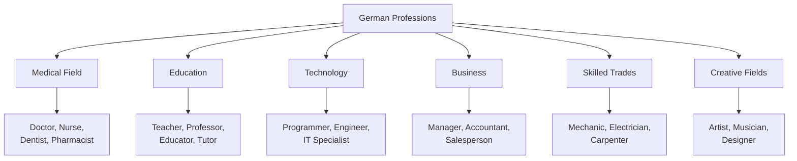
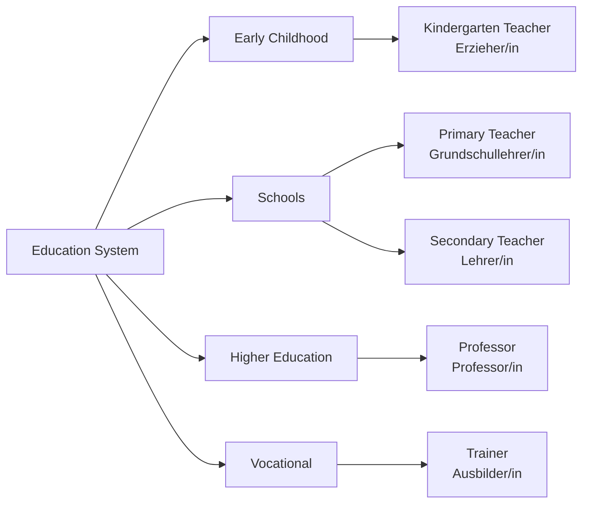
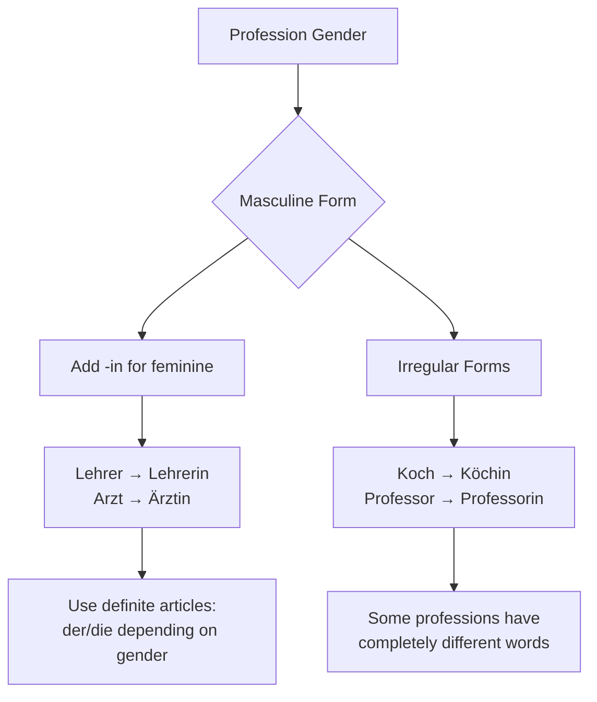
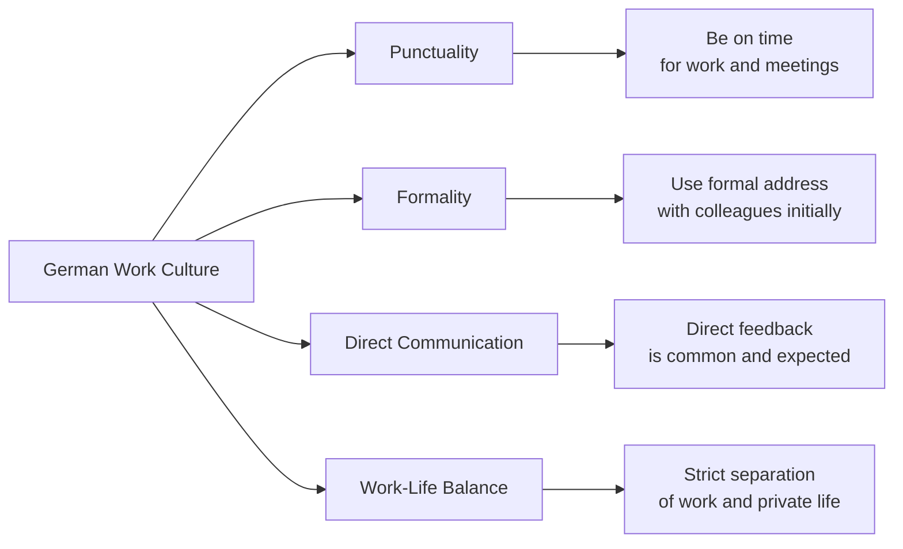

# Professions (Berufe) - German Professions Vocabulary for English Speakers

## Introduction
Learning profession vocabulary is essential for job applications, workplace communication, and everyday conversations in German. This chapter covers common professions, workplace vocabulary, and job-related phrases.

## Common Professions

### Popular Occupations

| Profession | German | Pronunciation | Gender | Example Sentence |
|------------|--------|---------------|--------|------------------|
| 👨‍⚕️ | der Arzt / die Ärztin | [aʁtst] / [ˈɛʁtstɪn] | m/f | Mein Bruder ist Arzt. (My brother is a doctor.) |
| 👩‍🏫 | der Lehrer / die Lehrerin | [ˈleːʁɐ] / [ˈleːʁəʁɪn] | m/f | Sie ist Lehrerin an einer Grundschule. (She is a teacher at an elementary school.) |
| 👨‍💼 | der Ingenieur / die Ingenieurin | [ɪnʒɛˈni̯øːɐ] / [ɪnʒɛˈni̯øːʁɪn] | m/f | Er arbeitet als Ingenieur. (He works as an engineer.) |
| 👩‍💻 | der Programmierer / die Programmiererin | [pʁoɡʁaˈmiːʁɐ] / [pʁoɡʁaˈmiːʁəʁɪn] | m/f | Sie ist Programmiererin bei einer IT-Firma. (She is a programmer at an IT company.) |
| 👨‍🔧 | der Mechaniker / die Mechanikerin | [meˈçaːnɪkɐ] / [meˈçaːnɪkəʁɪn] | m/f | Der Mechaniker repariert Autos. (The mechanic repairs cars.) |
| 👩‍🍳 | der Koch / die Köchin | [kɔx] / [ˈkœçɪn] | m/f | Er ist Koch in einem Restaurant. (He is a cook in a restaurant.) |

## Profession Classification

## Medical Professions (Medizinische Berufe)

### Healthcare Workers

| Profession | German | Pronunciation | Workplace |
|------------|--------|---------------|-----------|
| 👨‍⚕️ Doctor | der Arzt / die Ärztin | [aʁtst] / [ˈɛʁtstɪn] | Krankenhaus (hospital) |
| 👩‍⚕️ Nurse | der Krankenpfleger / die Krankenpflegerin | [ˈkʁaŋkənˌpfleːɡɐ] / [ˈkʁaŋkənˌpfleːɡəʁɪn] | Krankenhaus (hospital) |
| 🦷 Dentist | der Zahnarzt / die Zahnärztin | [ˈt͡saːnˌaʁt͡st] / [ˈt͡saːnˌʔɛʁt͡stɪn] | Zahnarztpraxis (dental practice) |
| 💊 Pharmacist | der Apotheker / die Apothekerin | [apoˈteːkɐ] / [apoˈteːkəʁɪn] | Apotheke (pharmacy) |
| 🧠 Psychologist | der Psychologe / die Psychologin | [psyçoˈloːɡə] / [psyçoˈloːɡɪn] | Praxis (practice) |

## Education Professions (Bildungsberufe)

### Education Field

### Education Professionals

| Profession | German | Pronunciation | Level |
|------------|--------|---------------|-------|
| 👩‍🏫 Teacher | der Lehrer / die Lehrerin | [ˈleːʁɐ] / [ˈleːʁəʁɪn] | School |
| 🎓 Professor | der Professor / die Professorin | [pʁoˈfɛsoːɐ] / [pʁoˈfɛsoːʁɪn] | University |
| 🧒 Kindergarten Teacher | der Erzieher / die Erzieherin | [ɛɐ̯ˈt͡siːɐ] / [ɛɐ̯ˈt͡siːəʁɪn] | Preschool |
| 📚 Tutor | der Nachhilfelehrer / die Nachhilfelehrerin | [ˈnaːxˌhɪlfəleːʁɐ] / [ˈnaːxˌhɪlfəleːʁəʁɪn] | Private |

## Technology & IT Professions (Technologie Berufe)

### Tech Industry

| Profession | German | Pronunciation | Specialization |
|------------|--------|---------------|---------------|
| 💻 Programmer | der Programmierer / die Programmiererin | [pʁoɡʁaˈmiːʁɐ] / [pʁoɡʁaˈmiːʁəʁɪn] | Software |
| 🔧 Engineer | der Ingenieur / die Ingenieurin | [ɪnʒɛˈni̯øːɐ] / [ɪnʒɛˈni̯øːʁɪn] | Various fields |
| 🌐 IT Specialist | der IT-Spezialist / die IT-Spezialistin | [aɪˈtiː ʃpet͡si̯aˈlɪst] / [aɪˈtiː ʃpet͡si̯aˈlɪstɪn] | Information Technology |
| 📱 Web Developer | der Webentwickler / die Webentwicklerin | [ˈvɛpʔɛntˌvɪklɐ] / [ˈvɛpʔɛntˌvɪkləʁɪn] | Web Development |

## Business Professions (Wirtschaftsberufe)

### Business and Office

| Profession | German | Pronunciation | Field |
|------------|--------|---------------|-------|
| 👨‍💼 Manager | der Manager / die Managerin | [ˈmɛnɪd͡ʒɐ] / [ˈmɛnɪd͡ʒəʁɪn] | Management |
| 💰 Accountant | der Buchhalter / die Buchhalterin | [ˈbuːxˌhaltɐ] / [ˈbuːxˌhaltəʁɪn] | Finance |
| 📊 Salesperson | der Verkäufer / die Verkäuferin | [fɛɐ̯ˈkɔɪ̯fɐ] / [fɛɐ̯ˈkɔɪ̯fəʁɪn] | Sales |
| 📈 Marketing Manager | der Marketingmanager / die Marketingmanagerin | [ˈmaʁkətɪŋˌmɛnɪd͡ʒɐ] / [ˈmaʁkətɪŋˌmɛnɪd͡ʒəʁɪn] | Marketing |

## Skilled Trades (Handwerksberufe)

### Trade Professions

| Profession | German | Pronunciation | Trade |
|------------|--------|---------------|-------|
| 🔧 Mechanic | der Mechaniker / die Mechanikerin | [meˈçaːnɪkɐ] / [meˈçaːnɪkəʁɪn] | Automotive |
| ⚡ Electrician | der Elektriker / die Elektrikerin | [eˈlɛktʁɪkɐ] / [eˈlɛktʁɪkəʁɪn] | Electrical |
| 🛠️ Carpenter | der Tischler / die Tischlerin | [ˈtɪʃlɐ] / [ˈtɪʃləʁɪn] | Woodworking |
| 🚰 Plumber | der Klempner / die Klempnerin | [ˈklɛmpnɐ] / [ˈklɛmpnəʁɪn] | Plumbing |

## Creative Professions (Kreative Berufe)

### Arts and Media

| Profession | German | Pronunciation | Field |
|------------|--------|---------------|-------|
| 🎨 Artist | der Künstler / die Künstlerin | [ˈkʏnstlɐ] / [ˈkʏnstləʁɪn] | Fine Arts |
| 🎵 Musician | der Musiker / die Musikerin | [ˈmuːzɪkɐ] / [ˈmuːzɪkəʁɪn] | Music |
| ✏️ Designer | der Designer / die Designerin | [diˈzaɪnɐ] / [diˈzaɪnəʁɪn] | Design |
| 📝 Writer | der Schriftsteller / die Schriftstellerin | [ˈʃʁɪftˌʃtɛlɐ] / [ˈʃʁɪftˌʃtɛləʁɪn] | Literature |

## Grammar: Gender and Articles

### Gender Rules for Professions

### Gender Patterns

| Masculine Ending | Feminine Ending | Example |
|------------------|-----------------|---------|
| -er | -erin | der Lehrer → die Lehrerin |
| -or | -orin | der Professor → die Professorin |
| -arzt | -ärztin | der Zahnarzt → die Zahnärztin |
| Irregular | Irregular | der Koch → die Köchin |

### Articles with Professions

| Situation | German | English |
|-----------|--------|---------|
| With "sein" (to be) | Ich bin Lehrer. | I am a teacher. |
| With indefinite article | Er ist ein guter Arzt. | He is a good doctor. |
| With definite article | Die Ärztin ist jung. | The doctor (female) is young. |

## Workplace Vocabulary

### Office Terms

| English | German | Pronunciation |
|---------|--------|---------------|
| Office | das Büro | [byˈʁoː] |
| Company | die Firma | [ˈfɪʁma] |
| Meeting | das Meeting | [ˈmiːtɪŋ] |
| Colleague | der Kollege / die Kollegin | [kɔˈleːɡə] / [kɔˈleːɡɪn] |
| Boss | der Chef / die Chefin | [ʃɛf] / [ˈʃɛfɪn] |
| Salary | das Gehalt | [ɡəˈhalt] |
| Work hours | die Arbeitszeit | [ˈaʁbaɪt͡sˌt͡saɪt] |

### Job Search Vocabulary

| English | German | Pronunciation |
|---------|--------|---------------|
| Job application | die Bewerbung | [bəˈvɛʁbʊŋ] |
| Resume | der Lebenslauf | [ˈleːbənslaʊf] |
| Job interview | das Vorstellungsgespräch | [ˈfoːɐ̯ʃtɛlʊŋsɡəˌʃpʁɛːç] |
| Job offer | das Stellenangebot | [ˈʃtɛlənˌʔanɡəboːt] |
| Qualifications | die Qualifikationen | [kvalifikaˈt͡si̯oːnən] |
| Experience | die Erfahrung | [ɛɐ̯ˈfaːʁʊŋ] |

## German Work Culture

### Cultural Aspects

### Key Cultural Points

1. **Punctuality**: Being on time is extremely important
2. **Formality**: Use "Sie" with colleagues until invited to use "du"
3. **Directness**: Germans are typically direct in communication
4. **Work-Life Balance**: Strict separation between work and private life
5. **Vacation**: Germans typically have 25-30 vacation days per year

## Job Application Process

### Steps in Germany

| Step | German | English |
|------|--------|---------|
| 1. Find job listing | die Stellenanzeige finden | Find job advertisement |
| 2. Write application | die Bewerbung schreiben | Write application |
| 3. Send documents | die Unterlagen senden | Send documents |
| 4. Interview | das Vorstellungsgespräch | Job interview |
| 5. Contract | der Arbeitsvertrag | Employment contract |

### Required Documents

| Document | German | Description |
|----------|--------|-------------|
| Resume | der Lebenslauf | CV with photo typically |
| Cover letter | das Anschreiben | Customized for each application |
| References | die Zeugnisse | Certificates and references |
| Photo | das Bewerbungsfoto | Professional photo |

## Practice Exercises

### Exercise 1: Profession Vocabulary
Translate these professions to German:
1. "I am a doctor" (male)
2. "She is an engineer" (female)
3. "We are teachers" (mixed group)
4. "They are programmers" (all female)

### Exercise 2: Gender Practice
Provide the feminine form:
1. der Arzt
2. der Lehrer
3. der Ingenieur
4. der Koch

### Exercise 3: Workplace Sentences
Complete the sentences in German:
1. "Mein ___ (colleague) arbeitet im selben Büro."
2. "Der ___ (boss) ist sehr freundlich."
3. "Ich habe ein ___ (job interview) nächste Woche."
4. "Mein ___ (salary) ist gut."

### Exercise 4: Job Application
What would you say in these situations?
1. Introducing yourself in a job interview
2. Asking about work hours
3. Talking about your qualifications
4. Discussing salary expectations

### Exercise 5: Cultural Understanding
Answer these questions:
1. Why is punctuality important in German work culture?
2. When should you use "Sie" versus "du" at work?
3. What is typical about German communication style?
4. How many vacation days do Germans typically have?

---

## Summary

Key points about German professions and work culture:
- Professions have gender-specific forms (-in for feminine)
- Formal address ("Sie") is used in professional settings
- Punctuality is highly valued
- Direct communication is common and appreciated
- The job application process typically includes a photo
- Work-life balance is strongly emphasized

With this vocabulary and cultural knowledge, you'll be well-prepared for professional situations in German-speaking countries!