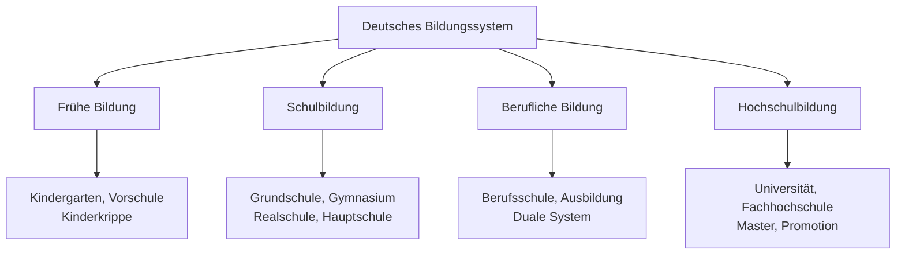
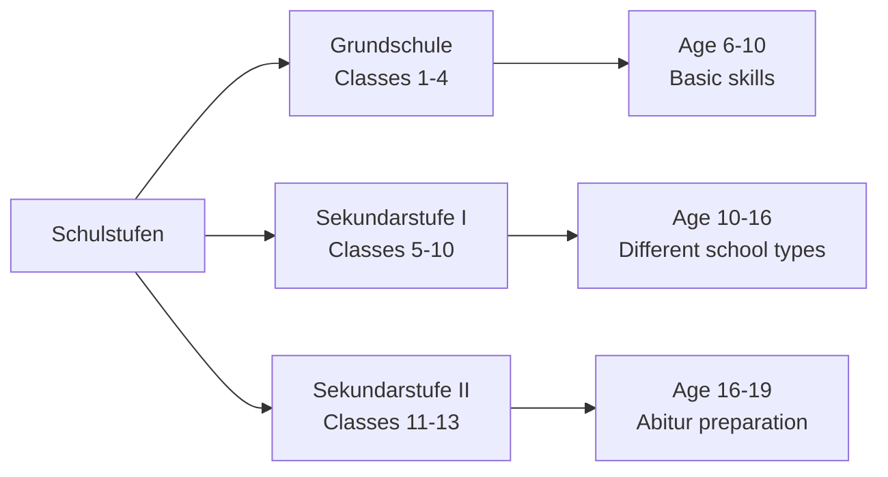
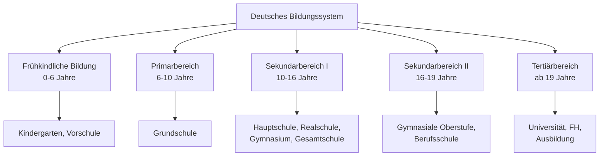

# Education (Bildung) - German Education Vocabulary

## Introduction
Education vocabulary is essential for discussing schools, universities, learning processes, and academic topics in German. This chapter covers educational institutions, academic subjects, learning activities, and the German education system.

## Educational Institutions

### Types of Schools

| Institution | German | Pronunciation | Level |
|------------|--------|---------------|-------|
| 🏫 | die Schule | [ˈʃuːlə] | General term |
| 🧒 | der Kindergarten | [ˈkɪndɐɡaʁtn̩] | Preschool |
| 📚 | die Grundschule | [ˈɡʁʊntʃuːlə] | Primary (grades 1-4) |
| 🏫 | die weiterführende Schule | [ˈvaɪ̯tɐfyːʁəndə ˈʃuːlə] | Secondary |
| 🎓 | die Universität | [univɛʁziˈtɛːt] | University |

## Education Classification

## School System (Schulsystem)

### School Types in Germany

| School Type | German | Duration | Focus |
|------------|--------|----------|-------|
| Primary School | die Grundschule | 4 years | Basic education |
| Grammar School | das Gymnasium | 8-9 years | Academic preparation |
| Secondary School | die Realschule | 6 years | Practical education |
| Vocational School | die Hauptschule | 5-6 years | Basic vocational |
| Comprehensive School | die Gesamtschule | Varies | Combined system |

### School Levels and Grades

## Academic Subjects (Unterrichtsfächer)

### Core Subjects

| Subject | German | Pronunciation | Description |
|---------|--------|---------------|-------------|
| 📖 German | Deutsch | [dɔɪ̯tʃ] | German language and literature |
| 🔢 Mathematics | Mathematik | [matemaˈtiːk] | Math, algebra, geometry |
| 🌍 Geography | Erdkunde | [ˈeːɐ̯tkʊndə] | Geography, earth sciences |
| 🧪 Science | Naturwissenschaften | [naˈtuːɐ̯vɪsənʃaftən] | Natural sciences |
| 🎨 Art | Kunst | [kʊnst] | Art, drawing, painting |

### Languages and Humanities

| Subject | German | Pronunciation |
|---------|--------|---------------|
| English | Englisch | [ˈɛŋlɪʃ] |
| French | Französisch | [fʁanˈt͡søːzɪʃ] |
| History | Geschichte | [ɡəˈʃɪçtə] |
| Social Studies | Sozialkunde | [zoˈt͡si̯aːlkʊndə] |
| Philosophy | Philosophie | [filozoˈfiː] |

### Practical Subjects

| Subject | German | Pronunciation |
|---------|--------|---------------|
| Music | Musik | [muˈziːk] |
| Sports | Sport | [ʃpɔʁt] |
| Computer Science | Informatik | [ɪnfɔʁˈmaːtɪk] |
| Technology | Technik | [ˈtɛçnɪk] |
| Home Economics | Hauswirtschaft | [ˈhaʊ̯svɪʁtʃaft] |

## University Education (Hochschulbildung)

### University Types

| Institution | German | Pronunciation | Focus |
|------------|--------|---------------|-------|
| University | die Universität | [univɛʁziˈtɛːt] | Research, academic |
| University of Applied Sciences | die Fachhochschule | [ˈfaxhoːxʃuːlə] | Practical, vocational |
| Technical University | die Technische Universität | [ˈtɛçnɪʃə univɛʁziˈtɛːt] | Engineering, technology |
| College | die Hochschule | [ˈhoːxʃuːlə] | General higher education |

### Academic Degrees

| Degree | German | Pronunciation | Duration |
|--------|--------|---------------|----------|
| Bachelor | der Bachelor | [ˈbɛtʃəlɐ] | 3-4 years |
| Master | der Master | [ˈmaːstɐ] | 1-2 years |
| Doctorate | die Promotion | [pʁomoˈt͡si̯oːn] | 3-5 years |
| Professor | der Professor / die Professorin | [pʁoˈfɛsoːɐ] / [pʁoˈfɛsoːʁɪn] | Academic title |

## Learning Activities (Lernaktivitäten)

### Classroom Activities

| Activity | German | Pronunciation | Description |
|----------|--------|---------------|-------------|
| To learn | lernen | [ˈlɛʁnən] | General learning |
| To study | studieren | [ʃtuˈdiːʁən] | University studies |
| To read | lesen | [ˈleːzən] | Reading texts |
| To write | schreiben | [ˈʃʁaɪ̯bən] | Writing assignments |
| To calculate | rechnen | [ˈʁɛçnən] | Math calculations |

### Academic Tasks

| Task | German | Pronunciation |
|------|--------|---------------|
| Homework | die Hausaufgabe | [ˈhaʊ̯sʔaʊ̯fɡaːbə] |
| Exam | die Prüfung | [ˈpʁyːfʊŋ] |
| Test | der Test | [tɛst] |
| Presentation | die Präsentation | [pʁɛzɛntat͡si̯ˈoːn] |
| Research | die Forschung | [ˈfɔʁʃʊŋ] |

## German Education System

### Key Features

### Important Terms

| Term | German | Explanation |
|------|--------|-------------|
| Abitur | das Abitur | University entrance qualification |
| Vocational Training | die Ausbildung | Dual education system |
| Semester | das Semester | University term (6 months) |
| Lecture | die Vorlesung | University lecture |
| Seminar | das Seminar | Small group teaching |

## Educational Materials (Lernmaterialien)

### School Supplies

| Item | German | Pronunciation |
|------|--------|---------------|
| Book | das Buch | [buːx] |
| Notebook | das Heft | [hɛft] |
| Pen | der Stift | [ʃtɪft] |
| Pencil | der Bleistift | [ˈblaɪ̯ʃtɪft] |
| Backpack | der Rucksack | [ˈʁʊkzak] |

### Digital Learning

| Term | German | Pronunciation |
|------|--------|---------------|
| Computer | der Computer | [kɔmˈpjuːtɐ] |
| Internet | das Internet | [ˈɪntɐnɛt] |
| Online Course | der Online-Kurs | [ˈɔnlaɪn kʊʁs] |
| E-Learning | das E-Learning | [ˈiːˌlœːnɪŋ] |
| Digital Classroom | das digitale Klassenzimmer | [diɡiˈtaːlə klasənˈtsɪmɐ] |

## Academic Calendar (Schuljahr)

### School Year Structure

| Period | German | Duration |
|--------|--------|----------|
| School Year | das Schuljahr | August/September to July |
| Semester | das Halbjahr | Half school year |
| Vacation | die Ferien | School holidays |
| Break | die Pause | Short break between lessons |

### Important Dates

| Event | German | Time |
|-------|--------|------|
| Start of School Year | Schulbeginn | August/September |
| Summer Vacation | Sommerferien | 6 weeks summer |
| Christmas Vacation | Weihnachtsferien | 2 weeks December/January |
| Easter Vacation | Osterferien | 2 weeks spring |

## Practice Exercises

### Exercise 1: School Subjects
Name these subjects in German:
1. Mathematics
2. Geography
3. History
4. Physical Education
5. Computer Science

### Exercise 2: Education System
Answer these questions about German education:
1. How long does Grundschule typically last?
2. What is the difference between Universität and Fachhochschule?
3. What is "Abitur"?
4. At what age do children typically start school in Germany?

### Exercise 3: Classroom Vocabulary
Translate to German:
1. "I have homework in mathematics."
2. "The exam is next week."
3. "We are learning German."
4. "My favorite subject is art."

### Exercise 4: University Life
Describe your ideal study program in German:
- What would you study?
- At which type of university?
- What subjects would you take?
- What career would you pursue?

### Exercise 5: Cultural Comparison
Compare the education system in your country with Germany:
- School starting age
- Types of secondary schools
- University entrance requirements
- Vocational training opportunities

---

## Summary

Key points about German education vocabulary and system:
- Germany has a tracked secondary school system
- The dual education system combines workplace training and school
- University education is mostly tuition-free
- Formal address is used with teachers ("Sie")
- Education is highly valued in German culture

With this vocabulary, you can discuss educational topics, understand the German school system, and navigate academic situations in German-speaking countries!