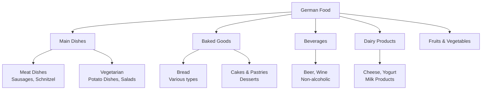
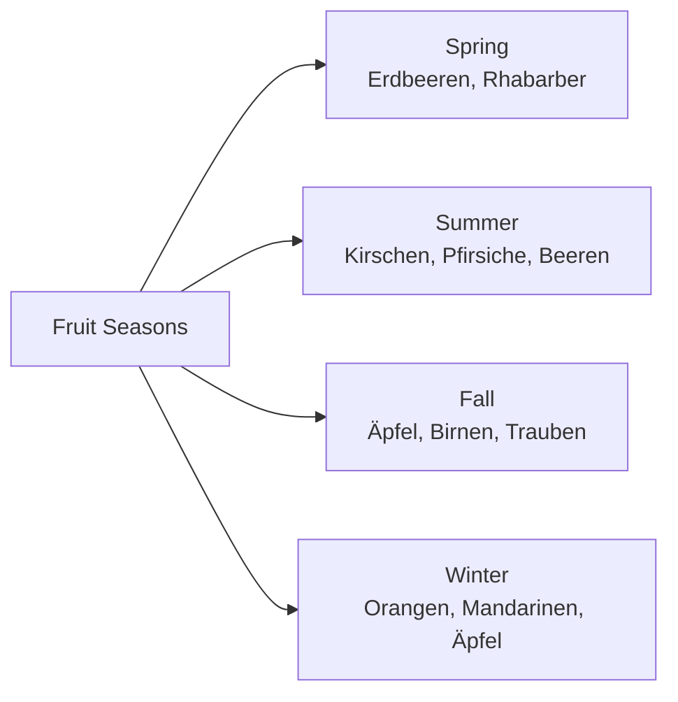
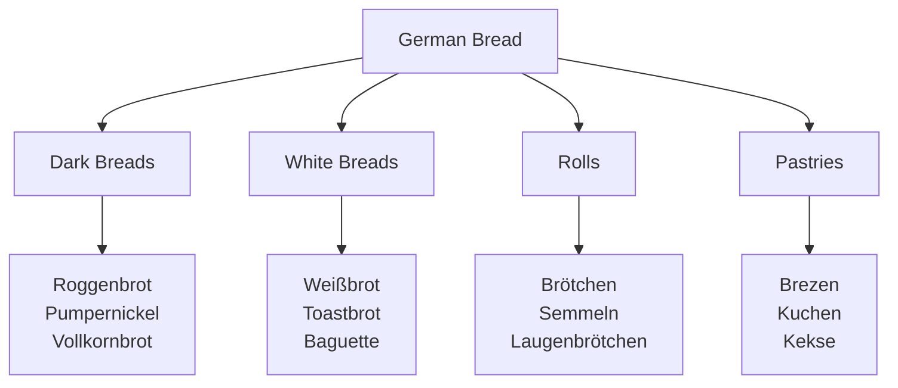
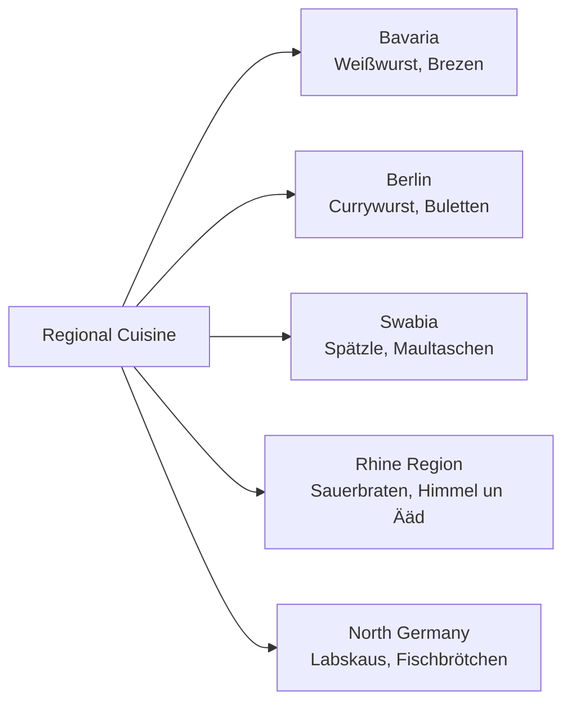
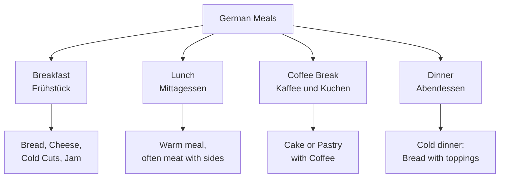

# Food and Drink (Essen und Trinken) - German Food Vocabulary for English Speakers

## Introduction
Food is a central part of German culture. This chapter covers German cuisine, dining vocabulary, food categories, and essential phrases for restaurants, shopping, and cooking.

## Basic Food Categories

### Main Food Groups

| Category | German | Pronunciation | Examples |
|----------|--------|---------------|----------|
| 🍎 | das Obst | [oːpst] | Apple, banana, orange (Apfel, Banane, Orange) |
| 🥦 | das Gemüse | [ɡəˈmyːzə] | Carrot, potato, tomato (Karotte, Kartoffel, Tomate) |
| 🥩 | das Fleisch | [flaɪʃ] | Beef, pork, chicken (Rindfleisch, Schweinefleisch, Hühnchen) |
| 🐟 | der Fisch | [fɪʃ] | Salmon, trout, herring (Lachs, Forelle, Hering) |
| 🥖 | das Brot | [bʁoːt] | Bread, roll, pretzel (Brot, Brötchen, Brezel) |
| 🧀 | die Milchprodukte | [ˈmɪlçpʁoˌdʊktə] | Cheese, milk, yogurt (Käse, Milch, Joghurt) |

## Food Classification

## Fruits (Obst)

### Common Fruits

| Fruit | German | Pronunciation | Season |
|-------|--------|---------------|--------|
| 🍎 Apple | der Apfel | [ˈap͡fəl] | Year-round |
| 🍌 Banana | die Banane | [baˈnaːnə] | Year-round |
| 🍊 Orange | die Orange | [oˈʁɑ̃ːʒə] | Winter |
| 🍓 Strawberry | die Erdbeere | [ˈeːɐ̯tbeːʁə] | Summer |
| 🍇 Grapes | die Trauben | [ˈtʁaʊbən] | Fall |
| 🍒 Cherries | die Kirschen | [ˈkɪʁʃən] | Summer |
| 🍑 Peach | der Pfirsich | [ˈpfɪʁzɪç] | Summer |

### Seasonal Fruits

## Vegetables (Gemüse)

### Common Vegetables

| Vegetable | German | Pronunciation | Usage |
|-----------|--------|---------------|-------|
| 🥔 Potato | die Kartoffel | [kaʁˈtɔfəl] | Boiled, fried, mashed |
| 🥕 Carrot | die Karotte | [kaˈʁɔtə] | Soups, salads, side dish |
| 🍅 Tomato | die Tomate | [toˈmaːtə] | Salads, sauces |
| 🧅 Onion | die Zwiebel | [ˈt͡sviːbəl] | Cooking base |
| 🥒 Cucumber | die Gurke | [ˈɡʊʁkə] | Salads, pickled |
| 🥬 Cabbage | der Kohl | [koːl] | Sauerkraut, soups |

### Popular German Vegetable Dishes

| Dish | German | Description |
|------|--------|-------------|
| Sauerkraut | das Sauerkraut | [ˈzaʊ̯ɐkʁaʊt] | Fermented cabbage |
| Potato salad | der Kartoffelsalat | [kaʁˈtɔfəlzaˌlaːt] | Potato salad (regional variations) |
| Red cabbage | der Rotkohl | [ˈʁoːtkoːl] | Sweet and sour cooked cabbage |

## Meat and Poultry (Fleisch und Geflügel)

### Types of Meat

| Meat | German | Pronunciation | Common Dishes |
|------|--------|---------------|--------------|
| 🐷 Pork | das Schweinefleisch | [ˈʃvaɪnəflaɪʃ] | Schnitzel, Bratwurst |
| 🐮 Beef | das Rindfleisch | [ˈʁɪntflaɪʃ] | Rouladen, Gulasch |
| 🐔 Chicken | das Hühnchen | [ˈhyːnçən] | Grilled, roasted |
| 🦆 Duck | die Ente | [ˈɛntə] | Christmas dish |
| 🦃 Turkey | der Truthahn | [ˈtʁuːthaːn] | Holiday meals |

### Famous German Sausages

| Sausage | German | Pronunciation | Region |
|---------|--------|---------------|--------|
| 🍖 Bratwurst | die Bratwurst | [ˈbʁaːtvʊʁst] | Nationwide |
| 🌭 Wiener | der Wiener | [ˈviːnɐ] | Frankfurt |
| 🥨 Weisswurst | die Weißwurst | [ˈvaɪsvʊʁst] | Bavaria |
| 🌶️ Currywurst | die Currywurst | [ˈkœʁivʊʁst] | Berlin |

## Bread and Bakery (Brot und Bäckerei)

### German Bread Culture

### Bread Types

| Bread | German | Pronunciation | Characteristics |
|-------|--------|---------------|----------------|
| 🍞 Rye bread | das Roggenbrot | [ˈʁɔɡənbʁoːt] | Dark, dense, healthy |
| 🥨 Pretzel | die Brezel | [ˈbʁɛt͡səl] | Soft, salty, twisted |
| 🥐 Croissant | das Croissant | [kʁoaˈsɑ̃] | Buttery, flaky |
| 🥪 Toast bread | das Toastbrot | [ˈtoːstbʁoːt] | Soft, white, for toasting |

## Dairy Products (Milchprodukte)

### Common Dairy Items

| Product | German | Pronunciation | Usage |
|---------|--------|---------------|-------|
| 🧀 Cheese | der Käse | [ˈkɛːzə] | On bread, in cooking |
| 🥛 Milk | die Milch | [mɪlç] | Drinking, cooking |
| 🧈 Butter | die Butter | [ˈbʊtɐ] | On bread, cooking |
| 🍦 Yogurt | der Joghurt | [ˈjoːɡʊʁt] | Breakfast, snacks |
| 🥚 Eggs | die Eier | [ˈaɪ̯ɐ] | Breakfast, baking |

### German Cheeses

| Cheese | German | Pronunciation | Type |
|--------|--------|---------------|------|
| 🧀 Emmental | der Emmentaler | [ˈɛməntaːlɐ] | Hard cheese with holes |
| 🧀 Camembert | der Camembert | [kamɑ̃ˈbɛːɐ] | Soft cheese |
| 🧀 Gouda | der Gouda | [ˈɡaʊda] | Semi-hard cheese |

## Beverages (Getränke)

### Non-Alcoholic Drinks

| Drink | German | Pronunciation | Notes |
|-------|--------|---------------|-------|
| 💧 Water | das Wasser | [ˈvasɐ] | Mit/ohne Gas (with/without bubbles) |
| ☕ Coffee | der Kaffee | [ˈkafe] | Very popular in Germany |
| 🫖 Tea | der Tee | [teː] | Various types available |
| 🥛 Juice | der Saft | [zaft] | Orange, apple, multivitamin |
| 🥤 Soda | die Limonade | [limoˈnaːdə] | Sweet carbonated drink |

### Alcoholic Drinks

| Drink | German | Pronunciation | Region |
|-------|--------|---------------|--------|
| 🍺 Beer | das Bier | [biːɐ] | Nationwide, many varieties |
| 🍷 Wine | der Wein | [vaɪn] | Rhine, Mosel regions |
| 🥂 Sparkling wine | der Sekt | [zɛkt] | Celebrations |
| 🥃 Schnapps | der Schnaps | [ʃnaps] | Digestif |

## Traditional German Dishes

### Classic German Meals

| Dish | German | Pronunciation | Description |
|------|--------|---------------|-------------|
| 🍖 Sauerbraten | der Sauerbraten | [ˈzaʊ̯ɐˌbʁaːtən] | Marinated pot roast |
| 🥘 Goulash | das Gulasch | [ˈɡuːlaʃ] | Stew with meat and paprika |
| 🥗 Potato pancakes | die Kartoffelpuffer | [kaʁˈtɔfəlˌpʊfɐ] | Fried potato pancakes |
| 🍲 Lentil soup | die Linsensuppe | [ˈlɪnzənˌzʊpə] | Lentil soup with sausage |

### Regional Specialties

## Dining Out (Im Restaurant)

### Restaurant Vocabulary

| English | German | Pronunciation |
|---------|--------|---------------|
| Menu | die Speisekarte | [ˈʃpaɪzəkaʁtə] |
| Waiter/Waitress | der Kellner / die Kellnerin | [ˈkɛlnɐ] / [ˈkɛlnəʁɪn] |
| Table | der Tisch | [tɪʃ] |
| Bill | die Rechnung | [ˈʁɛçnʊŋ] |
| Tip | das Trinkgeld | [ˈtʁɪŋkɡɛlt] |

### Ordering Food

| Phrase | German | Pronunciation |
|--------|--------|---------------|
| I would like... | Ich hätte gern... | [ɪç ˈhɛtə ɡɛʁn] |
| What do you recommend? | Was empfehlen Sie? | [vas ɛmˈpfeːlən ziː] |
| The bill, please | Die Rechnung, bitte | [diː ˈʁɛçnʊŋ ˈbɪtə] |
| Is service included? | Ist die Bedienung inklusive? | [ɪst diː bəˈdiːnʊŋ ɪnkluˈziːvə] |

### Dietary Requirements

| Requirement | German | Pronunciation |
|-------------|--------|---------------|
| Vegetarian | vegetarisch | [veɡeˈtaːʁɪʃ] |
| Vegan | vegan | [veˈɡaːn] |
| Gluten-free | glutenfrei | [ˈɡluːtənfʁaɪ] |
| I'm allergic to... | Ich bin allergisch gegen... | [ɪç bɪn aˈlɛʁɡɪʃ ˈɡeːɡən] |

## Shopping for Food (Lebensmittel einkaufen)

### Food Stores

| Store | German | Pronunciation | Sells |
|-------|--------|---------------|-------|
| Supermarket | der Supermarkt | [ˈzuːpɐmaʁkt] | Everything |
| Bakery | die Bäckerei | [bɛkəˈʁaɪ] | Bread, pastries |
| Butcher | der Metzger | [ˈmɛt͡sɡɐ] | Meat, sausages |
| Farmers market | der Wochenmarkt | [ˈvɔxənmaʁkt] | Fresh produce |

### Shopping Phrases

| English | German | Pronunciation |
|---------|--------|---------------|
| How much does it cost? | Wie viel kostet das? | [viː fiːl ˈkɔstət das] |
| I would like 500 grams... | Ich hätte gern 500 Gramm... | [ɪç ˈhɛtə ɡɛʁn fʏnfhʊndɐt ɡʁam] |
| Do you have...? | Haben Sie...? | [ˈhaːbən ziː] |
| Where can I find...? | Wo finde ich...? | [voː ˈfɪndə ɪç] |

## Cooking and Recipes (Kochen und Rezepte)

### Cooking Terms

| English | German | Pronunciation |
|---------|--------|---------------|
| To cook | kochen | [ˈkɔxən] |
| To bake | backen | [ˈbakən] |
| To fry | braten | [ˈbʁaːtən] |
| To boil | kochen | [ˈkɔxən] |
| Recipe | das Rezept | [ʁeˈt͡sɛpt] |
| Ingredients | die Zutaten | [t͡suˈtaːtən] |

### Kitchen Utensils

| Utensil | German | Pronunciation |
|---------|--------|---------------|
| Pot | der Topf | [tɔpf] |
| Pan | die Pfanne | [ˈp͡fanə] |
| Knife | das Messer | [ˈmɛsɐ] |
| Spoon | der Löffel | [ˈlœfəl] |
| Fork | die Gabel | [ˈɡaːbəl] |

## German Eating Habits

### Meal Times and Customs

### Typical Meal Structure

1. **Frühstück** (Breakfast): Bread with cheese, cold cuts, jam, boiled eggs
2. **Mittagessen** (Lunch): Main warm meal of the day
3. **Kaffee und Kuchen** (Coffee and Cake): Afternoon break around 3-4 PM
4. **Abendessen** (Dinner): Usually cold - bread with various toppings

## Practice Exercises

### Exercise 1: Food Vocabulary
Translate to German:
1. "I would like an apple and a banana"
2. "We need potatoes and carrots for the soup"
3. "Do you have fresh bread?"
4. "I'm vegetarian"

### Exercise 2: Restaurant Role Play
What would you say in these situations?
1. Getting a table at a restaurant
2. Ordering food and drinks
3. Asking about ingredients
4. Paying the bill

### Exercise 3: Shopping Dialogue
Complete the dialogue:
- "Haben Sie frische ___ (tomatoes)?"
- "Ja, hier sind sie. ___ (How much) möchten Sie?"
- "___ (I would like) ein Kilo, bitte."
- "Das macht ___ (that costs) 3,50 Euro."

### Exercise 4: Cooking Instructions
Put these cooking steps in order in German:
1. "Die Kartoffeln schälen und schneiden"
2. "Wasser zum Kochen bringen"
3. "Kartoffeln ins Wasser geben"
4. "20 Minuten kochen lassen"

### Exercise 5: Cultural Understanding
Answer these questions:
1. What is "Kaffee und Kuchen"?
2. When do Germans typically eat their main warm meal?
3. What is typical German breakfast?
4. Why is bread so important in German cuisine?

---

## Summary

Key points about German food culture:
- Bread has enormous variety and cultural importance
- Meat, especially pork, features heavily in traditional cuisine
- Regional variations are significant across Germany
- "Kaffee und Kuchen" is an important afternoon tradition
- Meal times are generally structured and consistent
- Beer and wine are important parts of food culture

With this vocabulary and cultural knowledge, you'll be able to navigate German food situations with confidence!