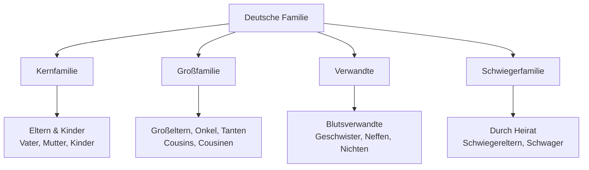
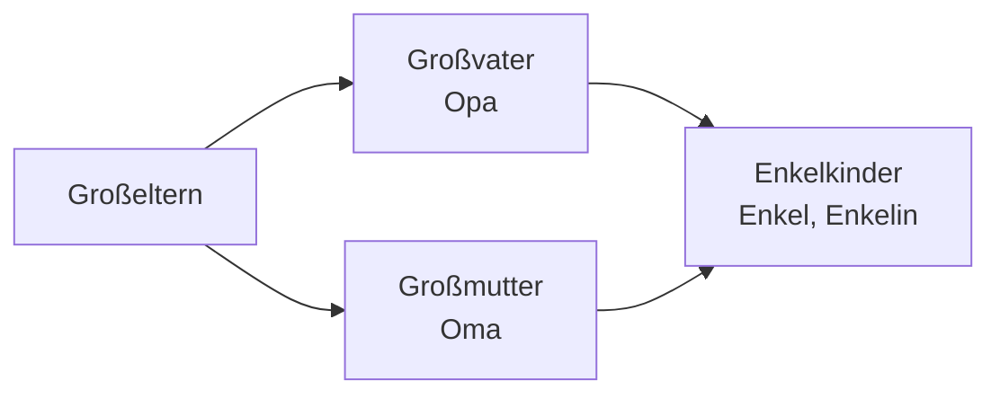
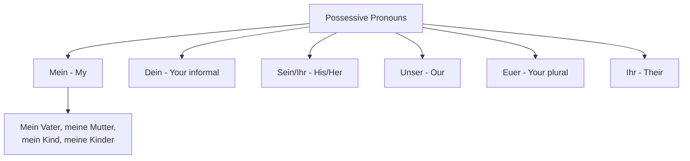
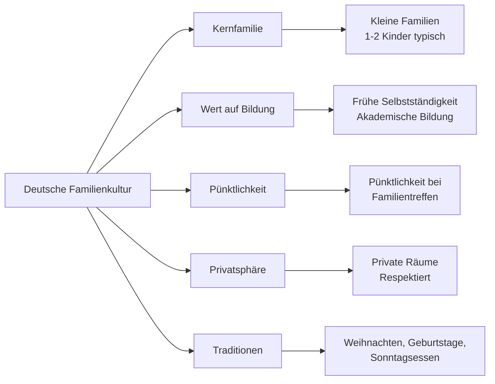

# Family (Familie) - German Family Vocabulary for English Speakers

## Introduction
Family vocabulary is essential for personal conversations, describing relationships, and understanding German culture. This chapter covers family members, relationships, family events, and cultural aspects of German family life.

## Basic Family Members

### Immediate Family

| Family Member | German | Pronunciation | Relationship |
|---------------|--------|---------------|-------------|
| 👨‍👩‍👧‍👦 | die Familie | [faˈmiːli̯ə] | Family |
| 👨 | der Vater | [ˈfaːtɐ] | Father |
| 👩 | die Mutter | [ˈmʊtɐ] | Mother |
| 👦 | der Sohn | [zoːn] | Son |
| 👧 | die Tochter | [ˈtɔxtɐ] | Daughter |
| 👶 | das Kind | [kɪnt] | Child |
| 👫 | die Eltern | [ˈɛltɐn] | Parents |

## Family Classification

## Immediate Family (Kernfamilie)

### Core Family Members

| Family Member | German | Pronunciation | Notes |
|---------------|--------|---------------|-------|
| 👨 Father | der Vater | [ˈfaːtɐ] | Also: Papa, Vati |
| 👩 Mother | die Mutter | [ˈmʊtɐ] | Also: Mama, Mutti |
| 👦 Son | der Sohn | [zoːn] | Male child |
| 👧 Daughter | die Tochter | [ˈtɔxtɐ] | Female child |
| 👶 Child | das Kind | [kɪnt] | Gender-neutral |
| 👫 Parents | die Eltern | [ˈɛltɐn] | Plural of parent |
| 👨‍👩‍👧‍👦 Siblings | die Geschwister | [ɡəˈʃvɪstɐ] | Brothers and sisters |

## Extended Family (Großfamilie)

### Grandparents and Grandchildren

### Grandparents and Beyond

| Family Member | German | Pronunciation | Informal |
|---------------|--------|---------------|----------|
| 👴 Grandfather | der Großvater | [ˈɡʁoːsfaːtɐ] | Opa |
| 👵 Grandmother | die Großmutter | [ˈɡʁoːsmʊtɐ] | Oma |
| 👶 Grandchild | das Enkelkind | [ˈɛŋkəlkɪnt] | Enkel |
| 👦 Grandson | der Enkel | [ˈɛŋkəl] | - |
| 👧 Granddaughter | die Enkelin | [ˈɛŋkəlɪn] | - |
| 👴 Great-grandfather | der Urgroßvater | [ˈuːɐɡʁoːsfaːtɐ] | Uropa |
| 👵 Great-grandmother | die Urgroßmutter | [ˈuːɐɡʁoːsmʊtɐ] | Uroma |

### Aunts, Uncles, and Cousins

| Family Member | German | Pronunciation | Relationship |
|---------------|--------|---------------|-------------|
| 👨‍🦳 Uncle | der Onkel | [ˈɔŋkəl] | Parent's brother |
| 👩‍🦳 Aunt | die Tante | [ˈtantə] | Parent's sister |
| 👦 Cousin (male) | der Cousin | [kuˈzɛŋ] | Uncle/Aunt's son |
| 👧 Cousin (female) | die Cousine | [kuˈziːnə] | Uncle/Aunt's daughter |
| 👶 Nephew | der Neffe | [ˈnɛfə] | Sibling's son |
| 👶 Niece | die Nichte | [ˈnɪçtə] | Sibling's daughter |

## In-Laws (Schwiegerfamilie)

### Marriage Relationships

| Family Member | German | Pronunciation | Relationship |
|---------------|--------|---------------|-------------|
| 💑 Husband | der Ehemann | [ˈeːəman] | Also: Mann |
| 💑 Wife | die Ehefrau | [ˈeːəfʁaʊ] | Also: Frau |
| 👰‍♂️ Father-in-law | der Schwiegervater | [ˈʃviːɡɐfaːtɐ] | Spouse's father |
| 👰‍♀️ Mother-in-law | die Schwiegermutter | [ˈʃviːɡɐmʊtɐ] | Spouse's mother |
| 👨‍💼 Brother-in-law | der Schwager | [ˈʃvaːɡɐ] | Spouse's brother |
| 👩‍💼 Sister-in-law | die Schwägerin | [ˈʃvɛːɡəʁɪn] | Spouse's sister |

## Family Relationships

### Relationship Terms

| Relationship | German | Pronunciation | Description |
|-------------|--------|---------------|-------------|
| 💕 Marriage | die Ehe | [ˈeːə] | Legal union |
| 💍 Engagement | die Verlobung | [fɛɐˈloːbʊŋ] | Before marriage |
| 💔 Divorce | die Scheidung | [ˈʃaɪ̯dʊŋ] | End of marriage |
| 👶 Birth | die Geburt | [ɡəˈbuːɐt] | Child being born |
| 💀 Death | der Tod | [toːt] | Passing away |
| 🧬 Relative | der Verwandte | [fɛɐˈvantə] | Family member |

### Family Status

| Status | German | Pronunciation | Example |
|--------|--------|---------------|---------|
| Single | ledig | [ˈleːdɪç] | Ich bin ledig. |
| Married | verheiratet | [fɛɐˈhaɪ̯ʁaːtət] | Sie ist verheiratet. |
| Divorced | geschieden | [ɡəˈʃiːdən] | Er ist geschieden. |
| Widowed | verwitwet | [fɛɐˈvɪtvət] | Sie ist verwitwet. |

## Grammar: Possessive Pronouns

### Family Possessives

### Declension of Possessives

| Case | Masculine | Feminine | Neuter | Plural |
|------|-----------|----------|--------|--------|
| **Nominative** | mein Vater | meine Mutter | mein Kind | meine Kinder |
| **Accusative** | meinen Vater | meine Mutter | mein Kind | meine Kinder |
| **Dative** | meinem Vater | meiner Mutter | meinem Kind | meinen Kindern |
| **Genitive** | meines Vaters | meiner Mutter | meines Kindes | meiner Kinder |

## Family Events and Celebrations

### Important Family Occasions

| Event | German | Pronunciation | Tradition |
|-------|--------|---------------|-----------|
| 🎂 Birthday | der Geburtstag | [ɡəˈbuːɐt͡staːk] | Cake, presents |
| 💒 Wedding | die Hochzeit | [ˈhɔxt͡saɪt] | Church, party |
| 🍼 Baptism | die Taufe | [ˈtaʊ̯fə] | Church ceremony |
| 🎓 Graduation | der Abschluss | [ˈapʃlʊs] | School completion |
| 🎄 Christmas | Weihnachten | [ˈvaɪ̯naxtən] | Family gathering |
| 🥚 Easter | Ostern | [ˈoːstɐn] | Egg hunting |

## German Family Culture

### Cultural Aspects

### Key Cultural Points

1. **Family Size**: Typically 1-2 children per family
2. **Education**: High value placed on academic achievement
3. **Punctuality**: Being on time for family events is important
4. **Privacy**: Respect for personal space and private rooms
5. **Traditions**: Strong family traditions, especially around holidays
6. **Independence**: Children are encouraged to be independent early

## Family Activities

### Common Family Activities

| Activity | German | Pronunciation | Description |
|----------|--------|---------------|-------------|
| 🍽️ Family dinner | das Abendessen | [ˈaːbəntˌɛsən] | Evening meal together |
| 🎮 Game night | der Spieleabend | [ˈʃpiːləˌʔaːbənt] | Playing games together |
| 🌳 Weekend outing | der Wochenendausflug | [ˈvɔxənˌʔɛntʔaʊsfluːk] | Family trip |
| 📺 Movie night | der Filmabend | [ˈfɪlmˌʔaːbənt] | Watching movies together |
| 🎉 Family celebration | die Familienfeier | [faˈmiːli̯ənˌfaɪ̯ɐ] | Birthday, anniversary |

## Describing Family Relationships

### Relationship Quality

| Description | German | Pronunciation | Meaning |
|-------------|--------|---------------|---------|
| Close | eng | [ɛŋ] | Wir haben eine enge Beziehung. |
| Distant | distanziert | [dɪstanˈt͡siːɐt] | Unsere Beziehung ist distanziert. |
| Loving | liebevoll | [ˈliːbəfɔl] | Meine Mutter ist sehr liebevoll. |
| Strict | streng | [ʃtʁɛŋ] | Mein Vater ist manchmal streng. |
| Supportive | unterstützend | [ˈʊntɐˌʃtʏt͡sənt] | Meine Familie ist sehr unterstützend. |

## Family in Different Life Stages

### Life Cycle Vocabulary

| Stage | German | Pronunciation | Age Range |
|-------|--------|---------------|-----------|
| 👶 Baby | das Baby | [ˈbeːbi] | 0-1 year |
| 🧒 Child | das Kind | [kɪnt] | 2-12 years |
| 🧑 Teenager | der Teenager | [ˈtiːnˌʔeːd͡ʒɐ] | 13-19 years |
| 👨 Adult | der Erwachsene | [ɛɐˈvaksənə] | 20+ years |
| 👴 Senior | der Senior | [ˈzeːni̯oːɐ] | 65+ years |

## Practice Exercises

### Exercise 1: Family Vocabulary
Translate to German:
1. "My mother and father live in Berlin"
2. "I have two sisters and one brother"
3. "Our grandparents visit every Sunday"
4. "Her husband is from Austria"

### Exercise 2: Family Tree
Describe this family in German:
- Großeltern: Oma Maria (67), Opa Hans (70)
- Eltern: Mutter Anna (40), Vater Peter (42)
- Kinder: Tochter Lisa (15), Sohn Tom (12)

### Exercise 3: Possessive Practice
Complete with correct possessive:
1. "___ Bruder ist 20 Jahre alt." (my)
2. "___ Schwester studiert Medizin." (his)
3. "___ Eltern wohnen in München." (our)
4. "___ Großeltern sind sehr nett." (their)

### Exercise 4: Family Relationships
Describe these relationships in German:
1. "My mother's sister"
2. "My father's brother"
3. "My sister's daughter"
4. "My wife's parents"

### Exercise 5: Cultural Understanding
Answer these questions:
1. Why is punctuality important in German family culture?
2. What is typical about German family size?
3. How do Germans typically celebrate birthdays?
4. What values are important in German family education?

## Useful Phrases for Family Conversations

### Talking About Family

| English | German | Pronunciation |
|---------|--------|---------------|
| How many siblings do you have? | Wie viele Geschwister hast du? | [viː ˈfiːlə ɡəˈʃvɪstɐ hast duː] |
| I have two brothers and one sister | Ich habe zwei Brüder und eine Schwester | [ɪç ˈhaːbə t͡svaɪ ˈbʁyːdɐ ʊnt ˈaɪnə ˈʃvɛstɐ] |
| Where do your parents live? | Wo wohnen deine Eltern? | [voː ˈvoːnən ˈdaɪnə ˈɛltɐn] |
| My family is very important to me | Meine Familie ist mir sehr wichtig | [ˈmaɪnə faˈmiːli̯ə ɪst miːɐ zeːɐ ˈvɪçtɪç] |

### Family Events Phrases

| English | German | Pronunciation |
|---------|--------|---------------|
| Happy birthday! | Alles Gute zum Geburtstag! | [ˈaləs ˈɡuːtə t͡sʊm ɡəˈbuːɐt͡staːk] |
| Congratulations on your wedding! | Herzlichen Glückwunsch zur Hochzeit! | [ˈhɛʁt͡slɪçən ˈɡlʏkvʊnʃ t͡suːɐ ˈhɔxt͡saɪt] |
| My condolences | Mein Beileid | [maɪn ˈbaɪ̯laɪt] |

---

## Summary

Key points about German family vocabulary and culture:
- Family relationships have specific terms for different relatives
- Possessive pronouns must agree with gender and case
- German families tend to be small (1-2 children)
- Punctuality and privacy are highly valued
- Education and independence are important family values
- Family traditions are maintained, especially around holidays

With this vocabulary and cultural knowledge, you'll be able to discuss family relationships and understand German family dynamics with confidence!