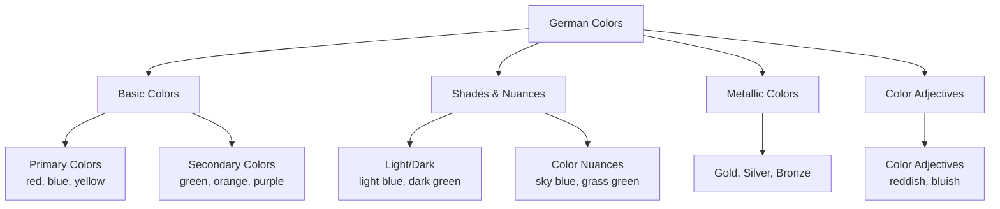
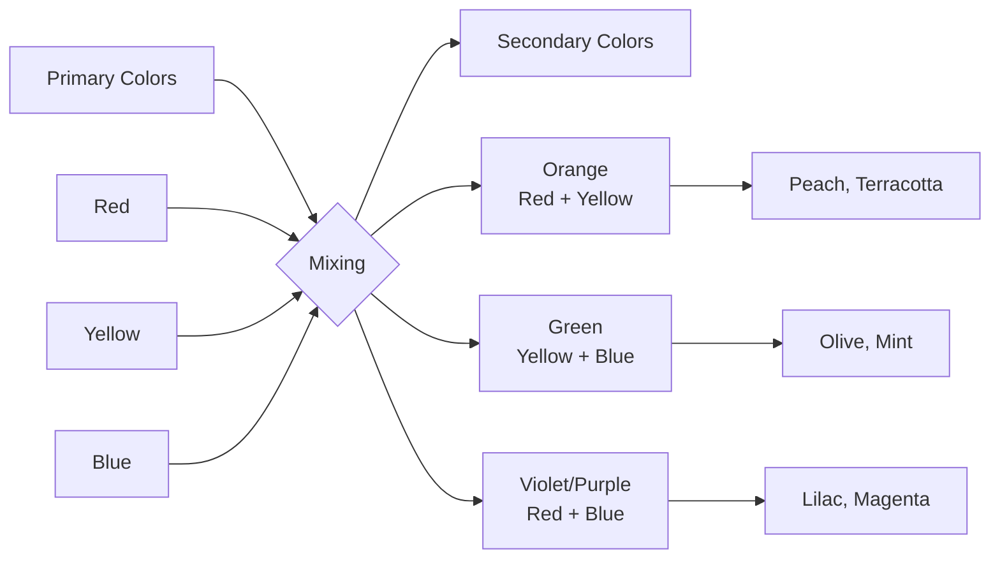
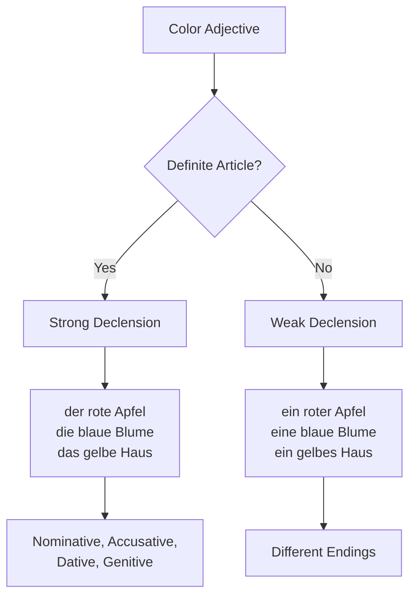
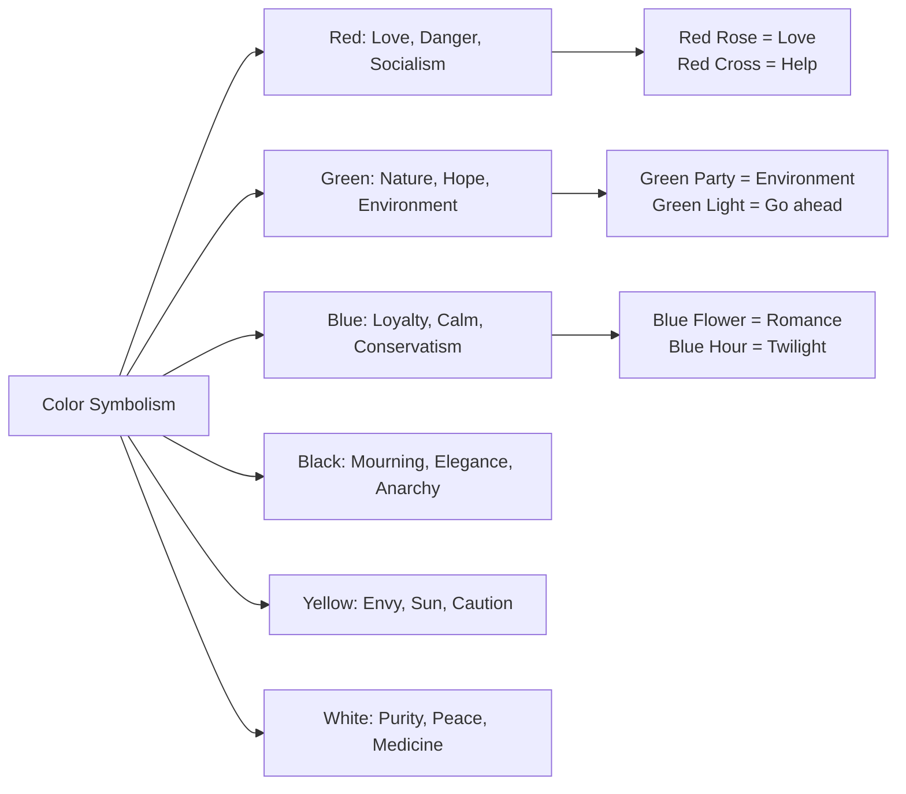

# Colors (Farben) - German Colors for English Speakers

## Introduction
Colors play an important role in German language and culture. In this chapter, you'll learn basic colors, shades, cultural meanings, and idioms with colors.

## Basic Colors

### Primary and Basic Colors

| Color | German | Pronunciation | Example |
|-------|--------|---------------|---------|
|  | rot | [ʁoːt] | der rote Apfel (the red apple) |
|  | blau | [blaʊ] | der blaue Himmel (the blue sky) |
|  | gelb | [ɡɛlp] | die gelbe Sonne (the yellow sun) |
|  | grün | [ɡʁyːn] | das grüne Gras (the green grass) |
|  | schwarz | [ʃvaʁts] | die schwarze Nacht (the black night) |
|  | weiß | [vaɪs] | der weiße Schnee (the white snow) |
|  | grau | [ɡʁaʊ] | der graue Himmel (the gray sky) |
|  | braun | [bʁaʊn] | die braune Erde (the brown earth) |

## Color Classification

## Color Shades and Nuances

### Light Shades

| Color | German | Pronunciation |
|-------|--------|---------------|
|  | hellrot | [ˈhɛlʁoːt] |
|  | hellblau | [ˈhɛlblaʊ] |
|  | hellgrün | [ˈhɛlɡʁyːn] |
|  | hellgelb | [ˈhɛlɡɛlp] |

### Dark Shades

| Color | German | Pronunciation |
|-------|--------|---------------|
|  | dunkelrot | [ˈdʊŋkəlʁoːt] |
|  | dunkelblau | [ˈdʊŋkəlblaʊ] |
|  | dunkelgrün | [ˈdʊŋkəlɡʁyːn] |
|  | dunkelgrau | [ˈdʊŋkəlɡʁaʊ] |

### Special Color Nuances

| Color | German | Description |
|-------|--------|-------------|
|  | himmelblau | like the sky on a clear day |
|  | meeresblau | deep blue of the ocean |
|  | grasgrün | fresh green of grass |
|  | blutrot | deep red like blood |
|  | schneeweiß | pure white like fresh snow |

## Secondary and Mixed Colors

### Secondary Colors

| Color | German | Pronunciation | Mixing |
|-------|--------|---------------|--------|
|  | orange | [oˈʁɑ̃ːʃ] | red + yellow |
|  | lila | [ˈliːla] | red + blue |
|  | violett | [vioˈlɛt] | red + blue |
|  | pink | [pɪŋk] | light red |
|  | rosa | [ˈʁoːza] | light red |

## Metallic and Natural Colors

### Metallic Colors

| Color | German | Pronunciation | Usage |
|-------|--------|---------------|-------|
|  | gold | [ɡɔlt] | gold medal |
|  | silber | [ˈzɪlbɐ] | silver cutlery |
|  | bronze | [ˈbʁɔ̃ːsə] | bronze statue |
|  | kupfer | [ˈkʊpfɐ] | copper roof |

### Natural Colors

| Color | German | Pronunciation | Natural Example |
|-------|--------|---------------|----------------|
|  | beige | [bɛːʃ] | sand |
|  | elfenbein | [ˈɛlfənbaɪn] | ivory |
|  | ocker | [ˈɔkɐ] | earth |
|  | türkis | [tʏʁˈkiːs] | gemstone |

## Grammar: Colors as Adjectives

### Declension of Color Adjectives

### Adjective Declension with Colors

| Case | Masculine | Feminine | Neuter | Plural |
|------|-----------|----------|--------|--------|
| **Nominative** | der rote Ball | die blaue Blume | das gelbe Haus | die grünen Bäume |
| **Accusative** | den roten Ball | die blaue Blume | das gelbe Haus | die grünen Bäume |
| **Dative** | dem roten Ball | der blauen Blume | dem gelben Haus | den grünen Bäumen |
| **Genitive** | des roten Balls | der blauen Blume | des gelben Hauses | der grünen Bäume |

### Comparison of Color Adjectives

- **Positive**: rot, blau, grün (red, blue, green)
- **Comparative**: röter, blauer, grüner (redder, bluer, greener)
- **Superlative**: am rötesten, am blauesten, am grünsten (the reddest, the bluest, the greenest)

**Examples**:
- "Dieses Rot ist röter als jenes." (This red is redder than that one.)
- "Der Himmel ist heute am blauesten." (The sky is the bluest today.)

## Colors in German Culture

### Symbolic Meanings

### Political Colors

| Color | Political Meaning | Examples |
|-------|------------------|----------|
| **Black** | CDU/CSU (Christian Democrats) | "schwarze Null" (balanced budget) |
| **Red** | SPD (Social Democrats) | "rote Karte" (red card in soccer) |
| **Yellow** | FDP (Free Democrats) | "gelbe Tonne" (packaging waste bin) |
| **Green** | Bündnis 90/Die Grünen | "grüne Welle" (green wave of traffic lights) |
| **Blue** | AfD (right-wing conservative) | "blaue Briefe" (warning letters) |

## Idioms with Colors

### Common Color Idioms

| Idiom | Literal Meaning | Actual Meaning | Example |
|-------|----------------|----------------|---------|
| **blau machen** | to make blue | to skip work/school | "Er macht heute blau." (He's skipping work today.) |
| **grün sein** | to be green | to be inexperienced | "Sie ist noch grün in diesem Job." (She's still green in this job.) |
| **gelb vor Neid** | yellow with envy | very envious | "Er wurde gelb vor Neid." (He turned yellow with envy.) |
| **rot sehen** | to see red | to become very angry | "Wenn ich das sehe, sehe ich rot!" (When I see that, I see red!) |
| **schwarzfahren** | to ride black | to ride without a ticket | "Er fährt oft schwarz." (He often rides without a ticket.) |
| **weiße Weste haben** | to have a white vest | to be innocent | "Der Angeklagte hat eine weiße Weste." (The accused has a clean record.) |
| **ins Schwarze treffen** | to hit the black | to hit the bullseye | "Mit deinem Vorschlag hast du ins Schwarze getroffen." (Your suggestion hit the bullseye.) |

### Colors in Everyday Situations

**Traffic Light**:
- **Rot** = stop
- **Gelb** = caution
- **Grün** = go

**Weather**:
- "blauer Himmel" = clear sky
- "grauer Tag" = gloomy day
- "rote Abendsonne" = beautiful sunset

**Recycling**:
- "grüne Welle" = series of green traffic lights
- "gelber Sack" = yellow bag for packaging waste

## Colors in Different Contexts

### Clothing and Fashion

| Expression | Meaning |
|------------|---------|
| "Das Kleid in marineblau" | navy blue dress |
| "Eine beige Hose" | beige pants |
| "Schwarzer Anzug" | black suit (formal wear) |
| "Bunte Kleidung" | colorful clothing |

### Food and Nature

| Color | Food | Nature |
|-------|------|--------|
| **Red** | tomatoes, strawberries | roses, poppies |
| **Yellow** | lemons, bananas | sunflowers |
| **Green** | lettuce, cucumbers | leaves, grass |
| **Orange** | oranges, carrots | autumn leaves |
| **Brown** | chocolate, coffee | earth, tree bark |

## Key Grammar Points for English Speakers

### Adjective Endings
- Colors are adjectives and must have correct endings
- Endings change based on gender, case, and article
- Example: "ein roter Apfel" (a red apple) vs "der rote Apfel" (the red apple)

### Word Order
- Color adjectives come before the noun
- Example: "das blaue Auto" (the blue car)

### Compound Colors
- German often creates compound words for colors
- Example: "himmelblau" (sky blue) = Himmel (sky) + blau (blue)

## Practice Exercises

### Exercise 1: Name the Colors
Name these colors in German:
1.  
2. 
3. 
4. 
5. 

### Exercise 2: Color Adjective Endings
Add the correct endings:
1. Der ___ (rot) Ball (the red ball)
2. Eine ___ (blau) Blume (a blue flower)
3. Das ___ (gelb) Haus (the yellow house)
4. Mit dem ___ (grün) Auto (with the green car)
5. Die ___ (weiß) Blusen (the white blouses)

### Exercise 3: Understand Idioms
Explain the meaning:
1. "Er macht heute blau."
2. "Sie sieht grün aus."
3. "Das ist ein grauer Tag."
4. "Er hat ins Schwarze getroffen."

### Exercise 4: Describe Colors
Describe in German:
1. The sky on a sunny day
2. A ripe strawberry
3. Fresh snow
4. The color of the ocean

---

## Summary

Colors in German are more than just visual impressions:
- They have cultural and symbolic meanings
- Are used in many idioms and expressions
- Must be declined as adjectives
- Have specific nuances and shades

With this knowledge, you can not only name colors but also use them idiomatically correctly and understand their cultural significance!