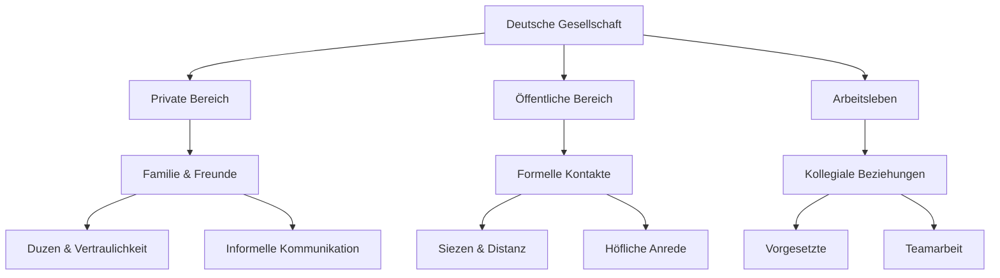
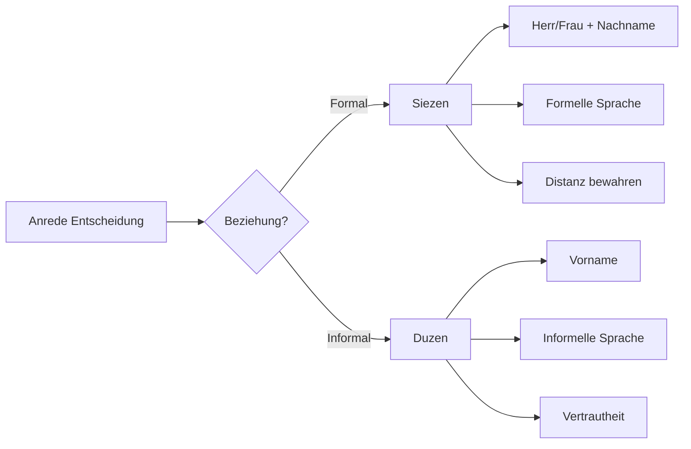

# German Society and Culture - Comprehensive Guide

## Core Societal Concepts

### Basic Social Structures

| German | Pronunciation | English | Example Sentence |
|--------|---------------|---------|------------------|
| die Gesellschaft | [ɡəˈzɛlʃaft] | society | Die deutsche Gesellschaft ist multikulturell. |
| die Gemeinschaft | [ɡəˈmaɪnʃaft] | community | Unsere Gemeinschaft hilft einander. |
| das Zusammenleben | [tsuˈzamənˌleːbn̩] | coexistence | Das Zusammenleben verschiedener Kulturen bereichert uns. |
| die Sozialstruktur | [zoˈtsi̯aːlˌʃtʁʊkˈtuːɐ̯] | social structure | Die Sozialstruktur in Deutschland ist komplex. |
| die Bevölkerungsgruppe | [bəˈfœlkəʁʊŋsˌɡʁʊpə] | population group | Jede Bevölkerungsgruppe hat ihre Traditionen. |

### Family and Relationships

| German | Pronunciation | English | Example Sentence |
|--------|---------------|---------|------------------|
| die Kernfamilie | [ˈkɛʁnfaˌmiːli̯ə] | nuclear family | Die Kernfamilie besteht aus Eltern und Kindern. |
| die Großfamilie | [ˈɡʁoːsfaˌmiːli̯ə] | extended family | In der Großfamilie leben mehrere Generationen. |
| die Lebensgemeinschaft | [ˈleːbnsɡəˌmaɪnʃaft] | domestic partnership | Sie führen eine Lebensgemeinschaft. |
| die Verwandtschaft | [fɛɐ̯ˈvantʃaft] | relatives | Meine Verwandtschaft wohnt in ganz Deutschland. |
| die Nachbarschaft | [ˈnaːxbaːɐ̯ʃaft] | neighborhood | Die Nachbarsschaft ist sehr hilfsbereit. |

## Social Hierarchy and Relationships



## Cultural Institutions

### Education System
- **Kindergarten** (preschool)
- **Grundschule** (elementary school)
- **Gymnasium** (academic high school)
- **Universität** (university)
- **Berufsschule** (vocational school)

### Social Organizations
- **Vereine** (clubs/associations)
- **Kirchen** (churches)
- **Gewerkschaften** (trade unions)
- **Soziale Einrichtungen** (social institutions)

## Communication Patterns

### Formal vs. Informal Address



### Key Social Rules
1. **Pünktlichkeit** (punctuality) - Being late is considered rude
2. **Direktheit** (directness) - Germans value honest, direct communication
3. **Privatsphäre** (privacy) - Respect for personal boundaries
4. **Ordnung** (order) - Appreciation for structure and rules

## Advanced Vocabulary

### Social Issues
- **die Integration** - integration
- **die Migration** - migration
- **die Gleichberechtigung** - equal rights
- **die soziale Gerechtigkeit** - social justice
- **der demografische Wandel** - demographic change

### Social Events
- **das Fest** - celebration
- **die Feier** - party
- **die Versammlung** - gathering
- **die Tradition** - tradition
- **der Brauch** - custom

## Practical Dialogues

### Meeting Someone New
```
Person A: "Guten Tag, ich heiße Müller."
Person B: "Freut mich, Sie kennenzulernen. Ich bin Schmidt."
Person A: "Woher kommen Sie?"
Person B: "Aus Köln. Und Sie?"
```

### Social Invitation
```
"Würden Sie am Samstag zu unserer Grillparty kommen?
Es beginnt um 15 Uhr. Bitte seien Sie pünktlich!"
```

## Cultural Notes

### Regional Differences
- **Northern Germany**: More reserved, direct communication
- **Southern Germany**: More traditional, warmer hospitality
- **Eastern Germany**: Distinct post-reunification culture
- **Western Germany**: Diverse, industrial heritage

### Important Holidays
- **Weihnachten** (Christmas)
- **Ostern** (Easter)
- **Oktoberfest** (Bavarian festival)
- **Karneval/Fasching** (Carnival)

## Grammar Focus

### Cases in Social Context
- **Nominative**: "Der Freund ist nett." (The friend is nice.)
- **Accusative**: "Ich sehe den Freund." (I see the friend.)
- **Dative**: "Ich helfe dem Freund." (I help the friend.)
- **Genitive**: "Das Auto des Freundes." (The friend's car.)

### Useful Prepositions
- **mit** (with): "Ich gehe mit Freunden aus."
- **bei** (at): "Ich bin bei der Familie."
- **zu** (to): "Ich gehe zu einer Party."