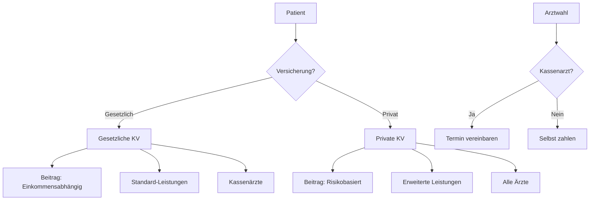
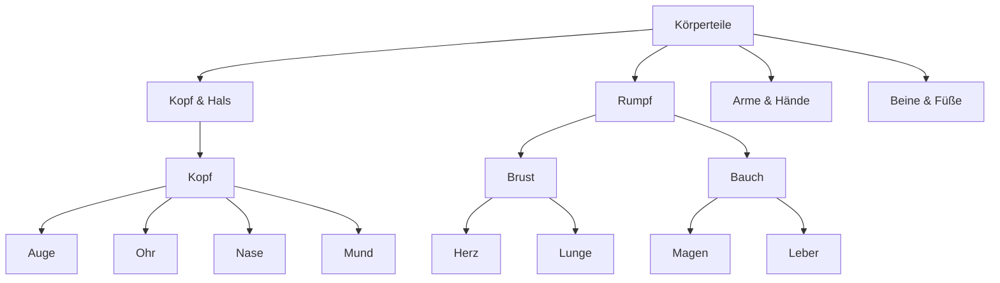
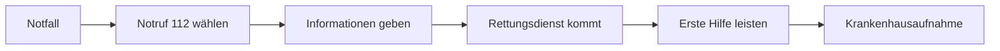

# Health and Medicine - Comprehensive Guide

## Medical System Overview

### Healthcare Facilities

| German | Pronunciation | English | Example Sentence |
|--------|---------------|---------|------------------|
| die Arztpraxis | [ˈaːɐ̯tstˌpʁaːksɪs] | doctor's office | Ich habe einen Termin in der Arztpraxis. |
| das Krankenhaus | [ˈkʁaŋkn̩ˌhaʊ̯s] | hospital | Das Krankenhaus hat eine Notaufnahme. |
| die Notaufnahme | [ˈnoːtʔaʊfˌnaːmə] | emergency room | Bei Unfällen geht man in die Notaufnahme. |
| die Apotheke | [apoˈteːkə] | pharmacy | Die Apotheke hat bis 18 Uhr geöffnet. |
| der Rettungsdienst | [ˈʁɛtʊŋsˌdiːnst] | emergency service | Der Rettungsdienst kam schnell. |

### Medical Professionals

| German | Pronunciation | English | Example Sentence |
|--------|---------------|---------|------------------|
| der Hausarzt | [ˈhaʊsˌʔaːɐ̯tst] | general practitioner | Mein Hausarzt ist sehr erfahren. |
| der Facharzt | [ˈfaxˌʔaːɐ̯tst] | specialist | Der Facharzt für Herzprobleme heißt Kardiologe. |
| der Chirurg | [çiˈʁʊʁk] | surgeon | Der Chirurg operiert morgen. |
| der Zahnarzt | [ˈtsaːnˌʔaːɐ̯tst] | dentist | Beim Zahnarzt war ich heute. |
| die Krankenschwester | [ˈkʁaŋkn̩ˌʃvɛstɐ] | nurse | Die Krankenschwester gibt Medikamente. |

## German Healthcare System



## Body Parts Vocabulary

### Major Body Areas
- **der Kopf** - head
- **der Oberkörper** - upper body
- **der Unterkörper** - lower body
- **die Gliedmaßen** - limbs

### Detailed Anatomy



## Common Health Conditions

### Symptoms and Illnesses
- **die Erkältung** - cold
- **die Grippe** - flu
- **das Fieber** - fever
- **der Schmerz** - pain
- **die Übelkeit** - nausea
- **der Husten** - cough
- **der Schnupfen** - runny nose

### Chronic Conditions
- **der Bluthochdruck** - high blood pressure
- **der Diabetes** - diabetes
- **die Allergie** - allergy
- **das Asthma** - asthma

## Medical Procedures

### Examination Types
- **die Untersuchung** - examination
- **die Blutuntersuchung** - blood test
- **die Röntgenaufnahme** - X-ray
- **die Operation** - surgery
- **die Impfung** - vaccination

### Treatment Methods
- **die Therapie** - therapy
- **die Medikation** - medication
- **die Physiotherapie** - physical therapy
- **die Rehabilitation** - rehabilitation

## Health Insurance System

### Key Concepts
- **die Krankenversicherungskarte** - health insurance card
- **die Versichertennummer** - insurance number
- **der Eigenanteil** - co-payment
- **das Rezept** - prescription
- **die Überweisung** - referral

## Emergency Situations

### Emergency Vocabulary
- **der Notfall** - emergency
- **der Unfall** - accident
- **die Verletzung** - injury
- **die Vergiftung** - poisoning
- **der Herzinfarkt** - heart attack
- **der Schlaganfall** - stroke

### Emergency Response Chain



## Practical Medical Dialogues

### Doctor's Visit
```
Patient: "Guten Tag, Herr Doktor. Ich fühle mich nicht wohl."
Arzt: "Was fehlt Ihnen denn?"
Patient: "Ich habe Kopfschmerzen und Fieber."
Arzt: "Lassen Sie mich Ihre Temperatur messen."
```

### Pharmacy Conversation
```
Kunde: "Haben Sie etwas gegen Halsschmerzen?"
Apotheker: "Ja, ich empfehle diesen Hustensaft."
Kunde: "Brauche ich ein Rezept dafür?"
Apotheker: "Nein, das ist rezeptfrei."
```

## Prevention and Wellness

### Healthy Lifestyle Terms
- **gesunde Ernährung** - healthy nutrition
- **Bewegung** - exercise
- **Stressmanagement** - stress management
- **Vorsorgeuntersuchung** - preventive check-up

### Wellness Practices
- **Entspannung** - relaxation
- **Schlafhygiene** - sleep hygiene
- **Mental Health** - psychische Gesundheit
- **Balance** - work-life balance

## Grammar for Medical Context

### Modal Verbs for Symptoms
- "Ich **kann** nicht schlafen." (I can't sleep.)
- "Ich **muss** husten." (I have to cough.)
- "Ich **möchte** einen Termin." (I would like an appointment.)

### Prepositions for Body Parts
- "Schmerzen **im** Rücken" (pain in the back)
- "Eine Wunde **am** Arm" (a wound on the arm)
- "Probleme **mit** dem Magen" (problems with the stomach)

### Important Verbs
- **sich fühlen** - to feel
- **untersuchen** - to examine
- **behandeln** - to treat
- **verschreiben** - to prescribe
- **heilen** - to heal