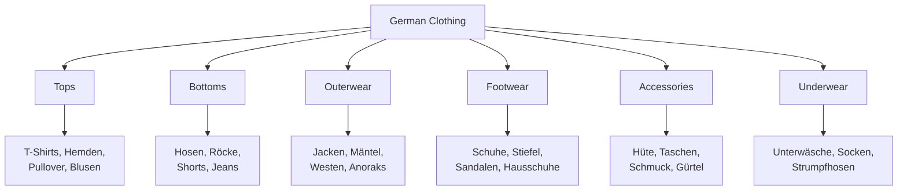
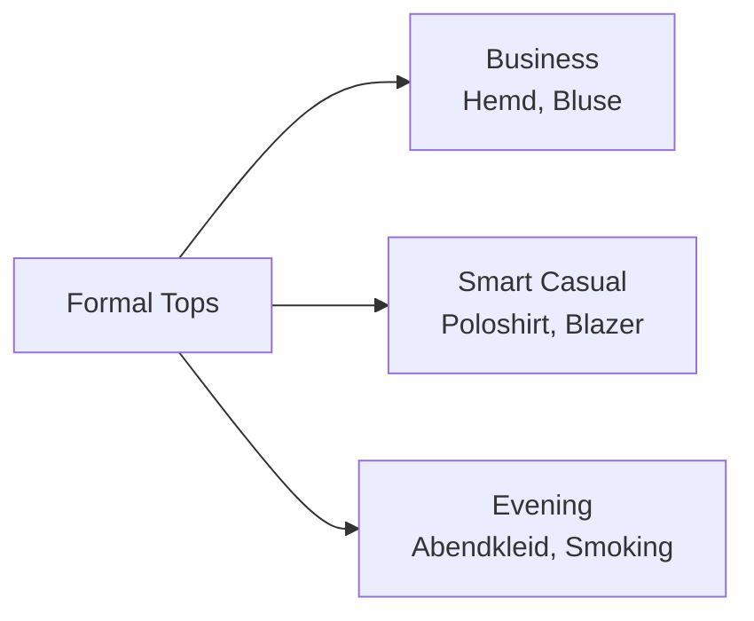
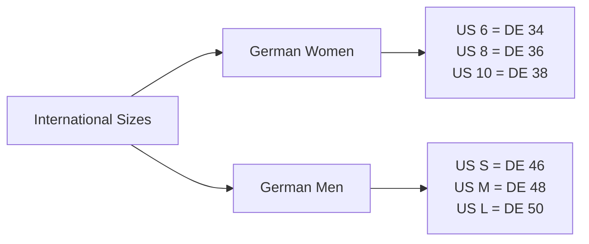
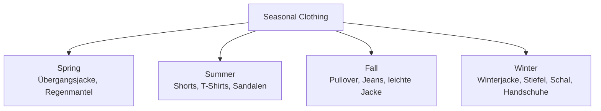
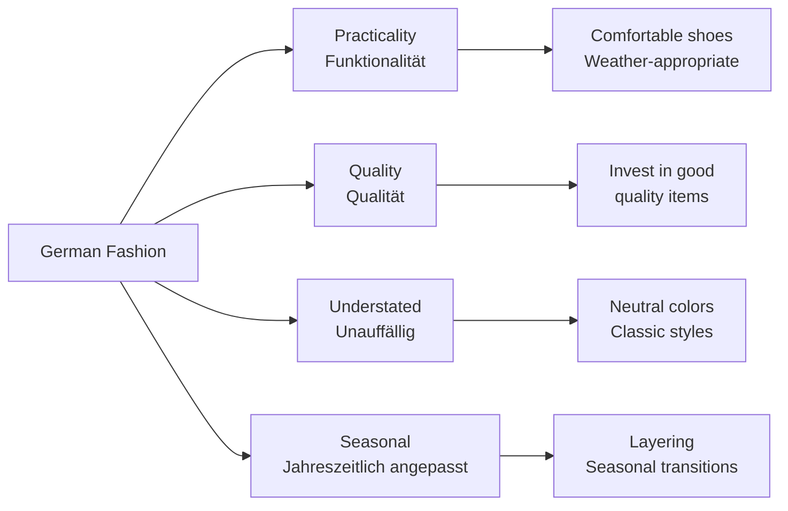

# Clothing (Kleidung) - German Clothing Vocabulary for English Speakers

## Introduction
Clothing vocabulary is essential for shopping, describing people, and discussing weather-appropriate attire in German. This chapter covers clothing items, accessories, materials, sizes, and shopping phrases.

## Basic Clothing Categories

### Main Clothing Types

| Clothing | German | Pronunciation | Category |
|----------|--------|---------------|----------|
| 👕 | das T-Shirt | [ˈtiːʃœʁt] | Top |
| 👔 | das Hemd | [hɛmt] | Shirt |
| 👖 | die Hose | [ˈhoːzə] | Bottom |
| 👗 | das Kleid | [klaɪt] | Dress |
| 🧥 | die Jacke | [ˈjakə] | Outerwear |
| 👟 | die Schuhe | [ˈʃuːə] | Footwear |

## Clothing Classification

## Tops (Oberteile)

### Shirts and Blouses

| Clothing | German | Pronunciation | Type |
|----------|--------|---------------|------|
| 👕 T-shirt | das T-Shirt | [ˈtiːʃœʁt] | Casual |
| 👔 Shirt | das Hemd | [hɛmt] | Formal |
| 👚 Blouse | die Bluse | [ˈbluːzə] | Women's top |
| 🧥 Sweater | der Pullover | [pʊˈloːvɐ] | Knitted top |
| 🥼 Sweatshirt | das Sweatshirt | [ˈsvɛtʃœʁt] | Casual |
| 🔵 Polo shirt | das Poloshirt | [ˈpoːloʃœʁt] | Casual/sport |

### Formal Tops

## Bottoms (Hosen und Röcke)

### Pants and Skirts

| Clothing | German | Pronunciation | Description |
|----------|--------|---------------|-------------|
| 👖 Pants | die Hose | [ˈhoːzə] | General term |
| 👖 Jeans | die Jeans | [dʒiːns] | Denim pants |
| 🩳 Shorts | die Shorts | [ʃɔʁts] | Summer pants |
| 👗 Skirt | der Rock | [ʁɔk] | Women's bottom |
| 💃 Dress | das Kleid | [klaɪt] | One-piece |
| 👖 Leggings | die Leggings | [ˈlɛɡɪŋs] | Tight pants |

## Outerwear (Oberbekleidung)

### Jackets and Coats

| Clothing | German | Pronunciation | Season |
|----------|--------|---------------|--------|
| 🧥 Jacket | die Jacke | [ˈjakə] | All seasons |
| 🧥 Coat | der Mantel | [ˈmantəl] | Winter |
| 🧥 Raincoat | der Regenmantel | [ˈʁeːɡənˌmantəl] | Rainy weather |
| 🧥 Winter jacket | die Winterjacke | [ˈvɪntɐˌjakə] | Cold weather |
| 🧥 Blazer | der Blazer | [ˈbleːzɐ] | Formal |
| 🧥 Vest | die Weste | [ˈvɛstə] | Layering |

## Footwear (Schuhe)

### Shoes and Boots

| Footwear | German | Pronunciation | Occasion |
|----------|--------|---------------|----------|
| 👞 Shoes | die Schuhe | [ˈʃuːə] | General term |
| 👟 Sneakers | die Turnschuhe | [ˈtʊʁnʃuːə] | Sports/casual |
| 👠 High heels | die High Heels | [haɪ̯ hiːls] | Formal |
| 👢 Boots | die Stiefel | [ˈʃtiːfəl] | Winter |
| 🩴 Sandals | die Sandalen | [zanˈdaːlən] | Summer |
| 👞 Loafers | die Loafers | [ˈloːfɐs] | Business casual |

## Accessories (Accessoires)

### Common Accessories

| Accessory | German | Pronunciation | Type |
|-----------|--------|---------------|------|
| 🎒 Bag | die Tasche | [ˈtaʃə] | Handbag, backpack |
| 👒 Hat | der Hut | [huːt] | Headwear |
| 🧣 Scarf | der Schal | [ʃaːl] | Neckwear |
| 🧤 Gloves | die Handschuhe | [ˈhantʃuːə] | Handwear |
| 👓 Glasses | die Brille | [ˈbʁɪlə] | Eyewear |
| 💍 Jewelry | der Schmuck | [ʃmʊk] | Accessories |

### Specific Accessories

| Accessory | German | Pronunciation |
|-----------|--------|---------------|
| Belt | der Gürtel | [ˈɡʏʁtəl] |
| Watch | die Uhr | [uːɐ] |
| Ring | der Ring | [ʁɪŋ] |
| Necklace | die Halskette | [ˈhalsˌkɛtə] |
| Earrings | die Ohrringe | [ˈoːɐˌʁɪŋə] |
| Handbag | die Handtasche | [ˈhantˌtaʃə] |
| Backpack | der Rucksack | [ˈʁʊkzak] |

## Underwear and Sleepwear (Unterwäsche und Nachtwäsche)

### Basic Underwear

| Clothing | German | Pronunciation | Type |
|----------|--------|---------------|------|
| 👙 Underwear | die Unterwäsche | [ˈʊntɐˌvɛʃə] | General term |
| 🩲 Underpants | die Unterhose | [ˈʊntɐˌhoːzə] | Men's/women's |
| 👚 Bra | der BH | [beːˈhaː] | Women's |
| 🧦 Socks | die Socken | [ˈzɔkən] | Footwear |
| 🛌 Pajamas | der Schlafanzug | [ˈʃlaːfˌant͡suːk] | Sleepwear |

## Materials and Fabrics (Materialien und Stoffe)

### Common Materials

| Material | German | Pronunciation | Characteristics |
|----------|--------|---------------|----------------|
| 🧵 Cotton | die Baumwolle | [ˈbaʊ̯mˌvɔlə] | Soft, breathable |
| 🧶 Wool | die Wolle | [ˈvɔlə] | Warm, winter |
| 🧵 Silk | die Seide | [ˈzaɪ̯də] | Luxurious, smooth |
| 🧵 Leather | das Leder | [ˈleːdɐ] | Durable, formal |
| 🧵 Denim | der Denim | [ˈdɛnɪm] | Casual, durable |
| 🧵 Polyester | das Polyester | [poliˈɛstɐ] | Synthetic, easy care |

## Colors and Patterns (Farben und Muster)

### Common Patterns

| Pattern | German | Pronunciation | Description |
|---------|--------|---------------|-------------|
| 🟦 Solid | uni | [ˈuːni] | One color |
| 📏 Striped | gestreift | [ɡəˈʃtʁaɪ̯pt] | With lines |
| 🔴 Dotted | gepunktet | [ɡəˈpʊŋktət] | With dots |
| 🎨 Checked | kariert | [kaˈʁiːɐt] | Check pattern |
| 🎯 Floral | geblümt | [ɡəˈblyːmt] | Flower pattern |

## Sizes and Measurements (Größen und Maße)

### Clothing Sizes

| Size Type | German | Examples |
|-----------|--------|----------|
| General | die Größe | S, M, L, XL |
| Numerical | die Konfektionsgröße | 36, 38, 40, 42 |
| Shoes | die Schuhgröße | 38, 40, 42, 44 |

### Size Conversion Chart

## Seasonal Clothing (Jahreszeitliche Kleidung)

### Clothing by Season

### Seasonal Recommendations

| Season | German | Essential Items |
|--------|--------|----------------|
| 🌸 Spring | der Frühling | Übergangsjacke, leichte Hose |
| ☀️ Summer | der Sommer | Shorts, T-Shirts, Sandalen |
| 🍂 Fall | der Herbst | Pullover, Jeans, leichte Jacke |
| ❄️ Winter | der Winter | Winterjacke, Stiefel, Schal |

## Shopping for Clothes (Kleidung einkaufen)

### Store Types

| Store | German | Pronunciation | Sells |
|-------|--------|---------------|-------|
| 👕 Clothing store | das Bekleidungsgeschäft | [bəˈklaɪ̯dʊŋsɡəˌʃɛft] | General clothing |
| 👠 Shoe store | das Schuhgeschäft | [ˈʃuːɡəˌʃɛft] | Shoes |
| 🛍️ Department store | das Kaufhaus | [ˈkaʊ̯fhaʊ̯s] | Everything |
| 👗 Boutique | die Boutique | [buˈtiːk] | Fashionable items |

### Shopping Phrases

| English | German | Pronunciation |
|---------|--------|---------------|
| Where is the fitting room? | Wo ist die Umkleidekabine? | [voː ɪst diː ˈʊmklaɪ̯dəkaˌbiːnə] |
| Can I try this on? | Kann ich das anprobieren? | [kan ɪç das ˈanpʁoˌbiːʁən] |
| Do you have this in size...? | Haben Sie das in Größe...? | [ˈhaːbən ziː das ɪn ˈɡʁøːsə] |
| How much does it cost? | Wie viel kostet das? | [viː fiːl ˈkɔstət das] |

### Common Questions and Answers

| Question | German | Response |
|----------|--------|----------|
| What size are you? | Welche Größe haben Sie? | Ich habe Größe M/38. |
| What color would you like? | Welche Farbe möchten Sie? | Ich hätte gern schwarz. |
| Do you need help? | Kann ich Ihnen helfen? | Ja, ich suche eine Jacke. |

## German Fashion Culture

### Style and Etiquette

### Key Cultural Points

1. **Practicality**: Germans value functional clothing over flashy fashion
2. **Quality**: Investing in good quality items that last is common
3. **Seasonal Appropriateness**: Dressing appropriately for the weather is important
4. **Business Attire**: Formal and conservative in professional settings
5. **Casual Wear**: Comfortable and practical for everyday

## Traditional Clothing (Trachten)

### Regional Traditional Wear

| Clothing | German | Pronunciation | Region |
|----------|--------|---------------|--------|
| 👗 Dirndl | das Dirndl | [ˈdɪʁndl] | Bavaria, Austria |
| 👖 Lederhosen | die Lederhosen | [ˈleːdɐˌhoːzən] | Bavaria, Austria |
| 🎩 Trachten hat | der Trachtenhut | [ˈtʁaxtənˌhuːt] | Southern Germany |

### When Traditional Clothing is Worn

- **Oktoberfest**: Dirndl and Lederhosen are commonly worn
- **Weddings**: Traditional attire for special occasions
- **Volksfeste**: Local festivals and celebrations
- **Church Events**: Particularly in rural areas

## Care Instructions (Pflegehinweise)

### Washing Symbols and Terms

| Instruction | German | Pronunciation | Meaning |
|-------------|--------|---------------|---------|
| 🚿 Machine wash | maschinenwaschbar | [maˈʃiːnənˌvaʃbaːɐ] | Can be machine washed |
| 🚫 Do not bleach | nicht bleichen | [nɪçt ˈblaɪ̯çən] | No bleach |
- 🔥 Iron | bügeln | [ˈbyːɡəln] | Can be ironed |
- 🌀 Dry clean | chemisch reinigen | [ˈçeːmɪʃ ˈʁaɪ̯nɪɡən] | Dry clean only |

## Practice Exercises

### Exercise 1: Clothing Vocabulary
Translate to German:
1. "I need a new winter coat"
2. "These shoes are too small"
3. "Where can I find jeans?"
4. "I'm looking for a red dress"

### Exercise 2: Shopping Dialogue
Complete the dialogue:
- "Kann ich Ihnen helfen?"
- "Ja, ich suche ___ (a blue sweater) in Größe ___ (size M)."
- "Hier ist ein schöner ___ (pullover). Möchten Sie ihn ___ (try on)?"
- "Ja, wo ist die ___ (fitting room)?"

### Exercise 3: Seasonal Clothing
What would you wear in these situations?
1. A business meeting in winter
2. Hiking in the mountains in summer
3. A summer wedding
4. Skiing in the Alps

### Exercise 4: Size and Fit
Describe these clothing problems in German:
1. "The pants are too long"
2. "This shirt is too tight"
3. "The shoes are too big"
4. "The dress fits perfectly"

### Exercise 5: Cultural Understanding
Answer these questions:
1. Why do Germans value practical clothing?
2. When might you see people wearing Dirndl or Lederhosen?
3. What is typical German business attire?
4. How do Germans typically approach seasonal clothing changes?

---

## Summary

Key points about German clothing and fashion culture:
- Practicality and functionality are highly valued
- Quality over quantity - Germans often invest in durable items
- Seasonal appropriateness is important
- Business attire tends to be conservative and formal
- Traditional clothing (Trachten) is worn for special occasions
- Understated, classic styles are preferred over flashy fashion

With this vocabulary and cultural knowledge, you'll be well-prepared for shopping and discussing clothing in German-speaking countries!