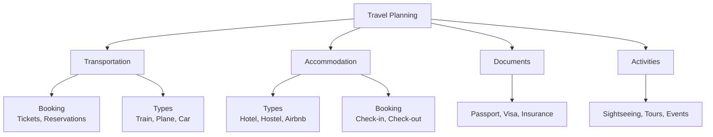
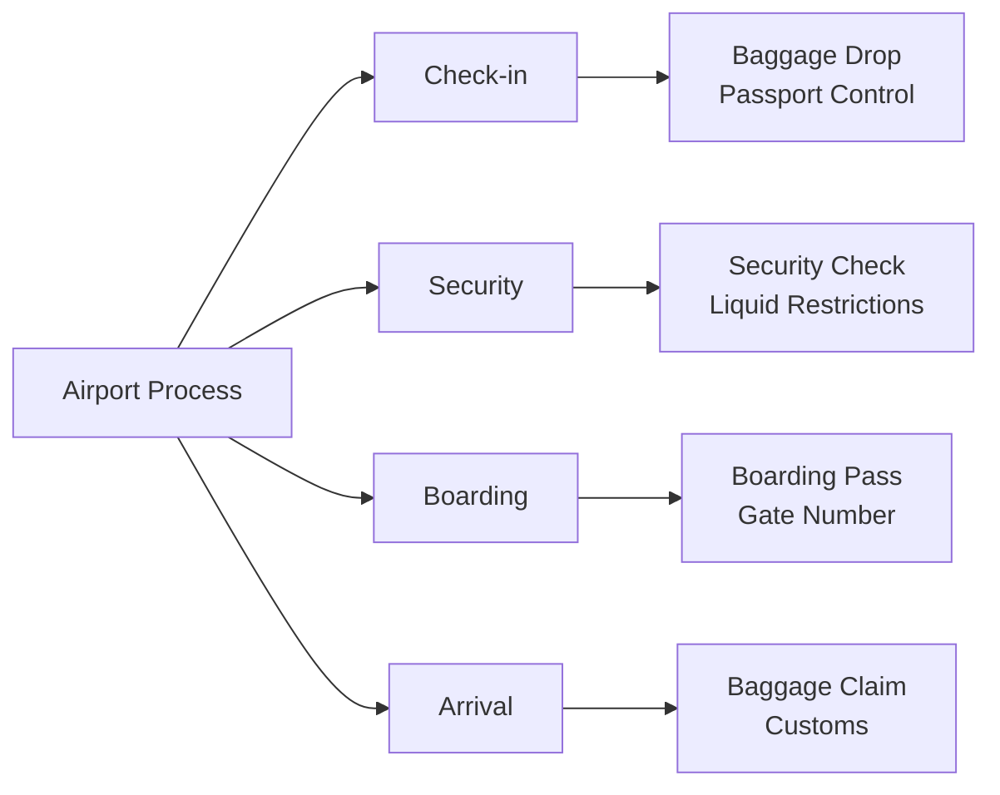
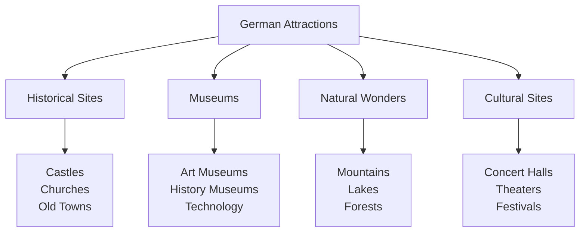

# Travel (Reisen) - German Travel Vocabulary for English Speakers

## Introduction
Travel vocabulary is essential for navigating German-speaking countries. This chapter covers transportation, accommodations, sightseeing, and useful phrases for travelers.

## Transportation (Transportmittel)

### Main Transportation Methods

| Transportation | German | Pronunciation | Example |
|----------------|--------|---------------|---------|
| 🚗 | das Auto | [ˈaʊto] | Wir fahren mit dem Auto. (We're going by car.) |
| 🚆 | der Zug | [tsuːk] | Der Zug fährt um 10 Uhr. (The train leaves at 10 o'clock.) |
| ✈️ | das Flugzeug | [ˈfluːktsɔɪk] | Das Flugzeug landet in Berlin. (The plane lands in Berlin.) |
| 🚌 | der Bus | [bʊs] | Der Bus kommt gleich. (The bus is coming soon.) |
| 🚇 | die U-Bahn | [ˈuːbaːn] | Die U-Bahn ist schnell. (The subway is fast.) |
| 🚋 | die Straßenbahn | [ˈʃtraːsənbaːn] | Die Straßenbahn fährt ins Zentrum. (The tram goes to the center.) |
| 🚕 | das Taxi | [ˈtaksi] | Ich nehme ein Taxi. (I'll take a taxi.) |
| 🚲 | das Fahrrad | [ˈfaːɐʁaːt] | Wir mieten Fahrräder. (We're renting bicycles.) |

## Travel Planning



### Booking Transportation

| English | German | Pronunciation |
|---------|--------|---------------|
| One-way ticket | die einfache Fahrkarte | [ˈaɪnfaxə ˈfaːɐkaʁtə] |
| Round-trip ticket | die Hin- und Rückfahrkarte | [hɪn ʊnt ˈʁʏkfaːɐkaʁtə] |
| First class | erste Klasse | [ˈeːɐstə ˈklasə] |
| Second class | zweite Klasse | [ˈtsvaɪtə ˈklasə] |
| Window seat | der Fensterplatz | [ˈfɛnstɐplats] |
| Aisle seat | der Gangplatz | [ˈɡaŋplats] |
| Departure | die Abfahrt | [ˈapfaːɐt] |
| Arrival | die Ankunft | [ˈankʊnft] |

## Airport (Flughafen)

### Airport Procedures



### Airport Vocabulary

| English | German | Pronunciation |
|---------|--------|---------------|
| Airport | der Flughafen | [ˈfluːkhaːfən] |
| Terminal | das Terminal | [ˈtɛʁminal] |
| Check-in | der Check-in | [ˈtʃɛkʔɪn] |
| Boarding pass | der Boardingpass | [ˈbɔːdɪŋpas] |
| Gate | das Gate | [ɡeːt] |
| Security check | die Sicherheitskontrolle | [ˈzɪçɐhaɪtskɔnˌtʁɔlə] |
| Luggage | das Gepäck | [ɡəˈpɛk] |
| Suitcase | der Koffer | [ˈkɔfɐ] |
| Carry-on | das Handgepäck | [ˈhantɡəˌpɛk] |
| Customs | der Zoll | [tsɔl] |

## Accommodation (Unterkunft)

### Types of Accommodation

| Accommodation | German | Pronunciation | Description |
|---------------|--------|---------------|-------------|
| 🏨 | das Hotel | [hoˈtɛl] | Standard hotel accommodation |
| 🛌 | die Pension | [pɑ̃ˈsi̯oːn] | Small guesthouse, often family-run |
| 🏠 | die Ferienwohnung | [ˈfeːʁiənˌvoːnʊŋ] | Vacation apartment |
| 🏡 | das Gasthaus | [ˈɡasthaʊs] | Traditional inn, often with restaurant |
| 🎪 | die Jugendherberge | [ˈjuːɡn̩tˌhɛʁbɛʁɡə] | Youth hostel |
| 🌲 | der Campingplatz | [ˈkɛmpɪŋplats] | Campground |

### Hotel Procedures

| English | German | Pronunciation |
|---------|--------|---------------|
| Reservation | die Reservierung | [ʁezɛʁˈviːʁʊŋ] |
| Check-in | der Eincheck | [ˈaɪntʃɛk] |
| Check-out | der Auscheck | [ˈaʊstʃɛk] |
| Room key | der Zimmerschlüssel | [ˈtsɪmɐˌʃlʏsəl] |
| Single room | das Einzelzimmer | [ˈaɪntsəlˌtsɪmɐ] |
| Double room | das Doppelzimmer | [ˈdɔpəlˌtsɪmɐ] |
| Breakfast included | Frühstück inklusive | [ˈfʁyːʃtʏk ɪnkluˈziːvə] |
| Reception | die Rezeption | [ʁet͡sɛpˈt͡si̯oːn] |

## Directions and Navigation

### Asking for Directions

| English | German | Pronunciation |
|---------|--------|---------------|
| Where is...? | Wo ist...? | [voː ɪst] |
| How do I get to...? | Wie komme ich zu...? | [viː ˈkɔmə ɪç tsuː] |
| Is it far? | Ist es weit? | [ɪst ɛs vaɪt] |
| Can you show me on the map? | Können Sie es mir auf der Karte zeigen? | [ˈkœnən ziː ɛs miːɐ aʊf deːɐ ˈkaʁtə ˈtsaɪɡən] |
| I'm lost | Ich habe mich verlaufen | [ɪç ˈhaːbə mɪç fɛɐˈlaʊfən] |

### Directions Vocabulary

| English | German | Pronunciation |
|---------|--------|---------------|
| Left | links | [lɪŋks] |
| Right | rechts | [ʁɛçts] |
| Straight ahead | geradeaus | [ɡəˈʁaːdəʔaʊs] |
| North | Norden | [ˈnɔʁdən] |
| South | Süden | [ˈzyːdən] |
| East | Osten | [ˈɔstən] |
| West | Westen | [ˈvɛstən] |
| Map | die Karte | [ˈkaʁtə] |
| GPS | das Navi | [ˈnaːvi] |

## Sightseeing (Sehenswürdigkeiten)

### Popular Attractions



### Common Attractions

| Attraction | German | Pronunciation | Example Locations |
|------------|--------|---------------|-------------------|
| Castle | das Schloss | [ʃlɔs] | Neuschwanstein, Heidelberg |
| Cathedral | der Dom | [doːm] | Cologne, Berlin |
| Museum | das Museum | [muˈzeːʊm] | Munich, Frankfurt |
| Old town | die Altstadt | [ˈaltʃtat] | Rothenburg, Nuremberg |
| Park | der Park | [paʁk] | Englischer Garten, Munich |
| Mountain | der Berg | [bɛʁk] | Zugspitze, Alps |
| Lake | der See | [zeː] | Bodensee, Chiemsee |
| River | der Fluss | [flʊs] | Rhine, Danube |

### Ticket Information

| English | German | Pronunciation |
|---------|--------|---------------|
| Admission ticket | die Eintrittskarte | [ˈaɪntʁɪtskaʁtə] |
| Reduced price | der ermäßigte Preis | [ɛɐˈmɛːsɪçtə pʁaɪs] |
| Student discount | der Studentenrabatt | [ʃtuˈdɛntənʁaˌbat] |
| Guided tour | die Führung | [ˈfyːʁʊŋ] |
| Opening hours | die Öffnungszeiten | [ˈœfnʊŋsˌtsaɪtən] |
| Closed on Mondays | montags geschlossen | [ˈmoːntaks ɡəˈʃlɔsən] |

## Shopping and Souvenirs

### Shopping Vocabulary

| English | German | Pronunciation |
|---------|--------|---------------|
| Souvenir | das Souvenir | [zuvəˈniːɐ] |
| Gift shop | der Geschenkladen | [ɡəˈʃɛŋklaːdən] |
| How much does it cost? | Wie viel kostet das? | [viː fiːl ˈkɔstət das] |
| I'm just looking | Ich schaue mich nur um | [ɪç ˈʃaʊə mɪç nuːɐ ʊm] |
| Do you accept credit cards? | Akzeptieren Sie Kreditkarten? | [akt͡sɛpˈtiːʁən ziː kʁeˈdɪtkaʁtən] |
| Receipt | die Quittung | [ˈkvɪtʊŋ] |

### Typical German Souvenirs

| Souvenir | German | Description |
|----------|--------|-------------|
| Cuckoo clock | die Kuckucksuhr | [ˈkʊkʊksʔuːɐ] | Traditional Black Forest clock |
| Beer stein | der Bierkrug | [ˈbiːɐkʁuːk] | Traditional beer mug |
| Christmas ornament | der Christbaumschmuck | [ˈkʁɪstbaʊmʃmʊk] | German glass ornaments |
| Chocolate | die Schokolade | [ʃokoˈlaːdə] | German brand chocolates |
| Dirndl/Lederhosen | das Dirndl/die Lederhose | [ˈdɪʁndl]/[ˈleːdɐhoːzə] | Traditional clothing |

## Eating Out (Restaurant)

### Restaurant Types

| Restaurant | German | Pronunciation | Description |
|------------|--------|---------------|-------------|
| 🍺 | das Restaurant | [ʁɛstoˈʁɑ̃ː] | Formal restaurant |
| 🍻 | das Gasthaus | [ˈɡasthaʊs] | Traditional inn with food |
| ☕ | das Café | [kaˈfeː] | Coffee house |
| 🥨 | die Bäckerei | [bɛkəˈʁaɪ] | Bakery with snacks |
| 🌭 | der Imbiss | [ˈɪmbɪs] | Fast food stand |

### Ordering Food

| English | German | Pronunciation |
|---------|--------|---------------|
| Menu | die Speisekarte | [ˈʃpaɪzəkaʁtə] |
| I would like... | Ich hätte gern... | [ɪç ˈhɛtə ɡɛʁn] |
| The bill, please | Die Rechnung, bitte | [diː ˈʁɛçnʊŋ ˈbɪtə] |
| Is service included? | Ist die Bedienung inklusive? | [ɪst diː bəˈdiːnʊŋ ɪnkluˈziːvə] |
| Vegetarian | vegetarisch | [veɡeˈtaːʁɪʃ] |
| Vegan | vegan | [veˈɡaːn] |

## Emergency Situations

### Important Phrases

| English | German | Pronunciation |
|---------|--------|---------------|
| Help! | Hilfe! | [ˈhɪlfə] |
| I need a doctor | Ich brauche einen Arzt | [ɪç ˈbʁaʊxə ˈaɪnən aʁt͡st] |
| Call the police! | Rufen Sie die Polizei! | [ˈʁuːfən ziː diː poliˈt͡saɪ] |
| Where is the hospital? | Wo ist das Krankenhaus? | [voː ɪst das ˈkʁaŋkənhaʊs] |
| I lost my passport | Ich habe meinen Pass verloren | [ɪç ˈhaːbə ˈmaɪnən pas fɛɐˈloːʁən] |

### Emergency Numbers

| Service | Number | German Name |
|---------|--------|-------------|
| Police | 110 | Polizei |
| Fire/Ambulance | 112 | Feuerwehr/Rettungsdienst |
| Emergency doctor | 116 117 | Ärztlicher Bereitschaftsdienst |

## Cultural Tips for Travelers

### German Travel Etiquette

```mermaid
graph LR
    A[German Etiquette] --> B[Punctuality]
    A --> C[Formality]
    A --> D[Cash Culture]
    A --> E[Recycling]
    
    B --> B1[Be on time<br/>for appointments]
    C --> C1[Use formal "Sie"<br/>until invited otherwise]
    D --> D1[Carry cash<br/>many places don't accept cards]
    E --> E1[Separate trash<br/>follow recycling rules]
```

### Important Cultural Notes

1. **Punctuality**: Being on time is very important in Germany
2. **Formal Address**: Use "Sie" for strangers until invited to use "du"
3. **Cash Payments**: Many smaller establishments only accept cash
4. **Sunday Quiet**: Sundays are quiet days with limited shopping
5. **Recycling**: Germans take recycling very seriously

## Practice Exercises

### Exercise 1: Transportation Vocabulary
Translate to German:
1. "I need a train ticket to Berlin"
2. "Where is the nearest subway station?"
3. "What time does the bus arrive?"
4. "I would like to rent a car"

### Exercise 2: Hotel Situations
What would you say in these situations?
1. Checking into a hotel
2. Asking for the Wi-Fi password
3. Reporting a problem with your room
4. Checking out and asking for your bill

### Exercise 3: Directions Practice
Give directions in German:
1. From the train station to the city center
2. To the nearest pharmacy
3. To your hotel from a landmark
4. To the airport using public transportation

### Exercise 4: Cultural Understanding
Answer these cultural questions:
1. Why is it important to be punctual in Germany?
2. When should you use "Sie" versus "du"?
3. What should you know about shopping on Sundays?
4. Why is carrying cash important in Germany?

---

## Summary

Key points for traveling in German-speaking countries:
- Public transportation is efficient and widely used
- Punctuality is highly valued
- Formal address ("Sie") is used with strangers
- Cash is still king in many places
- Recycling rules are strictly followed
- Sundays are quiet with most shops closed

With these vocabulary words and cultural tips, you'll be well-prepared for your travels in Germany, Austria, and Switzerland!