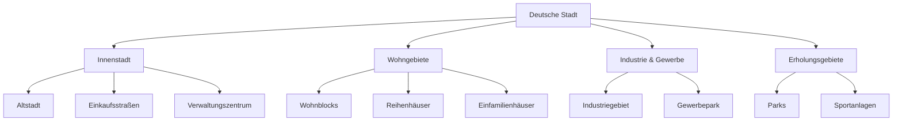
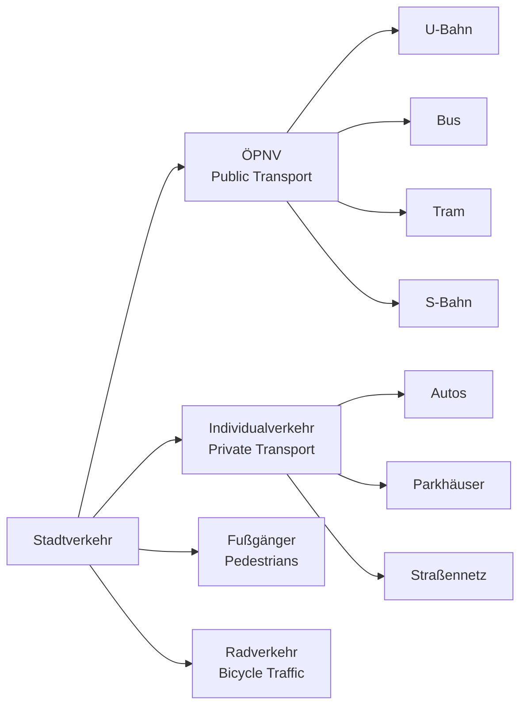

# Cities and Places - Comprehensive Guide

## Urban Geography and Infrastructure

### City Structure Components

| German | Pronunciation | English | Example Sentence |
|--------|---------------|---------|------------------|
| die Metropole | [metʁoˈpoːlə] | metropolis | Berlin ist eine internationale Metropole. |
| die Großstadt | [ˈɡʁoːsˌʃtat] | large city | Hamburg ist eine wichtige Großstadt. |
| die Kleinstadt | [ˈklaɪnˌʃtat] | small town | Wir wohnen in einer ruhigen Kleinstadt. |
| das Dorf | [dɔʁf] | village | Das Dorf hat nur 500 Einwohner. |
| der Stadtteil | [ˈʃtatˌtaɪ̯l] | district | Dieser Stadtteil ist sehr multikulturell. |

### Urban Infrastructure

| German | Pronunciation | English | Example Sentence |
|--------|---------------|---------|------------------|
| die Infrastruktur | [ˈɪnfʁaʃtʁʊkˌtuːɐ̯] | infrastructure | Die Infrastruktur ist gut ausgebaut. |
| das Verkehrsnetz | [fɛɐ̯ˈkeːɐ̯sˌnɛt͡s] | transport network | Das Verkehrsnetz ist sehr dicht. |
| die Versorgung | [fɛɐ̯ˈzɔʁɡʊŋ] | utilities/supply | Die Versorgung mit Wasser ist sicher. |
| die Grünanlage | [ˈɡʁyːnˌʔanlaːɡə] | green space | Die Grünanlage ist ein beliebter Treffpunkt. |
| das Gewerbegebiet | [ɡəˈvɛʁbəɡəˌbiːt] | commercial area | Das Gewerbegebiet liegt am Stadtrand. |

## German City Structure



## Types of Settlements

### Urban Hierarchy
- **Hauptstadt** - capital city
- **Landeshauptstadt** - state capital
- **Kreisstadt** - county seat
- **Gemeinde** - municipality

### Settlement Patterns
- **Ballungsraum** - metropolitan area
- **Vorort** - suburb
- **Speckgürtel** (literally "bacon belt") - affluent suburbs
- **ländlicher Raum** - rural area

## Public Buildings and Institutions

### Government and Administration
- **das Rathaus** - town hall
- **die Stadtverwaltung** - city administration
- **das Bürgeramt** - citizens' office
- **die Polizeiwache** - police station

### Cultural and Educational
- **die Bibliothek** - library
- **das Museum** - museum
- **die Universität** - university
- **die Volkshochschule** - adult education center

### Commercial Establishments
- **das Einkaufszentrum** - shopping center
- **der Supermarkt** - supermarket
- **das Kaufhaus** - department store
- **der Wochenmarkt** - weekly market

## Transportation Infrastructure

### Transport Network Elements



## Residential Areas

### Housing Types
- **das Mehrfamilienhaus** - apartment building
- **das Einfamilienhaus** - single-family house
- **das Reihenhaus** - townhouse
- **die Wohnung** - apartment
- **das Studentenwohnheim** - student dormitory

### Neighborhood Features
- **der Spielplatz** - playground
- **der Kindergarten** - kindergarten
- **die Schule** - school
- **der Sportplatz** - sports field
- **der Friedhof** - cemetery

## Historical and Cultural Sites

### Architectural Heritage
- **das Denkmal** - monument
- **die historische Altstadt** - historic old town
- **die Burg** - castle
- **das Schloss** - palace
- **die Kirche** - church
- **das Fachwerkhaus** - half-timbered house

### Modern Landmarks
- **der Wolkenkratzer** - skyscraper
- **das Kulturzentrum** - cultural center
- **die Konzerthalle** - concert hall
- **das Stadion** - stadium

## City Planning Concepts

### Urban Development Terms
- **die Stadtplanung** - urban planning
- **der Flächennutzungsplan** - land use plan
- **die Nachverdichtung** - urban densification
- **die Gentrifizierung** - gentrification
- **der soziale Wohnungsbau** - social housing

### Environmental Aspects
- **die Luftqualität** - air quality
- **der Lärmpegel** - noise level
- **die Begrünung** - greening
- **nachhaltige Stadtentwicklung** - sustainable urban development

## Practical Location Vocabulary

### Asking for Directions
```
"Entschuldigung, wie komme ich zum Hauptbahnhof?"
"Können Sie mir sagen, wo die nächste U-Bahn-Station ist?"
"Ist es weit bis zum Stadtzentrum?"
```

### Describing Locations
```
"Das Restaurant liegt in der Altstadt."
"Der Park befindet sich hinter dem Museum."
"Das Geschäft ist gegenüber der Bank."
```

## Regional Differences in German Cities

### Northern Germany
- **Hafenstädte** (harbor cities): Hamburg, Bremen
- **Backsteingotik** (brick gothic architecture)
- **Wasserwege** (canals and waterways)

### Southern Germany
- **Barockstädte** (baroque cities): München, Würzburg
- **Biergärten** (beer gardens)
- **Alpenvorland** (Alpine foothills)

### Eastern Germany
- **Plattenbauten** (prefabricated buildings)
- **Wiederaufbau** (reconstruction)
- **Moderne Architektur** (modern architecture)

### Western Germany
- **Industriekultur** (industrial heritage)
- **Rheinromantik** (Rhine romanticism)
- **Karnevalshochburgen** (carnival strongholds)

## Grammar for Locations

### Two-Way Prepositions
- "Das Cafe ist **an** der Ecke." (The cafe is on the corner.)
- "Der Park liegt **in** der Stadtmitte." (The park is in the city center.)
- "Das Museum steht **neben** dem Rathaus." (The museum stands next to the town hall.)

### Dative Case for Locations
- "Ich wohne **in einem** Dorf." (I live in a village.)
- "Er arbeitet **in der** Stadt." (He works in the city.)
- "Sie treffen sich **am** Marktplatz." (They meet at the market square.)

### Useful Verbs
- **liegen** - to be located (for places)
- **befinden sich** - to be situated
- **wohnen** - to live/reside
- **besuchen** - to visit
- **erkunden** - to explore