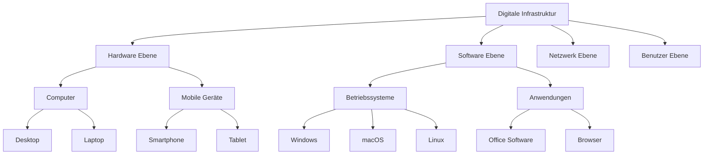
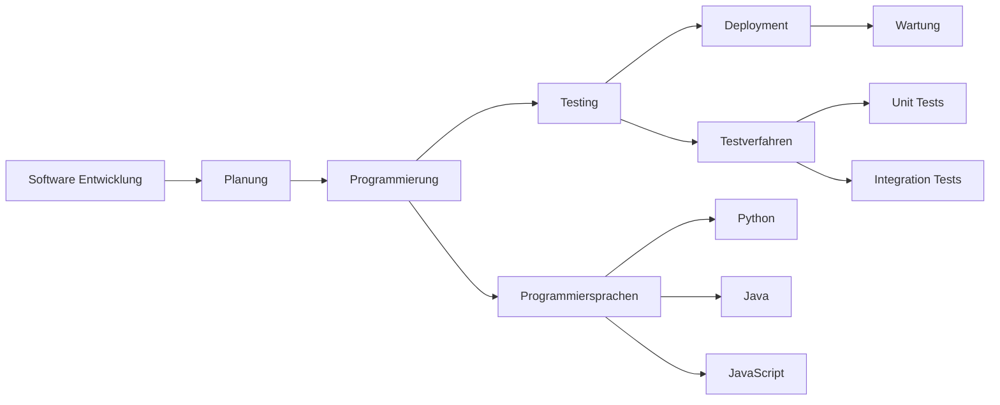

# Technology and Digital World - Comprehensive Guide

## Core Technology Concepts

### Fundamental Terms

| German | Pronunciation | English | Example Sentence |
|--------|---------------|---------|------------------|
| die Digitalisierung | [diɡitaliˈziːʁʊŋ] | digitalization | Die Digitalisierung verändert die Arbeitswelt. |
| die Informationstechnik | [ɪnfɔʁmaˈt͡si̯oːnsˌtɛçnɪk] | information technology | IT-Experten arbeiten in der Informationstechnik. |
| die künstliche Intelligenz | [ˈkʏnstlɪçə ɪntɛliˈɡɛnt͡s] | artificial intelligence | KI wird in vielen Bereichen eingesetzt. |
| das Internet der Dinge | [ˈɪntɐnɛt deːɐ̯ ˈdɪŋə] | internet of things | Das Internet der Dinge verbindet Geräte. |
| die Cybersicherheit | [ˈsaɪbɐˌzɪçɐhaɪ̯t] | cybersecurity | Cybersicherheit ist sehr wichtig. |

### Hardware Components

| German | Pronunciation | English | Example Sentence |
|--------|---------------|---------|------------------|
| die Hardware | [ˈhaːɐ̯dvɛːɐ̯] | hardware | Die Hardware muss leistungsstark sein. |
| der Prozessor | [pʁoˈt͡sɛsoːɐ̯] | processor | Der Prozessor ist sehr schnell. |
| der Arbeitsspeicher | [ˈaʁbaɪ̯tsˌʃpaɪ̯çɐ] | RAM | Mehr Arbeitsspeicher macht den Computer schneller. |
| die Festplatte | [ˈfɛstˌplatə] | hard drive | Die Festplatte hat 1 Terabyte Speicher. |
| die Grafikkarte | [ˈɡʁaːfɪkˌkaʁtə] | graphics card | Die Grafikkarte ist für Spiele wichtig. |

## Digital Ecosystem Architecture



## Software and Applications

### Operating Systems
- **das Betriebssystem** - operating system
- **die Benutzeroberfläche** - user interface
- **das Dateisystem** - file system
- **der Treiber** - driver

### Application Types
- **die Bürosoftware** - office software
- **die Bildbearbeitung** - image editing
- **die Videokonferenz-Software** - video conferencing software
- **die Antivirensoftware** - antivirus software

## Internet and Networking

### Network Components
- **das Netzwerk** - network
- **der Router** - router
- **das WLAN** - WiFi
- **die Bandbreite** - bandwidth
- **die Latenz** - latency

### Internet Services
- **der Cloud-Speicher** - cloud storage
- **das Streaming** - streaming
- **der E-Mail-Dienst** - email service
- **soziale Medien** - social media

## Programming and Development

### Development Concepts



### Programming Terms
- **der Algorithmus** - algorithm
- **die Variable** - variable
- **die Funktion** - function
- **die Schleife** - loop
- **die Bedingung** - condition

## Emerging Technologies

### Modern Tech Trends
- **das Machine Learning** - machine learning
- **die Blockchain** - blockchain
- **Virtual Reality (VR)** - virtual reality
- **Augmented Reality (AR)** - augmented reality
- **5G-Technologie** - 5G technology

### Sustainable Technology
- **grüne IT** - green IT
- **Energieeffizienz** - energy efficiency
- **nachhaltige Technologie** - sustainable technology
- **E-Waste-Management** - electronic waste management

## Digital Communication

### Communication Platforms
- **die Messaging-App** - messaging app
- **das Forum** - forum
- **der Blog** - blog
- **der Podcast** - podcast
- **der Videochat** - video chat

### Online Security
- **das Passwort** - password
- **die Zwei-Faktor-Authentifizierung** - two-factor authentication
- **die Verschlüsselung** - encryption
- **der Datenschutz** - data protection

## Practical Tech Situations

### Technical Support Dialogue
```
Benutzer: "Mein Computer startet nicht mehr."
Support: "Haben Sie schon versucht, ihn neu zu starten?"
Benutzer: "Ja, aber es funktioniert immer noch nicht."
Support: "Dann kommen wir morgen vorbei."
```

### Shopping for Electronics
```
Kunde: "Ich suche einen neuen Laptop."
Verkäufer: "Für welche Zwecke brauchen Sie ihn?"
Kunde: "Hauptsächlich für Office-Arbeiten und Videos."
Verkäufer: "Dann empfehle ich dieses Modell mit 16 GB RAM."
```

## German Tech Industry

### Major Tech Hubs
- **Berlin** - startups and digital innovation
- **München** - automotive and industrial tech
- **Hamburg** - media and e-commerce
- **Stuttgart** - engineering and manufacturing
- **Dresden** - semiconductor industry

### German Tech Companies
- **SAP** - enterprise software
- **Siemens** - industrial technology
- **Bosch** - IoT and automotive
- **Zalando** - e-commerce
- **Delivery Hero** - food delivery

## Grammar for Technology

### Gender of Tech Terms
- **der** Computer, **der** Laptop (masculine)
- **die** Software, **die** App (feminine)
- **das** Internet, **das** System (neuter)

### Compound Nouns in Tech
- **der Computer + das Spiel** = **das Computerspiel**
- **die Hand + das Gerät** = **das Handgerät**
- **das Netz + das Werk** = **das Netzwerk**

### Useful Verbs
- **herunterladen** - to download
- **hochladen** - to upload
- **installieren** - to install
- **aktualisieren** - to update
- **speichern** - to save
- **löschen** - to delete

### Passive Voice for Processes
- "Das Programm **wird installiert**." (The program is being installed.)
- "Die Daten **werden gespeichert**." (The data is being saved.)
- "Das Update **wird durchgeführt**." (The update is being performed.)

## Future Technology Trends

### Digital Transformation
- **Industrie 4.0** - fourth industrial revolution
- **Smart Home** - intelligent home automation
- **E-Health** - digital healthcare
- **Mobilität 4.0** - future mobility

### Career Opportunities
- **IT-Spezialist** - IT specialist
- **Softwareentwickler** - software developer
- **Data Scientist** - data scientist
- **Cybersecurity-Experte** - cybersecurity expert