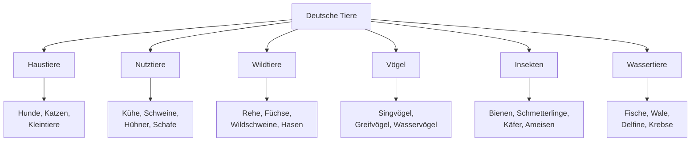
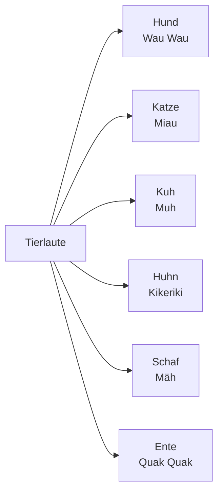
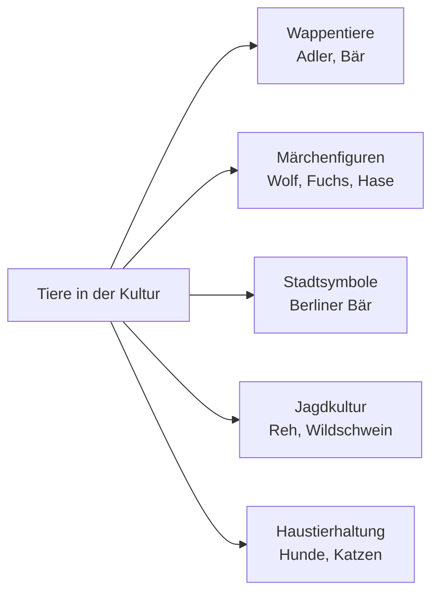
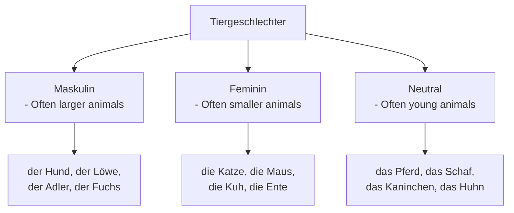

# Animals (Tiere) - German Animal Vocabulary for English Speakers

## Introduction
Animal vocabulary is essential for nature conversations, visiting zoos, talking about pets, and understanding German culture. This chapter covers domestic animals, wildlife, birds, insects, and animal-related expressions.

## Basic Animal Categories

### Main Animal Groups

| Category | German | Pronunciation | Examples |
|----------|--------|---------------|----------|
| 🐶 | die Haustiere | [ˈhaʊ̯sˌtiːʁə] | Pets |
| 🐄 | die Nutztiere | [ˈnʊt͡sˌtiːʁə] | Farm animals |
| 🦁 | die Wildtiere | [ˈvɪltˌtiːʁə] | Wild animals |
| 🐦 | die Vögel | [ˈføːɡəl] | Birds |
| 🐠 | die Fische | [ˈfɪʃə] | Fish |
| 🐛 | die Insekten | [ɪnˈzɛktən] | Insects |

## Animal Classification

## Pets (Haustiere)

### Common Pets

| Animal | German | Pronunciation | Description |
|--------|--------|---------------|-------------|
| 🐶 Dog | der Hund | [hʊnt] | Most popular pet |
| 🐱 Cat | die Katze | [ˈkat͡sə] | Second most popular |
| 🐰 Rabbit | das Kaninchen | [kaˈniːnçən] | Popular small pet |
| 🐹 Hamster | der Hamster | [ˈhamstɐ] | Small rodent |
| 🐦 Bird | der Vogel | [ˈfoːɡəl] | Canary, parrot, etc. |
| 🐠 Fish | der Fisch | [fɪʃ] | Aquarium pets |
| 🐢 Turtle | die Schildkröte | [ˈʃɪltˌkʁøːtə] | Reptile pet |

### Pet Care Vocabulary

| English | German | Pronunciation |
|---------|--------|---------------|
| Pet | das Haustier | [ˈhaʊ̯sˌtiːɐ] |
| Pet food | das Tierfutter | [ˈtiːɐˌfʊtɐ] |
| Leash | die Leine | [ˈlaɪ̯nə] |
| Collar | das Halsband | [ˈhalsˌbant] |
| Litter box | das Katzenklo | [ˈkat͡sənˌkloː] |
| Cage | der Käfig | [ˈkɛːfɪç] |

## Farm Animals (Nutztiere)

### Common Farm Animals

| Animal | German | Pronunciation | Products |
|--------|--------|---------------|----------|
| 🐄 Cow | die Kuh | [kuː] | Milk, beef |
| 🐖 Pig | das Schwein | [ʃvaɪ̯n] | Pork, bacon |
| 🐑 Sheep | das Schaf | [ʃaːf] | Wool, lamb |
| 🐓 Chicken | das Huhn | [huːn] | Eggs, meat |
| 🦆 Duck | die Ente | [ˈɛntə] | Eggs, meat |
| 🦃 Turkey | der Truthahn | [ˈtʁuːtˌhaːn] | Meat |
| 🐐 Goat | die Ziege | [ˈt͡siːɡə] | Milk, cheese |

### Farm Animal Sounds

## Wildlife (Wildtiere)

### Forest Animals

| Animal | German | Pronunciation | Habitat |
|--------|--------|---------------|---------|
| 🦌 Deer | das Reh | [ʁeː] | Forests |
| 🦊 Fox | der Fuchs | [fʊks] | Forests, fields |
| 🐗 Wild boar | das Wildschwein | [ˈvɪltʃvaɪ̯n] | Forests |
| 🐇 Rabbit | der Hase | [ˈhaːzə] | Fields, forests |
| 🦔 Hedgehog | der Igel | [ˈiːɡəl] | Gardens, forests |
| 🦡 Badger | der Dachs | [daks] | Forests |

### Large Mammals

| Animal | German | Pronunciation | Region |
|--------|--------|---------------|--------|
| 🦌 Red deer | der Rothirsch | [ˈʁoːtˌhɪʁʃ] | Forests |
| 🐻 Bear | der Bär | [bɛːɐ] | Alps (rare) |
| 🐺 Wolf | der Wolf | [vɔlf] | Eastern Germany |
| 🦅 Eagle | der Adler | [ˈaːdlɐ] | Mountains |

## Birds (Vögel)

### Common Birds

| Bird | German | Pronunciation | Characteristics |
|------|--------|---------------|----------------|
| 🐦 Sparrow | der Spatz | [ʃpat͡s] | Common in cities |
| 🕊️ Pigeon | die Taube | [ˈtaʊ̯bə] | Urban areas |
| 🐦 Robin | das Rotkehlchen | [ˈʁoːtˌkeːlçən] | Red breast |
| 🦆 Mallard | die Stockente | [ˈʃtɔkˌʔɛntə] | Common duck |
| 🦢 Swan | der Schwan | [ʃvaːn] | Lakes, rivers |
| 🦉 Owl | die Eule | [ˈɔɪ̯lə] | Nocturnal |

### Bird Watching Terms

| English | German | Pronunciation |
|---------|--------|---------------|
| Feather | die Feder | [ˈfeːdɐ] |
| Nest | das Nest | [nɛst] |
| Beak | der Schnabel | [ˈʃnaːbəl] |
| Wing | der Flügel | [ˈflyːɡəl] |
| To fly | fliegen | [ˈfliːɡən] |

## Insects and Small Creatures (Insekten und Kleintiere)

### Common Insects

| Insect | German | Pronunciation | Notes |
|--------|--------|---------------|-------|
| 🐝 Bee | die Biene | [ˈbiːnə] | Important pollinator |
| 🦋 Butterfly | der Schmetterling | [ˈʃmɛtɐlɪŋ] | Colorful, flies |
| 🐜 Ant | die Ameise | [ˈaːmaɪ̯zə] | Lives in colonies |
| 🕷️ Spider | die Spinne | [ˈʃpɪnə] | Eight legs |
| 🦗 Grasshopper | die Heuschrecke | [ˈhɔɪ̯ˌʃʁɛkə] | Jumps, chirps |
| 🐞 Ladybug | der Marienkäfer | [maˈʁiːənˌkɛːfɐ] | Red with black spots |

## Marine Animals (Wassertiere)

### Sea Creatures

| Animal | German | Pronunciation | Habitat |
|--------|--------|---------------|---------|
| 🐬 Dolphin | der Delfin | [dɛlˈfiːn] | Oceans |
| 🐋 Whale | der Wal | [vaːl] | Oceans |
| 🦈 Shark | der Hai | [haɪ̯] | Oceans |
| 🦀 Crab | der Krebs | [kʁeːps] | Coastlines |
| 🦑 Octopus | der Tintenfisch | [ˈtɪntənˌfɪʃ] | Oceans |
| 🐡 Pufferfish | der Kugelfisch | [ˈkuːɡəlˌfɪʃ] | Tropical waters |

## German Animal Culture

### Animals in German Culture

### Cultural Significance

1. **National Symbols**: Eagle (Bundesadler) - German coat of arms
2. **Fairy Tales**: Animals in Grimm's fairy tales (wolf, fox, hare)
3. **City Symbols**: Berlin bear, Munich lion
4. **Hunting Culture**: Traditional hunting of deer and wild boar
5. **Pet Ownership**: High percentage of households have pets

### Animals in German Idioms

| Idiom | Literal Meaning | Actual Meaning |
|-------|----------------|----------------|
| "Wie ein Hund leben" | To live like a dog | To have a miserable life |
| "Die Katze im Sack kaufen" | To buy the cat in the bag | To buy something unseen |
| "Ein Wolf im Schafspelz" | A wolf in sheep's clothing | A dangerous person pretending to be harmless |
| "Wie die Hunde" | Like the dogs | Very much, intensely |
| "Da beißt die Maus keinen Faden ab" | The mouse won't bite any thread off there | That's just the way it is |

## Animal Habitats and Conservation

### Habitats in Germany

| Habitat | German | Pronunciation | Animals |
|---------|--------|---------------|---------|
| Forest | der Wald | [valt] | Deer, foxes, wild boar |
| Meadow | die Wiese | [ˈviːzə] | Rabbits, insects, birds |
| Lake | der See | [zeː] | Ducks, swans, fish |
| Mountain | der Berg | [bɛʁk] | Eagles, chamois |
| River | der Fluss | [flʊs] | Beavers, fish, birds |

### Conservation Terms

| English | German | Pronunciation |
|---------|--------|---------------|
| Endangered | gefährdet | [ɡəˈfɛːɐ̯dət] |
| Protected | geschützt | [ɡəˈʃʏt͡st] |
| Nature reserve | das Naturschutzgebiet | [naˈtuːɐʃʊt͡sɡəˌbiːt] |
| Species | die Art | [aːɐ̯t] |
| Extinct | ausgestorben | [ˈaʊ̯sɡəˌʃtɔʁbən] |

## Grammar: Animal Gender and Plural

### Gender Patterns

### Plural Forms

| Singular | Plural | Pronunciation |
|----------|--------|---------------|
| der Hund | die Hunde | [ˈhʊndə] |
| die Katze | die Katzen | [ˈkat͡sən] |
| das Pferd | die Pferde | [ˈpfeːɐ̯də] |
| der Vogel | die Vögel | [ˈføːɡəl] |
| die Maus | die Mäuse | [ˈmɔɪ̯zə] |

## Visiting Zoos and Wildlife Parks

### Zoo Vocabulary

| English | German | Pronunciation |
|---------|--------|---------------|
| Zoo | der Zoo | [t͡soː] |
| Animal enclosure | das Gehege | [ɡəˈheːɡə] |
| Wildlife park | der Wildpark | [ˈvɪltpaʁk] |
| Safari park | der Safaripark | [zaˈfaːʁipaʁk] |
| Aquarium | das Aquarium | [aˈkvaːʁi̯ʊm] |
| Aviary | die Voliere | [voˈli̯eːʁə] |

## Practice Exercises

### Exercise 1: Animal Vocabulary
Translate to German:
1. "I have a dog and two cats"
2. "We saw deer in the forest"
3. "The birds are singing in the morning"
4. "Farm animals live on the countryside"

### Exercise 2: Animal Sounds
Match the animals with their German sounds:
1. Hund - (a) Muh
2. Katze - (b) Wau Wau
3. Kuh - (c) Miau
4. Huhn - (d) Kikeriki

### Exercise 3: Habitat Description
Describe where these animals live in German:
1. "Fish live in water"
2. "Birds build nests in trees"
3. "Rabbits dig holes in the ground"
4. "Bears live in caves in the mountains"

### Exercise 4: Cultural Knowledge
Answer these questions:
1. What animal is on the German coat of arms?
2. Name three animals from German fairy tales
3. Why are bees important in German culture?
4. What does "Wie ein Hund leben" mean?

### Exercise 5: Zoo Visit
Create a dialogue for a zoo visit:
- Buying tickets
- Asking where to find certain animals
- Describing what you see
- Talking about your favorite animals

---

## Summary

Key points about German animal vocabulary and culture:
- Animals have specific genders that must be learned
- Animal sounds are described differently in German
- Germany has diverse wildlife from forests to alpine regions
- Animals play important roles in German culture and idioms
- Conservation and protection of wildlife is taken seriously
- Pet ownership is very common in German households

With this vocabulary and cultural knowledge, you'll be able to discuss animals, visit zoos, and understand animal-related expressions in German-speaking countries!