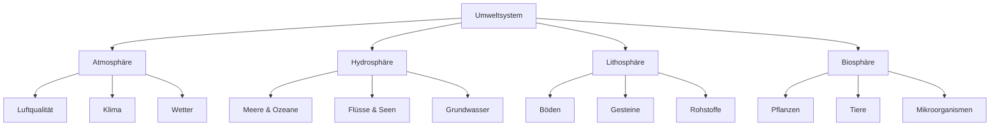
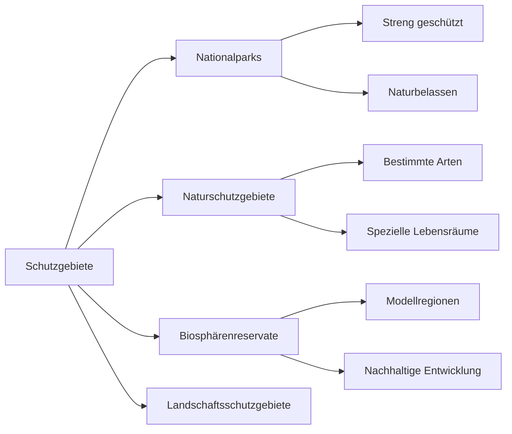
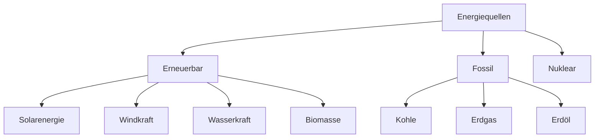

# Environment and Nature - Comprehensive Guide

## Fundamental Environmental Concepts

### Core Ecological Terms

| German | Pronunciation | English | Example Sentence |
|--------|---------------|---------|------------------|
| die Ökologie | [økoˈloːɡiː] | ecology | Die Ökologie studiert Lebensgemeinschaften. |
| das Ökosystem | [ˈøːkoˌzysteːm] | ecosystem | Das Ökosystem Wald ist sehr komplex. |
| die Biodiversität | [biodivɛʁziˈtɛːt] | biodiversity | Biodiversität schützt das Gleichgewicht. |
| die Nachhaltigkeit | [ˈnaːxˌhaltɪçkaɪ̯t] | sustainability | Nachhaltigkeit ist wichtig für die Zukunft. |
| der Umweltschutz | [ˈʊmvɛltˌʃʊt͡s] | environmental protection | Umweltschutz betrifft uns alle. |

### Natural Elements

| German | Pronunciation | English | Example Sentence |
|--------|---------------|---------|------------------|
| die Landschaft | [ˈlantʃaft] | landscape | Die deutsche Landschaft ist vielfältig. |
| das Gewässer | [ɡəˈvɛsɐ] | body of water | Dieses Gewässer ist sauber. |
| das Gebirge | [ɡəˈbɪʁɡə] | mountain range | Das Gebirge ist im Winter verschneit. |
| das Tiefland | [ˈtiːfˌlant] | lowland | Das norddeutsche Tiefland ist flach. |
| das Klima | [ˈkliːma] | climate | Das Klima in Deutschland ist gemäßigt. |

## Environmental Systems



## Ecosystems of Germany

### Forest Ecosystems
- **der Laubwald** - deciduous forest
- **der Nadelwald** - coniferous forest
- **der Mischwald** - mixed forest
- **der Urwald** - primeval forest
- **der Forst** - managed forest

### Water Ecosystems
- **der See** - lake
- **der Fluss** - river
- **das Moor** - bog/moor
- **das Watt** - tidal flat
- **das Feuchtgebiet** - wetland

### Mountain Ecosystems
- **die Alpen** - Alps
- **das Mittelgebirge** - mid-range mountains
- **das Hochmoor** - high moor
- **die Alm** - alpine pasture

## Environmental Issues

### Climate Change
- **der Klimawandel** - climate change
- **die globale Erwärmung** - global warming
- **der Treibhauseffekt** - greenhouse effect
- **der CO2-Ausstoß** - CO2 emissions
- **der Meeresspiegelanstieg** - sea level rise

### Pollution Types
- **die Luftverschmutzung** - air pollution
- **die Wasserverschmutzung** - water pollution
- **die Bodenverschmutzung** - soil pollution
- **die Lichtverschmutzung** - light pollution
- **die Lärmbelästigung** - noise pollution

## Conservation and Protection

### Protected Areas



### Conservation Measures
- **Artenschutz** - species protection
- **Biotopschutz** - habitat protection
- **Renaturierung** - restoration
- **Umweltverträglichkeitsprüfung** - environmental impact assessment

## German Environmental Policy

### Key Principles
- **Vorsorgeprinzip** - precautionary principle
- **Verursacherprinzip** - polluter pays principle
- **Kooperationsprinzip** - cooperation principle
- **Nachhaltigkeitsprinzip** - sustainability principle

### Environmental Organizations
- **das Umweltbundesamt** - federal environment agency
- **der NABU** (Naturschutzbund) - nature conservation association
- **BUND** (Bund für Umwelt) - friends of the earth Germany
- **Greenpeace Deutschland** - Greenpeace Germany

## Flora and Fauna

### Common German Trees
- **die Eiche** - oak
- **die Buche** - beech
- **die Fichte** - spruce
- **die Kiefer** - pine
- **die Birke** - birch

### German Wildlife
- **der Rothirsch** - red deer
- **der Wildschwein** - wild boar
- **der Fuchs** - fox
- **der Hase** - hare
- **der Uhu** - eagle owl

## Sustainable Practices

### Energy Sources



### Waste Management
- **Mülltrennung** - waste separation
- **Recycling** - recycling
- **Kompostierung** - composting
- **Wertstoffhof** - recycling center

## Practical Environmental Vocabulary

### Everyday Actions
- **Energie sparen** - save energy
- **Wasser sparen** - save water
- **Müll vermeiden** - avoid waste
- **öffentliche Verkehrsmittel nutzen** - use public transport
- **regionale Produkte kaufen** - buy local products

### Environmental Dialogues
```
Person A: "Trennst du deinen Müll?"
Person B: "Ja natürlich, Plastik, Papier und Biomüll getrennt."
Person A: "Das ist gut für die Umwelt."
Person B: "Und ich fahre jetzt immer mit dem Fahrrad zur Arbeit."
```

## Regional Natural Features

### Northern Germany
- **Nordsee** - North Sea
- **Ostsee** - Baltic Sea
- **Wattenmeer** - Wadden Sea
- **Heidelandschaft** - heath landscape

### Central Germany
- **Mittelgebirge** - mid-range mountains
- **Flusslandschaften** - river landscapes
- **Wälder** - forests

### Southern Germany
- **Alpen** - Alps
- **Voralpenland** - Alpine foothills
- **Seenplatte** - lake district

## Grammar for Environmental Topics

### Compound Environmental Terms
- **Umwelt + Schutz** = **Umweltschutz**
- **Natur + Schütz** = **Naturschutz**
- **Klima + Wandel** = **Klimawandel**
- **Abfall + Vermeidung** = **Abfallvermeidung**

### Passive Voice for Environmental Processes
- "Die Bäume **werden gepflanzt**." (The trees are being planted.)
- "Das Wasser **wird gereinigt**." (The water is being cleaned.)
- "Energie **wird erzeugt**." (Energy is being produced.)

### Prepositions for Locations
- "**Im** Wald leben viele Tiere." (Many animals live in the forest.)
- "**An** der Küste ist das Klima mild." (The climate is mild at the coast.)
- "**Auf** dem Berg wachsen besondere Pflanzen." (Special plants grow on the mountain.)

## Future Environmental Challenges

### Global Issues
- **Klimakrise** - climate crisis
- **Plastikverschmutzung** - plastic pollution
- **Artensterben** - species extinction
- **Ressourcenknappheit** - resource scarcity

### Solutions and Innovations
- **Energiewende** - energy transition
- **Kreislaufwirtschaft** - circular economy
- **nachhaltige Landwirtschaft** - sustainable agriculture
- **grüne Technologien** - green technologies