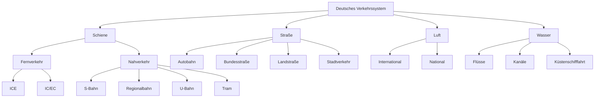
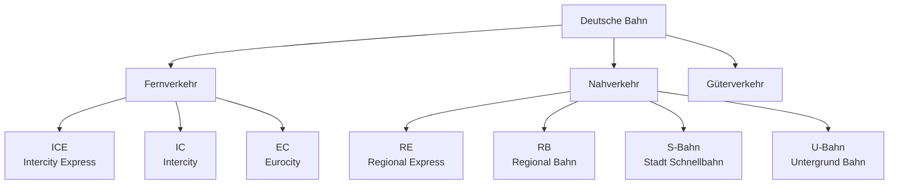
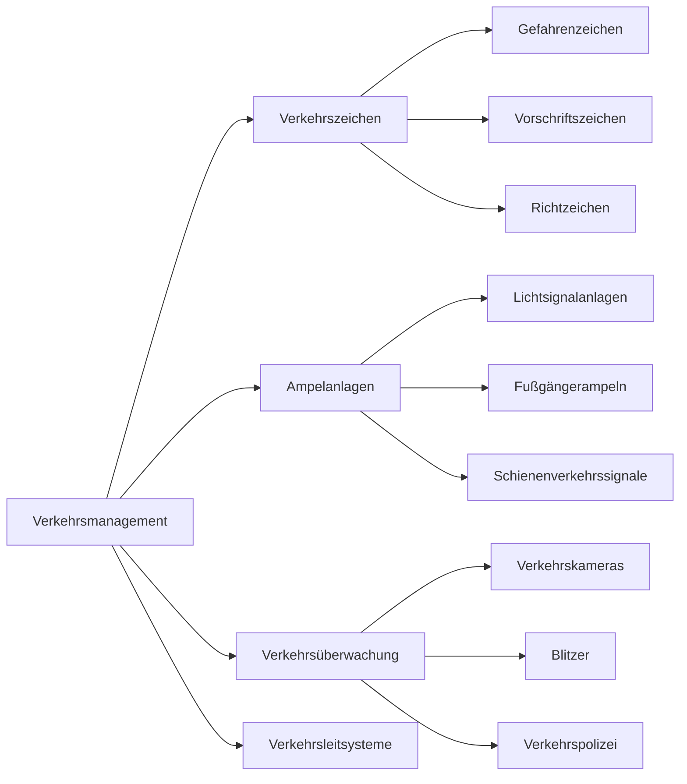

# Transportation and Traffic - Comprehensive Guide

## Comprehensive Transportation System

### Core Transportation Concepts

| German | Pronunciation | English | Example Sentence |
|--------|---------------|---------|------------------|
| das Verkehrssystem | [fɛɐ̯ˈkeːɐ̯sˌzystem] | transportation system | Das deutsche Verkehrssystem ist gut ausgebaut. |
| die Mobilität | [mobiliˈtɛːt] | mobility | Moderne Mobilität ist vielfältig. |
| die Verkehrsinfrastruktur | [fɛɐ̯ˈkeːɐ̯sˌʔɪnfʁaʃtʁʊktuːɐ̯] | transport infrastructure | Die Verkehrsinfrastruktur muss modernisiert werden. |
| der öffentliche Nahverkehr | [ˈœfɛntlɪçə ˈnaːfɛɐ̯ˌkeːɐ̯] | local public transport | Der öffentliche Nahverkehr ist preiswert. |
| der Fernverkehr | [ˈfɛʁnfɛɐ̯ˌkeːɐ̯] | long-distance transport | Der Fernverkehr verbindet große Städte. |

### Transportation Modes

| German | Pronunciation | English | Example Sentence |
|--------|---------------|---------|------------------|
| der Schienenverkehr | [ˈʃiːnənfɛɐ̯ˌkeːɐ̯] | rail transport | Der Schienenverkehr ist umweltfreundlich. |
| der Straßenverkehr | [ˈʃtʁaːsn̩fɛɐ̯ˌkeːɐ̯] | road traffic | Der Straßenverkehr ist oft dicht. |
| der Luftverkehr | [ˈlʊftfɛɐ̯ˌkeːɐ̯] | air traffic | Der Luftverkehr nimmt ständig zu. |
| der Wasserverkehr | [ˈvasɐfɛɐ̯ˌkeːɐ̯] | water transport | Der Wasserverkehr auf dem Rhein ist wichtig. |
| der Individualverkehr | [ɪndividuˈaːlfɛɐ̯ˌkeːɐ̯] | private transport | Der Individualverkehr verursacht Staus. |

## German Transportation Network



## Public Transportation System

### Rail Transport Hierarchy



### Tickets and Fares
- **die Fahrkarte** - ticket
- **das Ticket** - ticket
- **die Monatskarte** - monthly pass
- **die Bahncard** - railway discount card
- **der Fahrschein** - travel ticket

## Road Transportation

### Road Types and Classification
- **die Autobahn** - highway/motorway (no general speed limit)
- **die Bundesstraße** - federal highway
- **die Landesstraße** - state road
- **die Kreisstraße** - county road
- **die Gemeindestraße** - municipal road

### Vehicle Types
- **der Pkw** (Personenkraftwagen) - passenger car
- **der Lkw** (Lastkraftwagen) - truck
- **das Motorrad** - motorcycle
- **der Bus** - bus
- **das Fahrrad** - bicycle

## Air and Water Transport

### Aviation Infrastructure
- **der Flughafen** - airport
- **die Landebahn** - runway
- **das Terminal** - terminal
- **die Abflughalle** - departure hall
- **die Ankunftshalle** - arrival hall

### Water Transport
- **der Hafen** - port/harbor
- **die Fähre** - ferry
- **das Schiff** - ship
- **der Kanal** - canal
- **die Schleuse** - lock

## Traffic Management and Rules

### Traffic Control Systems



### Important Traffic Signs
- **Vorfahrt gewähren!** - yield
- **Stopp** - stop
- **Einbahnstraße** - one-way street
- **Parkverbot** - no parking
- **Geschwindigkeitsbegrenzung** - speed limit

## Urban Mobility Concepts

### Modern Transportation Trends
- **Carsharing** - car sharing
- **Ridesharing** - ride sharing
- **E-Mobilität** - e-mobility
- **autonomes Fahren** - autonomous driving
- **Mobilitäts-Apps** - mobility apps

### Sustainable Transportation
- **ÖPNV** (Öffentlicher Personennahverkehr) - public transport
- **Fahrradverkehr** - bicycle traffic
- **Fußgängerfreundlichkeit** - pedestrian friendliness
- **Verkehrsvermeidung** - traffic avoidance

## Practical Travel Situations

### At the Train Station
```
Reisender: "Eine Fahrkarte nach München, bitte."
Schalter: "Einfach oder Hin und Rück?"
Reisender: "Hin und Rück, zweite Klasse."
Schalter: "Das macht 98 Euro. Möchten Sie eine Sitzplatzreservierung?"
```

### Asking for Directions
```
Tourist: "Entschuldigung, wie komme ich zum Hauptbahnhof?"
Einheimischer: "Gehen Sie geradeaus, dann links an der Ampel."
Tourist: "Ist es weit?"
Einheimischer: "Nein, zu Fuß etwa 10 Minuten."
```

### Car Rental
```
Kunde: "Ich möchte einen Kleinwagen für drei Tage mieten."
Vermietung: "Haben Sie einen Führerschein und Kreditkarte?"
Kunde: "Ja, hier bitte. Ist die Versicherung inklusive?"
Vermietung: "Ja, Vollkasko mit Selbstbeteiligung."
```

## Transportation Vocabulary by Context

### Time Expressions
- **abfahren** - to depart
- **ankommen** - to arrive
- **verspätet sein** - to be delayed
- **pünktlich** - on time
- **der Fahrplan** - schedule

### Location Terms
- **der Bahnsteig** - platform
- **die Haltestelle** - stop
- **der Gleis** - track
- **der Parkplatz** - parking space
- **der Stellplatz** - parking bay

## German Transportation Culture

### Punctuality and Efficiency
- **Deutsche Pünktlichkeit** - German punctuality
- **Taktfahrplan** - regular interval timetable
- **Anschluss garantieren** - guarantee connections
- **Verspätungsanzeige** - delay announcement

### Regional Transportation Characteristics
- **Ruhrgebiet**: Dense network of S-Bahn and U-Bahn
- **München**: Comprehensive tram and subway system
- **Hamburg**: Extensive harbor and ferry connections
- **Berlin**: Integrated BVG system (U-Bahn, S-Bahn, Bus, Tram)

## Grammar for Transportation

### Verbs of Movement
- **fahren** - to travel/drive
- **fliegen** - to fly
- **gehen** - to walk
- **reisen** - to travel
- **pendeln** - to commute

### Prepositions for Transportation
- **mit** dem Bus fahren (to go by bus)
- **zu** Fuß gehen (to go on foot)
- **an** Haltestelle X aussteigen (to get off at stop X)
- **von** Gleis 3 abfahren (to depart from track 3)

### Separable Prefix Verbs
- **abfahren** - to depart
- **ankommen** - to arrive
- **umsteigen** - to change (transport)
- **einsteigen** - to board
- **aussteigen** - to disembark

## Future of Transportation in Germany

### Current Projects
- **Deutschlandtakt** - integrated national timetable
- **Autobahnausbau** - highway expansion
- **Bahnstrecken-Elektrifizierung** - railway electrification
- **Ladesäulen-Infrastruktur** - charging station infrastructure

### Sustainability Goals
- **Verkehrswende** - transport transition
- **Klimaneutrale Mobilität** - climate-neutral mobility
- **Verbesserung des ÖPNV** - improvement of public transport
- **Förderung des Radverkehrs** - promotion of bicycle traffic