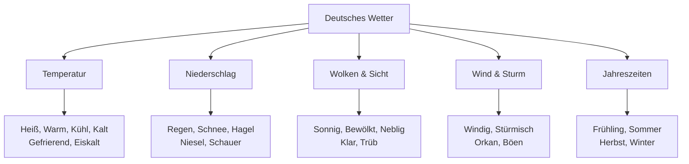
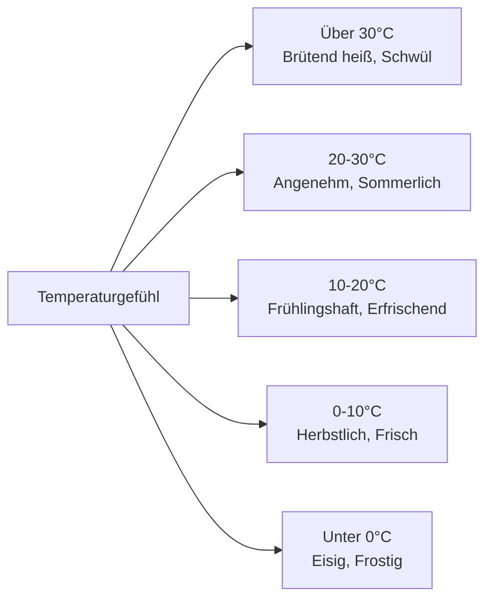
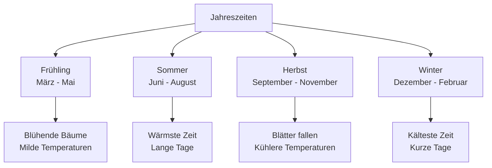

# Weather (Wetter) - German Weather Vocabulary for English Speakers

## Introduction
Weather vocabulary is essential for daily conversations, planning activities, and understanding weather forecasts in German. This chapter covers weather conditions, seasons, temperatures, and common weather-related expressions.

## Basic Weather Conditions

### Main Weather Types

| Weather | German | Pronunciation | Description |
|---------|--------|---------------|-------------|
| ☀️ | sonnig | [ˈzɔnɪç] | Sunny |
| ☁️ | bewölkt | [bəˈvœlkt] | Cloudy |
| 🌧️ | regnerisch | [ˈʁeːɡnəʁɪʃ] | Rainy |
| ⛈️ | gewittrig | [ɡəˈvɪtʁɪç] | Stormy |
| ❄️ | schneeweiß | [ˈʃneːvaɪs] | Snowy |
| 🌫️ | neblig | [ˈneːblɪç] | Foggy |
| 💨 | windig | [ˈvɪndɪç] | Windy |

## Weather Classification



## Temperature (Temperatur)

### Temperature Ranges

| Temperature | German | Pronunciation | Feeling |
|-------------|--------|---------------|---------|
| 🔥 Very hot | sehr heiß | [zeːɐ haɪs] | Above 30°C |
| ☀️ Hot | heiß | [haɪs] | 25-30°C |
| 😊 Warm | warm | [vaʁm] | 20-25°C |
| 😌 Mild | mild | [mɪlt] | 15-20°C |
| 😐 Cool | kühl | [kyːl] | 10-15°C |
| 🥶 Cold | kalt | [kalt] | 0-10°C |
| ❄️ Freezing | eiskalt | [ˈaɪskalt] | Below 0°C |

### Temperature Expressions



## Precipitation (Niederschlag)

### Types of Precipitation

| Precipitation | German | Pronunciation | Intensity |
|---------------|--------|---------------|-----------|
| 🌧️ Rain | der Regen | [ˈʁeːɡən] | General rain |
| 🌦️ Drizzle | der Nieselregen | [ˈniːzəlˌʁeːɡən] | Light rain |
| 💦 Downpour | der Platzregen | [ˈplat͡sˌʁeːɡən] | Heavy rain |
| ❄️ Snow | der Schnee | [ʃneː] | Snow |
| 🌨️ Sleet | der Schneeregen | [ˈʃneːˌʁeːɡən] | Rain and snow |
| ⛄ Hail | der Hagel | [ˈhaːɡəl] | Ice balls |

### Rain Intensity

| Intensity | German | Pronunciation | Description |
|-----------|--------|---------------|-------------|
| Light rain | leichter Regen | [ˈlaɪ̯çtɐ ˈʁeːɡən] | Gentle rain |
| Moderate rain | mäßiger Regen | [ˈmɛːsɪɡɐ ˈʁeːɡən] | Steady rain |
| Heavy rain | starker Regen | [ˈʃtaʁkɐ ˈʁeːɡən] | Pouring rain |
| Torrential rain | sintflutartiger Regen | [ˈzɪntfluːtˌʔaʁtɪɡɐ ˈʁeːɡən] | Very heavy rain |

## Sky Conditions (Himmelszustände)

### Cloud Coverage

| Condition | German | Pronunciation | Sky Coverage |
|-----------|--------|---------------|-------------|
| ☀️ Sunny | sonnig | [ˈzɔnɪç] | 0-10% clouds |
| ⛅ Partly cloudy | teilweise bewölkt | [ˈtaɪ̯lvaɪ̯zə bəˈvœlkt] | 10-50% clouds |
| ☁️ Cloudy | bewölkt | [bəˈvœlkt] | 50-90% clouds |
| 🌫️ Overcast | bedeckt | [bəˈdɛkt] | 90-100% clouds |
| 🌫️ Foggy | neblig | [ˈneːblɪç] | Low visibility |

## Wind and Storms (Wind und Stürme)

### Wind Conditions

| Wind | German | Pronunciation | Speed |
|------|--------|---------------|-------|
| 💨 Breeze | die Brise | [ˈbʁiːzə] | Light wind |
| 💨 Windy | windig | [ˈvɪndɪç] | Moderate wind |
| 💨 Strong wind | starker Wind | [ˈʃtaʁkɐ vɪnt] | Strong wind |
| 🌪️ Stormy | stürmisch | [ˈʃtʏʁmɪʃ] | Storm conditions |
| 🌀 Hurricane | der Orkan | [ɔʁˈkaːn] | Very strong wind |

### Storm Types

| Storm | German | Pronunciation | Characteristics |
|-------|--------|---------------|----------------|
| ⛈️ Thunderstorm | das Gewitter | [ɡəˈvɪtɐ] | Thunder and lightning |
| 🌪️ Tornado | der Tornado | [tɔʁˈnaːdo] | Rotating column |
| 🌀 Hurricane | der Hurrikan | [ˈhʊʁikaːn] | Tropical cyclone |
| ❄️ Blizzard | der Schneesturm | [ˈʃneːˌʃtʊʁm] | Snow storm |

## Seasons (Jahreszeiten)

### The Four Seasons



### Seasonal Characteristics

| Season | German | Temperature | Typical Weather |
|--------|--------|-------------|----------------|
| 🌸 Spring | der Frühling | 5-15°C | Changeable, rainy |
| ☀️ Summer | der Sommer | 20-30°C | Warm, occasional storms |
| 🍂 Autumn | der Herbst | 5-15°C | Cool, foggy, rainy |
| ❄️ Winter | der Winter | -5 to 5°C | Cold, snow, ice |

## Weather Forecast (Wettervorhersage)

### Forecast Terms

| Term | German | Pronunciation | Meaning |
|------|--------|---------------|---------|
| Forecast | die Vorhersage | [ˈfoːɐ̯heːɐ̯zaːɡə] | Weather prediction |
| Today | heute | [ˈhɔɪ̯tə] | Today's weather |
| Tomorrow | morgen | [ˈmɔʁɡən] | Tomorrow's weather |
| Week | die Woche | [ˈvɔxə] | Weekly forecast |
| High | das Maximum | [ˈmaksimʊm] | Highest temperature |
| Low | das Minimum | [ˈminimʊm] | Lowest temperature |

### Probability Terms

| Probability | German | Pronunciation | Chance |
|-------------|--------|---------------|--------|
| Certain | sicher | [ˈzɪçɐ] | 100% |
| Very likely | sehr wahrscheinlich | [zeːɐ vaːɐˈʃaɪ̯nlɪç] | 80-99% |
| Likely | wahrscheinlich | [vaːɐˈʃaɪ̯nlɪç] | 60-79% |
| Possible | möglich | [ˈmøːklɪç] | 40-59% |
| Unlikely | unwahrscheinlich | [ˈʊnvaːɐˌʃaɪ̯nlɪç] | 20-39% |
| Very unlikely | sehr unwahrscheinlich | [zeːɐ ˈʊnvaːɐˌʃaɪ̯nlɪç] | 1-19% |

## German Weather Culture

### Weather Small Talk

```mermaid
graph LR
    A[Wetter Small Talk] --> B[Begrüßung<br/>"Schönes Wetter heute!"]
    A --> C[Kommentar<br/>"Es wird kälter."]
    A --> D[Planung<br/>"Bei dem Wetter bleibe ich lieber zu Hause."]
    A --> E[Abschied<br/>"Genießen Sie das sonnige Wetter!"]
```

### Common Weather Conversations

**Starting a conversation:**
- "Schönes Wetter heute, nicht wahr?" (Nice weather today, isn't it?)
- "Das Wetter ist aber wechselhaft." (The weather is really changeable.)

**Complaining about weather:**
- "Es ist zu kalt/heiß/nass." (It's too cold/hot/wet.)
- "Dieser Regen hört nicht auf." (This rain won't stop.)

**Planning based on weather:**
- "Bei diesem Wetter gehen wir besser nicht wandern." (We'd better not go hiking in this weather.)
- "Perfektes Wetter für einen Spaziergang!" (Perfect weather for a walk!)

## Regional Weather in Germany

### Weather by Region

| Region | German | Typical Weather | Characteristics |
|--------|--------|-----------------|----------------|
| North | Norddeutschland | Maritime | Mild, rainy, windy |
| South | Süddeutschland | Continental | Colder winters, warmer summers |
| West | Westdeutschland | Atlantic influence | Mild, humid, rainy |
| East | Ostdeutschland | Continental | Colder winters, drier |
| Alps | Alpenregion | Mountain | Snowy winters, cool summers |

### Famous German Weather Phenomena

| Phenomenon | German | Description |
|------------|--------|-------------|
| Föhn | der Föhn | Warm, dry wind in the Alps |
| Eisheilige | die Eisheiligen | Cold period in mid-May |
| Schafskälte | die Schafskälte | Cold period in June |
| Altweibersommer | der Altweibersommer | Warm period in autumn |

## Weather-Related Activities

### Activities by Weather

| Weather | German | Recommended Activities |
|---------|--------|------------------------|
| ☀️ Sunny | sonnig | Schwimmen, Wandern, Picknick |
| 🌧️ Rainy | regnerisch | Museen besuchen, Kino, Lesen |
| ❄️ Snowy | schneeweiß | Skifahren, Schlittenfahren, Schneemann bauen |
| 💨 Windy | windig | Drachen steigen lassen, Segeln |
| 🌫️ Foggy | neblig | Spaziergang, Fotografieren |

## Weather Idioms and Expressions

### Common Weather Idioms

| Idiom | Literal Meaning | Actual Meaning |
|-------|----------------|----------------|
| "Das ist ja nicht mein Bier" | That's not my beer | That's not my problem |
| "Da liegt was in der Luft" | Something is in the air | You can sense something is about to happen |
| "Ins Wasser fallen" | To fall into the water | To be cancelled |
| "Schlechtes Wetter machen" | To make bad weather | To complain |
| "Wie aus heiterem Himmel" | Like from a clear sky | Completely unexpectedly |

### Weather in Proverbs

| Proverb | German | Meaning |
|---------|--------|---------|
| "April, April, der macht was er will" | April, April, does what it wants | April weather is unpredictable |
| "Abendrot, Gutwetterbot" | Red sky at night, weather prediction | Red sunset means good weather tomorrow |
| "Morgenrot, Schlechtwetter droht" | Red sky in morning, bad weather threatens | Red sunrise means bad weather coming |

## Grammar: Weather Expressions

### Using "es" for Weather

```mermaid
flowchart TD
    A[Wetter mit "es"] --> B[Es regnet<br/>It is raining]
    A --> C[Es schneit<br/>It is snowing]
    A --> D[Es donnert<br/>It is thundering]
    A --> E[Es blitzt<br/>It is lightning]
    
    B --> B1[Kein Subjekt nötig<br/>Das Verb steht im Vordergrund]
```

### Common Weather Verbs

| Verb | German | Example |
|------|--------|---------|
| To rain | regnen | Es regnet. |
| To snow | schneien | Es schneit. |
| To hail | hageln | Es hagelt. |
| To thunder | donnern | Es donnert. |
| To lightning | blitzen | Es blitzt. |
| To freeze | frieren | Es friert. |

## Practice Exercises

### Exercise 1: Weather Vocabulary
Translate to German:
1. "It is sunny and warm today"
2. "Tomorrow it will rain"
3. "The weather is very changeable"
4. "I like snowy weather"

### Exercise 2: Temperature Conversion
Convert these temperatures and describe them in German:
1. 25°C (describe the feeling)
2. 5°C (describe the feeling)
3. -3°C (describe the feeling)
4. 32°C (describe the feeling)

### Exercise 3: Weather Forecast
Create a simple weather forecast in German for:
- Today: sunny, 22°C
- Tomorrow: rainy, 15°C
- Weekend: cloudy, 18°C

### Exercise 4: Seasonal Activities
What activities would you recommend in German for:
1. A hot summer day
2. A rainy autumn day
3. A snowy winter day
4. A mild spring day

### Exercise 5: Cultural Understanding
Answer these questions:
1. Why is weather such a common small talk topic in Germany?
2. What are the "Eisheiligen"?
3. How does regional geography affect German weather?
4. What does "Abendrot, Gutwetterbot" mean?

## Useful Weather Phrases

### Asking About Weather

| English | German | Pronunciation |
|---------|--------|---------------|
| What's the weather like? | Wie ist das Wetter? | [viː ɪst das ˈvɛtɐ] |
| How's the weather today? | Wie ist das Wetter heute? | [viː ɪst das ˈvɛtɐ ˈhɔɪ̯tə] |
| What's the temperature? | Wie viel Grad sind es? | [viː fiːl ɡʁaːt zɪnt ɛs] |
| Will it rain? | Wird es regnen? | [vɪʁt ɛs ˈʁeːɡnən] |

### Describing Weather

| English | German | Pronunciation |
|---------|--------|---------------|
| It's beautiful weather | Es ist schönes Wetter | [ɛs ɪst ˈʃøːnəs ˈvɛtɐ] |
| The weather is bad | Das Wetter ist schlecht | [das ˈvɛtɐ ɪst ʃlɛçt] |
| It's getting colder | Es wird kälter | [ɛs vɪʁt ˈkɛltɐ] |
| The sun is shining | Die Sonne scheint | [diː ˈzɔnə ʃaɪ̯nt] |

---

## Summary

Key points about German weather vocabulary and culture:
- Weather is a very common small talk topic in Germany
- The impersonal "es" is used for most weather expressions
- Regional variations are significant across Germany
- Seasonal changes are distinct and affect daily life
- Germans often plan activities based on weather forecasts
- Traditional weather proverbs are still commonly used

With this vocabulary and cultural knowledge, you'll be able to discuss weather, understand forecasts, and engage in weather-related small talk in German-speaking countries!