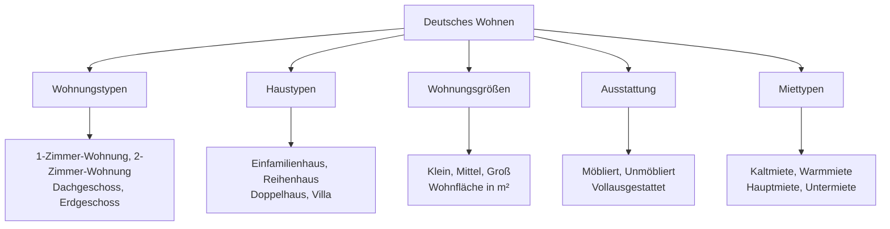
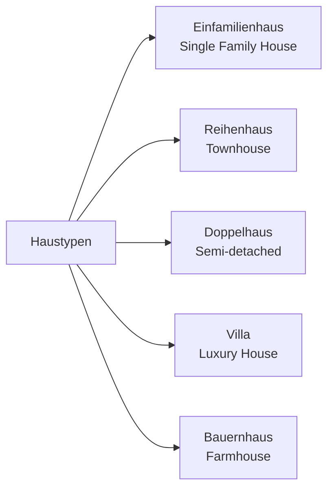
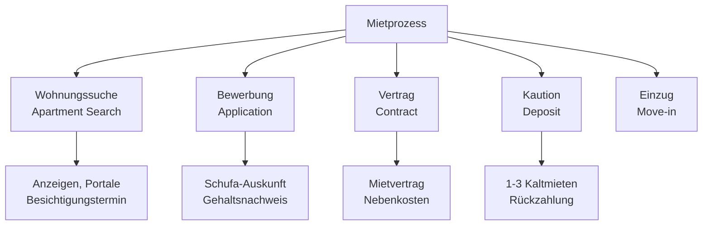
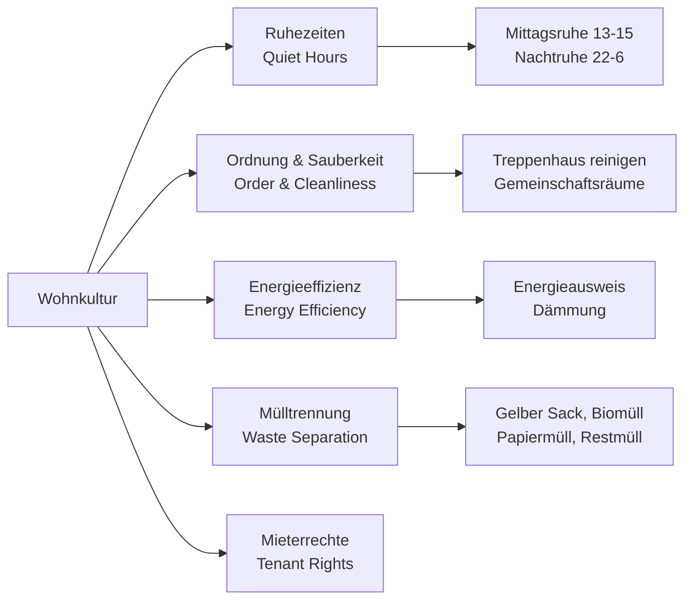

# Living/Housing (Wohnen) - German Housing Vocabulary for English Speakers

## Introduction
Housing vocabulary is essential for finding accommodation, describing living situations, and understanding German housing culture. This chapter covers types of housing, rooms, furniture, rental processes, and cultural aspects of German living.

## Basic Housing Types

### Main Housing Categories

| Housing Type | German | Pronunciation | Description |
|--------------|--------|---------------|-------------|
| 🏠 | das Haus | [haʊ̯s] | House |
| 🏢 | die Wohnung | [ˈvoːnʊŋ] | Apartment/Flat |
| 🏘️ | das Mehrfamilienhaus | [ˈmeːɐ̯famiːli̯ənˌhaʊ̯s] | Multi-family house |
| 🏡 | das Einfamilienhaus | [ˈaɪ̯nfamiːli̯ənˌhaʊ̯s] | Single-family house |
| 🏰 | das Reihenhaus | [ˈʁaɪ̯ənˌhaʊ̯s] | Townhouse |
| 🏙️ | das Hochhaus | [ˈhoːxˌhaʊ̯s] | High-rise building |

## Housing Classification

## Types of Housing (Wohnungstypen)

### Apartment Types

| Type | German | Pronunciation | Characteristics |
|------|--------|---------------|----------------|
| 🏠 1-room apartment | die 1-Zimmer-Wohnung | [aɪ̯ns ˈt͡sɪmɐ ˈvoːnʊŋ] | Studio apartment |
| 🏠 2-room apartment | die 2-Zimmer-Wohnung | [t͡svaɪ ˈt͡sɪmɐ ˈvoːnʊŋ] | 1 bedroom + living room |
| 🏠 3-room apartment | die 3-Zimmer-Wohnung | [dʁaɪ ˈt͡sɪmɐ ˈvoːnʊŋ] | 2 bedrooms + living room |
| 🏠 Penthouse | das Penthouse | [ˈpɛnthaʊ̯s] | Top floor luxury |
| 🏠 Loft | das Loft | [lɔft] | Open space |
| 🏠 Ground floor | das Erdgeschoss | [ˈeːɐ̯tɡəˌʃɔs] | First floor |

### House Types

## Rooms and Areas (Räume und Bereiche)

### Main Rooms

| Room | German | Pronunciation | Purpose |
|------|--------|---------------|---------|
| 🛏️ Bedroom | das Schlafzimmer | [ˈʃlaːfˌt͡sɪmɐ] | Sleeping |
| 🛋️ Living room | das Wohnzimmer | [ˈvoːnˌt͡sɪmɐ] | Relaxing, entertaining |
| 🍽️ Dining room | das Esszimmer | [ˈɛsˌt͡sɪmɐ] | Eating meals |
| 👨‍🍳 Kitchen | die Küche | [ˈkʏçə] | Cooking |
| 🚽 Bathroom | das Badezimmer | [ˈbaːdəˌt͡sɪmɐ] | Bathing, toilet |
| 🚪 Hallway | der Flur | [fluːɐ] | Entrance area |

### Additional Spaces

| Space | German | Pronunciation | Use |
|-------|--------|---------------|-----|
| 🛁 Bathroom | das Bad | [baːt] | Bathing room |
| 🚽 Toilet | die Toilette | [to̯aˈlɛtə] | WC |
| 📚 Study | das Arbeitszimmer | [ˈaʁbaɪ̯t͡sˌt͡sɪmɐ] | Office/study |
| 👶 Children's room | das Kinderzimmer | [ˈkɪndɐˌt͡sɪmɐ] | Child's bedroom |
| 🧺 Laundry room | der Waschraum | [ˈvaʃˌʁaʊ̯m] | Washing clothes |
| 🗄️ Storage room | der Abstellraum | [ˈapʃtɛlˌʁaʊ̯m] | Storage |

## Furniture and Household Items (Möbel und Haushaltsgegenstände)

### Essential Furniture

| Furniture | German | Pronunciation | Room |
|-----------|--------|---------------|------|
| 🛏️ Bed | das Bett | [bɛt] | Bedroom |
| 🛋️ Sofa | das Sofa | [ˈzoːfa] | Living room |
| 🪑 Chair | der Stuhl | [ʃtuːl] | Various |
| 🏺 Table | der Tisch | [tɪʃ] | Various |
| 🗄️ Wardrobe | der Schrank | [ʃʁaŋk] | Bedroom |
| 📚 Bookshelf | das Bücherregal | [ˈbyːçɐʁəˌɡaːl] | Living room/study |

### Kitchen Items

| Item | German | Pronunciation | Use |
|------|--------|---------------|-----|
| 🍳 Stove | der Herd | [heːɐ̯t] | Cooking |
| 🧊 Refrigerator | der Kühlschrank | [ˈkyːlˌʃʁaŋk] | Food storage |
| 🚰 Sink | die Spüle | [ˈʃpyːlə] | Washing dishes |
| 🍽️ Oven | der Backofen | [ˈbakˌʔoːfən] | Baking |
| 🗄️ Cabinet | der Küchenschrank | [ˈkʏçənˌʃʁaŋk] | Storage |

## Rental Process (Mietprozess)

### Rental Terms

### Key Rental Vocabulary

| Term | German | Pronunciation | Explanation |
|------|--------|---------------|-------------|
| Rent | die Miete | [ˈmiːtə] | Monthly payment |
| Cold rent | die Kaltmiete | [ˈkaltmiːtə] | Rent without utilities |
| Warm rent | die Warmmiete | [ˈvaʁmmiːtə] | Rent including utilities |
| Deposit | die Kaution | [kaʊ̯ˈt͡si̯oːn] | Security deposit |
| Lease | der Mietvertrag | [ˈmiːtfɛɐ̯ˌtʁaːk] | Rental contract |
| Utilities | die Nebenkosten | [ˈneːbn̩ˌkɔstən] | Additional costs |

### Required Documents

| Document | German | Pronunciation | Purpose |
|----------|--------|---------------|---------|
| Credit report | die Schufa-Auskunft | [ˈʃuːfa ˈaʊ̯skʊnft] | Credit history |
| Proof of income | der Gehaltsnachweis | [ɡəˈhalt͡sˌnaχvaɪ̯s] | Income verification |
| ID copy | der Personalausweis | [pɛʁzoˈnaːlʔaʊ̯svaɪ̯s] | Identity verification |
| Previous landlord reference | die Mietschuldenfreiheitsbescheinigung | [ˈmiːtʃʊldənˌfʁaɪ̯haɪ̯tsbəˌʃaɪ̯nɪɡʊŋ] | No rent debt certificate |

## German Housing Culture

### Cultural Aspects

### Key Cultural Points

1. **Quiet Hours**: Strict quiet times (Mittagsruhe 13-15, Nachtruhe 22-6)
2. **Cleanliness**: High value placed on cleanliness in shared areas
3. **Energy Efficiency**: Important consideration in housing
4. **Recycling**: Strict waste separation rules
5. **Tenant Protection**: Strong legal protection for tenants
6. **Rental Market**: High percentage of people rent rather than own

## House Hunting (Wohnungssuche)

### Searching for Housing

| Platform/Place | German | Description |
|----------------|--------|-------------|
| Online portals | ImmobilienScout24, eBay Kleinanzeigen | Main online platforms |
| Newspaper ads | Zeitungsanzeigen | Traditional method |
| Real estate agency | die Immobilienagentur | Professional help |
| Word of mouth | Mundpropaganda | Through acquaintances |

### Viewing an Apartment

| Question | German | English |
|----------|--------|---------|
| How much is the rent? | Wie hoch ist die Miete? | What is the rent? |
| Are utilities included? | Sind die Nebenkosten inklusive? | Are utilities included? |
| How long is the lease? | Wie lange ist der Mietvertrag? | How long is the lease? |
| When can I move in? | Wann kann ich einziehen? | When can I move in? |

## Moving Process (Umzugsprozess)

### Moving Vocabulary

| Term | German | Pronunciation | Meaning |
|------|--------|---------------|---------|
| Move | der Umzug | [ˈʊmt͡suːk] | Relocation |
| Moving company | der Umzugsunternehmen | [ˈʊmt͡suːksʔʊntɐˌneːmən] | Moving service |
| Box | der Karton | [kaʁˈtɔ̃ː] | Cardboard box |
| Forwarding service | der Nachsendeauftrag | [ˈnaːxzɛndəˌʔaʊ̯ftʁaːk] | Mail forwarding |
| Change of address | die Adressänderung | [aˈdʁɛsˌʔɛndəʁʊŋ] | Address change |

## Utilities and Services (Versorgungsunternehmen)

### Essential Services

| Service | German | Pronunciation | Provider Type |
|---------|--------|---------------|--------------|
| ⚡ Electricity | der Strom | [ʃtʁoːm] | Energy company |
| 💧 Water | das Wasser | [ˈvasɐ] | Municipal |
| 🔥 Heating | die Heizung | [ˈhaɪ̯t͡sʊŋ] | Various |
| 🌐 Internet | das Internet | [ˈɪntɐnɛt] | Telecom provider |
| 📞 Telephone | das Telefon | [teleˈfoːn] | Telecom provider |

### Setting Up Utilities

| Step | German | English |
|------|--------|---------|
| Register | anmelden | To register |
| Contract | der Vertrag | Contract |
| Provider | der Anbieter | Provider |
| Meter reading | der Zählerstand | Meter reading |
| Deposit | die Anzahlung | Down payment |

## German Living Standards

### Housing Quality Indicators

| Indicator | German | Importance |
|-----------|--------|------------|
| Energy certificate | der Energieausweis | Legal requirement |
| Modernization | die Modernisierung | Value increase |
| Balcony | der Balkon | Highly desirable |
| Basement | der Keller | Storage space |
| Parking space | der Stellplatz | Parking availability |

### Common Housing Features

| Feature | German | Prevalence |
|---------|--------|------------|
| Double-glazed windows | doppelt verglaste Fenster | Very common |
| Central heating | Zentralheizung | Standard |
| Tiled floors | Fliesen | Common in kitchens/baths |
| Parquet flooring | Parkett | Common in living areas |
| Built-in kitchen | Einbauküche | Often included |

## Practice Exercises

### Exercise 1: Housing Vocabulary
Translate to German:
1. "I'm looking for a 3-room apartment with a balcony"
2. "The monthly rent is 800 euros warm"
3. "We need to pay a deposit of two months' rent"
4. "The apartment has a modern kitchen and two bathrooms"

### Exercise 2: Room Description
Describe your ideal apartment in German including:
- Number of rooms
- Special features (balcony, garden, etc.)
- Location preferences
- Maximum rent

### Exercise 3: Rental Dialogue
Create a dialogue between a tenant and landlord:
- Inquiring about an apartment
- Asking about utilities and costs
- Discussing the lease terms
- Arranging a viewing

### Exercise 4: Cultural Understanding
Answer these questions:
1. Why are quiet hours important in German housing?
2. What documents are typically required for renting?
3. How does German recycling system work?
4. What are the advantages of renting vs buying in Germany?

### Exercise 5: Moving Checklist
Create a moving checklist in German including:
- Notifying current landlord
- Setting up new utilities
- Hiring movers
- Changing address
- Cleaning old apartment

## Useful Housing Phrases

### For House Hunting

| English | German | Pronunciation |
|---------|--------|---------------|
| I'm looking for an apartment | Ich suche eine Wohnung | [ɪç ˈzuːxə ˈaɪ̯nə ˈvoːnʊŋ] |
| Is the apartment still available? | Ist die Wohnung noch frei? | [ɪst diː ˈvoːnʊŋ nɔx fʁaɪ̯] |
| Can I schedule a viewing? | Kann ich einen Besichtigungstermin vereinbaren? | [kan ɪç ˈaɪ̯nən bəˈzɪçtɪɡʊŋstɛʁmiːn fɛɐ̯ˈʔaɪ̯nbaːʁən] |
| What's included in the rent? | Was ist in der Miete enthalten? | [vas ɪst ɪn deːɐ̯ ˈmiːtə ɛntˈhaltən] |

### For Rental Agreements

| English | German | Pronunciation |
|---------|--------|---------------|
| I'd like to sign the lease | Ich möchte den Mietvertrag unterschreiben | [ɪç ˈmœçtə deːn ˈmiːtfɛɐ̯tʁaːk ˈʊntɐˌʃʁaɪ̯bən] |
| When is the rent due? | Wann ist die Miete fällig? | [van ɪst diː ˈmiːtə ˈfɛlɪç] |
| How do I pay the deposit? | Wie zahle ich die Kaution? | [viː ˈt͡saːlə ɪç diː kaʊ̯ˈt͡si̯oːn] |
| Are pets allowed? | Sind Haustiere erlaubt? | [zɪnt ˈhaʊ̯stiːʁə ɛɐ̯ˈlaʊ̯pt] |

---

## Summary

Key points about German housing and living culture:
- Renting is more common than owning in urban areas
- Strong tenant protection laws exist
- Quiet hours and cleanliness are taken seriously
- Energy efficiency and environmental considerations are important
- The rental process requires substantial documentation
- Recycling and waste separation are strictly followed
- Shared living spaces have specific rules and expectations

With this vocabulary and cultural knowledge, you'll be well-prepared to navigate the German housing market and understand living customs in German-speaking countries!