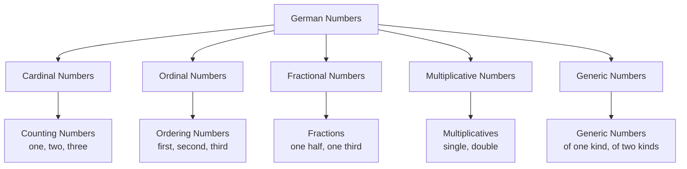
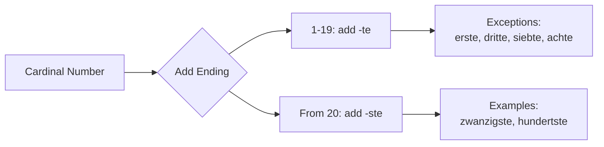
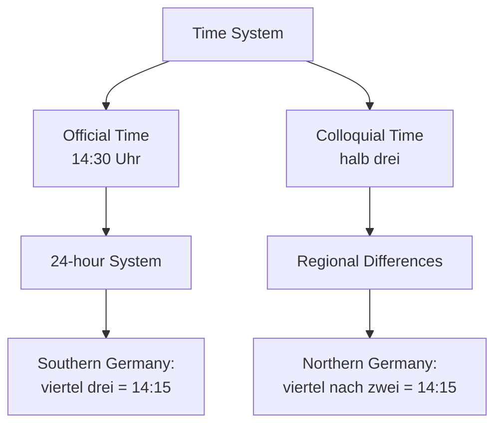

# Numbers (Zahlen) - German Numbers for English Speakers

## Introduction
Numbers are a fundamental part of the German language. In this chapter, you'll learn cardinal numbers, ordinal numbers, fractions, and their everyday usage.

## Cardinal Numbers (Counting Numbers)

### Numbers 0-20

| Number | German | Pronunciation | English Equivalent |
|--------|--------|---------------|-------------------|
| 0 | null | [nʊl] | zero |
| 1 | eins | [aɪns] | one |
| 2 | zwei | [tsvaɪ] | two |
| 3 | drei | [draɪ] | three |
| 4 | vier | [fiːɐ] | four |
| 5 | fünf | [fʏnf] | five |
| 6 | sechs | [zɛks] | six |
| 7 | sieben | [ˈziːbən] | seven |
| 8 | acht | [axt] | eight |
| 9 | neun | [nɔɪn] | nine |
| 10 | zehn | [tseːn] | ten |
| 11 | elf | [ɛlf] | eleven |
| 12 | zwölf | [tsvœlf] | twelve |
| 13 | dreizehn | [ˈdraɪtseːn] | thirteen |
| 14 | vierzehn | [ˈfɪʁtseːn] | fourteen |
| 15 | fünfzehn | [ˈfʏnftseːn] | fifteen |
| 16 | sechzehn | [ˈzɛçtseːn] | sixteen |
| 17 | siebzehn | [ˈziːptseːn] | seventeen |
| 18 | achtzehn | [ˈaxtseːn] | eighteen |
| 19 | neunzehn | [ˈnɔɪntseːn] | nineteen |
| 20 | zwanzig | [ˈtsvantsɪç] | twenty |

### Numbers 21-100

| Number | German | Construction | English |
|--------|--------|--------------|---------|
| 21 | einundzwanzig | eins + und + zwanzig | twenty-one |
| 22 | zweiundzwanzig | zwei + und + zwanzig | twenty-two |
| 23 | dreiundzwanzig | drei + und + zwanzig | twenty-three |
| 24 | vierundzwanzig | vier + und + zwanzig | twenty-four |
| 25 | fünfundzwanzig | fünf + und + zwanzig | twenty-five |
| 26 | sechsundzwanzig | sechs + und + zwanzig | twenty-six |
| 27 | siebenundzwanzig | sieben + und + zwanzig | twenty-seven |
| 28 | achtundzwanzig | acht + und + zwanzig | twenty-eight |
| 29 | neunundzwanzig | neun + und + zwanzig | twenty-nine |
| 30 | dreißig | [ˈdraɪsɪç] | thirty |
| 40 | vierzig | [ˈfɪʁtsɪç] | forty |
| 50 | fünfzig | [ˈfʏnftsɪç] | fifty |
| 60 | sechzig | [ˈzɛçtsɪç] | sixty |
| 70 | siebzig | [ˈziːptsɪç] | seventy |
| 80 | achtzig | [ˈaxtsɪç] | eighty |
| 90 | neunzig | [ˈnɔɪntsɪç] | ninety |
| 100 | (ein)hundert | [(aɪn)ˈhʊndɐt] | (one) hundred |

### Large Numbers

| Number | German | Pronunciation | English |
|--------|--------|---------------|---------|
| 100 | hundert | [ˈhʊndɐt] | hundred |
| 101 | hunderteins | [ˈhʊndɐtˈaɪns] | one hundred one |
| 200 | zweihundert | [ˈtsvaɪˈhʊndɐt] | two hundred |
| 1.000 | tausend | [ˈtaʊzənt] | thousand |
| 10.000 | zehntausend | [ˈtseːnˈtaʊzənt] | ten thousand |
| 100.000 | hunderttausend | [ˈhʊndɐtˈtaʊzənt] | one hundred thousand |
| 1.000.000 | eine Million | [ˈaɪnə mɪˈli̯oːn] | one million |
| 1.000.000.000 | eine Milliarde | [ˈaɪnə mɪˈli̯aʁdə] | one billion |

## Number Classification



## Ordinal Numbers (Ordering Numbers)

### How to Form Ordinal Numbers



### Ordinal Numbers Table

| Number | German Ordinal | Abbreviation | Usage Example |
|--------|----------------|--------------|---------------|
| 1st | der/die/das erste | 1. | On the first of January |
| 2nd | der/die/das zweite | 2. | The second place |
| 3rd | der/die/das dritte | 3. | The third book |
| 4th | der/die/das vierte | 4. | The fourth street |
| 5th | der/die/das fünfte | 5. | On the fifth day |
| 10th | der/die/das zehnte | 10. | The tenth year |
| 20th | der/die/das zwanzigste | 20. | The twentieth birthday |

### Declension of Ordinal Numbers

| Case | Masculine | Feminine | Neuter |
|------|-----------|----------|--------|
| Nominative | der erste | die erste | das erste |
| Accusative | den ersten | die erste | das erste |
| Dative | dem ersten | der ersten | dem ersten |
| Genitive | des ersten | der ersten | des ersten |

## Fractional Numbers

### Basic Fractions

| Fraction | German | Example |
|----------|--------|---------|
| 1/2 | ein halb | one half apple |
| 1/3 | ein Drittel | one third of the time |
| 1/4 | ein Viertel | one quarter liter |
| 3/4 | drei Viertel | three quarters of an hour |

### Decimal Numbers

| Decimal | German | Pronunciation |
|---------|--------|---------------|
| 0.5 | null Komma fünf | [nʊl ˈkɔma fʏnf] |
| 1.25 | eins Komma zwei fünf | [aɪns ˈkɔma t͡svaɪ fʏnf] |
| 10.75 | zehn Komma sieben fünf | [t͡seːn ˈkɔma ˈziːbən fʏnf] |

## Special Number Types

### Multiplicative Numbers

| Number | German | Usage |
|--------|--------|-------|
| 1x | einfach | simple version |
| 2x | zweifach | double security |
| 3x | dreifach | triple victory |
| 4x | vierfach | quadruple amount |

### Generic Numbers

| Number | German | Example |
|--------|--------|---------|
| 1 type | einerlei | of one origin |
| 2 types | zweierlei | double standard |
| 3 types | dreierlei | three different reasons |

## Numbers in Everyday Life

### Phone Numbers

```
- 0157 1234567: null eins fünf sieben eins zwei drei vier fünf sechs sieben
- 030 887766: null drei null acht acht sieben sieben sechs sechs
```

### Prices and Money

| Amount | German |
|--------|--------|
| € 5.50 | fünf Euro fünfzig |
| € 19.99 | neunzehn Euro neunundneunzig |
| € 100,- | hundert Euro |

### Telling Time

```
- 08:15: acht Uhr fünfzehn / Viertel nach acht (quarter past eight)
- 14:30: vierzehn Uhr dreißig / halb drei (half past two)
- 19:45: neunzehn Uhr fünfundvierzig / Viertel vor acht (quarter to eight)
```

### Dates

```
- 01.01.2025: der erste Januar zweitausendfünfundzwanzig (January 1st, 2025)
- 24.12.2024: der vierundzwanzigste Dezember zweitausendvierundzwanzig (December 24th, 2024)
```

## Mathematical Operations

| Operation | German | Example |
|-----------|--------|---------|
| + | plus | zwei plus zwei ist vier (two plus two is four) |
| - | minus | fünf minus drei ist zwei (five minus three is two) |
| × | mal | drei mal vier ist zwölf (three times four is twelve) |
| ÷ | geteilt durch | acht geteilt durch zwei ist vier (eight divided by two is four) |
| = | ist gleich | zehn ist gleich zehn (ten equals ten) |

## Special Rules and Exceptions

### Number 1
- **eins** (when standing alone)
- **ein** (with a noun: ein Buch, eine Frau, ein Kind)

### Number 2
- **zwei** (standard)
- **zwo** (used in telephone conversations to distinguish from "drei")

### Time System



## Key Differences from English

### Number Construction
- In German, numbers from 13-99 are single words
- For numbers above 20, the units come BEFORE the tens (einundzwanzig = one-and-twenty)
- No "and" in large numbers (hundertfünfundzwanzig = one hundred twenty-five)

### Decimal Separator
- Germans use comma for decimals: 5,50 (not 5.50)
- They use period for thousands: 1.000 (not 1,000)

## Practice Exercises

### Exercise 1: Write Numbers in German
Write these numbers in German:
1. 47
2. 123
3. 1,589
4. 75,320

### Exercise 2: Form Ordinal Numbers
Create the ordinal numbers:
1. 15th (day)
2. 3rd (place)
3. 100th (anniversary)

### Exercise 3: In Context
Translate into German:
1. "My phone number is 0176 1234567"
2. "The price is €25.99"
3. "I was born on May 3rd, 1990"

### Exercise 4: Mathematical Expressions
Say these in German:
1. 8 + 4 = 12
2. 20 ÷ 5 = 4
3. 7 × 6 = 42

---

## Summary

German numbers are systematic but have some unique features:
- Numbers 1-12 are unique words
- From 13 upward, numbers are compound words
- For numbers above 100, the units are mentioned first
- Ordinal numbers are declined like adjectives
- Decimal numbers use commas instead of periods

With regular practice, you'll quickly become confident using German numbers in everyday situations!