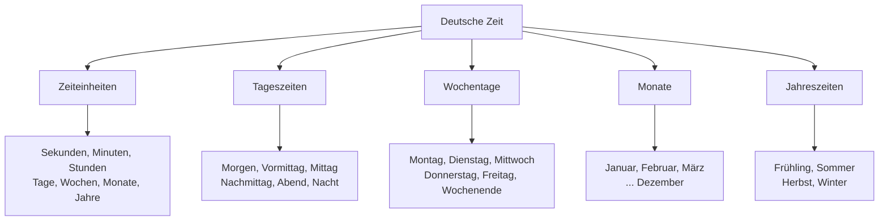
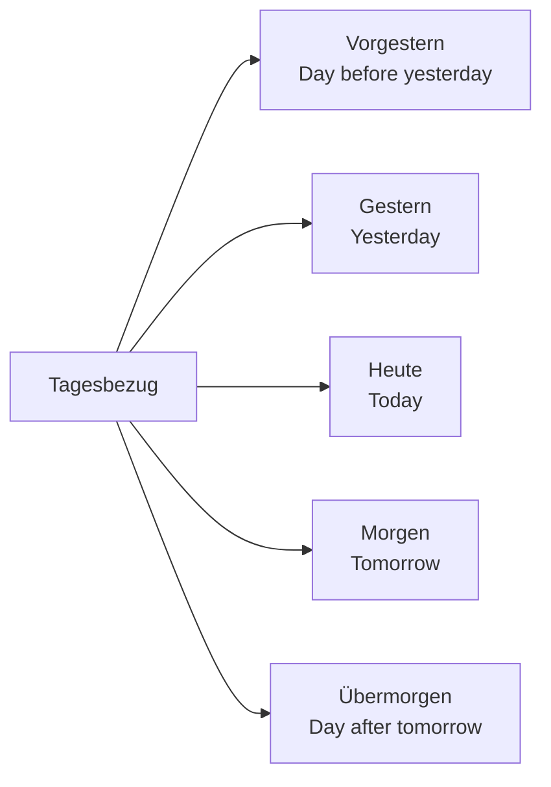
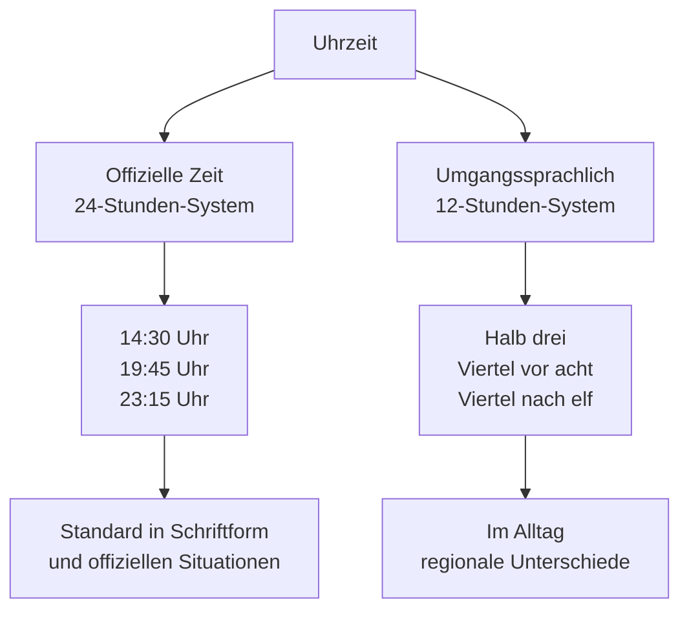
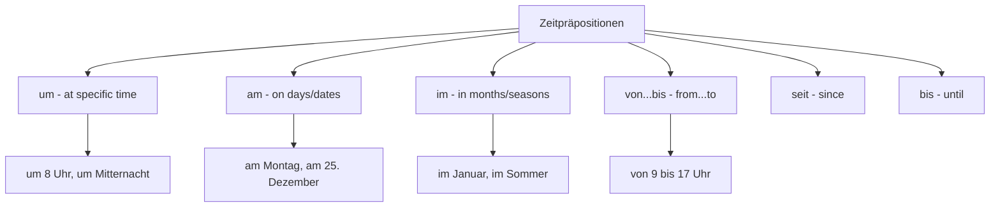
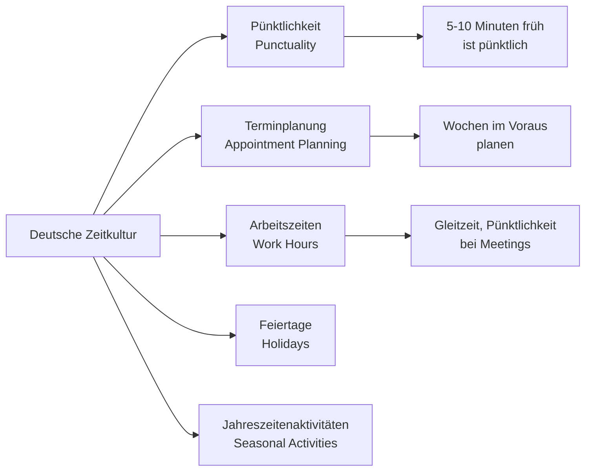

# Time and Date (Zeit und Datum) - German Time Vocabulary for English Speakers

## Introduction
Time and date vocabulary is essential for scheduling, making appointments, and daily conversations in German. This chapter covers telling time, dates, seasons, time expressions, and cultural aspects of time in German-speaking countries.

## Basic Time Units

### Time Measurements

| Unit | German | Pronunciation | Abbreviation |
|------|--------|---------------|-------------|
| ⏱️ Second | die Sekunde | [zeˈkʊndə] | sec |
| ⏰ Minute | die Minute | [miˈnuːtə] | min |
| 🕐 Hour | die Stunde | [ˈʃtʊndə] | h |
| 📅 Day | der Tag | [taːk] | d |
| 📆 Week | die Woche | [ˈvɔxə] | Wo. |
| 📅 Month | der Monat | [ˈmoːnat] | Mon. |
| 📅 Year | das Jahr | [jaːɐ] | J. |

## Time Classification

## Days of the Week (Wochentage)

### Weekdays and Weekend

| Day | German | Pronunciation | Abbreviation | Origin |
|-----|--------|---------------|--------------|--------|
| 📅 Monday | der Montag | [ˈmoːntaːk] | Mo. | Moon day |
| 📅 Tuesday | der Dienstag | [ˈdiːnstaːk] | Di. | Thing day |
| 📅 Wednesday | der Mittwoch | [ˈmɪtvɔx] | Mi. | Middle of the week |
| 📅 Thursday | der Donnerstag | [ˈdɔnɐstaːk] | Do. | Thunder day |
| 📅 Friday | der Freitag | [ˈfʁaɪtaːk] | Fr. | Frigg's day |
| 📅 Saturday | der Samstag | [ˈzamstaːk] | Sa. | Sabbath day |
| 📅 Sunday | der Sonntag | [ˈzɔntaːk] | So. | Sun day |

### Day-Related Vocabulary

## Months (Monate)

### The Twelve Months

| Month | German | Pronunciation | Abbreviation | Season |
|-------|--------|---------------|--------------|--------|
| ❄️ January | der Januar | [ˈjanuaːɐ] | Jan. | Winter |
| ❄️ February | der Februar | [ˈfeːbʁuaːɐ] | Feb. | Winter |
| 🌸 March | der März | [mɛʁt͡s] | Mär. | Spring |
| 🌸 April | der April | [aˈpʁɪl] | Apr. | Spring |
| 🌸 May | der Mai | [maɪ̯] | Mai | Spring |
| ☀️ June | der Juni | [ˈjuːni] | Jun. | Summer |
| ☀️ July | der Juli | [ˈjuːli] | Jul. | Summer |
| ☀️ August | der August | [aʊ̯ˈɡʊst] | Aug. | Summer |
| 🍂 September | der September | [zɛpˈtɛmbɐ] | Sep. | Autumn |
| 🍂 October | der Oktober | [ɔkˈtoːbɐ] | Okt. | Autumn |
| 🍂 November | der November | [noˈvɛmbɐ] | Nov. | Autumn |
| ❄️ December | der Dezember | [deˈt͡sɛmbɐ] | Dez. | Winter |

## Seasons (Jahreszeiten)

### The Four Seasons

| Season | German | Pronunciation | Months | Characteristics |
|--------|--------|---------------|--------|----------------|
| 🌸 Spring | der Frühling | [ˈfʁyːlɪŋ] | März - Mai | Blossoming, mild |
| ☀️ Summer | der Sommer | [ˈzɔmɐ] | Juni - August | Warm, long days |
| 🍂 Autumn | der Herbst | [hɛʁpst] | September - November | Falling leaves, cool |
| ❄️ Winter | der Winter | [ˈvɪntɐ] | Dezember - Februar | Cold, short days |

## Telling Time (Uhrzeit)

### Official Time (24-hour clock)

### Time Expressions

| Time | Official German | Colloquial German | English |
|------|-----------------|-------------------|---------|
| 08:00 | acht Uhr | acht Uhr | eight o'clock |
| 08:15 | acht Uhr fünfzehn | Viertel nach acht | quarter past eight |
| 08:30 | acht Uhr dreißig | halb neun | half past eight |
| 08:45 | acht Uhr fünfundvierzig | Viertel vor neun | quarter to nine |
| 12:00 | zwölf Uhr | zwölf Uhr | twelve o'clock |
| 00:00 | null Uhr | Mitternacht | midnight |

### Regional Time Differences

| Region | 14:15 | 14:30 | 14:45 |
|--------|-------|-------|-------|
| **Northern Germany** | Viertel nach zwei | halb drei | Viertel vor drei |
| **Southern Germany** | viertel drei | halb drei | dreiviertel drei |
| **Austria/Switzerland** | Viertel nach zwei | halb drei | Viertel vor drei |

## Date Formats (Datumsformate)

### Writing Dates

| Format | German Example | English Equivalent |
|--------|----------------|-------------------|
| Long form | der 25. Dezember 2023 | December 25, 2023 |
| Numerical (German) | 25.12.2023 | 12/25/2023 |
| Numerical (International) | 2023-12-25 | 2023-12-25 |

### Saying Dates

| Date | German | Pronunciation |
|------|--------|---------------|
| January 1st | der erste Januar | [deːɐ̯ ˈeːɐ̯stə ˈjanuaːɐ] |
| December 24th | der vierundzwanzigste Dezember | [deːɐ̯ ˈfiːɐ̯ʊntˌt͡svantsɪçstə deˈt͡sɛmbɐ] |
| My birthday | mein Geburtstag | [maɪ̯n ɡəˈbuːɐ̯t͡staːk] |

## Time of Day (Tageszeiten)

### Parts of the Day

| Time | German | Pronunciation | Approximate Hours |
|------|--------|---------------|-------------------|
| 🌅 Morning | der Morgen | [ˈmɔʁɡən] | 6:00 - 12:00 |
| ☀️ Late morning | der Vormittag | [ˈfoːɐ̯mɪtaːk] | 9:00 - 12:00 |
| 🍽️ Noon | der Mittag | [ˈmɪtaːk] | 12:00 - 14:00 |
| 🌇 Afternoon | der Nachmittag | [ˈnaːxmɪtaːk] | 14:00 - 18:00 |
| 🌃 Evening | der Abend | [ˈaːbənt] | 18:00 - 24:00 |
| 🌙 Night | die Nacht | [naxt] | 0:00 - 6:00 |

## Prepositions of Time (Zeitpräpositionen)

### Common Time Prepositions

### Usage Examples

| Preposition | German Example | English |
|-------------|----------------|---------|
| um | Wir treffen uns um 15 Uhr. | We meet at 3 PM. |
| am | Ich arbeite am Montag. | I work on Monday. |
| im | Im Sommer ist es warm. | In summer it's warm. |
| von...bis | Geschäfte sind von 9 bis 18 Uhr geöffnet. | Stores are open from 9 to 6. |
| seit | Ich wohne hier seit 2020. | I've lived here since 2020. |
| bis | Das Geschäft ist bis 20 Uhr geöffnet. | The store is open until 8 PM. |

## Time Expressions

### Relative Time

| Expression | German | Pronunciation | Meaning |
|------------|--------|---------------|---------|
| 🕐 Now | jetzt | [jɛt͡st] | right now |
| ⏳ Soon | bald | [balt] | in a short time |
| ⏰ Later | später | [ˈʃpɛːtɐ] | after some time |
| 🔙 Earlier | früher | [ˈfʁyːɐ] | before now |
| 📅 Recently | kürzlich | [ˈkʏʁt͡slɪç] | not long ago |

### Frequency Expressions

| Frequency | German | Pronunciation | Meaning |
|-----------|--------|---------------|---------|
| 🔄 Always | immer | [ˈɪmɐ] | every time |
| 📅 Often | oft | [ɔft] | many times |
| 📆 Sometimes | manchmal | [ˈmançmaːl] | occasionally |
| ❌ Rarely | selten | [ˈzɛltən] | not often |
| 🚫 Never | nie | [niː] | not at any time |

## German Time Culture

### Punctuality and Time Management

### Key Cultural Points

1. **Punctuality**: Being on time is extremely important
2. **Planning**: Germans often plan appointments weeks in advance
3. **Work Hours**: Standard work day 8:00-17:00 with flexibility
4. **Store Hours**: Limited on Sundays and holidays
5. **Seasonal Rhythms**: Activities change with seasons

### Public Holidays (Feiertage)

| Holiday | German | Date | Significance |
|---------|--------|------|-------------|
| New Year's Day | Neujahr | January 1st | Start of new year |
| Easter | Ostern | March/April | Christian holiday |
| Labor Day | Tag der Arbeit | May 1st | Workers' day |
| Christmas | Weihnachten | December 24-26 | Family celebration |
| German Unity Day | Tag der Deutschen Einheit | October 3rd | National holiday |

## Grammar: Time Expressions

### Case Usage with Time

| Case | Usage | Example |
|------|-------|---------|
| **Accusative** | Definite time expressions | Ich bleibe einen Tag. (I stay one day.) |
| **Dative** | Points in time | Am Montag habe ich frei. (On Monday I'm free.) |
| **Genitive** | Time expressions (formal) | Eines Tages werde ich reisen. (One day I will travel.) |

### Word Order with Time

| Element | Position | Example |
|---------|----------|---------|
| Time | Usually after verb | Ich gehe heute ins Kino. |
| Multiple time elements | From specific to general | Wir treffen uns um 15 Uhr am Freitag. |

## Practice Exercises

### Exercise 1: Telling Time
Write these times in German (both official and colloquial):
1. 09:15
2. 14:30
3. 19:45
4. 23:20

### Exercise 2: Date Writing
Write these dates in German:
1. March 8, 2024
2. Your birthday
3. Christmas Day
4. New Year's Eve

### Exercise 3: Time Prepositions
Complete with correct prepositions:
1. ___ Montag gehe ich einkaufen.
2. Der Unterricht beginnt ___ 8 Uhr.
3. ___ Sommer fahren wir in Urlaub.
4. Ich arbeite ___ 9 ___ 17 Uhr.

### Exercise 4: Scheduling Dialogue
Create a dialogue for making an appointment:
- Suggesting a date and time
- Proposing alternatives
- Confirming the appointment
- Discussing location

### Exercise 5: Cultural Understanding
Answer these questions:
1. Why is punctuality so important in German culture?
2. How do store hours differ from other countries?
3. What are typical German holiday traditions?
4. How do Germans typically plan their schedules?

## Useful Time Phrases

### Asking About Time

| English | German | Pronunciation |
|---------|--------|---------------|
| What time is it? | Wie spät ist es? | [viː ʃpɛːt ɪst ɛs] |
| When does it start? | Wann fängt es an? | [van fɛŋt ɛs an] |
| How long does it take? | Wie lange dauert es? | [viː ˈlaŋə ˈdaʊ̯ɐt ɛs] |
| What's the date today? | Den wievielten haben wir heute? | [deːn ˈviːfiːltən ˈhaːbən viːɐ ˈhɔɪ̯tə] |

### Making Appointments

| English | German | Pronunciation |
|---------|--------|---------------|
| Are you free on Monday? | Hast du am Montag Zeit? | [hast duː am ˈmoːntaːk t͡saɪ̯t] |
| Let's meet at 3 PM. | Lass uns um 15 Uhr treffen. | [las ʊns ʊm ˈfʏnftseːn uːɐ̯ ˈtʁɛfən] |
| That works for me. | Das passt mir. | [das past miːɐ̯] |
| I need to reschedule. | Ich muss den Termin verschieben. | [ɪç mʊs deːn tɛʁˈmiːn fɛɐ̯ˈʃiːbən] |

### Time-Related Vocabulary

| English | German | Pronunciation |
|---------|--------|---------------|
| Clock | die Uhr | [uːɐ̯] |
| Watch | die Armbanduhr | [ˈaʁmbantʔuːɐ̯] |
| Calendar | der Kalender | [kaˈlɛndɐ] |
| Schedule | der Zeitplan | [ˈt͡saɪ̯tplaːn] |
| Appointment | der Termin | [tɛʁˈmiːn] |
| Deadline | die Frist | [fʁɪst] |

---

## Summary

Key points about German time and date vocabulary:
- Punctuality is highly valued in German culture
- Both 24-hour and colloquial time telling are used
- Dates follow day-month-year order
- Specific prepositions are used for different time expressions
- Planning and scheduling are typically done well in advance
- Store hours and business operations follow strict time patterns

With this vocabulary and cultural knowledge, you'll be able to schedule appointments, understand time expressions, and navigate daily time-related situations in German-speaking countries with confidence!